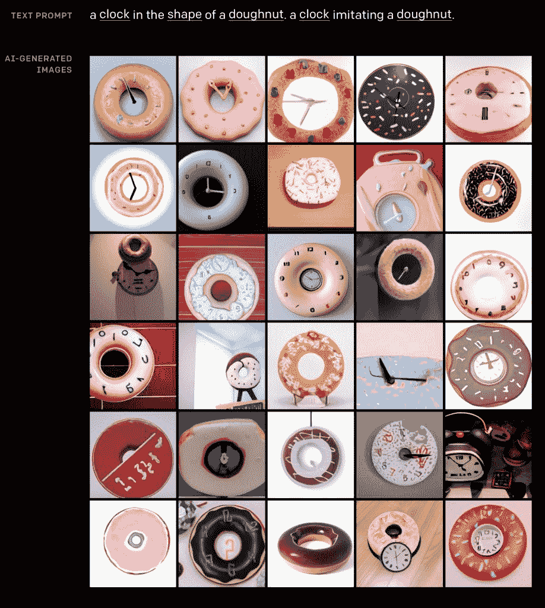
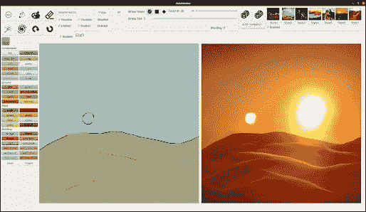
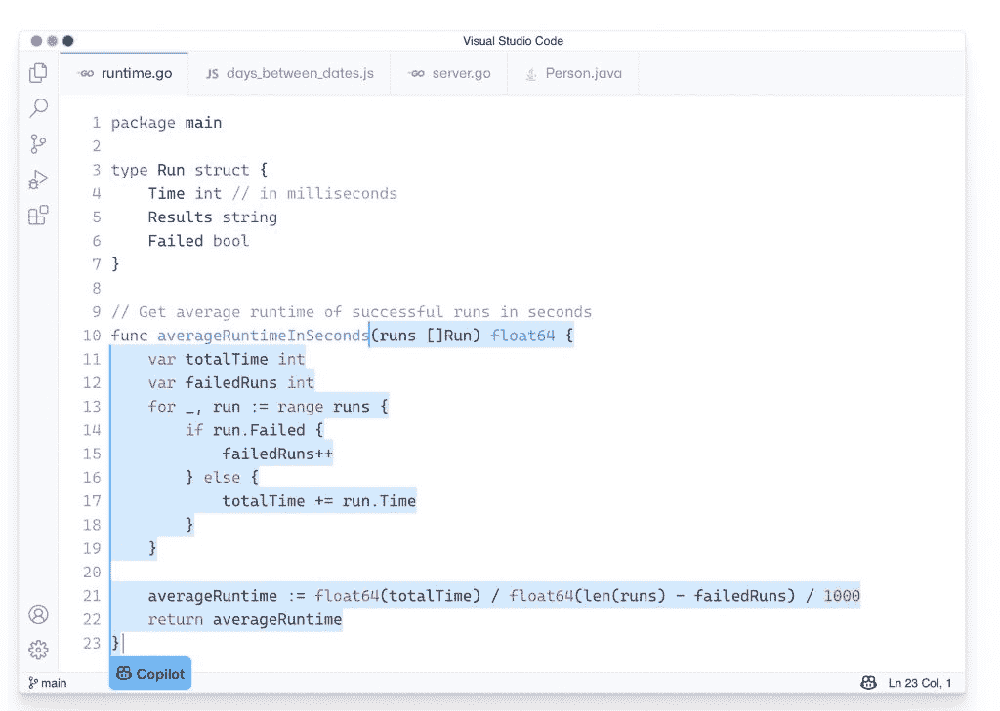
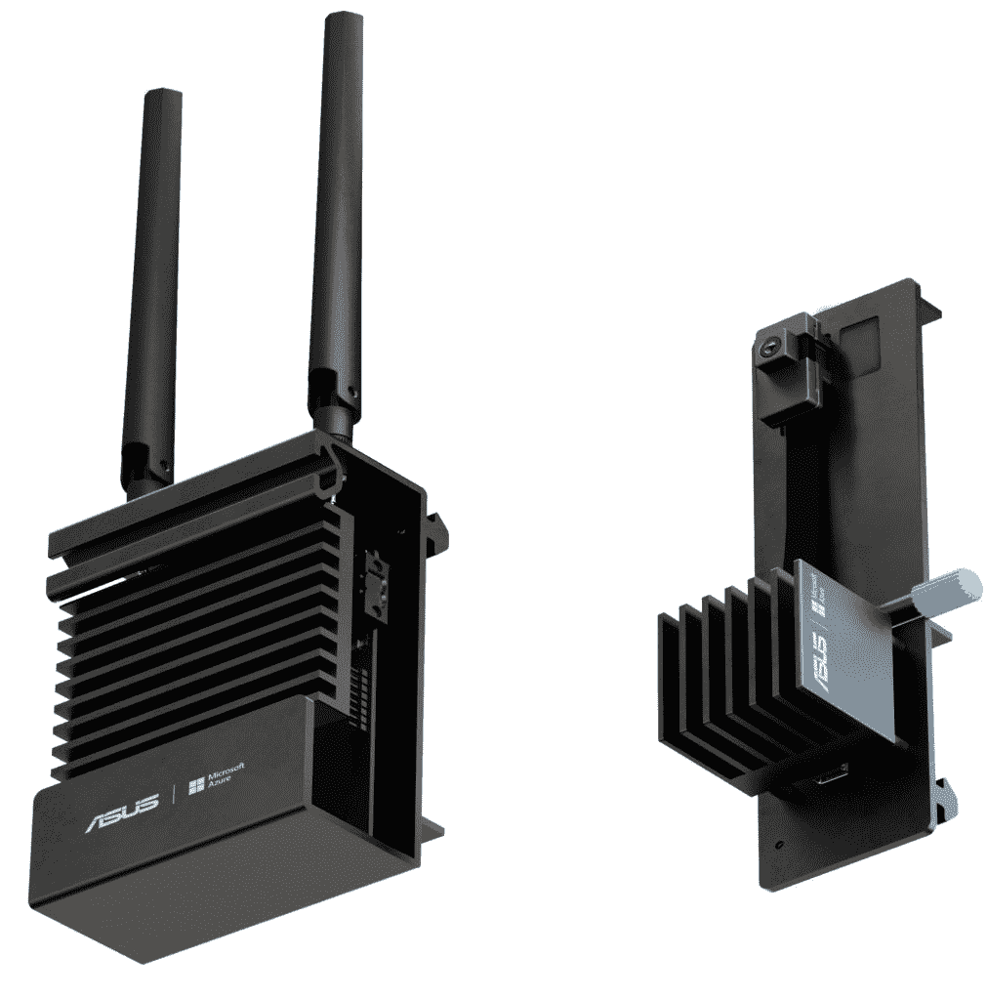

# 2022 年值得关注的 5 个人工智能趋势

> 原文：<https://thenewstack.io/5-ai-trends-to-watch-out-for-in-2022/>

新冠肺炎疫情在 2021 年加快了人工智能或机器学习的采用。企业对自动化的需求与人工智能硬件和软件的进步相结合，正在将应用人工智能变为现实。

以下是 2022 年人工智能的五大趋势:

### 趋势 1:大型语言模型(LLM)定义了对话式人工智能的下一波浪潮

语言模型基于自然语言处理技术和算法来确定给定单词序列在句子中出现的概率。这些模型可以预测句子中的下一个单词，总结文本信息，甚至从纯文本创建可视化图表。

大型语言模型(LLM)是在包含大量数据的大规模数据集上训练的。谷歌的[伯特](https://ai.googleblog.com/2018/11/open-sourcing-bert-state-of-art-pre.html)和 OpenAI 的 [GPT-2](https://openai.com/blog/better-language-models/) 和 [GPT-3](https://openai.com/blog/gpt-3-apps/) 是 LLM 的一些例子。众所周知，GPT-3 在 570 千兆字节的文本上训练了 1750 亿个参数。这些模型可以生成任何东西，从简单的文章到复杂的金融模型。

包括 [OpenAI](https://openai.com/) 、[抱脸](https://huggingface.co/)、 [Cohere](https://cohere.ai/) 、 [AI21 Labs](https://www.ai21.com/) 在内的 AI 创业公司，正在通过拥有数十亿参数的训练模型来推动 LLM 的边界。

韩国公司 [Naver](https://www.naver.com/) 宣布，它已经建立了最全面的基于人工智能的语言模型之一， [HyperCLOVA](https://gpt3demo.com/apps/hyperclova) ，一个类似 GPT 3 的韩语模型。华为的[盘古阿尔法](https://www.huaweicentral.com/huawei-is-designing-pangu-alpha-chinese-language-equivalent-of-gpt-3/)和百度的[厄尼 3.0 泰坦](https://arxiv.org/abs/2112.12731)接受了数万亿字节的中国数据集的训练，这些数据集包括电子书、百科全书和社交媒体。

2022 年，我们将看到大型语言模型成为下一代对话式人工智能工具的基础。

### 趋势二:多模态人工智能的崛起

深度学习算法传统上专注于从一个数据源训练它们的模型。例如，在一组图像上训练计算机视觉模型，而在文本内容上训练 NLP 模型。语音处理处理声学模型创建、唤醒词检测和噪声消除。这种类型的机器学习与单一模式的人工智能相关联，其结果被映射到单一数据类型的来源——图像、文本、语音。

多模态人工智能是计算机视觉和对话式人工智能模型的最终融合，以提供更接近人类感知的强大场景。它将人工智能推理带到了一个新的水平，结合了视觉和语音模态。

多模态 AI 的最新例子是 OpenAI 的 [DALL-E](https://openai.com/blog/dall-e/) ，它可以从文本描述中生成图像。该模型使用艺术家萨瓦尔多·达利和皮克斯的 WALL E 的组合来命名。例如，当文本提示“一个甜甜圈形状的时钟”发送到模型时，它会生成以下图像:

谷歌的多任务统一模型( [MUM](https://blog.google/products/search/introducing-mum/) )是多模态人工智能的另一个例子。它承诺通过基于从 75 种不同语言中挖掘的上下文信息对结果进行优先排序来增强用户的搜索体验。MUM 使用 T5 文本到文本框架，比用于自然语言处理的流行的基于转换器的模型 BERT 强大 1000 倍。

NVIDIA 的 [GauGAN2](http://gaugan.org/gaugan2/) 模型将基于简单的文本输入生成照片般逼真的图像。它在一个模型中结合了分段映射、修补和文本到图像的生成，使其成为一个强大的工具，可以通过文字和图形的混合来创建真实感艺术。

展望未来，我们将看到计算机视觉和语言/语音模型的融合，使人工智能更加自然和丰富。

### 趋势 3:简化和精简的 MLOps

机器学习操作(MLOps)，或者说将机器学习投入工业生产的实践，是复杂的！可用于实施 MLOps 的众多工具和框架使其势不可挡。

今天的 MLOps 在许多方面都与 2012 年的 DevOps 相似。组织很快意识到 DevOps 的价值，但是由于缺乏指导，他们很难实现它。工具链是复杂的，生态系统是支离破碎的。

MLOps 包包括从安装和配置训练和推理基础结构、配置特征存储、配置模型注册表、监视模型衰退和检测模型漂移的所有内容。

MLOps 是已经被纳入基于云的 ML 平台的概念之一，例如[亚马逊网络服务](https://aws.amazon.com/?utm_content=inline-mention) ' [亚马逊 SageMaker](https://aws.amazon.com/sagemaker/) 、 [Azure ML](https://azure.microsoft.com/en-in/services/machine-learning/#product-overview) 和[谷歌顶点 AI](https://cloud.google.com/vertex-ai) 。然而，这些能力不能在混合和边缘计算环境中使用。因此，监控边缘模型对企业来说是一个巨大的挑战。在处理计算机视觉系统和对话式人工智能系统时，监控边缘模型变得更加具有挑战性。

由于开源项目如 [Kubeflow](https://www.kubeflow.org/) 和 [MLflow](https://mlflow.org/) 的成熟，MLOps 已经变得相当容易获得。未来几年将会看到一种简化的 MLOps 方法，涵盖云和边缘计算环境。

### 趋势 4:人工智能驱动的开发者生产力

人工智能将影响 IT 的几乎每个方面，包括编程和开发。

在过去的几年中，我们已经看到了一些工具，如 [Amazon Code Guru](https://aws.amazon.com/codeguru/) 提供智能建议来提高代码质量，并识别应用程序中最昂贵的代码行。最近， [Github Copilot](https://copilot.github.com/) 作为“AI 结对程序员”首次亮相，协助开发者编写高效代码。Salesforce 研究团队已经推出了 [CodeT5](https://blog.salesforceairesearch.com/codet5/) ，这是一个开源项目，将帮助 Apex 开发人员进行人工智能驱动的编码。 [Tabnine](https://www.tabnine.com) ，前身为 Codata，为主流开发环境带来了智能代码完成。Ponicode 是另一个人工智能驱动的工具，可以创建、可视化和运行功能单元测试。

大型语言模型(LLM)的兴起和开放源代码的广泛使用使得 IDE 供应商能够构建智能代码生成和分析。展望未来，有望看到可以从行内注释生成高质量和紧凑代码的工具。他们甚至能够将一种语言编写的代码翻译成另一种语言，通过将遗留代码转换成现代语言来实现应用程序现代化。

### 趋势 5:来自平台公司的新垂直化人工智能解决方案

领先的人工智能供应商，包括亚马逊、谷歌和微软，正在专注于将研发工作商业化。他们通过自己的云平台提供托管服务，或者构建带有人工智能加速器和针对特定场景的预训练模型的硬件设备。

[亚马逊连接](https://aws.amazon.com/connect/)和[谷歌联络中心人工智能](https://cloud.google.com/solutions/contact-center)是垂直整合的经典例子。两者都利用机器学习能力来执行智能路由、由机器人驱动的对话以及对联络中心代理的自动协助。

谈到设备， [AWS Panorama](https://aws.amazon.com/panorama/) 和 [Azure Percept](https://docs.microsoft.com/en-us/azure/azure-percept/overview-azure-percept) 旨在提供交钥匙人工智能功能。AWS Panorama 连接到现有的 IP 摄像机，以执行基于计算机视觉的推断。客户可以在云中训练新模型，并在部署 Panorama 设备的边缘部署它们。Azure Percept 采用类似的方法在边缘提供计算机视觉和对话式人工智能功能。微软基于 Azure 上已经可用的现有物联网、人工智能和边缘计算服务构建了 Percept。

最后，[亚马逊寻找设备](https://aws.amazon.com/lookout-for-equipment/)和[谷歌云视觉检测人工智能](https://cloud.google.com/solutions/visual-inspection-ai)等服务利用基于云的人工智能平台来执行设备的预测性维护和产品的异常检测。这些服务针对零售和制造垂直行业进行了高度定制。

2022 年，我们将看到人工智能平台和云提供商利用前沿研究和现有的托管服务来提供针对利基用例及场景的解决方案。

<svg xmlns:xlink="http://www.w3.org/1999/xlink" viewBox="0 0 68 31" version="1.1"><title>Group</title> <desc>Created with Sketch.</desc></svg>