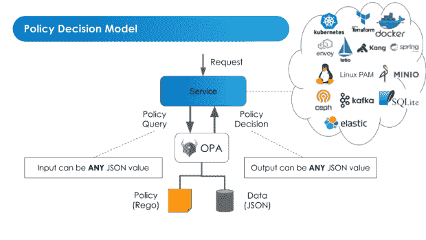
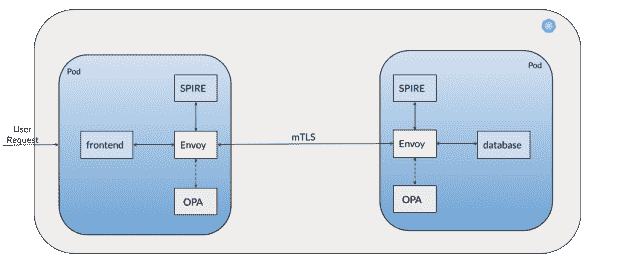
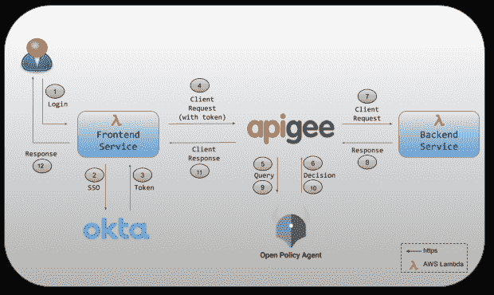

# 5 种应用授权最佳实践，提高网络安全性

> 原文：<https://thenewstack.io/5-application-authorization-best-practices-for-better-cybersecurity/>

随着云原生应用的兴起，安全性、合规性和访问控制的挑战已经成为人们最关心的问题。对于许多组织来说，微服务已经成为首选的架构，不仅用于构建新的应用程序，还用于迁移遗留应用程序。

现代应用程序带来了许多好处，但却使这些挑战变得更加难以解决。在传统的整体式应用中，可能有几十个单独的组件，有数千种访问可能性需要保护，而今天的应用有数千个移动部件，可能有数万亿种访问可能性，为每个应用创造了更大的攻击面。

授权是这些挑战的核心，通过授权，应用程序所有者可以控制谁(和什么)可以访问应用程序，以及一旦进入应用程序，他们可以做什么。

如果您能够解决授权问题，即[仅允许您在关键访问点明确允许的操作和用户](https://thenewstack.io/how-do-authentication-and-authorization-differ/)，您就可以解决现代应用程序的复杂性所带来的绝大多数安全性、合规性和运营问题。

我们将分享五个最佳实践，以及一些技术细节，以便在您的云原生应用中获得授权。

## **1。将策略用作代码**

这是采用现代授权的最关键的一步。 [GigaOm](https://www.styra.com/resources/reports/2022-gigaom-radar-for-policy-as-code-solutions/?utm_medium=pr&utm_source=business_wire&utm_campaign=awn&utm_content=report) 将策略定义为代码，作为“将人类可读的策略映射为机器可执行的代码”的一种手段这是一种采用关键的安全性、操作和合规性策略，并在您的应用程序中和跨团队自动执行这些策略的方式。

大多数公司和开发团队习惯于将授权逻辑和策略直接硬编码到应用程序中，但是考虑到云原生环境的复杂性，这种方式不再适用。这也是开发人员采用其他 as-code 解决方案的原因，比如基础设施 as Code。

这里，由 Styra 创建和维护的[开放策略代理(OPA)](https://www.openpolicyagent.org/) 是迄今为止最流行和最可靠的将策略实现为代码的工具。它允许您将授权逻辑和策略从应用程序本身中分离出来，同时在单个可信的技术无关工具上实现标准化。

OPA 与独立的应用程序元素(如 API 网关或服务网格 L7 代理)一起运行。OPA 支持跨堆栈的基于统一策略的访问控制，并已成为现代应用的最佳实践工具。

用于将策略实现为代码的 OPA 体系结构。

## **2。实施零信任架构**

现在我们已经介绍了用于现代授权的工具，让我们来谈谈策略实施。[零信任](https://thenewstack.io/what-is-zero-trust-security/)可能是一个时髦的词，但是使用 OPA，您可以在您的云原生应用程序中功能性地实现最小特权原则。

正如我之前[写的关于](https://www.styra.com/blog/zero-trust-with-envoy-spire-and-open-policy-agent-opa/)的文章，实现 [NIST SP 800-207 零信任架构](https://csrc.nist.gov/publications/detail/sp/800-207/final)的两个关键要素是，一个主体(用户或服务)必须只有在被认证和授权后才能访问应用程序中的资源。

这意味着主体的身份已经由身份提供者验证，并且授权系统已经确定该身份被允许访问资源。让我们看看如何使用 OPA 在微服务中实现零信任架构的这些特性。

这里，OPA 用于授权服务网格中服务之间的通信。具体来说，它作为开源 L7 代理(如 [Envoy](https://www.cncf.io/projects/envoy/) )的边站运行，这是流行服务网格(如 [Kong](https://konghq.com/products/service-mesh-platform) )的基础。

同时，我们可以利用像 [SPIFFE/SPIRE](https://spiffe.io/) (身份验证)这样的身份框架来创建唯一标识可信工作负载和服务的 id。在下面的例子中，我们在应用程序中的不同服务(前端服务和数据库)之间创建了一个真正的“从不信任，总是验证”系统。

微服务应用零信任架构的基础。

在这个模型中，每个单独的服务在经过身份验证后，都会被分配一个可信的、可验证的身份(SPIFFE ID，由 SPIRE 分配)。当前端服务调用数据库获取一些数据时，请求与 SPIFFE ID 一起被发送到 OPA，OPA 作为 sidecar 运行并实现 Envoy 的外部授权 API。OPA 根据策略评估这个调用，“只有具有相关 SPIFFE ID 的前端服务被授权与数据库通信。”

在这种情况下，授权检查通过。重要的是，除了由策略授权为代码的前端服务之外，没有其他服务能够与数据库通信。

## **3。确保用户的令牌验证**

我们可以对最终用户授权采取类似的方法。正如我的同事 Anders Eknert 在新堆栈的另一篇文章中所讨论的，一个关键的最佳实践是为您的用户实施令牌验证，确保您可以建立对用户身份的安全信任。换句话说，当用户调用特定服务时，您可以实现一个 OPA 策略，要求用户拥有一个经过验证的身份令牌。

与上面的服务-服务示例非常相似，我们可以使用不同的标准，JSON web 令牌(jwt)，它由您环境中的可信身份提供者发布，如 OpenID Connect 或 Oauth2。同样，在您的微服务环境中，同一个 OPA 仍然可以与类似于 Envoy 的 L7 代理并行，如下例所示。

为您的用户建立安全信任

以类似的方式，用户通过一个“签名的”JWT 令牌来建立他们的身份。当用户调用服务时，OPA 根据策略评估请求，“只有拥有有效且未过期的 JWT 的用户才有权访问服务。”

当然，您可以并且应该对这些策略进行分层，以做出更细粒度的、基于上下文的授权决策，比如使用基于角色的访问控制(RBAC)策略，或者指定用户还必须属于工程部门。更细粒度的授权方法将包括基于属性的访问控制(ABAC)策略——例如，工程师必须随叫随到，他们控制最低预算(比如 50 万美元)或在公司中拥有一定级别的权限(高级工程师)。

请注意，使用 OPA，RBAC 和 ABAC 之间的功能差异为零——您只需添加带有数据源的更细粒度的策略，以支持 LDAP、Active Directory 或 ForgeRock 等用户的策略决策。

## **4。启用应用程序的最低权限访问控制**

有了以上这些框架，您可以更容易地在应用程序的不同点启用最低特权访问控制——例如，在 API 网关或前端和后端服务之间。使用下面的策略示例，您可以了解 OPA 如何在您的应用程序中具体实现这种最低权限的最佳实践，即默认情况下拒绝所有流量，而只允许策略特别授权的流量。

### API 网关

API 网关是现代应用程序的一个标准特性，由于将应用程序 API 暴露给了 internet，因此它是策略的一个关键实施点。为了了解最低权限策略在这里是如何工作的，让我们想象一个假设的例子，ACME Health 公司和他们的 API 网关控制对敏感数据的访问，比如提交的保险索赔。

这里，OPA 的一个网关策略示例是:“只允许 Acme Health 的主要保险持有人查看提交的索赔。”在这种情况下，OPA 将根据上述最佳实践，通过查看用户的 JWT 来验证保险计划参与者的身份。在减压阀的 OPA 政策语言中，该政策可能是这样的(以下是在[要点](https://gist.github.com/ashutosh-narkar/84dd7f24c8fcc85c03fb6e54fd9b06e8)中到该政策的链接):

### 后端数据库服务

在 Acme Health 示例中，下一步是前端服务查询后端数据库以检索保险索赔列表。这里，示例 OPA 策略应该是:" *A* 只允许/claims 路径上的 GET 请求。"该策略还将验证调用后端数据库的服务的 SPIFFE ID，从而实现真正的最小特权模型。在减压阀，这样的政策看起来会像下面这样(这里是在[要点](https://gist.github.com/ashutosh-narkar/b4980d3745ab18984324773c97c15d9d)中政策的链接):

## **5。使用 OPA 学习资源**

围绕 OPA 和 policy as code 等开源标准调整您的微服务授权的好处之一是，您可以利用一个强大的社区和丰富的教育资源。例如， [Styra Academy](http://academy.styra.com/) 提供针对不同用例部署 OPA 和学习减压阀的免费课程。关于后一点，减压阀游乐场是学习和探索减压阀政策的绝佳资源。

同时， [OPA Community Slack](https://app.slack.com/client/T1H19LVHV) 让您可以直接参与社区活动。最后，像 [OPA 101 入门指南](https://drive.google.com/file/d/1zpqxIY_s3e4q27idsReGc5AtBF18kBOa/view)这样的资源可以让你对 OPA 的一切有一个全面的了解，而 [OPA 文档](https://www.openpolicyagent.org/docs/latest/)为你入门提供了实用的指导。

## **最终想法**

现代的云原生安全性非常困难，应用程序授权已经成为企业最关注的焦点之一。然而，有一些实用的步骤可以帮助简化应用程序的安全性。使用上面的步骤，您可以将微服务应用程序中潜在的访问可能性从字面上的万亿减少到实际上只有那些由 OPA 强制执行的策略授权的代码。

请注意，这种策略不仅可以在您的应用中实施，还可以在云原生堆栈的任何地方实施，从 Kubernetes 准入控制，到云交付的基础设施(想想对基础设施即代码资源更改的策略检查)，再到 CICD 管道。

想要更多关于应用程序授权的指导吗？查看我们的按需虚拟活动，[提升现代应用的 AuthZ】，在这里我们涵盖了您需要了解的关于应用授权的一切。](https://www.styra.com/level-up-authz-for-modern-applications/?utm_medium=social_media&utm_source=twitter&utm_campaign=awn&utm_content=workshop)

<svg xmlns:xlink="http://www.w3.org/1999/xlink" viewBox="0 0 68 31" version="1.1"><title>Group</title> <desc>Created with Sketch.</desc></svg>