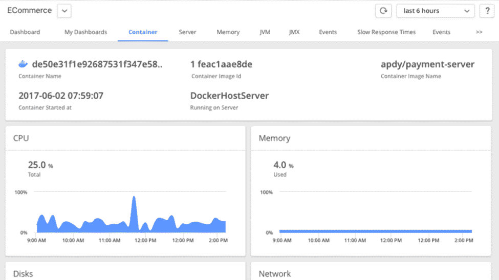

# 五个 Docker 安全最佳实践

> 原文：<https://thenewstack.io/5-docker-security-best-practices/>

 [阿密特·夏尔马

阿密特·夏尔马是 AppDynamics 的产品营销经理。他在软件开发、产品管理和产品营销方面拥有超过 11 年的经验。他在亚利桑那州立大学获得 MSCE 学位，在加州大学伯克利分校哈斯商学院获得 MBA 学位。](https://www.appdynamics.com/) 

Docker 容器的采用正在快速增长。根据 RightScale 的最新调查，83%的企业正在使用或计划使用 Docker。然而，安全问题仍然是最大的挑战之一。在最新的[云本地计算基金会(CNCF)研究](https://www.cncf.io/blog/2017/12/06/cloud-native-technologies-scaling-production-applications/)中，43%的受访者认为安全性是采用容器的最大障碍。

随着容器的使用成为主流并进入生产环境，我预计对 Docker 容器安全主题的兴趣只会增加。在本文中，我将讨论五个 Docker 安全最佳实践，供您在开始采用容器基础设施的旅程时考虑。

## 1.Docker 主机、应用程序运行时和代码级安全性:采取整体方法

Docker 安全性从主机开始，因为容器共享操作系统内核。如果主机受到威胁，所有进程都很脆弱。Docker 容器中运行的进程看起来运行在一个独立的 Linux 主机上，但实际上，它们只是一个共享主机中的“命名空间”进程。您的首要任务是正确修补和更新主机操作系统。类似地，在你的容器中运行的进程应该有最新的安全更新，你应该开始将安全最佳实践整合到你的[应用程序代码](http://www.oracle.com/technetwork/java/seccodeguide-139067.html)中。

## 2.Docker 运行时安全性:知道你的容器里有什么

在构建 Docker 容器映像时，您需要确切地知道每一层都包含什么。然而，仅在构建时这样做是不够的。您还必须确保由第三方供应商安装的容器不会在运行时下载和运行任何东西。Docker 容器运行的所有东西都必须声明并包含在静态容器映像中。这对第三方供应商容器尤其重要。为了简化安装，一些性能工具会部署一个最小的代理，然后在运行时下载其他特定于语言的代理。不过，你应该获得透明度。只需在运行时对秘密下载说不。

## 3.Docker 图片真实性:你信任来源吗？

正如您不会从任何随机的互联网来源下载软件并在您的 PC 上运行，您必须知道并信任您的容器映像的来源和注册表。

码头商店是值得信赖的市场。与任何人都可以推送容器映像的 Docker Hub 不同，Docker Store 托管来自可信合作伙伴的容器。Docker 也会对这些 Docker 容器映像进行漏洞测试。图像来源提供了图像来源和内容的可验证痕迹。

AppDynamics 最新的数字签名版本可从 [Docker 商店](https://store.docker.com/images/appdynamics)获得。

即使对于您的内部图像，我也建议使用基于 PKI 的信任机制来确保发布容器图像的个人、团队或流程的真实性。

## 4.限制资源利用:避免嘈杂的邻居问题

因为 Docker 容器是轻量级进程，所以可以运行比虚拟机更多的容器。这种增加的密度是有益的，因为它提高了主机资源利用率，并允许您优化总体拥有成本。这也意味着更多的进程在争夺主机资源。

为了减少诸如拒绝服务攻击之类的漏洞的威胁，以及由于嘈杂的邻居造成的性能影响，您可以通过容器编排框架(如 [Kubernetes](https://kubernetes.io/) 或 [Swarm](https://docs.docker.com/engine/swarm/) )来限制单个容器可以消耗的系统资源。

AppDynamics [全面监控](https://www.appdynamics.com/cloud-monitoring/docker-monitoring/)主机上所有被监控容器消耗的资源。通过在 AppDynamics 中创建所需的阈值和警报，使您的方法更加积极主动，这样当任何 Docker 容器接近其极限时，您都会收到警报。

## 5.以超级特权模式运行？你要把钥匙送人

如果你遵循上面的四个建议，但仍然在超级特权模式下运行你的(或第三方)Docker 容器，你实际上是关上了窗户，但让前门大开着。

以超级特权身份运行的集装箱打破了集装箱化围绕隔离和遏制的基本原则。这种容器将增加威胁面，潜在地危及整个数据中心或 VPC 环境。

幸运的是，默认情况下，Docker 不会以超级特权身份运行容器——您必须显式地授予这些权限。但是只有当 Docker 容器需要访问受保护的资源时才这样做。

## 结论

按照设计，Docker 是按照安全最佳实践构建的。但是关键是你不能放松警惕，尤其是在运行来自第三方供应商的 Docker 容器时。现在保持警惕比因为各种错误的原因出现在新闻上要好得多。

<svg xmlns:xlink="http://www.w3.org/1999/xlink" viewBox="0 0 68 31" version="1.1"><title>Group</title> <desc>Created with Sketch.</desc></svg>