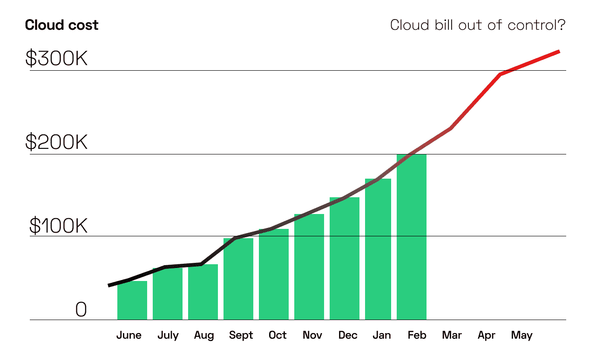
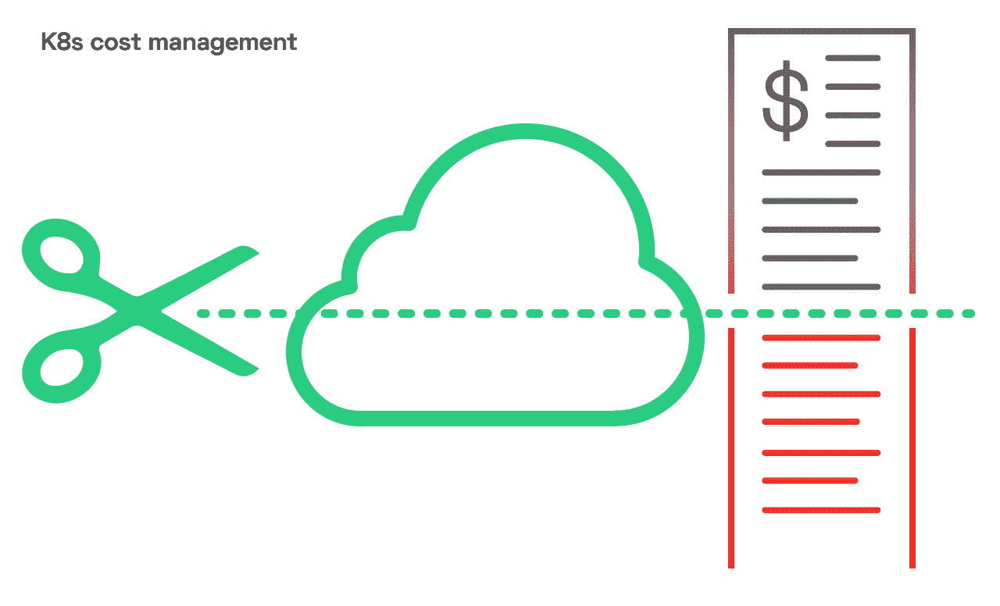

# 5 昂贵的 Kubernetes 成本陷阱和如何处理它们

> 原文：<https://thenewstack.io/5-expensive-kubernetes-cost-traps-and-how-to-deal-with-them/>

Kubernetes 的成本管理变得越来越复杂，更多的企业将很快面临这个问题。根据 Gartner 的调查，到 2022 年，75%的公司将在生产中运行容器化的应用。

如果你在 AWS 上使用 Kubernetes，你可能已经在实施[最佳实践来减少你的账单](https://cast.ai/blog/8-best-practices-to-reduce-your-aws-bill-for-kubernetes/)。然而，为了最大化您的[云成本节约](https://cast.ai)，您需要了解 Kubernetes 在成本管理和优化方面带来的具体挑战。请阅读本文，了解它们是什么以及如何处理它们。

## 为什么 Kubernetes 云成本如此令人困惑？

 [莱昂·库伯曼

莱昂是 CAST AI 的联合创始人兼首席技术官。Leon 曾担任甲骨文云基础设施安全产品副总裁，拥有 20 多年在 IBM、Truition 和 HostedPCI 等公司工作的经验。他创立了 Zenedge，并担任首席技术官，该公司被甲骨文收购。](https://www.linkedin.com/in/itexecutivecto/) 

在集装箱化之前，分配资源和成本要容易得多。你只需要将资源标记到一个特定的项目或团队。这足以让 FinOps 确定你的典型成本结构，更好地控制你的预算。一旦您映射了供应商标签并确定了拥有该项目的团队，计算总项目成本就变得更容易了。

当然，在这种情况下，您还会面临过度配置资源的风险。开发人员可能会订购比他们所需更多的资源，以确保应用程序无中断运行。随着 Kubernetes 和其他集装箱化工具变得越来越普遍，传统的成本分配和报告流程不再适用。计算出 Kubernetes 的成本估算、分配和报告并不容易。

如果你仍然不能详细了解你的团队的费用，不要担心。你不是唯一一个努力控制成本的人。为了改善您的成本控制，从探索这些成本挑战开始。

## 避免这 5 个 Kubernetes 成本陷阱

### 1.计算每个集装箱的成本

计算一个集装箱的成本本身并不难，但是需要基础设施和时间。

Kubernetes 集群是由多个团队运行的共享服务，拥有众多容器，包含各种应用程序。一旦部署了容器，您就可以使用集群的一些资源，并为属于该集群的每个服务器实例付费。

现在假设你有三个团队在开发 10 个不同的应用程序。知道哪个应用程序使用您的集群资源几乎是不可能的，因为每个项目都使用多个容器。你不知道一个给定的团队使用了哪个部分，以及在一个特定的项目中使用了多少。

简而言之，不清楚一个容器从一个特定的服务器上使用了多少资源。这使得计算和分配成本变得更加困难。

### 2.您通过不同的成本中心支付

您的公司包含多个成本中心，并非所有开发成本都来自 DevOps 预算。有些应用程序可能是由您的一个产品团队、一个 R&D 团队或您 IT 部门的另一个团队为影子 IT 项目创建的。

你的组织的规模和结构是这里的关键。如果你的公司提供多种数字服务，每种服务都有自己的团队和预算，跟踪云服务的成本就变得复杂了。当多个团队使用同一个集群时，定义哪个团队或项目负责最终账单的哪个部分就成了一个挑战。

### 3.跨云跟踪成本并不容易

一旦考虑到多云团，追踪就变得更加困难。Gartner 对公共云用户的调查显示，如今 81%的受访者与两家或更多提供商合作。据 ICD 称，到 2022 年，90%的企业将依赖多种云或内部云、私有云、混合云和公共云的混合。

因此，很快您可能会在多个云中运行 Kubernetes 集群，并且您的容器将使用不同的节点。

你的应用可以分散在不同的云上，比如 AWS、谷歌云平台、Azure 或者数字海洋。它们中的每一个可能只承载整体工作负载的一小部分，这使得跟踪节点和集群变得更加复杂。

### 4.缩放使问题变得更加复杂

为了充分利用 Kubernetes，大多数团队使用内置的 [Kubernetes 自动伸缩](https://cast.ai/blog/guide-to-kubernetes-autoscaling-for-cloud-cost-optimization/)机制。配置得越紧，运行集群的浪费就越少，成本就越低。

垂直 Pod Autoscaler (VPA)自动调整请求并限制配置以降低开销，而水平 Pod Autoscaler (HPA)则侧重于横向扩展，以达到分配给现有实例的最佳 CPU 或 RAM 数量。

但是，这些缩放机制会影响成本计算。VPA 不断改变容器上的请求数量，扩展和收缩其资源分配。另一方面，HPA 动态地改变容器的数量。

例如，想象三个 web 服务器容器在夜间运行。在高峰时段，HPA 从 3 个集装箱扩展到 50 个集装箱。然后，它在午餐期间缩减，然后恢复。晚上，它停留在一个较低的水平。

这意味着集装箱的数量及其尺寸是非常动态的，使得计算和预测成本的过程更加困难。

### 5.容器更加动态

使用容器，您可以跨地区、区域或实例类型重新计划工作负载。一个容器的寿命只有[一天](https://www.datadoghq.com/container-report/)。与虚拟机可以持续的时间相比，这只是时间上的一小部分。越来越多的人在 Kubernetes 上运行函数和 cron 作业。它们的寿命从几秒到几分钟不等。

集装箱化环境的动态特性为这种混合增加了另一层复杂性。你的成本管理系统需要能够处理这种情况。

## 如何处理这些 Kubernetes 成本问题

为了避免陷入上述陷阱，您需要一个基于可靠数据源的可靠成本分析流程。这里有一个示例向您展示它可能的样子:

1.  找到一个成本可见性工具来详细跟踪成本，例如，在微服务级别。
2.  一旦有了成本可见性，您就可以设置精确的预算并监控诸如流量成本等元素，以便更好地了解它们。
3.  接下来，按名称空间、单元、部署和标签分配您的成本。
4.  分析价格信息，预测下个月你要付多少钱。
5.  根据您的估计持续监控成本，并查明成本或使用异常，以便进一步分析。

目前，大多数公司都是手动解决这个问题，但是如果您可以自动化整个过程会怎么样呢？

## 解决方案:自动化 Kubernetes 成本管理

分配资源、计算成本和分析 Kubernetes 定价信息不应该像今天这样具有挑战性。同步成本和资源分配才是出路。

自动化工具的必备特性是什么？

1.  先进的云账单分析和成本可见性功能，能够分析单个微服务的成本，并获得任何云提供商的通用指标。
2.  自动化实例选择和合理调整。
3.  使用 [spot 实例节省高达 90%的成本](https://cast.ai/blog/how-to-reduce-cloud-costs-by-90-spot-instances-and-how-to-use-them/)。
4.  预测项目、集群、命名空间和部署的费用。

## 自动化成本管理

依靠手动策略来控制您的 Kubernetes 云成本是有风险的。它们通常很耗时，容易出错，并且难以维护。

部署自动化成本管理解决方案为您省去许多麻烦，并帮助您专注于对您的业务最重要的事情:向客户提供优质服务。

我们制作了 [CAST AI](https://cast.ai/) 就是为了做到这一点。预订一个演示，并给它一个旋转，看看你的 Kubernetes 成本下降。

<svg xmlns:xlink="http://www.w3.org/1999/xlink" viewBox="0 0 68 31" version="1.1"><title>Group</title> <desc>Created with Sketch.</desc></svg>