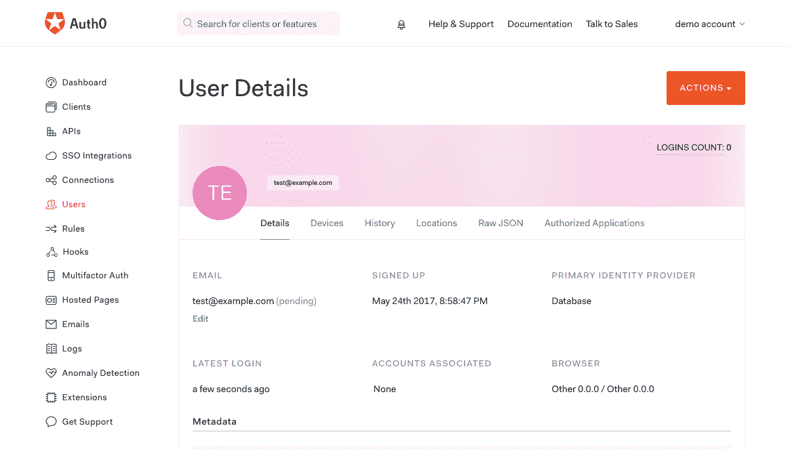
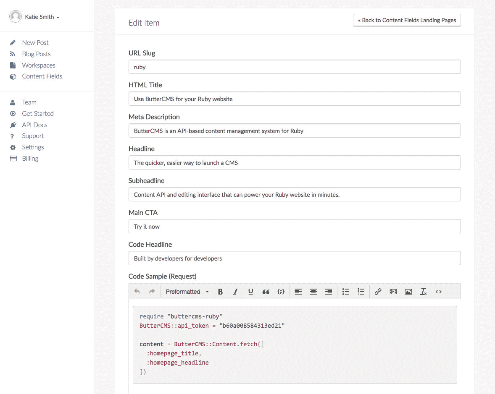
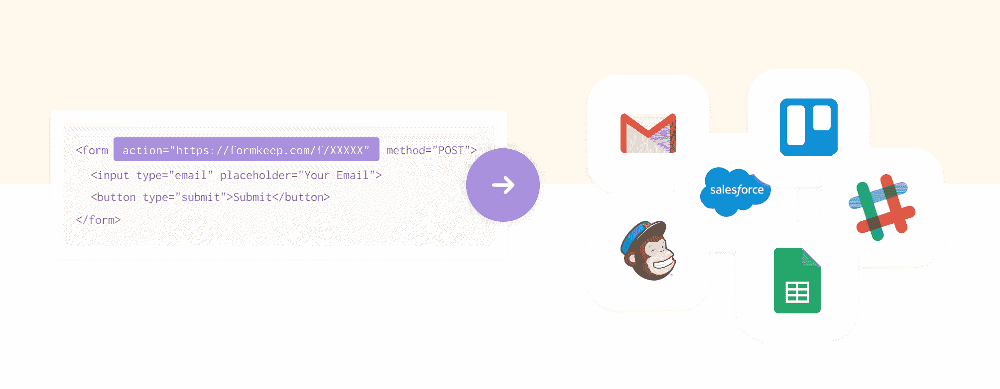

# 用于 Web 开发的 5 个方便的“无服务器”API

> 原文：<https://thenewstack.io/5-handy-api-services-web-development/>

[](https://buttercms.com/)

[Roger Jin](https://buttercms.com/)

[Roger Jin 是 ButterCMS 的一名开发人员和技术作家，他在 ButterCMS 专注于开发使开发人员的生活更轻松的工具。他将自己对编程和教育的热情结合在一起，撰写了一些关注无服务器开发、微服务等等的文章。他主要使用 React、Node.js、Elixir 和 Ruby 进行开发。](https://buttercms.com/)

[](https://buttercms.com/)[](https://buttercms.com/)

为什么要花时间去建造那些你可以买或租的东西呢？

对于那些以前从未听说过术语“BaaS”的人来说，它代表“后端即服务”，指的是可以集成到您的应用程序中以快速构建特定功能的第三方 API 服务。

例如，想象一下您的团队为您的产品构建一个单点登录服务以及一个用于提供和管理用户权限的管理界面需要做多少工作。听起来很痛苦吗？好消息是，有大量的服务可以让你不用写一行服务器代码就能实现。

事实上，现在已经有很多成功的公司几乎不用自己的服务器端代码就能生产出引人注目的产品。

在本文中，我们将介绍五个 API 服务提供者，它们解决了一些常见的特性，并看看它们是如何工作的。

## 1)用于认证的 Auth0

想象一下，拥有几个服务器提供的 web 应用程序、单页面应用程序、API 和移动应用程序，都需要对一组共享用户进行身份验证和授权？

[Auth0](https://auth0.com/) 通过其认证平台使这变得更加容易。Auth0 可以通过多种方式集成，包括[托管登录页面](https://manage.auth0.com/login)和使用其软件开发工具包(SDK)构建的完全集成的表单。

例如，托管登录页面可以用少量的 JavaScript 代码启动:

```
window<span class="token punctuation">.</span><span class="token function">addEventListener</span><span class="token punctuation">(</span><span class="token string">'load'</span><span class="token punctuation">,</span>  <span class="token keyword">function</span><span class="token punctuation">(</span><span class="token punctuation">)</span>  <span class="token punctuation">{</span>

  <span class="token keyword">var</span>  webAuth  <span class="token operator">=</span>  <span class="token keyword">new</span>  <span class="token class-name">auth0<span class="token punctuation">.</span>WebAuth</span><span class="token punctuation">(</span><span class="token punctuation">{</span>
 domain<span class="token punctuation">:</span>  <span class="token string">'YOUR_AUTH0_DOMAIN'</span><span class="token punctuation">,</span>
 clientID<span class="token punctuation">:</span>  <span class="token string">'YOUR_CLIENT_ID'</span><span class="token punctuation">,</span>
 redirectUri<span class="token punctuation">:</span>  window<span class="token punctuation">.</span>location<span class="token punctuation">.</span>href<span class="token punctuation">,</span>
 audience<span class="token punctuation">:</span>  <span class="token string">'https://YOUR_AUTH0_DOMAIN/userinfo'</span><span class="token punctuation">,</span>
 responseType<span class="token punctuation">:</span>  <span class="token string">'token id_token'</span><span class="token punctuation">,</span>
 scope<span class="token punctuation">:</span>  <span class="token string">'openid'</span>
  <span class="token punctuation">}</span><span class="token punctuation">)</span><span class="token punctuation">;</span>

  <span class="token keyword">var</span>  loginBtn  <span class="token operator">=</span>  document<span class="token punctuation">.</span><span class="token function">getElementById</span><span class="token punctuation">(</span><span class="token string">'btn-login'</span><span class="token punctuation">)</span><span class="token punctuation">;</span>

  loginBtn<span class="token punctuation">.</span><span class="token function">addEventListener</span><span class="token punctuation">(</span><span class="token string">'click'</span><span class="token punctuation">,</span>  <span class="token keyword">function</span><span class="token punctuation">(</span>e<span class="token punctuation">)</span>  <span class="token punctuation">{</span>
 e<span class="token punctuation">.</span><span class="token function">preventDefault</span><span class="token punctuation">(</span><span class="token punctuation">)</span><span class="token punctuation">;</span>
 webAuth<span class="token punctuation">.</span><span class="token function">authorize</span><span class="token punctuation">(</span><span class="token punctuation">)</span><span class="token punctuation">;</span>
  <span class="token punctuation">}</span><span class="token punctuation">)</span><span class="token punctuation">;</span>
<span class="token punctuation">}</span><span class="token punctuation">)</span><span class="token punctuation">;</span>

```

Auth0 还提供了管理用户和权限的管理界面。



Auth0 甚至提供了不错的额外功能，如多因素身份验证和密码泄露检测。

## 2)用于博客和内容管理的 ButterCMS

你已经用你最喜欢的技术栈(比如 Node.js，Rails，React)建立了一个网站，现在你需要在你的应用程序中添加一个客户端友好的博客和内容管理系统——就像 WordPress 一样简单易用。

建立博客和 CMS 后台可能是你最不想做的事情。幸运的是， [ButterCMS](https://buttercms.com/) 让这变得简单。

ButterCMS 提供了用于将动态内容集成到应用程序中的 API 和 SDK，以及用于内容编辑和发布的客户端友好的管理界面。

例如，使用 ButterCMS JavaScript 客户端:
用这个简单的代码就可以将你的博客文章或页面内容作为 JSON 获取

```
butter<span class="token punctuation">.</span>post<span class="token punctuation">.</span><span class="token function">list</span><span class="token punctuation">(</span><span class="token punctuation">)</span><span class="token punctuation">.</span><span class="token function">then</span><span class="token punctuation">(</span><span class="token keyword">function</span><span class="token punctuation">(</span>response<span class="token punctuation">)</span>  <span class="token punctuation">{</span>
  console<span class="token punctuation">.</span><span class="token function">log</span><span class="token punctuation">(</span>response<span class="token punctuation">)</span>
<span class="token punctuation">}</span><span class="token punctuation">)</span>

butter<span class="token punctuation">.</span>content<span class="token punctuation">.</span><span class="token function">retrieve</span><span class="token punctuation">(</span><span class="token punctuation">[</span><span class="token string">"homepage"</span><span class="token punctuation">]</span><span class="token punctuation">)</span><span class="token punctuation">.</span><span class="token function">then</span><span class="token punctuation">(</span><span class="token keyword">function</span><span class="token punctuation">(</span>response<span class="token punctuation">)</span>  <span class="token punctuation">{</span>
  console<span class="token punctuation">.</span><span class="token function">log</span><span class="token punctuation">(</span>response<span class="token punctuation">)</span>
<span class="token punctuation">}</span><span class="token punctuation">)</span>

```

ButterCMS 的管理界面简单直观，所以你不必担心你的内容编辑会打扰你如何做事情。*(披露:作者是 ButterCMS 的开发者)。*



## 3)表单的表单保存

您已经构建了一个简单的静态网站，但现在您需要添加一个自定义设计的联系人表单，该表单可以与您的 CRM 集成并发送一封自动回复电子邮件。构建一个定制的服务器应用程序来处理表单的 POST 请求听起来是一件痛苦的事情，对吗？FormKeep 的存在就是为了把你从那个麻烦中解救出来。

使用 FormKeep 只需将表单指向它们的端点:

```
<span class="token tag"><span class="token punctuation">&lt;</span>form  <span class="token attr-name">action</span><span class="token attr-value"><span class="token punctuation">=</span><span class="token punctuation">"</span>https://formkeep.com/f/df42a5f6bd1a<span class="token punctuation">"</span></span>  <span class="token attr-name">method</span><span class="token attr-value"><span class="token punctuation">=</span><span class="token punctuation">"</span>POST<span class="token punctuation">"</span></span><span class="token punctuation">&gt;</span></span>  
  <span class="token tag"><span class="token punctuation">&lt;</span>input  <span class="token attr-name">type</span><span class="token attr-value"><span class="token punctuation">=</span><span class="token punctuation">"</span>text<span class="token punctuation">"</span></span>  <span class="token attr-name">name</span><span class="token attr-value"><span class="token punctuation">=</span><span class="token punctuation">"</span>name<span class="token punctuation">"</span></span><span class="token punctuation">&gt;</span></span>
  <span class="token tag"><span class="token punctuation">&lt;</span>input  <span class="token attr-name">type</span><span class="token attr-value"><span class="token punctuation">=</span><span class="token punctuation">"</span>text<span class="token punctuation">"</span></span>  <span class="token attr-name">name</span><span class="token attr-value"><span class="token punctuation">=</span><span class="token punctuation">"</span>email<span class="token punctuation">"</span></span><span class="token punctuation">&gt;</span></span>
  <span class="token tag"><span class="token punctuation">&lt;</span>input  <span class="token attr-name">type</span><span class="token attr-value"><span class="token punctuation">=</span><span class="token punctuation">"</span>submit<span class="token punctuation">"</span></span>  <span class="token attr-name">value</span><span class="token attr-value"><span class="token punctuation">=</span><span class="token punctuation">"</span>Submit<span class="token punctuation">"</span></span><span class="token punctuation">&gt;</span></span>
<span class="token tag"><span class="token punctuation">&lt;/</span>form<span class="token punctuation">&gt;</span></span>

```

FormKeep 让你可以设置自定义回复邮件，并使用 Zapier 与几乎任何 CRM 或后端集成。



## 4)用于电子商务的 Moltin

如果你正在寻找建立一个电子商务网站或应用程序，看看 [Moltin](https://www.moltin.com/) ，它提供了一系列广泛的 API，支持从库存、购物车、结账和支付的一切。Moltin 对于提供跨平台购物体验非常有用，或者如果你想使用你喜欢的技术栈来构建独特的网络体验。

[Moltin 的 API](https://docs.moltin.com/v2/development/libraries) 非常广泛，但是为了了解它的样子，这里有一个将产品添加到用户购物车的示例请求:

```
curl  -X  POST https://api.moltin.com/v2/carts/supercart/items \
 -H  "Authorization: Bearer XXXX"  \
 -H  "Content-Type: application/json"  \
 -d  '{"data":{"type":"cart_item","id":"9bbf14aa-15ae-42f4-8eed-d860a7c8046f","quantity":1}}'

```

## 5)发送信息和聊天的 SendBird

你有多少次在应用程序中内置消息或聊天功能？如果你的回答不止一次，很有可能你知道下次你会更希望别人来处理这件事。

SendBird 提供涵盖从前端用户界面到后端 API 的整套软件开发工具包，因此您不必担心精心构建聊天界面或将后端扩展到数百万并发用户。

例如，用 JavaScript 发布来自用户的消息就像三行代码一样简单:

```
channel<span class="token punctuation">.</span><span class="token function">sendUserMessage</span><span class="token punctuation">(</span>message<span class="token punctuation">,</span>  data<span class="token punctuation">,</span>  customType<span class="token punctuation">,</span>  <span class="token keyword">function</span><span class="token punctuation">(</span>response<span class="token punctuation">,</span>  error<span class="token punctuation">)</span><span class="token punctuation">{</span>
 <span class="token keyword">if</span>  <span class="token punctuation">(</span>error<span class="token punctuation">)</span>  <span class="token punctuation">{</span>
 console<span class="token punctuation">.</span><span class="token function">error</span><span class="token punctuation">(</span>error<span class="token punctuation">)</span><span class="token punctuation">;</span>
 <span class="token punctuation">}</span>
<span class="token punctuation">}</span><span class="token punctuation">)</span><span class="token punctuation">;</span>

```

SendBird 支持多种实现方式，包括一对一消息传递、群聊和开放频道。它还提供了不错的高级功能，如阅读回执、垃圾邮件泛滥保护和审核工具。

## 包裹

我们喜欢听到新的后端服务提供商，所以请在评论中告诉我们，或者将它们提交到 GitHub 上我们的[策划列表中。](https://github.com/rogerjin12/awesome-baas)

通过 Pixabay 的特征图像。

<svg xmlns:xlink="http://www.w3.org/1999/xlink" viewBox="0 0 68 31" version="1.1"><title>Group</title> <desc>Created with Sketch.</desc></svg>