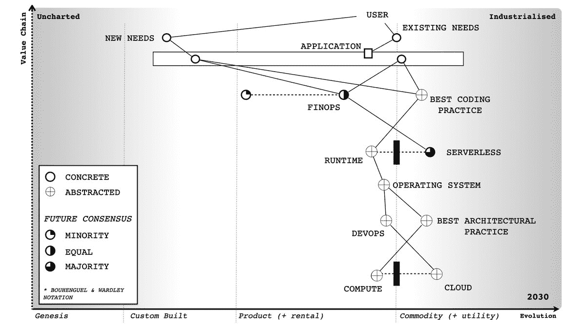

# 2022 年的 5 项互联网技术预测

> 原文：<https://thenewstack.io/5-internet-technology-predictions-for-2022/>

随着又一年接近尾声，是时候发布最可怕的网络媒体文章了:预测帖。就我而言，是从开发者的角度来预测互联网技术的未来。

在科技世界，预测帖子尤其令人担忧，因为事情变化如此之快——而且很多时候缺乏逻辑。谁会预料到“Web3”会成为 2021 年的标志性流行语？即使是最乐观的 crypto VC 也不会在一年前做出这样的预测(a16z 的 Web3 代言人 [Chris Dixon](https://a16z.com/author/chris-dixon/) ，直到 2021 年 7 月才在 Twitter [上使用这个术语)。谁还会想到一家初创公司会](https://twitter.com/cdixon/status/1416078680854450181)[推出一种金属球](https://thenewstack.io/top-5-internet-technology-stories-of-2021/)，扫描人们的眼球以换取加密货币？2021 年是疯狂的一年。

本着 2021 年的精神，我将在我的 2022 年清单中包括至少一个滑稽、科幻的预测。看看你能不能认出是哪一个。

## 1.密码市场将会修正

在这个时间点，2021 年 12 月，还不清楚加密市场——现在被称为“Web 3”——是否处于相当于 1999 年的市场高峰，或者是否像 1993 年的 web 一样处于其运行的最开始阶段。不管怎样，我预计市场将在 2022 年出现调整。以下是我的推理:

我目前对 Web3 的主要批评是，除了像加密交易所和 NFT 市场这样的投机工具之外，没有任何有用的东西是用加密和区块链构建的。Web3 的[技术基础设施既有缺陷，也不像许多加密支持者声称的那样](https://thenewstack.io/web3-architecture-and-how-it-compares-to-traditional-web-apps/)[分散。另一方面，同样的论点可以用来支持 1993 年的比较——当时网络还不成熟，还没有为主流做好准备。](https://thenewstack.io/web3-isnt-fully-decentralized-a-look-at-alchemy-bitclout/)

但是考虑到 Web3 中缺乏可行的产品，我的观点是这个市场的价值现在被极大地夸大了。记住，从网景公司开始的第一波网络公司 IPO 直到 1995 年下半年才开始。那时网络平台正在快速成熟，并吸引了微软和甲骨文等大型科技公司的注意(和激烈的竞争)。但是 Web3 相当于网景或雅虎吗？也许是比特币基地，但仅仅是因为数百万人用它来投机加密货币。

所有这些让我得出结论，crypto / Web3 市场明年将迎来一次市场调整。如果它变成全面崩溃(这很难预测，但有可能发生)，那么我们将看到哪些 Web3 公司是真正的交易。从积极的一面来看，他们中很可能有一个未来的 Amazon.com——我不排除这一点。

## 2.苹果将结束其在 iOS 上的浏览器引擎禁令

正如我在 2021 年的[头条中提到的，苹果现在面临着与移动浏览器相关的压力。6 月，英国竞争和市场管理局(CMA)开始了一项针对移动生态系统](https://thenewstack.io/top-5-internet-technology-stories-of-2021/)的[市场研究，重点关注苹果和谷歌，并于本月发布了中期报告。关于浏览器禁令，CMA 指出，“由于 WebKit 限制，iOS 上的浏览器引擎没有竞争，苹果实际上规定了 iOS 上的浏览器可以提供的功能。”](https://www.gov.uk/cma-cases/mobile-ecosystems-market-study)

我的一个消息来源曾参与了一份提交给 CMA 的报告，他认为苹果将在 2022 年被迫向外部浏览器引擎开放——不仅在英国，在美国和其他市场也是如此。这是这个人告诉我的:

“我发现很难想象第三方浏览器在英国 iOS 上被解禁，而不会对其他国家产生巨大影响的场景。美国监管机构会去:看起来在英国的安全/隐私方面很好，所以我们希望你在这里做同样的事情。我甚至看不到苹果对此提出质疑。”

如果你是 iPhone 的 Chrome 用户(像我一样)，这是一个令人兴奋的潜在发展。

## 3.一个新的谷歌核心网络指标的响应度

现在来看一些更平淡无奇，但对网络的持续健康至关重要的东西。谷歌对网络开发者和出版商的指导，称为[核心网络生命](https://web.dev/vitals/)，在 2021 年成为其搜索排名机制[的关键部分。CWV 有三个主要方面:](https://terakeet.com/blog/core-web-vitals/)

*   最大含量涂料(LCP)
*   第一输入延迟(FID)
*   累积布局偏移(CLS)

根据微软 Edge 的合作伙伴项目经理亚历克斯·罗素(在此之前是谷歌 Chrome 的高级工程师)的说法，一些网络开发工具和框架“一直在销售速度，却没有交付。”因此，他预测我们很快就会看到“一种新的反应标准”他不确定这一数字是否会在 2022 年或 2023 年下降，“但即使是对他们正在做的事情的预览，也会继续改变 SEO 给买家的信息，并相应地改变投资，”他告诉我。

这将特别影响 FID 测量，Russell 说“在 CWV 发射的时候就知道是坏的”他说，随着谷歌修复这个问题，“它将为那些玩游戏或试图为糟糕结果开脱的框架留下更少的空间。”

## 4.无服务器将作为主流开发实践加入容器

Netlify 的[劳里·沃斯](https://twitter.com/seldo)在他对 2022 年 Jamstack 的[预测中写道，“无服务器功能【将】成为主流。”他指出“令人震惊的是，46%的开发者报告说他们至少在一些项目中使用了无服务器功能”(来源:Netlify 2021 年](https://thenewstack.io/predictions-for-the-jamstack-in-2022/) [Jamstack 调查](https://jamstack.org/survey/2021/))。根据 Voss 的说法，这个数字明年将上升到 50%以上，将无服务器功能“放在容器和微服务之上”,成为主流开发者技术。

换句话说，2022 年可能是无服务器的转折点——也许是成为云计算未来的第一步。分析师 Simon Wardley 制作了一个极好的图表来描绘未来十年无服务器的发展轨迹:

来源:西蒙·沃德利

该图表明，到 2030 年，计算领域的几乎所有东西都将被抽象化，剩下的唯一“具体”的东西之一将是无服务器。

## 5.一家新的元宇宙创业公司将于 2022 年推出，并取代 Meta

独家报道:2022 年，一个名为 Doppel 的新的元宇宙社交网络将脱离秘密模式，公开发布。这将引起轰动，并成为元宇宙技术的引爆点，因为这是一款突破性的 VR 耳机，价格不超过 100 美元，还有一个令人惊叹的 3D 虚拟世界(完全基于网络)。在 FOMO 和大批抖音有影响力人士的推动下，数百万人将在几个月内注册。到今年年底，每天将有数千万人“进入”Doppel，在里面工作和娱乐。

* invirt:身处虚拟现实中。把 invirt 想象成在线的 VR 等价物。

由于分析家称之为“道佩尔效应”，Meta 的股票价格将会暴跌。随着越来越多的人把所有时间都花在 Doppel 上，脸书将失去数千万的日活跃用户。

好吧…如果你现在还没猜到，这个预测是假消息。在我 2016 年的科幻小说 [Presence](https://ricmac.org/presence/) 中，Doppel 是一家类似脸书的虚拟现实公司，背景设定在 2051 年。我在我的预测中包括了这一点，以显示做出技术预测的行为是多么的危险和有点可笑！

不过，预测未来很有趣，所以[让我知道](https://twitter.com/ricmac)你自己对 2022 年的看法。

<svg xmlns:xlink="http://www.w3.org/1999/xlink" viewBox="0 0 68 31" version="1.1"><title>Group</title> <desc>Created with Sketch.</desc></svg>