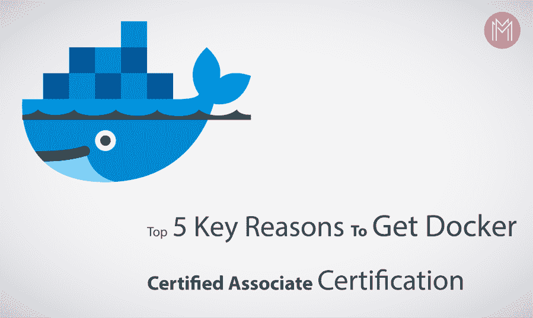

# 成为 Docker 认证助理的 5 个关键原因

> 原文：<https://thenewstack.io/5-key-reasons-to-become-a-docker-certified-associate/>

Docker 认证意味着通过 Docker Certified Associate (DCA)考试，并获得 Docker 技能的声誉。以下是一些好处，如 [Docker 认证网页](https://success.docker.com/certification)所述。

*   官方码头工人证书对你的码头工人技能的认可。
*   数字(在线)证书和 Docker Certified Associate 标志的使用。
*   限制访问 LinkedIn 上的 Docker Certified experience 系统，欢迎使用 Certified。

然而，我相信开发者应该考虑体验 Docker 认证考试计划的原因还有很多。在这篇文章中，我想展示一些关于 Docker 认证的观点。

1.  ### 自始至终，你都会成为一名专家

 [R.阿兹哈鲁丁

R.Azharuddin 是 Mindmajix 的技术内容撰稿人和 SEO 分析师。他拥有 JNTUA 大学的计算机科学与工程学士学位。](https://www.linkedin.com/in/azhar-uddin-a9597150/) 

在您体验 Docker 认证考试计划的过程中，您将有机会了解与以下内容相关的想法，并最终成为一名优秀的开发人员、应用架构师和系统管理员。以下是您将学到的一些内容:

*   从统一注册表中存储的以前的图片运行容器化的应用程序
    *   这将有助于您的日常开发/编程，使您能够快速打开开发域或编程应用程序，使用它们并根据需要解除它们的委托。
*   在整个集群中设置图片
    *   它将有所帮助的一个领域是通过在一种类型的容器中在集群上发送图片来实现连续传送。
*   安装、维护和运行 Docker 平台
    *   这将让你了解 Docker 的内部知识。
*   对来自合作伙伴的问题报告进行分类并解决。
*   支持新的对接情况，并执行一般配置和维护。
*   将常规应用程序转移到容器中。
    *   这将使您能够承担将现有应用程序作为 docker 容器化应用程序迁移的关键部分。
*   Docker 平台的设计和故障排除

您将有机会进行一次深刻的跳跃，学习与以下内容相关的概念:

*   建立工作关系网
*   卷和存储
*   安装和配置
*   管弦乐编曲
*   映像创建、管理和注册
*   安全性

2.  ### 作为一名开发人员，一名云本地应用程序开发人员，你会不断进步

Docker 容器作为一项创新改变了软件传输的方方面面。利用 Java 构建应用程序需要 JVM 容器辅助的日子已经一去不复返了。

欢迎来到 Docker 容器的世界！在 Docker 引擎运行时的帮助下，任何应用程序现在都可以在 Docker 容器的帮助下移植到任何框架上。

通过体验 Docker 与众不同的部分，作为一名开发人员，你可以通过学习细节来提高自己。[学 Docker](https://mindmajix.com/docker-training) 然后去考 Docker 认证考试。

您最终会利用容器化的应用程序来采用新的结构和工具，按照您的意愿调试/停用应用程序。您还将学习映像创建、注册和管理，以及安装和配置

3.  ### 强化你的职业形象

如果你有机会成为一名 DCA，这将表明你已经完成了尽职调查，并有通过考试的具体最终目标。这将提升雇主对你从事码头相关工作的信心。

即使你不能通过认证考试，你也一定会学到很多与 Docker 相关的好东西。在一天结束的时候，这不仅可以帮助你处理与 Docker 相关的问题，还可以帮助你完成与 Docker 相关的面试。

4.  ### 以更好的方式协作和沟通

通过逐点体验 Docker 确认考试科目，让您了解更多与网络、流程编排和存储相关的细节。因此，这鼓励你通过提出与 Docker 实现相关的关键困难，以一种更好的方式传授知识并与相关伙伴合作。

它同样会帮助你的协会充分利用 Docker 容器技术，并有一个具体的最终目标，以达到更敏捷和适应性更强。

5.  ### Docker Captain——帮助你更好地准备/辅导他人

最后但并非最不重要的一点是:当你投身于 Docker 的想法时，你会发现自己更适合作为 Docker 队长，通过考虑关键观点和关键想法，帮助你的同事和团队准备和教授 Docker 课程。

## 摘要

在这篇文章中，你发现了你应该参加 Docker 认证考试的部分关键原因。

你发现这篇文章有价值吗？你对这个职位有什么疑问或建议吗？这个职位与 Docker 认证助理考试有关。请留言并提出您的疑问，我将尽最大努力解答您的问题。

<svg xmlns:xlink="http://www.w3.org/1999/xlink" viewBox="0 0 68 31" version="1.1"><title>Group</title> <desc>Created with Sketch.</desc></svg>