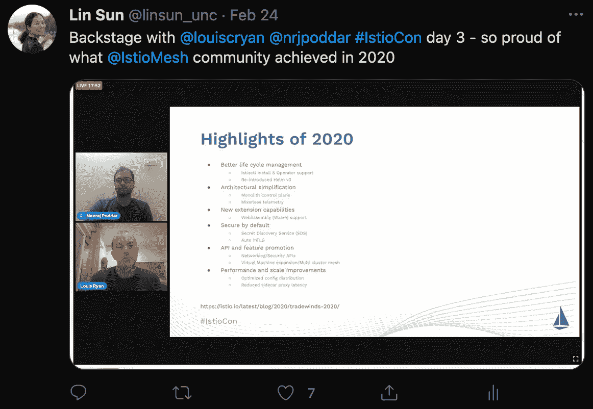

# IstioCon 2021 的 5 大要点

> 原文：<https://thenewstack.io/5-key-takeaways-from-istiocon-2021/>

[林是 Solo.io 的开源总监，她自 2017 年以来一直致力于 Istio 服务网格，并在 Istio 技术监督委员会任职。此前，她在 Istio 指导委员会工作了三年，并在 IBM 担任了 15 年多的高级技术人员和主发明家。她是《Istio 解释》一书的作者，拥有 200 多项专利。](https://www.linkedin.com/in/lin-sun-a9b7a81/)

今年的首届 Istio 社区大会取得了巨大成功。该活动于 2 月 22 日至 26 日举行，将全球约 3000 名与会者联系在一起，就像 [Istio 服务网](https://istio.io/latest/docs/concepts/what-is-istio/)连接微服务一样无缝。

作为会议项目的联合主席，我非常荣幸地与项目委员会的其他成员一起工作，从各种世界级的演讲者中挑选会议提交材料。我想分享我从这个节目中得到的五个关键收获:

1.  **2020:Istio 创新的一年**

我多次听到用户说，由于将所有控制平面组件整合到 Istiod 中，Istio 更易于使用。Mixer 的移除和 Web 程序集可扩展性功能的引入也受到了社区的广泛称赞。完整的亮点列表 Istio 增强功能和亮点可在此处找到:

用户还对 Helm 3 支持和简化的多集群部署模式给予了积极的反馈。

2.  **Istio 在生产中被广泛使用**

在本周的 IstioCon 上，许多知名品牌都在台上讨论他们对 Istio 的采用，包括；T-Mobile、Airbnb、[易贝](https://tech.ebayinc.com/?utm_content=inline-mention)和 Salesforce。与会者很高兴听到这些演讲者的发言，尤其对 T-Mobile 印象深刻，该公司已成功实施了 100 多个 Istio 服务网格实例。

与会者还兴奋地发现，Airbnb 使用了[外部控制平面部署](https://istio.io/latest/blog/2020/new-deployment-model/)模式，并且非常喜欢。我花了很多时间在 Istio upstream 上开发这个功能，我很高兴我的旅行网站在生产中使用了它！

3.  **Istio 路线图将会很无聊**

这是一个积极的举措，尤其是对大客户而言。在进行了必要的架构更改后，Istio 现在可以放慢速度，专注于 Istio 的第二天操作——包括准确地对特性及其相应的状态进行编目。我们希望 Istio 像 Kubernetes 一样成为用户微服务基础设施的一部分，核心功能的配置不变。高级用户应该能够利用 [Web Assembly](https://thenewstack.io/webassembly-could-be-the-key-for-cloud-native-extensibility/) (WASM)基于他们的业务需求来扩展 sidecar 代理。

4.  **Istio 和 Kubernetes 越走越近**

Istio 一直在采用 [Kubernetes 服务 API](https://istio.io/latest/docs/tasks/traffic-management/ingress/service-apis/)。我们打算用这些 Kubernetes APIs 替换 Istio 现有的网络 API。这一举措将帮助用户从 Kubernetes 平稳过渡到任何实现 Kubernetes 服务 API 的服务网格。

社区已经将复制和共享的控制平面模型统一到一个单一的多集群部署模型中。虽然这很好，但它缺乏合适的 API，让用户可以方便地向其他集群公开服务或使用其他服务的服务。Istio 打算实现 [Kubernetes multicluster 服务 API](https://github.com/kubernetes/enhancements/tree/master/keps/sig-multicluster/1645-multi-cluster-services-api) 来缩小这个差距。

5.  **抽象可以让 Istio 变得更好**

我们注意到用户经常在 Istio 资源之上提供他们自己的抽象来帮助简化 Istio 的采用。在这种模型下，只有服务网格平台团队需要拥有 Istio 专业知识，服务所有者可以简单地利用抽象层提供的配置。例如，Salesforce 使用 Helm 来提供这个抽象层，而易贝使用他们自己开发的定制资源来实现类似的抽象层。这也允许服务网格实现被容易地切换。在 Solo.io，我们也相信抽象有助于我们的用户采用 Istio 服务网格，而不必了解 Istio APIs 的所有细节。

## **结论**

我对这次会议的结果感到非常兴奋。我期待着与社区中的更多人联系，帮助我们塑造 Istio 的未来。我预计，随着 Istio 巩固其作为业内最受欢迎的服务网络的地位，2021 年将有更多用户在生产中采用 Istio。

如果你在使用 Istio 方面需要帮助(无论你是在寻找除默认 N-1、FIPS 140-2 兼容的 Istio 之外的扩展支持版本，还是简化的多集群和多网配置管理),请随时通过 [Twitter](https://twitter.com/linsun) 或 [Solo.io](https://www.solo.io/company/contact/) 联系我。

Solo.io 是一家现代 API 基础设施公司，提供从边缘到服务网格的应用网络。Solo.io 是 IstioCon 的战略合作伙伴，在展会上有超过五场[演讲。有兴趣了解有关 Istio 和服务网格的更多信息，请在 3 月 23 日至 25 日免费收听](https://www.solo.io/blog/catch-all-7-solo-io-sessions-at-istiocon/) [SoloCon 2021](https://www.solo.io/solocon/) 。

<svg xmlns:xlink="http://www.w3.org/1999/xlink" viewBox="0 0 68 31" version="1.1"><title>Group</title> <desc>Created with Sketch.</desc></svg>