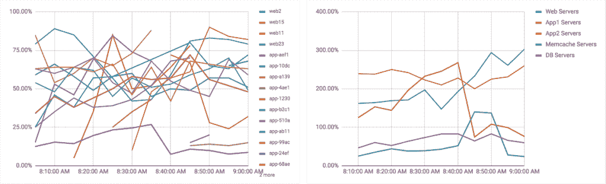

# 5 Kubernetes 监控待办事项

> 原文：<https://thenewstack.io/5-kubernetes-monitoring-to-dos/>

 [Steven Czerwinski，Scalyr 工程主管

Steven Czerwinski 是 Scalyr 的联合创始人兼工程主管。在 Scalyr 之前，他在 Google 工作了 8 年，专门为消费者应用程序构建分布式数据库系统。他是 Picasa 网络相册的后端技术负责人，Cosmo 的技术负责人，以及 Stratus 的技术负责人，Stratus 是 Cosmo 的替代者，推动了包括 Google Plus 在内的进一步统一。在加入谷歌之前，Steven 在加州大学伯克利分校攻读博士学位，专攻分布式和移动系统。他成功地通过了论文答辩，但离开了 ABD，开始了他在谷歌的工作。](http://scalyr.com/) 

如果您处于 DevOps 的前沿，Kubernetes 正迅速成为您的生产云环境的重要组成部分。因为容器编排对于部署、扩展和管理容器化的应用程序至关重要，所以监控 Kubernetes 需要成为监控策略的重要组成部分。

容器环境不像传统环境那样运行。因此，如果您正在监控您的应用程序和基础设施，您需要考虑如何监控运行它们的容器环境。以下是指导您策略的五个最佳实践:

1.  集中您的日志和指标。通过 Kubernetes 编排您的容器化服务和工作负载可以使混乱变得有序，但是请记住，您的环境仍然是分散的。如果您将日志和指标集中化，您将会给自己一个奋斗的机会。
2.  说明短暂的容器。容器编排的美妙之处在于很容易在短时间内启动、停止、终止和清理容器。然而，监控他们可能并不容易。即使服务来来去去，您仍然需要调试问题和监视集群活动。诀窍是在日志和指标消失之前抓住它们。如果不这样做，您的指标看起来会更像左边的图，而不是右边的图。
3.  简化，简化，简化。对于容器环境中的所有移动部分(服务、API、容器、编排工具)，您需要在不引入不必要的复杂性的情况下进行监控。不要用各种各样的监控代理来膨胀您的容器，每一个都需要按照独特的时间表进行更新，而是从您所监控和管理的内容中抽象出您的监控和管理工具。这也将帮助您的工程师专注于构建和交付软件，而不是操作交付平台。
4.  明确监控每一层。您需要收集日志，并在环境的每一层(pod、容器和控制器管理器)监控错误、故障和性能问题。例如，您需要能够对 pod 问题进行故障诊断，确保容器正在工作，并在控制器管理器中收集运行时指标。
5.  确保各层之间的数据一致性。为了快速、准确地调试，您需要确保容器环境中所有层的数据一致性。诸如准确的时间戳、一致的度量单位(例如毫秒与秒)以及跨应用程序和组件收集一组通用的指标和日志等，将帮助您跨所有层快速准确地进行故障排除和调试。

以简单直接的方式完成这些待办事项的一个最佳实践是在不接触应用程序容器的情况下监视 Kubernetes 环境中的容器。要做到这一点，可以在 Kubernetes 环境中引入 DaemonSet 或 sidecar，该环境位于容器化服务的旁边，包括日志记录和度量收集代理。使用这种方法进行部署将确保一致的数据收集，最大限度地减少对应用程序容器的更改，最重要的是，消除生产环境中选择性失明的可能性。

实现这一点的几种方法包括:

*   引入一个带有 Fluentd 日志记录代理的 DaemonSet(这将为您提供日志记录，但不是指标)。如果您已经配置了 ELK 集群，这可能是您的选择。点击此处了解更多信息。
*   引入带有普罗米修斯度量代理的 DaemonSet 或 sidecar(core OS 在集成普罗米修斯和 Kubernetes 方面做得非常好)。在 Kubernetes 集群上运行 Prometheus 将为您提供度量工具、查询和警报。[在此了解更多信息](https://coreos.com/blog/prometheus-and-kubernetes-up-and-running.html)。
*   各种度量和性能监控工具，包括 Heapster、DataDog、cAdvisor、New Relic、Weave/VMware 和其他几个工具，也为 Kubernetes 监控提供了 DaemonSet 或 sidecar 选项。

<svg xmlns:xlink="http://www.w3.org/1999/xlink" viewBox="0 0 68 31" version="1.1"><title>Group</title> <desc>Created with Sketch.</desc></svg>