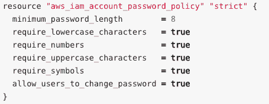
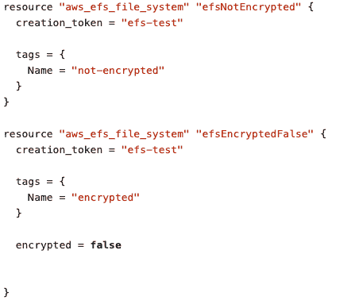
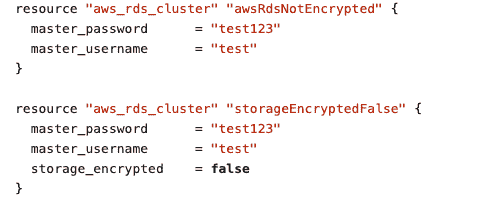
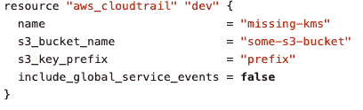
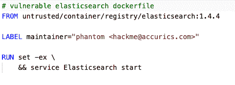

# 5 基础设施即代码的更多安全风险

> 原文：<https://thenewstack.io/5-more-security-risks-for-infrastructure-as-code/>

Accurics 赞助了这篇文章。

 [皮尤什·沙尔马

皮尤什是 Accurics 的联合创始人兼首席技术官。他是一名技术专家、企业家和工程领导者，在构建大规模 IaaS、端点和数据中心安全产品方面拥有近 20 年的经验。](https://www.linkedin.com/in/piyushsharrma/) 

通过代码(如 Terraform、AWS 云形成模板、Azure 资源管理器模板和 Kubernetes YML 文件)供应和管理云基础设施，实现了敏捷性。它还提供了在开发生命周期的早期嵌入安全性的机会，并在提供基础设施之前减少攻击面。为了实施正确的安全控制，了解与基础架构即代码(IaC)相关的主要风险非常重要。

在我们的[五大 IaC 风险](https://thenewstack.io/top-5-security-risks-for-infrastructure-as-code/)帖子中，我们讨论了其中的五种风险；在这篇后续文章中，我们概述了你应该注意的另外五个风险。

## **6。违规行为**

许多利用云基础架构的组织被强制遵守许多监管标准，如 GDPR、HIPAA、PCI 和 SOC2。如果没有在 IaC 上实施基于这些标准的策略防护，将会导致合规失败。例如，SOC2 要求存在 IAM 密码策略；因此，应该实施策略护栏，以确保在 IaC 中强制实施(如下例所示)。

一些标准还要求在持续集成(CI)和持续部署(CD)阶段评估 IaC 模板，因此违反策略会导致部署受阻。

**提示:**对基础架构代码(IaC)执行合规性检查，包括评估构建以确保云部署从一开始就合规。

## 7.数据暴露

云存储基础架构的配置是确保云中数据安全的关键要素。例如，创建时没有启用加密的数据库或云存储服务(如亚马逊弹性文件系统和亚马逊 S3)可能会带来风险(如下面的代码所示)。虽然加密只是数据安全的一个方面，但还有许多其他错误配置会在云中造成数据泄露。通过代码自动配置和管理存储基础架构(IaC)会加剧这些问题。

**提示:**将基础设施中与数据安全相关的配置作为代码进行评估，并在开发周期的早期对其进行补救。

## 8.硬编码的秘密

硬编码的秘密或凭证是一种常见的弊端，它涉及在源代码中存储纯文本凭证，如 SSH 密钥或帐户秘密(下面的示例代码片段)。这种风险可能导致违规期间未经授权的权限提升和横向移动。在运行时环境中，很难跟踪硬编码的秘密并将其置于上下文中。不幸的是，通过代码提供和管理基础设施使得在其中硬编码机密变得更加容易。

**提示:**将基础架构作为代码进行扫描，查找硬编码的秘密，并在调配云基础架构之前修复问题。

## 9.禁用的审计日志

审核日志在评估敏感或机密资产的安全风险以及调查事件的根本原因方面发挥着至关重要的作用。审计日志服务的著名例子是 AWS CloudTrail 和 Amazon CloudWatch。在调配云基础架构时，应该启用此功能。当通过代码自动提供基础设施时，很容易忽略这种配置，如下面的代码所示。

**提示:**启用审计日志来增强安全监控过程并帮助识别威胁。

## 10.不受信任的图像来源

IaC 模板用于构建从外部资源部署和运行代码的环境。但是，这些模板可能会无意中引用来自不可信来源的操作系统或容器映像。这可能会带来安全风险，如后门、中间人攻击、恶意软件和加密矿工。

**提示:**扫描 IaC 模板中的图像源/注册表，确保图像可信并经过数字签名。

专题图片[由 Alex Brylov](https://www.shutterstock.com/image-photo/elegant-female-extreme-climber-silhouette-against-214289443) 通过 Shutterstock 提供。

<svg xmlns:xlink="http://www.w3.org/1999/xlink" viewBox="0 0 68 31" version="1.1"><title>Group</title> <desc>Created with Sketch.</desc></svg>