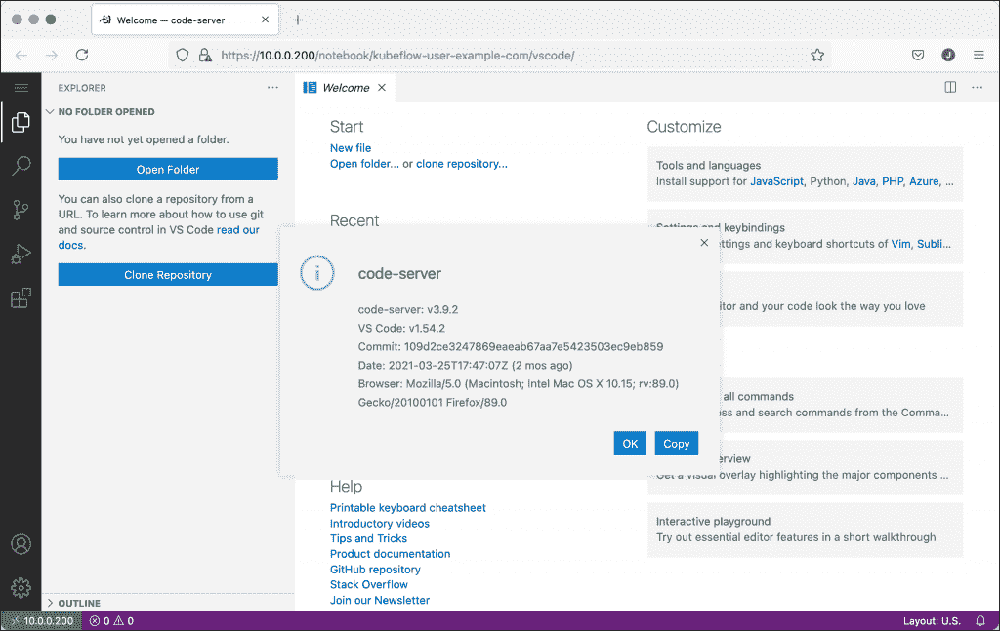
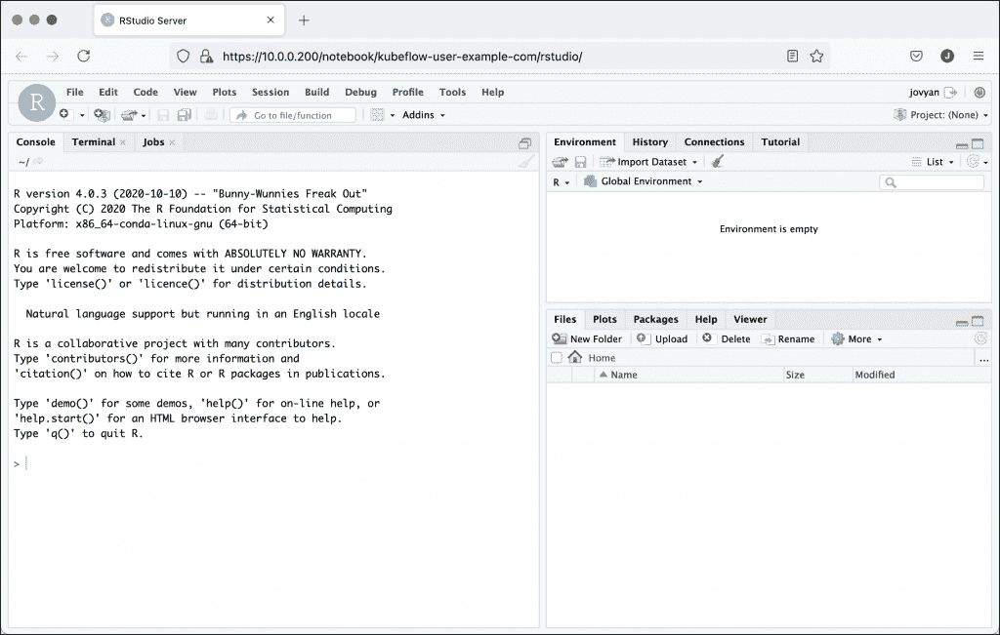
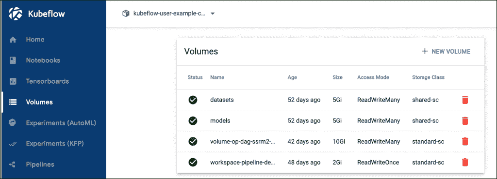
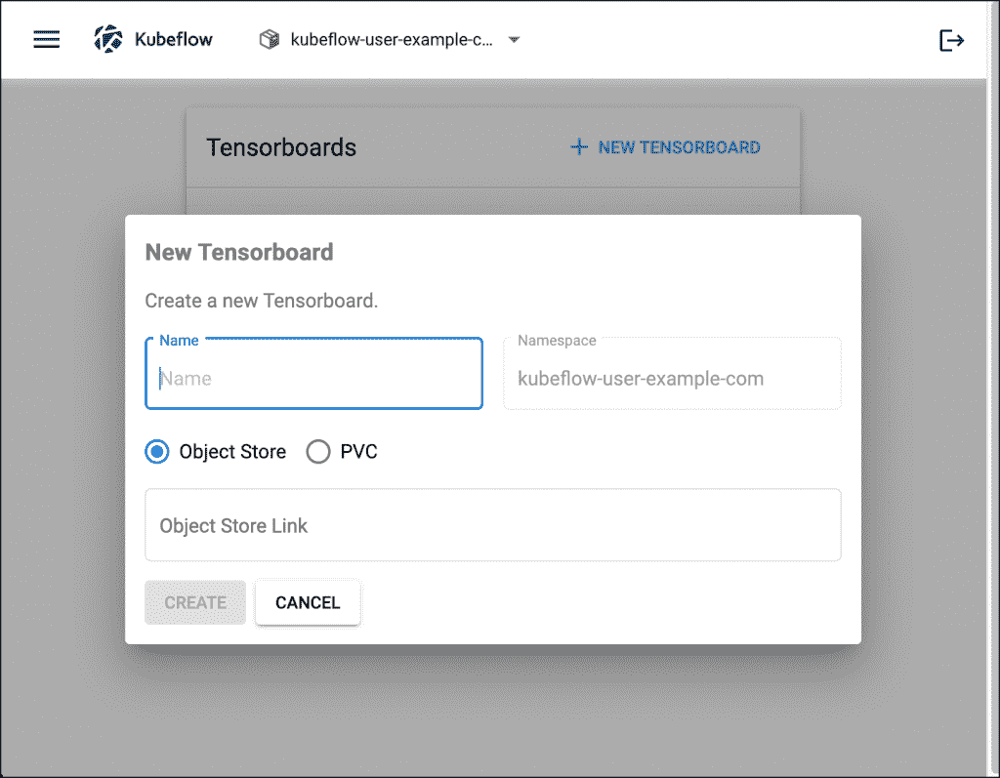

# 机器学习工程师会喜欢的 5 个新 Kubeflow 1.3 功能

> 原文：<https://thenewstack.io/5-new-kubeflow-1-3-features-that-machine-learning-engineers-will-love/>

谷歌的 [Kubeflow 1.3](https://www.kubeflow.org/) 是 Kubernetes 最受欢迎的开源机器学习平台的最新版本。它有许多新功能和增强功能，使机器学习操作( [MLOps](https://thenewstack.io/category/machine-learning/) )变得容易和容易。

以下是 Kubeflow 1.3 的五个特性，它们使该平台变得更好:

## 1.简化安装

与以前的版本相比，Kubeflow 的最新版本使安装变得极其简单和直接。当你可以用`kubectl`而不是像`kfctl`这样的专用工具来部署整个平台时，从 [Ksonnet](https://github.com/ksonnet/ksonnet) 到 [Kustomize](https://kustomize.io/) 的转变就变得很明显了。

如果您有一个 Kubernetes 集群，它有一个默认的支持动态配置的存储类，以及 Kustomize 工具，那么安装 Kubeflow 就像运行一个命令一样简单。

```
git clone https://github.com/kubeflow/manifests.git

```

```
while  !  kustomize build example  |  kubectl apply  -f  -;  do echo  "Retrying to apply resources";  sleep  10;  done

```

几分钟后，您应该能够访问仪表盘。但是，首先，运行以下命令将 Istio 的入口网关端口转发到本地端口。

```
kubectl port-forward svc/istio-ingressgateway  -n  istio-system  8080:80

```


参考我之前的教程，在[单 GPU 主机](https://thenewstack.io/tutorial-install-kubernetes-and-kubeflow-on-a-gpu-host-with-nvidia-deepops/)或[带 CPU 和 GPU 主机的混合集群](https://thenewstack.io/how-i-built-an-on-premises-ai-training-testbed-with-kubernetes-and-kubeflow/)上安装 Kubeflow 1.2。您可以遵循相同的工作流程来部署最新版本的 Kubeflow。

## 2.支持多种开发环境

使用 Kubeflow 1.3，您可以启动运行 [Jupyter](https://jupyter.org/) 、 [Visual Studio Code](https://code.visualstudio.com/) 或 [RStudio](https://www.rstudio.com/) 的笔记本服务器。这就给了数据科学家和 ML 开发者 ide 的选择。

Kubeflow 笔记本服务器实例转化为在 Kubernetes 中运行的 StatefulSet。您可以自定义用于部署笔记本电脑服务器的映像。使用特定于 IDE 环境的基本映像，您可以创建一个 docker 文件，其中包含开发所需的库和模块。然后，根据自定义映像，您可以启动一台笔记本电脑服务器，其中包含数据科学实验所需的完整环境和工具。



上面的截图显示了运行在 Kubeflow 中的由 VS 代码支持的代码服务器。虽然 Jupyter 笔记本是最受欢迎的，但是拥有熟悉的 IDE 来开发 Python 模块是很有帮助的。

下面是 RStudio 在 Kubeflow 中运行的截图:



## 3.Kubernetes 从 Web 用户界面进行卷管理

存储和卷管理是 MLOps 的重要组成部分。共享持久卷(RWX)和专用卷(RWO)使数据科学家能够在 MLOps 管道的多个阶段轻松共享数据集和模型。

关于为 Kubeflow 选择合适的存储引擎的详细讨论，请参考我以前的[文章](https://thenewstack.io/choose-the-right-storage-engine-for-kubeflow-and-ml-workloads/)。

Kubeflow 的早期版本将卷管理留给了 Kubernetes 管理员。Kubeflow 1.3 将这一功能引入了 web 用户界面，使数据科学家和开发人员能够自己创建卷。这使得卷管理成为平台不可或缺的一部分，而无需学习 Kubernetes 的概念。

下面是 Kubeflow 仪表板的卷管理用户界面的屏幕截图:



## 4.TensorBoard 与 Kubeflow 的集成

Kubeflow 1.3 内置了对 TensorFlow 的度量可视化工具 [TensorBoard](https://www.tensorflow.org/tensorboard) 的支持。例如，在训练一个模型时，简单地将`%tensorboard --logdir logs/fit`添加到笔记本中，将度量持久化到 PVC 中的一个目录中。

要可视化指标，请创建一个新的 TensorBoard，并将其指向笔记本中培训代码使用的同一目录。也可以将度量存储在对象存储桶中。在 [MinIO](https://min.io/) 中创建的存储桶可以用于此目的，MinIO 是开源的、符合 S3 API 的对象存储软件。

下面是 TensorBoard 与 Kubeflow 整合的截图:



## 5.使用 KFServing 的多模型服务

Kubeflow 的模型服务组件 KFServing 针对同时服务多个模型进行了优化。在以前的版本中， [KFServing](https://www.kubeflow.org/docs/components/kfserving/kfserving/) 为每个模型创建一个微服务，每个副本至少消耗 0.5 个 CPU 和 0.5G 内存资源。随着请求数量的增加，这种方法会快速消耗可用的集群资源。

对于多模型服务，可以在一个推理服务中加载多个模型，那么每个模型的平均开销是 0.1 CPU 和 0.1GB 内存。然而，随着模型数量的增加，基于 GPU 的模型所需的 GPU 数量呈线性增长，这不是最佳的。

KFServing 现在支持 [Nvidia Triton 推理服务器](https://developer.nvidia.com/nvidia-triton-inference-server)，可以与多个型号共享同一个 GPU。

多模型服务功能有助于克服 Kubernetes 的限制，例如每个节点的最大 pod 数和每个集群的最大 IP 地址数。此外，它通过新型调度器和控制器最大限度地利用集群资源。

我们将通过几个教程和指南继续探索 Kubeflow 的特性和功能。敬请关注。

<svg xmlns:xlink="http://www.w3.org/1999/xlink" viewBox="0 0 68 31" version="1.1"><title>Group</title> <desc>Created with Sketch.</desc></svg>