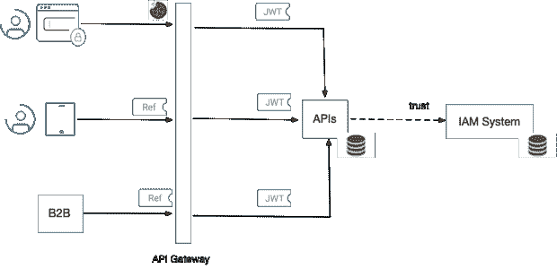
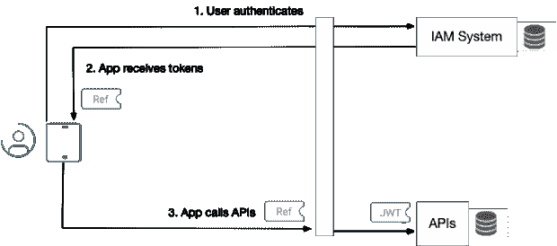
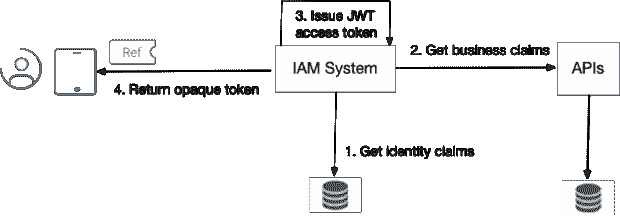
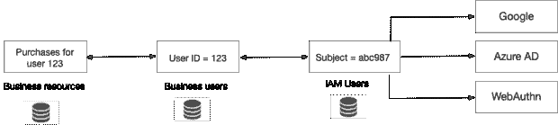

# 所有首席技术官都应该优先考虑的 5 个软件安全目标

> 原文：<https://thenewstack.io/5-software-security-goals-all-ctos-should-prioritize/>

提供数字服务的公司需要保护对信息的访问，以保护属于组织、客户和业务合作伙伴的数据。当开发的软件存在安全漏洞时，就存在被网络攻击利用的风险，近年来网络攻击变得越来越复杂。

请第三方公司进行渗透测试等缓解措施会有所帮助。这将从 [OWASP 十大](https://owasp.org/www-project-top-ten/)中识别漏洞，例如暴露于互联网的脆弱后端端点。不过，一般来说，渗透测试只会发现问题的一个子集。相反，建议[进行深度防御](https://thenewstack.io/container-defense-depth/)，在那里软件团队遵循最佳实践来抵御威胁。

正确实施安全性还可以带来显著的商业利益。具有良好的关注点分离的设计将表现良好，保持应用程序安全代码简单，并确保安全行为易于扩展。它还将在用户[认证](https://thenewstack.io/what-do-authentication-and-authorization-mean-in-zero-trust/)和连接业务伙伴等领域提供最佳功能。

## **1。应用程序使用现代安全标准**

如今，现代应用程序最强大的安全选项是使用 [OAuth 系列规范](https://www.rfc-editor.org/rfc/rfc6749)。这些安全标准对应于公司用例。对于每个标准，威胁和缓解措施也经过了许多专家的仔细审查。

OAuth 用于保护移动、web 和 API 组件。它是轻量级的，可以很好地扩展到大型软件平台。它还被广泛用于通过使用更强的安全配置文件来保护高价值的数据，例如那些由[金融级 API (FAPI)](https://openid.net/wg/fapi/) 工作组定义的安全配置文件。

然后，您的应用程序应该将复杂的安全性外包给身份和访问管理(IAM)系统。这为您提供了强大的选项，用于[认证](https://thenewstack.io/how-do-authentication-and-authorization-differ/)用户、使用令牌保护数据以及与业务合作伙伴进行互操作。

这些标准还为您的工程师提供了蓝图，让他们可以在早期发现更多的弱点。这包括使用“作用域”和“声明”在早期验证没有[破坏对象级授权](https://owasp.org/www-project-api-security/)，这是 OWASP 的顶级 API 漏洞。

然后，公司需要选择 IAM 解决方案。这是一个重要的决定，因为您需要确保正确的业务成果。一家公司可能会从一些技术调查开始。不过，最终选择产品的决策者通常是首席技术官(CTO)或架构负责人。

然而，理解重要的需求并做出最明智的选择是有微妙之处的。因此，我将强调首席技术官在规划公司的下一代安全架构时应该注意的其他关键行为。

## **2。保护 API 的安全令牌设计**

归根结底，OAuth 是为了保护数据。开发人员知道，当用户需要进行身份验证时，应用程序会重定向到 IAM 系统。之后，应用程序用令牌调用 API。然而，并不是所有人都意识到令牌中使用的数据需要仔细的设计。

IAM 系统将存储自己的用户帐户数据，这些数据成为[个人身份信息(PII)](https://curity.io/resources/learn/privacy-and-gdpr/) 的真实来源。IAM 系统可以帮助您管理其他监管方面，例如接受条款或用户隐私提示。应使用零信任架构(ZTA)来抵御外部和内部威胁。这仅需要 API 中的简单代码来验证每个请求上的 JWT 访问令牌并应用业务规则。有关该行为的概述，请参见“[实现零信任 API](https://curity.io/resources/learn/implementing-zero-trust-apis/)”一文。

IAM 系统必须将安全值作为“声明”写入令牌，您的 API 以后会信任这些值并将其用于授权。例如，用户 ID、电子邮件、租户 ID、角色或订阅级别。如果一些值存储在业务数据中，IAM 系统必须能够检索它们。同时，互联网客户端应该只接收机密参考令牌。

## **3。用户通过多种方式进行身份验证，只有一个身份**

IAM 系统将使您的应用程序能够运行简单的[代码流](https://curity.io/resources/learn/oauth-code-flow/)，之后您可以配置多种方式来验证用户。一个可能的解决方案是使用 Azure Active Directory 作为多因素身份验证(MFA)流程的第一个因素。支持通过 WebAuthn、密码和钱包的无密码登录对企业来说也越来越重要。

可靠的身份验证还需要数据完整性设计。您的业务数据通常有自己的用户概念，业务用户 id 根据业务资源存储。但是，当用户使用不同的身份验证方法时，系统应该避免重复用户的身份或业务数据。这是通过以下数据图片类型实现的，称为[账户链接](https://curity.io/resources/learn/account-linking-recipes/)。它要求 IAM 系统具有高度的可扩展性，以处理您当前和未来的所有身份验证用例。

## **4。工程团队遵循安全最佳实践**

OAuth 是一个复杂的框架，应用它是高度架构化的。与旧架构相比，关注点的分离程度更高，组件和端点更多。一些用例，比如 [web security](https://curity.io/product/token-service/oauth-for-web) ，很难正确处理。不幸的是，犯代价高昂的错误是很常见的，这可能会延迟上市时间或影响未来的生产率。由于大多数架构师和开发人员不是安全专家，他们需要访问详细的 IAM 在线资源。

如果做得好，OAuth 只需要简单的应用程序代码。然而，如果架构师遵循次优的设计，或者如果 IAM 系统没有所需的可扩展性特性，则通常需要在应用层编写复杂的解决方案。随着时间的推移，这些代码变得难以管理和扩展。

## **5。开发运维团队安全可靠地运营生产系统**

使用 SaaS 提供商的 IAM 系统有时被视为安全的选择，因为外部方保证了 IAM 系统的高可用性。然而，来自 DevOps 和 InfoSec 团队的需求通常不止于此。DevOps 团队将需要现代的[日志和监控](https://curity.io/resources/logging-monitoring/)功能，InfoSec 将需要 IAM 事件的[审计](https://curity.io/docs/idsvr/latest/system-admin-guide/audit-logging/index.html)。您的 IAM 提供商还应该提供一个支持包，及时联系真正的产品专家。

在生产中，DevOps 团队将操作 API、API 网关和 IAM 系统，这些在 [IAM 初级读本](https://curity.io/resources/learn/iam-primer/)中进行了总结。这些组件经常交互，因此如果它们在后端集群中相邻托管，效率最高。云原生方法效果最佳，也使团队能够限制暴露于互联网的端点。

## **结论**

通过 OAuth 框架保护现代应用程序是可能的，OAuth 框架为验证用户和保护数据提供了最先进的功能。在使用 IAM 产品之前，请让您的技术人员参与评估，并确保您可以实现以下成果:

1.  使用现代安全标准的应用程序。
2.  保护 API 的安全令牌设计。
3.  用户可以使用单一身份以多种方式进行身份验证。
4.  工程团队遵循安全最佳实践。
5.  DevOps 安全可靠地运行生产系统。

在 Curity，我们提供了一个 [IAM 产品](https://curity.io/product/)，并热衷于与不断增长的 [OAuth 安全标准](https://curity.io/product/conformance/)保持同步。我们还确保我们的产品可以轻松扩展，以满足任何使用情况。

我们认识到 OAuth 的实现对组织来说是具有挑战性的，并且会占用您关注自己复杂的业务目标的时间。因此，除了 IAM 产品之外，我们还提供具体的设计来减少不确定性并加快端到端解决方案的速度。

安全性方法包括将应用程序的安全性管道外部化的关注点分离。我们还投入大量精力开发以人为本的资源，支持开发人员和开发者的旅程。

<svg xmlns:xlink="http://www.w3.org/1999/xlink" viewBox="0 0 68 31" version="1.1"><title>Group</title> <desc>Created with Sketch.</desc></svg>