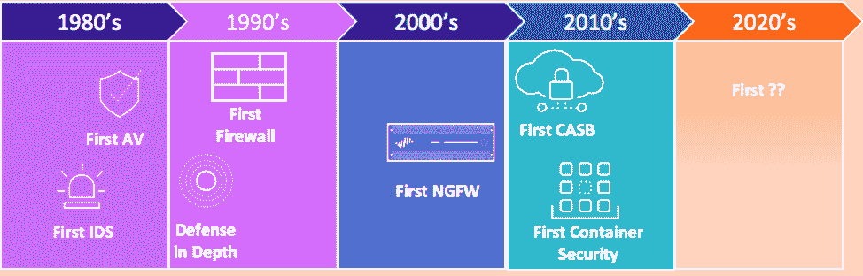

# 实施 DevSecOps 的 5 个步骤

> 原文：<https://thenewstack.io/5-steps-to-implement-devsecops/>

[帕洛阿尔托网络公司的 Prisma](https://www.paloaltonetworks.com/prisma/cloud) 在 Prisma 的[云本地安全直播，2020 年虚拟峰会](https://register.paloaltonetworks.com/prisma-cloud-native-security-virtual-summit)2020 年 2 月 11 日之前赞助了这篇文章。

80 年代给了我们很多好东西，比如 U2，Metallica，邦·乔维(有问题)。但是从安全的角度来看，这个发带时代是安全工具激增的开始。

快进到今天，it 行业急于投资安全工具似乎不是一个好主意。我们也没有从错误中吸取教训。尽管研究表明 [65%的云事件](https://unit42.paloaltonetworks.com/cloudy-with-a-chance-of-entropy/)是客户错误配置的结果，但对于每一次重大违规，仍然会有一种下意识的反应，即购买另一种工具来解决特定问题。这是有问题的，原因有二:

1.  安全团队的成长与他们购买的工具不成比例。还有…
2.  密码学家 Bruce Schneier 是对的:安全工具不会让我们更安全，过程会。

Figure 1: Evolution of Cybersecurity Tools.

鉴于每种云技术都有许多安全需求，安全团队必须专注于简化他们的安全组合。我们怎样才能避免过去的罪恶？答案并不在于另一个看似性感的点产品，而是作为一个定义良好的过程。

Figure 2: Five Steps to Implement DevSecOps.

### **第一步:定义你的未来**

在开始这个项目之前，绝对有必要确切地知道你想在哪里结束。如果您作为安全负责人不能清楚地定义最终结果应该是什么样子，您的团队将会陷入困境。这不是关于如何完成的技术细节或方法(这就是为什么你有一个团队)，而是你想要实现的结果。关键项目包括一些关于成功的陈述，如责任、义务、资源和里程碑。期待你的策略随着时间的推移而成熟，不要花太多时间试图让它“完美”随着时间的推移进行迭代是 DevSecOps 思维模式的关键组成部分。

### 步骤 2:发现代码移动

无论安全和 IT 团队是否知道，每个组织都有一个将代码和变更放入云(公共或私有)的过程。安全团队的诀窍是发现今天的流程是什么样的。这是关于描绘出你的组织如何将代码(应用和基础设施)推入云中的人、内容、时间和位置。如果这在您的组织中没有很好地定义，那么很有可能在这里集中精力可以产生最大的改进机会，即通过质量控制降低风险。

### 步骤 3:清点安全工具

 [马特·乔迪

Matt 拥有近二十年的安全领导经验，目前是 Palo Alto Networks 公共云的首席安全官。他经常在 RSA 等行业活动上发表博客和演讲。他目前领导着云威胁团队，这是一个专注于公共云问题的安全研究人员精英团队。他还是罗格斯大学网络安全证书项目的顾问委员会成员，也是 IANS Research 的成员。](https://www.linkedin.com/in/mattchiodi/) 

虽然很容易认为您的组织可以跳到 DevSecOps 模型，但如果不首先了解您的安全产品组合中已经有什么，这是不可能的。当我问安全团队他们是否有正在使用的所有安全工具的列表时，大多数情况下答案是否定的。这并不奇怪，因为组织的规模历来与安全工具的数量成正比。据我所见，小型企业可能只有 20 个工具，而最大的组织通常有 130 多个(想想金融服务)。在这一步中，您的团队将创建所有现有工具的清单，包括商业工具、自主开发的工具和开源工具。除了工具列表之外，至少跟踪以下关键项目也很重要:

1.  最初购买或创建该工具的原因。
2.  声称要降低或减轻的风险。
3.  这是消费和集成云提供商 API 的固有能力。
4.  其 API 的开放性(从工具中获取数据的难易程度)。
5.  其生成和共享环境威胁情报的能力(与第四点密切相关)。
6.  年度成本(确保包括支付给供应商的固定费用，以及人员支持工具的大概成本)。

### 步骤 4:评估差距

许多组织使用控制框架，如互联网安全中心的 [CIS-20](https://www.cisecurity.org/controls/cis-controls-list/) 、NIST [网络安全框架](https://www.nist.gov/cyberframework)或澳大利亚网络安全中心的 [Essential 8](https://www.cyber.gov.au/acsc/view-all-content/publications/essential-eight-maturity-model) 。如果您的组织使用其中的一种，或者可能依赖于基于风险的框架，那么下一步包括将这些信息与您的工具清单以及在第二步中发现的代码移动模式叠加起来。

然而，无论您的组织使用哪种框架，将差距分析建立在行业标准的基础上是非常重要的。这种分析应该产生多种结果。首先，它将帮助您了解今天您拥有、管理和支付哪些工具。第二，也是最重要的一点，它会让你直接看到控制间隙和重叠部分。最后，它将帮助您确定您在整个安全供应商领域的投资情况。

随着该领域的领导者将单点产品整合到全面的云安全平台中，组织可以节省真正的资金。他们还可以使用这些平台来降低复杂性，从而提高运营效率。实现 DevSecOps 的关键是从一个杂乱无章的解决方案网络转移到支持所选框架执行的综合平台。

### **第五步:快速迭代**

流程的“最终”步骤(好吧，它实际上不是最终的，因为 DevSecOps 需要不断的迭代)有两个不同的部分。第一步是利用您在差距分析中学到的知识，并将其应用到您的代码管道中，而第二步是调查和获取支持您的 DevSecOps 策略执行的基于平台的云安全控制。这种分析很可能意味着告别多年来让您的团队不堪重负的许多单点产品。这一步的主要成果包括与开发和 IT 部门紧密合作，将安全流程和平台插入到代码管道中破坏性最小的区域。这是通过沿途快速增加[安全护栏](https://blog.paloaltonetworks.com/2019/08/devops-vs-secops-devsecops/)(非大门)有效完成的。

采用持续改进驱动的方法，由行业标准驱动的差距分析推动，将产生大量的改进机会。所有这些都不需要 99 个以上的安全工具。遵循这个过程的团队将会顺利地实现 DevSecOps。从小处着手。快速倾斜。不断迭代。

为了与安全思想领袖直接交流， [Cloud Native Security Live，2020 Virtual Summit](https://register.paloaltonetworks.com/prisma-cloud-native-security-virtual-summit) 为您提供了与其他开发人员、DevOps 专业人员和 it 领袖进行交流和互动的机会，他们在容器技术和 DevSecOps 方面都有很大的利益。由 Palo Alto Networks 与 New Stack 合作主办，请于 2020 年 2 月 11 日加入我们，参加关于云原生安全性的全天讨论，无论您身在何处，我们都将为您提供在线直播。

通过 Pixabay 的特征图像。

<svg xmlns:xlink="http://www.w3.org/1999/xlink" viewBox="0 0 68 31" version="1.1"><title>Group</title> <desc>Created with Sketch.</desc></svg>