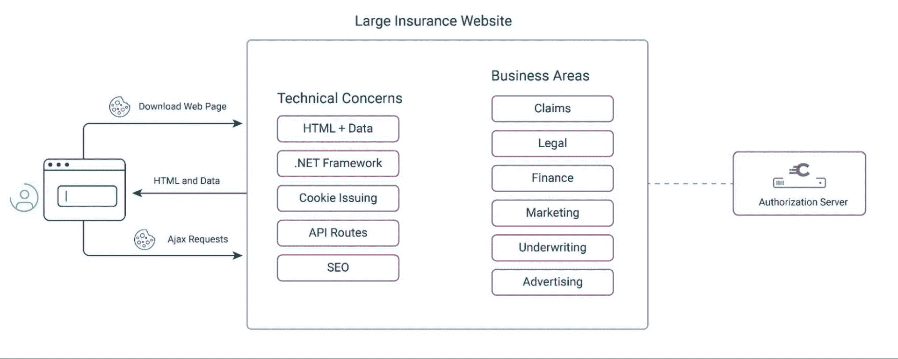
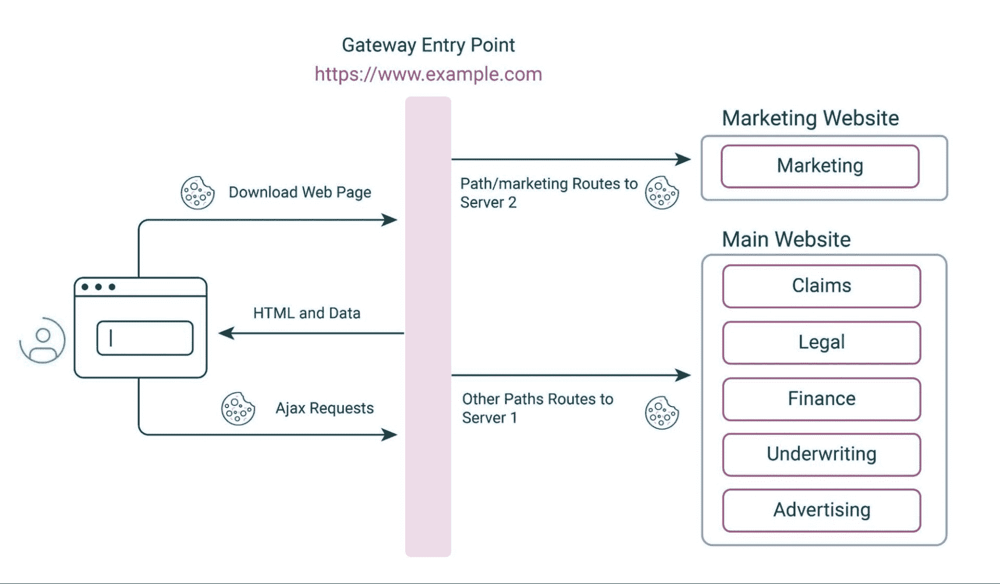
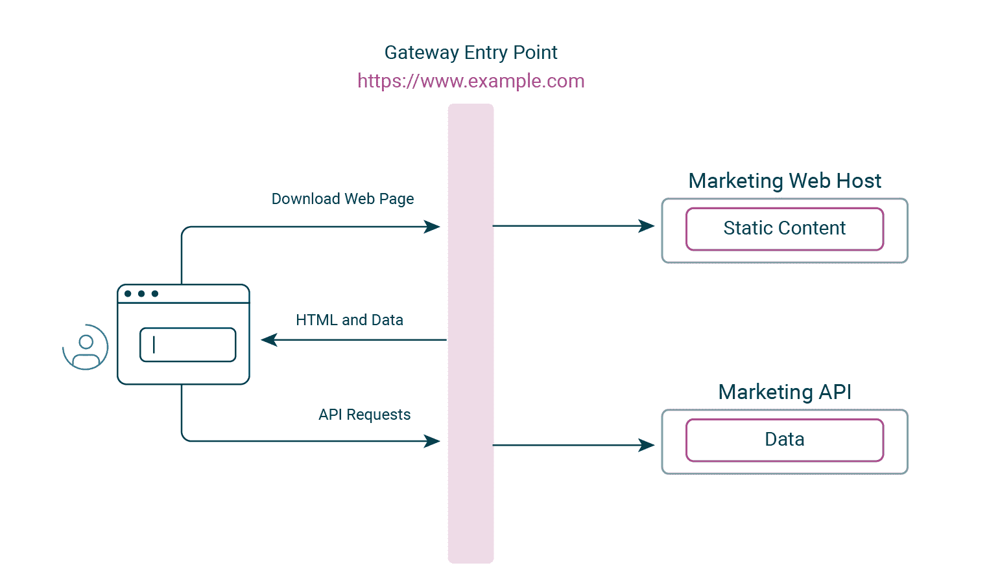
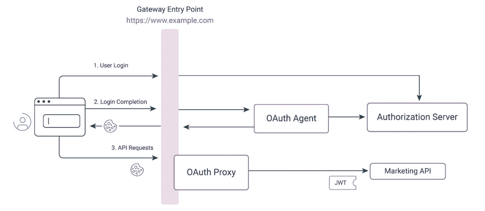
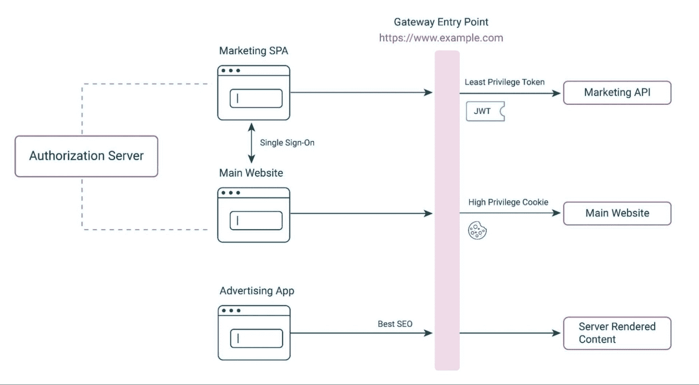
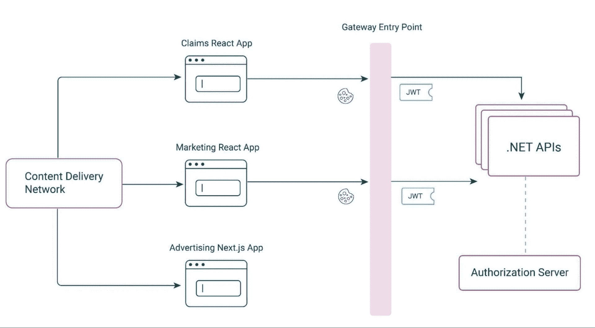

# 使用 OAuth 实现大型网站现代化的 5 个步骤

> 原文：<https://thenewstack.io/5-steps-to-modernize-large-websites-using-oauth/>

软件系统中的一个主要问题是，随着逻辑数量的增长，保持代码库的可维护性。

近年来，将代码分解成模块化组件是一种最佳实践:微服务和微 ui。每个组件可以由不同的开发团队并行管理，而不会相互影响。每个团队都可以按照自己的节奏运作，并且更容易地保持他们的工具、技术和能力是最新的。所有这些导致了更快和更可扩展的业务交付。

然而，许多现有的真实世界的业务平台并不是这样构建的。相反，他们是在一个旧的网站建筑风格。大约十年前，这些代码库变得非常大并且难以管理是很常见的，这减缓了业务交付。

对于仍在运营大型网站的公司，通常迫切需要对系统进行现代化改造，以实现微服务的上述优势。然而，人们并不总是清楚应该做出哪些部署和安全选择，或者如何迁移现有的基于 cookie 的安全性。

在这里，我将提供一些我们在 Curity 为 web 和 API 组件实现安全解决方案时推荐的部署和分离模式的概述。这些技术也非常适合现代化大型网站的架构。

## **基础:OAuth 和 OpenID 连接**

现代应用级组件使用 [OAuth 系列规范](https://datatracker.ietf.org/doc/html/rfc6749)实现安全性，为 web 应用、移动应用和 API 提供安全功能。这让公司拥有了最先进的选择，让[用一个或多个身份证明来认证用户](https://thenewstack.io/what-do-authentication-and-authorization-mean-in-zero-trust/)。它还有助于根据业务规则保护 API 中的数据。

在这篇文章中，我不会详细讨论安全标准。相反，我将重点关注高层次的技术和文化步骤，以帮助将一个大型网站分解成更小的部分。这一可管理的流程将避免大爆炸式的方法，以确保业务连续性。

我还假设组织从一个大型网站开始，该网站以基本的方式使用基于 OAuth 的登录和安全 cookies，但是没有充分利用该架构。

## **初始网站架构**

考虑下面这个处理保险业务逻辑的大型网站的例子。这个网站使用旧的。NET framework 并部署到 Windows 服务器上。很多网页都是结合 HTML 和数据下载到浏览器的。更新的代码越来越多地使用 Ajax 请求来更新页面，让页面看起来更快、更具交互性。web 后端还必须[管理许多 API 路径](https://thenewstack.io/creating-an-api-first-culture-and-company-part-1/)。

开发人员可能知道如何将大型代码库重构为多个应用程序。然而，这样做还需要改变 web 后端的部署和 cookie 安全性。这可能令人望而生畏，因为它可能需要运营团队的支持，并导致用户体验问题，如要求每个应用程序单独登录。企业还可能关注持续的、通常是高优先级的业务目标的影响。

因此，在接下来的部分中，我提出了一种管理逐步现代化的安全方法，包括五个主要步骤。

## **步骤 1:使用 API 网关入口点**

现代化过程的第一步应该是引入反向代理或 API 网关。这可以用在很多安全设计模式中，对于拆分网站也是有效的。

在下图中，从示例保险业务领域中选择了一个不太复杂的业务领域(营销)。营销应用已经被拆分成自己的网站。然后，NGINX 等高性能网关成为 web 入口点，形成以下端到端流:

这种重构将涉及一些适度的代码更改，并且应该只使用“提升和转移”迁移，因为它主要是一项部署工作。在这个阶段，新的营销网站应该继续使用相同的。NET 框架技术为主的网站。

请务必记住，每个网站都必须配置为使用相同的 cookie 属性，包括 cookie 名称和加密密钥。这将使用户能够登录其中一个应用程序，然后无缝导航到另一个应用程序。如果使用 OAuth，那么两个网站将使用相同的 OAuth 客户端，包含不同的重定向 URI(回复 URL)。一些例子:

*   https://www.example.com/callback
*   https://www.example.com/marketing/callback

这将需要一些部署和 cookie 调查，并且您需要确保网站继续向浏览器返回外部 URL。

完成后，营销网站被分配给一个特定的团队，该团队成为其组件所有者。然后，他们在一个更小、更容易管理的代码库上工作。将来，该公司可以在其他业务领域采用相同的方法，因此整个网站的模块化过程已经就绪。

## **第二步:分离 Web 和 API 关注点**

自从将应用程序构建为网站以来，技术已经发展了。公司通常希望使用 React 这样的[框架，在这种框架中，开发人员编写代码时只关注前端，并专注于提供尽可能好的客户体验。这对商业领袖来说很有用，因为他们通常不希望 web 开发人员从事 web 后端管道工作。](https://reactjs.org/)

因此，团队和企业所有者可能同意将营销网站更新为单页应用程序(SPA)架构，该网站在上一步中已模块化。一个主要的工作领域是将数据逻辑从 web 后端的 Ajax 端点迁移到 API。另一个是改变用户界面，使用客户端渲染，而不是将 HTML 与 web 后端的数据结合起来:

迁移可以安全地逐步完成，一次迁移几个页面，而整个应用程序仍然是一个网站。这将允许您避免“大爆炸”升级。这些 API 迁移还将提供短期的代码共享优势，例如支持移动应用程序重用网站功能。

尽管如此，还是要积极地以完整的迁移为目标，因为这是实现您的首选架构的先决条件。选择一个对业务也有利的时间，比如当营销应用程序没有其他重要的前端优先事项时。尽早迁移一些困难的页面，并记录一步一步的过程。

从技术角度来说，目标是使这成为一个“提升和转移”的操作，尽可能地移动现有的代码。因为重点是分离，所以避免将更新到诸如 React 这样的 web 框架作为这项工作的一部分，以防止技术风险。考虑将前端保持在普通的 JavaScript 中，使用简单的库如 [mustache.js](https://github.com/janl/mustache.js/) 进行客户端渲染。

## **第三步:集成单页面应用安全性**

将网站迁移到 spa 的棘手问题之一是安全性。在浏览器中使用令牌打开了更多的攻击媒介，你必须防范[跨站点脚本](https://owasp.org/www-community/attacks/xss/) (XSS)威胁。[当前的 SPA 安全最佳实践](https://curity.io/resources/learn/spa-best-practices/)是继续以与网站相同的方式使用仅 HTTP cookie。因此，spa 需要一个应用层 cookie 层。

对于 OAuth 安全的 spa，集成 cookies 的最主流方式是通过前端的后端(BFF) 。网关还用于将静态内容请求与 OAuth 和 API 请求分开。这样做可以实现最佳的用户和开发人员体验，同时还确保您可以将 SPA 作为静态内容部署到您选择的任何主机。

在 Curity，我们推荐一个 API 驱动的 BFF 变体，叫做[令牌处理模式](https://curity.io/resources/learn/token-handler-overview/)。这包括插入经过测试的组件来处理 OAuth 和 cookies，避免在应用程序代码中添加安全管道。在下面的流程中， [OAuth 代理](https://curity.io/resources/learn/dotnet-oauth-agent/)调用授权服务器并代表 SPA 发布 cookies。OAuth 代理是一个网关插件，它在 API 请求期间进行特定于 web 的安全检查，然后将 JWT 访问令牌转发给目标 API:

对于较新的 spa，应使用最低特权原则设计颁发的访问令牌。保持访问令牌的短暂性，并且[使用作用域和声明](https://curity.io/resources/learn/scopes-vs-claims/)锁定它们。这确保了颁发给营销应用程序的访问令牌只能发送给营销 API，然后营销 API 可以使用令牌的范围和声明进行授权。这是一个比大型网站更安全的设计，大型网站的 cookies 允许访问许多业务领域。

在这个阶段，可能会有一个学习曲线，所以计划一些峰值来降低风险。首先，使用一个小型的概念验证(POC)应用程序部署新的工作组件[。此外，确保 API 进行与之前的网站相同的授权检查。查看这些](https://curity.io/resources/learn/token-handler-deployment-example/) [API 指南](https://curity.io/resources/guides/api/)，了解使用 JWT 访问令牌进行基于声明的授权的更多细节。

## **第四步:混合搭配网页风格**

大型网站的现代化需要时间，但是这里提出的方法可以让你在其他业务目标之间逐步实现。在此期间，网关允许您混合和匹配 web 架构风格，并在需要时在同一个基本 URL 上公开它们。

当将新的 SPA 与现有的大型网站集成时，使用单点登录(SSO ),以便 SPA cookies 不会与网站共享。然后，每个新应用程序都被授予自己的最低特权令牌，以实现最佳安全性。它还使您能够针对不同的用户群进行不同的身份验证，例如使用较新的[无密码设备登录某些应用程序](https://curity.io/resources/learn/migrating-to-passwordless/)。

在这个例子中，我们可以看到熟悉的营销 app 和主网站。他们加入了一个新添加的广告应用程序，该应用程序具有不同的风格，因为它返回不安全的数据，并需要实现良好的搜索引擎优化(SEO)。因此，这个应用程序继续使用服务器端呈现(SSR)来一起返回 HTML 和公共数据。它可以在不需要 cookies 的网关路径上公开。

## **第五步:技术现代化**

一旦部署、分离和安全工作完成，分配给组件的专门团队就可以在适当的时间执行技术现代化。例如，这可能涉及到将 API 更新到最新版本。NET 堆栈，支持基于 Linux 容器的部署或更新 spa 以使用现代框架。

一旦 web 和 API 问题被分离，您可能不再需要网关或 cookies 来处理 web 组件。相反，可以使用内容传递网络(CDN)。这提供了静态的(不安全的)web 内容，有助于确保全球用户的同等 web 性能。同时，只有架构的 API 端使用网关，令牌转换是其[零信任实现](https://curity.io/resources/learn/implementing-zero-trust-apis/)的一部分。

最后，重要的是要记住，大规模使用 cookie需要仔细考虑决定网络域名和 cookie 路径。您必须确保每个应用程序只在 API 请求中发送自己的 cookie，而决不能发送属于其他应用程序的 cookie。

当您仅仅因为代码大小和生产率的原因将一个应用程序拆分成多个 spa 时，在这些应用程序之间共享相同的 cookie 是没问题的。这是通过在同一个域中使用不同的路径托管 spa 来实现的。当跨越业务区域时，单点登录导航是首选，以保持较小的令牌特权。这可能会导致每个业务领域的独立的 web 域。

## **结论**

在本文中，我提出了一种将大型网站逐步迁移到现代组件化架构的方法。这导致了一个随着代码和从事代码工作的人的增长而更有效地扩展的架构，导致了更可预测的业务交付。

这一进程始于对分离和部署的关注。这首先使大型网站能够拆分为多个应用程序，之后 web 和 API 问题被分离。这样做也为充分利用 OAuth 安全设计模式提供了最好的未来设置，当 web(客户端)和 API(资源服务器)的关注点分离时，OAuth 安全设计模式工作得最好。

在 Curity，我们知道技术迁移非常困难。如果您是 OAuth 的新手，[身份和访问管理(IAM)初级读本](https://curity.io/resources/learn/iam-primer/)介绍了本文中提到的安全组件。对于开发者，我们提供了许多关于 web、API 和网关解决方案的[教程](https://curity.io/resources/guides/)。您可以在开发计算机上端到端地运行这些程序，以便在现代化进程的早期评估设计。

<svg xmlns:xlink="http://www.w3.org/1999/xlink" viewBox="0 0 68 31" version="1.1"><title>Group</title> <desc>Created with Sketch.</desc></svg>