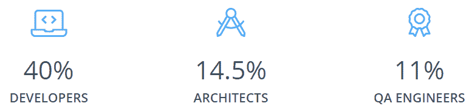
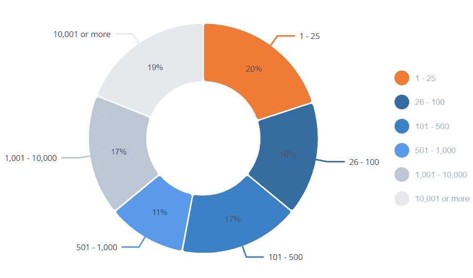

# SmartBear 软件质量报告的 5 个要点

> 原文：<https://thenewstack.io/5-takeaways-from-smartbears-state-of-software-quality-report/>

[Frank Kilcommins](https://www.linkedin.com/in/frank-kilcommins/?originalSubdomain=ie)

[Frank Kilcommins 是 SmartBear 的 API 技术宣传员。他在技术行业拥有超过 15 年的经验，从软件工程到企业架构都有他的身影。他的使命是在端到端 API 开发生命周期和管理领域激励、参与和支持 API 社区以及 SmartBear 客户。在加入 SmartBear 之前，Frank 最近的工作重点是在跨国企业中以 API 为主导的数字化转型和架构现代化。](https://www.linkedin.com/in/frank-kilcommins/?originalSubdomain=ie)

每年，SmartBear 都会发布大量行业洞察报告，由于我们关注整个软件领域的软件质量，我们将所有行业分析整合到主题为[软件质量状态](https://smartbear.com/state-of-software-quality/)的报告中，并发布了与测试、代码审查和 API 相关的版本。即使有了新的名字，软件质量|API 报告的[状态](https://smartbear.com/state-of-software-quality/api/)继续帮助我们掌握 API 社区的脉搏。

目标每年都是一样的:测量团队在整个生命周期中交付和管理 API 所使用的趋势、实践、方法和工具的温度。

我们认为这些数据是非常宝贵的，因为它有助于我们评估整个环境中哪些是有效的，哪些是无效的。我们利用分析为我们的决策提供信息，改善我们的 API 旅程，并构建工具来支持更广泛的行业。

我们免费提供该报告，因此它可以支持整个 API 社区。

## 方法学

近 1，700 名 API 从业者和利益相关者参与了我们的调查，代表了 17 个垂直行业。

图 1 —调查中的主要角色

主要的焦点群体是 Swagger、Collaborator、SoapUI 和 ReadyAPI 工具的用户。令人鼓舞的是，我们看到了不同角色的回应，以及跨组织规模的健康分布。

图 2 —对一系列组织规模的洞察

今年的报告中有许多要点，但如果要我提炼出前五个要点，如下所示。

## 1.API 的采用和开发变得越来越成熟

API 现在在大多数组织中都有一席之地，我们看到所有行业的成熟度都在提高。22%的受访者表示他们已经参与开发或提供 API 超过 10 年。

我们也看到 2021 年是具有里程碑意义的一年。企业和客户采用数字化转型计划的速度比以往任何时候都快，这通常是由于新冠肺炎环境的快速变化。因此，在几个垂直行业中，API 的采用增加了。此外，趋势表明，在 Gartner 的支持下，原料药行业正在加速发展，Gartner 预测，2022 年原料药投资将增长 37%。

从我们的调查中得出的主要驱动因素显示，大多数组织利用 API 来减少开发时间或成本(63%)，提供内部互操作性(61%)并促进转型(47%)。这种网络效应使满足消费者需求的质量、弹性和适应性成为焦点。

## 2.大多数组织在多协议环境中运营

随着各种各样的 API 风格和技术可供团队使用，我们自然会看到多协议使用的出现。集成模式和 API 风格的混合正变得越来越常见，并且在许多情况下，它们是相辅相成的。这在我们今年的调查结果中得到了强烈的反映，81%的受访者表示他们的组织使用一种以上的协议，57%的组织使用三种或三种以上的协议。

REST 仍然占主导地位，91%的人说他们使用这种风格交付 API。或许令人惊讶的是，SOAP 仍然保持在第二位(57%)，比 2019 年的 54%有所增加。GraphQL 和 gRPC 的使用量都比 2019 年翻了一番，分别从 12%到 24%和 4%到 8%。

公司现在意识到，为了给客户最佳的体验，多种风格的组合是有益的。所以，没有一个放之四海而皆准的方法。企业需要接受多种风格作为新的规范，新的协议和风格上市的速度要比现有协议和风格消失的速度快，这给 API 环境增加了更多的复杂性。

因此，我们在 SmartBear 挑战自我，提供工具，使其在具有多种协议和风格的多语言 API 环境中更有效地运行。

## 3.API 标准化仍然是最大的挑战

随着 API 的采用和增长，标准化(52%)仍然是组织在寻求规模化时希望尽快解决的首要挑战。

没有标准化，API 就会变成定制的，开发人员的生产力就会下降。成本和上市时间增加以适应变化，消费者体验的总体质量下降，并导致较低的价值主张和范围缩小。

此外，API 环境中的消费者角色理所当然地得到了更多的关注。消费者的期望从未如此之高。API 消费者要求提供商提供标准化的产品，如果对开发者体验的期望得不到满足，他们就会去别处寻找，这在金融服务行业尤其如此。

令人欣慰的是，安全性(40%)今年已经攀升至第二位。API 越来越多地连接我们最敏感的数据，因此确保您的 API 在生产前、生产中和生产后都是安全的是必不可少的。团队需要应用深思熟虑的标准化和治理指南来一致地交付高质量和安全的 API。

## 4.API 质量和增加测试更加重要

我们研究了确保质量的常见障碍，包括质量差的相关风险，以及组织如何将 API 质量视为业务优先事项。质量是重中之重，75%的受访者表示 API 质量对他们的组织“非常”或“极其重要”。

随着 API 市场的升温，竞争越来越激烈，公司意识到质量差会导致错过最后期限和 SLA。我们还看到客户流失和公司品牌受损在结果中得分很高。

团队想要质量，但是在快速交付(利用可用的资源)和快速交付质量之间有明显的冲突。结果，开发人员花费越来越多的时间进行测试，57%的开发人员报告他们参与了测试。

为了达到更好的质量，团队需要更多的测试，但是他们没有时间。需要将重点放在自动化平凡且可重复的任务上，让 QA 专家专注于有机测试和验证易用性。

对我来说，这些挑战应该与对 API 消费者重要的东西结合起来。交付 API 的组织应该继续关注他们的文档的质量和准确性，这些文档由在生命周期早期提高质量的规范提供支持。在交付团队、产品经理和消费者的眼中，这应该达到决定 API 成功的最佳点。

## 5.易用性和与现有工具的互操作性

几乎四分之三的受访者既开发又消费 API，这导致团队通常花费更多的时间与 API 进行交互。易用性、与现有工具链的互操作性，以及无需重新发明轮子就能扩展功能，继续引起 API 实践者的共鸣。

生产力和士气受到认知负荷的阻碍，团队希望在他们所在的地方得到满足。在交付和使用 API 时，必须更加重视沉浸式体验。使开发人员能够使用多种 API 风格和协议的工具——而不是强制进行无人看管的上下文切换——可能会得到大量开发人员、测试人员等的认可。

## 这是光明的一年

所有指标表明，原料药市场将继续增长，特别是随着疫情对组织的需求加速增长。在速度、灵活性和安全性之间实现恰当的平衡可以说是提供商和消费者在前进过程中必须考虑的最重要的问题。

纵观今年受访者的情绪，所有组织和行业的整体前景都是积极的。有一种感觉是，随着对 API 优先、以产品和客户为中心等策略的更好理解，以及对文档和开放标准重要性的日益认识，公司正在朝着正确的方向前进。

要查看其他发现， [查看新的软件质量状态| API 微型网站](https://smartbear.com/state-of-software-quality/api/) 提供图表、见解和其他要点。

<svg xmlns:xlink="http://www.w3.org/1999/xlink" viewBox="0 0 68 31" version="1.1"><title>Group</title> <desc>Created with Sketch.</desc></svg>