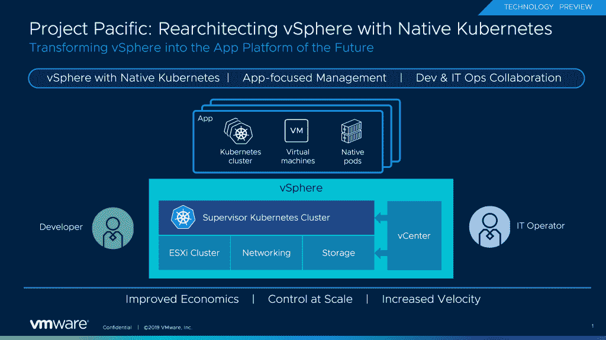

# 关于 VMware 的太平洋项目，您需要了解什么

> 原文：<https://thenewstack.io/5-things-to-know-about-vmwares-project-pacific/>

随着上个月在 VMworld 大会上推出 [Project Pacific](https://blogs.vmware.com/vsphere/2019/08/introducing-project-pacific.html) ，VMWare[迈出了大胆的一步](https://thenewstack.io/vmwares-project-pacific-integrates-vsphere-with-kubernetes/)，将流行的开源容器引擎 Kubernetes 与其旗舰虚拟机管理器 vSphere 集成在一起。尽管 VMware 尚未推出该产品并分享商业细节，但高管们在会议和其他论坛上详细讨论了技术架构。

太平洋项目的设计很复杂！经验丰富的 Kubernetes 用户可能会对特定于 vSphere 的术语感到困惑，而传统的 vSphere 管理员可能不理解融入 vSphere 的 Kubernetes 的核心概念。

这里试图根据公共领域的信息来揭开太平洋项目的神秘面纱。

## **vSphere 管理员和 Kubernetes 开发人员使用相同的控制平面**

借助 Project Pacific，vSphere 管理员和 Kubernetes 开发人员可以处理以不同形式呈现的相同控制平面。

vSphere APIs 得到了增强，以支持 Kubernetes 术语，如命名空间和 pod。Kubernetes 用户将会看到相当多的定制，以定制资源定义(CRD)、定制控制器和操作符支持的定制对象的形式出现。但是，最终，通过任一 API 部署的资源都将在 vCenter 中可见。

vSphere 管理员和 Kubernetes 开发人员使用相同的控制平面，但使用不同的工具集。Kubectl 作为一种强大的工具出现了。借助 Project Pacific，您可以使用 YAML 文件和 **Kubectl** 从技术上管理整个 vSphere 堆栈。

VMware 正尽力确保术语和工作流尽可能接近传统 vSphere 操作和现代 Kubernetes 操作。

### **太平洋项目可以从单个控制平面提供三种类型的部署单元**

你能从项目太平洋控制平面要求什么？开箱即用，有三个主要的部署单元可以启动:

1.  虚拟机和虚拟机集群
2.  库伯内特星团
3.  分离舱

Project Pacific 配备了适用于 vSphere 虚拟机的 Kubernetes 控制器。与定义 Pod 并提交给 Kubernetes master 的方式类似，带有虚拟机定义的 YAML 被提交给控制平面，控制平面可以将一个虚拟机或一组虚拟机作为一个集群运行。当 Kubernetes 收到调配虚拟机的请求时，它只需通过可以管理虚拟机整个生命周期的控制器将控制权传递给 vSphere。

太平洋项目实际上是一个元集群，因为它可以启动多个 Kubernetes 集群。VMware 将 Kubernetes 集群视为一个单独的部署单元。想象一下，创建一个很长的 YAML 文件，其中包含 Kubeadm 使用的所有参数，并将它提交给可以跨另一个集群的 Kubernetes。这正是控制平面通过开源 [Kubernetes 集群 API](https://github.com/kubernetes-sigs/cluster-api) 所做的事情。通过一点定制，您将能够基于 Pivotal Kubernetes 服务、Red Hat OpenShift 和基于上游代码库的普通集群推出不同风格的集群。这是太平洋计划最有趣的一面。

除了虚拟机和 Kubernetes 集群，您还可以启动独立的 Pods。我称它们为独立 Pods，因为您不需要在 Kubernetes 集群中安排它们。它们位于 vSphere 之上。这些本地 Pod 实际上是符合 Kubernetes Pod 规范的容器。

因此，无论是虚拟机、Kubernetes 集群还是 Pods，您都可以使用 YAML 文件来定义资源，并通过 Project Pacific 控制面板来调配资源。

### **可以通过太平洋项目部署无服务器 Pods】**

无服务器容器服务正得到越来越多的关注。AWS Fargate、Azure Container Instances 和 Google Cloud Run 都是无集群、无服务器容器平台的例子。您可以将现有的 Docker 容器打包成预期的格式，并在几秒钟内在云中启动它。 **Knative** 是在 Kubernetes 上实现无服务器容器的开源项目之一。

ESXi 原生 Pod 非常类似于 Azure Container 实例和 Fargate，但关键区别在于这些服务不遵循 Kubernetes Pod 规范。

ESXi Native Pods 为 Project Pacific 的无服务器实施奠定了坚实的基础。通过扩展类似 Knative 的语义，VMware 可以在 vSphere 上轻松启动零扩展平台。

### 本地 Pods 使用 Supervisor Cluster 和 Spherelet 相当于 Kubernetes 调度程序和 Kubelet

为了在 vSphere 上启用 ESXi Native Pods，VMware 创建了一个名为 Supervisor cluster 的默认集群，该集群嵌入到 vSphere 的核心中。为了让本地 Pods 与管理集群对话，他们还创建了**spheret**，这是一个专有版本的 **Kubelet** ，可以在 Kubernetes 集群中的每个工作节点上运行。

本机 Pods 直接在 ESXi 上运行，而不是使用 Linux 虚拟机。VMware 专门为这些资源创建了一个 Pod 优化的轻量级虚拟机。

Supervisor Cluster 和 **Spherelet** 的组合优雅地模仿了 Kubernetes 的主节点和工作节点。这是 VMware 的最佳设计决策之一。

### **VSP here Integrated Containers 和 Photon OS 的未来是 ESXi Native Pods**

当容器开始流行时，VMware 投资了两个项目:vSphere 集成容器和 Photon OS。

[VSP here Integrated Containers](https://www.vmware.com/products/vsphere/integrated-containers.html)迈出了弥合虚拟机和容器之间差距的第一步。与 Project Pacific 一样，VMware 也发布了 Docker API for vSphere 来管理运行容器的虚拟机的生命周期。该架构使用每个容器一个虚拟机来实现隔离和控制。

Photon OS 是一个轻量级操作系统，针对容器进行了高度优化。它是围绕 CoreOS、Intel Clear Linux、Red Hat Atomic Hosts 和 Ubuntu Core 建模的。Photon OS 为在 vSphere 集成容器平台中运行容器的虚拟机提供支持。

太平洋项目通过将 Docker API 扩展到 Kubernetes API，将 vSphere 集成容器扩展到 Kubernetes Pod，取代了这两种方法。

*有关太平洋项目的更多信息，* *[请查看云平台 CTO 办公室的 VMware 首席技术专家 Frank Denneman](https://frankdenneman.nl/2019/08/26/5-things-to-know-about-project-pacific/) 的帖子。*

*贾纳基拉姆·MSV 的网络研讨会系列“机器智能和现代基础设施(MI2)”提供了涵盖前沿技术的信息丰富、见解深刻的会议。在 [http://mi2.live](http://mi2.live/) 注册参加即将举行的 MI2 网络研讨会。*

<svg xmlns:xlink="http://www.w3.org/1999/xlink" viewBox="0 0 68 31" version="1.1"><title>Group</title> <desc>Created with Sketch.</desc></svg>