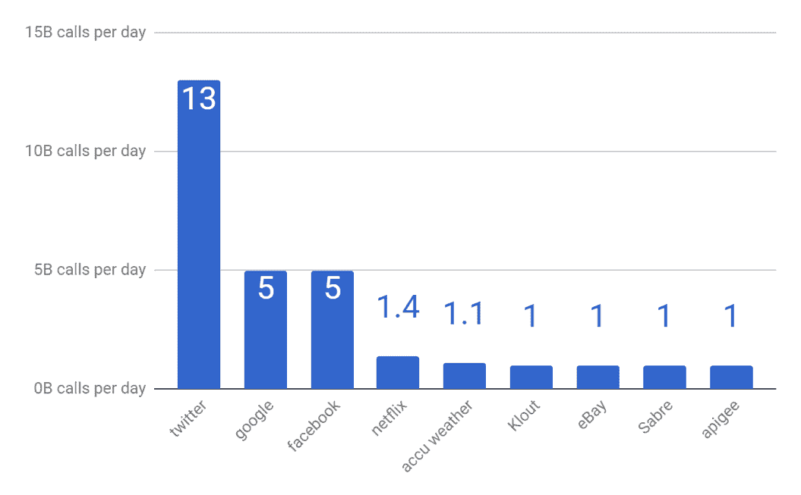

# 关于 API 安全性你需要知道的五件事

> 原文：<https://thenewstack.io/5-things-you-need-to-know-about-api-security/>

[](https://wallarm.com/)

 [Renata Budko，Wallarm 首席营销官

Renata Budko 是人工智能应用安全公司 Wallarm 的首席营销官。在加入 Wallarm 之前，Renata 是 Winkk 的产品副总裁。在此之前，她共同创立了 HyTrust，并领导产品管理和营销。Renata 在安全、云和企业软件领域拥有 15 年的经验，包括在 VMware、Hewlett-Packard 和 InfraTel 担任管理职务。她拥有云安全方面的三项专利，拥有加州大学戴维斯分校的 MBA 和计算机工程硕士学位，以及莫斯科 MIPT 大学的物理学学士学位。Renata 是 VMworld、Network Interop、HPWorld、CloudCon 和 EMC World 活动以及许多地区和在线活动的发言人。](https://wallarm.com/) [](https://wallarm.com/)

API，或应用程序编程接口，是软件与其他软件交流的方式。每天，API 的种类和 API 调用的数量都在增长。所有的网络和移动应用都是由 API 驱动的。就 API 的本质而言，它们中的许多都直接涉及用户数据和应用程序逻辑的核心。

例如，获得对计费 API 的控制将允许黑客将付款重定向到他/她自己的帐户，或者将购买标记为完成，而实际付款尚未收到。用恶意或网络钓鱼 API 替换合法 API 可能会导致整个网站被接管。在最近围绕加密货币交易所的安全问题中，我们已经看到了此类行为的灾难性后果，在这些事件中[数亿美元损失](http://time.com/money/5123018/coinchec-nem-hack-how-the-hackers-pulled-it-off/)。

根据专门跟踪 API 的公司的分析，如[可编程 Web](https://www.programmableweb.com/) 、 [Apigee](https://apigee.com/api-management/#/homepage) 和 BuiltWith，每天有数十亿个 API 请求被执行……事实上，BuiltWith 对 Alexa 10K 网站的分析显示，那里几乎 89%的 API 是内部的。另外 11%是来自 SaaS 提供商的公共 API。

为了对我们正在讨论的流量有一个概念，让我们来看看这个小部分的数据:公共 API 服务。不幸的是，这些数据有点过时——它们来自 2012 年——这仅仅意味着当前的流量水平要高得多。2012 年，仅 Twitter 每天就有 130 亿次 API 调用*。*

 *

让我们从一个不同的角度来估计 API 量。根据 ComScore 的数据，美国 13 岁以上人口的手机普及率为 81%。也就是说，2.6 亿美国公民随身携带 2.106 亿部智能手机，平均每天花三个小时玩手机。每个应用程序会话平均持续五分钟，平均进行 10 次 API 调用，也就是说，每天有 758 亿次 API 调用[指向移动后端](https://www.slideshare.net/jmusser/j-musser-apishotnotgluecon2012)。

鉴于威胁的严重性和暴露内容的庞大数量，我们如何开发既安全又健壮的系统？为了保护您的应用程序，您需要了解关于 API 安全性的五件事情。

## 一:API 的类型

那么，现在有哪些 API 呢？大致来说，我们可以看四类。首先是最常见的企业 API 类别:南北 API。大多数应用程序公开这种类型的 API，用于导出数据、与外部服务通信、管理、监控、报告以及其他计算机到计算机的通信需求。

第二类是内部的“东-西”API，它是相对较新的。随着应用程序变得更加模块化，单个功能由独立的微服务实现，这些微服务可能位于 Docker 容器中或以其他方式隔离。所有这些微服务都需要相互通信，并与协调器通信，例如应用网关或协调平台，如 Kubernetes。

接下来，有一大类 API 是为了让移动应用程序工作而实现的，我们前面提到过。最后一类(也是越来越多的一类)是集成到应用程序中的外部服务的 API。在企业领域，这里的例子可能包括 SalesForce API、Twilio(用于通信)或 Stripe(用于支付)。

## 第二:API 需要深度防御

对于应用程序，我们知道外部世界在外围访问它们。那里有实施安全的既定做法，如非军事区(DMZ)。但是 API 是不同的。API 无处不在。有用于在应用模块和微服务之间传输信息和命令的内部 API，有移动设备和它们的云后端之间的 API，有代表服务本身的 API(例如提供交通和天气信息)。这意味着模式更难识别，同时风险以及检测和保护的需求也更高。

对于您的应用程序使用的第三方 API，您甚至可能不知道所有的风险，因为您可能不知道所有的参数和支持的端点(文档从来都不是完美的！)或者是因为在上次版本更新期间发生了一些变化。

为了降低这种风险，您正在使用的应用程序内 API，如东西微服务 API 或 SaaS API，也应该在其各自的入口点进行安全问题监控。正确的 API 安全解决方案应该能够理解东西方微服务“协议”语法，从而检测注入，如[开放 Web 应用安全项目](https://owasp.org/) (OWASP)前 10 名 A1 级注入风险。因为微服务经常改变，并且经常由不同的团队不同步地实现，而没有对配置文件进行相应的改变，所以保护系统应该能够动态地理解语法。

## 第三:API 需要认证

在设计阶段，最重要的问题是 API 认证和凭证管理的正确实现。缺乏可靠的身份认证实践可能会带来可怕的后果。

可编程网站最近的一篇[文章关注了 T-Mobile 和埃森哲的 API 安全事件。据发现该漏洞的安全研究员](https://www.programmableweb.com/news/recent-api-security-incidents-show-perils-ignoring-best-practices/analysis/2017/10/17)[卡兰·塞尼](https://www.karansaini.com/about/)称，“T-Mobile 拥有 7600 万客户，攻击者可能运行了一个脚本来抓取所有 7600 万客户的数据(电子邮件、姓名、账单账号……)

由于常见的身份验证方法，如基于密码的身份验证和生物特征验证，不能在机器对机器的环境中使用，因此需要考虑加密身份验证、挑战响应、OTP 以及最近的区块链等技术。

当 API 位于后端和移动设备之间时，任务变得更加困难。原生移动应用呈现非浏览器环境。不支持 cookies，自定义协议和编码，如 [protobuf](https://developers.google.com/protocol-buffers/) ，支持不同的套接字管理，如 keep-alive。此外，客户的设备完全不同，从廉价的安卓手机到最新一代的 iPhones。工作任务证明和其他基于 CPU 内存的测试既不能用于身份验证，也不能用作强加密。

所以 API 认证很棘手！

## 第四:API 看起来像机器人

API 的意思是自动化。自动化意味着机器人。许多攻击者正在使用自动化技术来寻找漏洞，抓取您的数据(如用户、朋友、价目表和优惠券)，并进行暴力或凭据填充攻击。有好的和坏的机器人同时运行。

15 年前，对于最终用户的 web 应用程序，只需实现验证码、基于 JavaScript 的任务和其他一些浏览器指纹技术，就可以阻止机器人。这些对 API 不起作用，因为 API 客户机不再是浏览器了。当您的客户是基于 curl 的脚本或外部报告服务器时，跟踪 cookies 和指纹是不相关的。SaaS 公司通过出售专门针对机器人和自动化流程的 API 访问权限赚了很多钱。

API 保护面临的挑战是如何区分“坏的僵尸程序”和“好的僵尸程序”，它们只是高容量的 API 调用。因为这些调用是高容量的，所以检测引擎应该只使用被动的检测手段，而不需要向协议中注入任何东西，以避免影响性能。

## 五:原料药包装热

与用户发起的一次显示一个数据字段的交互不同，API 通常更复杂，需要在一次调用中传输更多的结构化数据。由于定制的应用程序业务逻辑，这需要构建定制的数据编码协议。有时，为了避免逃避问题，有必要对数据进行多次编码或应用额外的逻辑，如哈希或加密。例如，常见的情况是 REST API 调用中 JSON 内部的 base64 编码数据。

自定义协议中不寻常负载的另一个常见示例是 API 调用，乍一看像是利用漏洞，但实际上是合法的，不应该被阻止。

例如，让我们看看一个非常流行的 Elasticsearch API。假设我们在服务器上安装了这个 API，并且想要保护它。[一些 ES API 方法](https://www.elastic.co/guide/en/elasticsearch/reference/current/docs-update.html)处理一个“脚本”请求字段，从技术上讲，这个字段是有效载荷应该在的地方。JavaScript (XSS)和其他正则表达式语法的所有签名都将由该字段触发，因为它实际上是一个如下所示的 JavaScript:

```
POST  test/_doc/1/_update

{
   "script"  :  {
     "source":  "if (ctx._source.tags.contains(params.tag)) { ctx.op = 'delete' } else { ctx.op = 'none' }",
     "lang":  "painless",
     "params"  :  {
       "tag"  :  "green"
     }
   }
}

```

我们如何知道这个脚本在这里是完全合法的，并同时阻止所有非法的脚本呢？这对现代 API 保护是一个巨大的挑战，这也是模式和签名不再是有效识别机制的原因。

## 结论

作为应用程序架构师，您不能忽视 API 的设计时间或操作保护。API 代表了当今模块化应用程序的核心功能集，它们的重要性、影响和数量在未来只会继续增长。

<svg xmlns:xlink="http://www.w3.org/1999/xlink" viewBox="0 0 68 31" version="1.1"><title>Group</title> <desc>Created with Sketch.</desc></svg>*