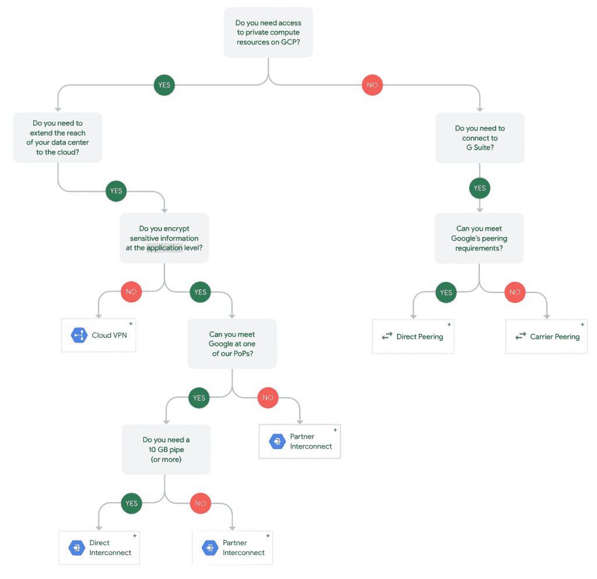
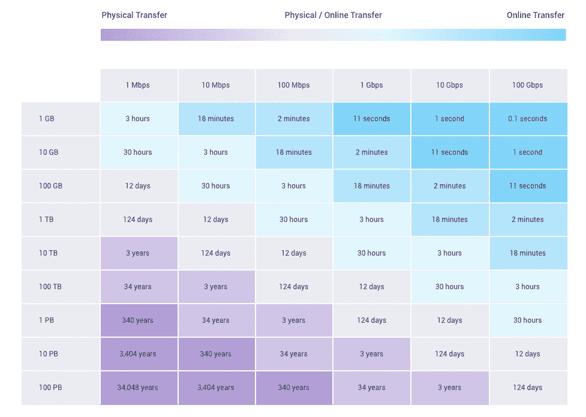
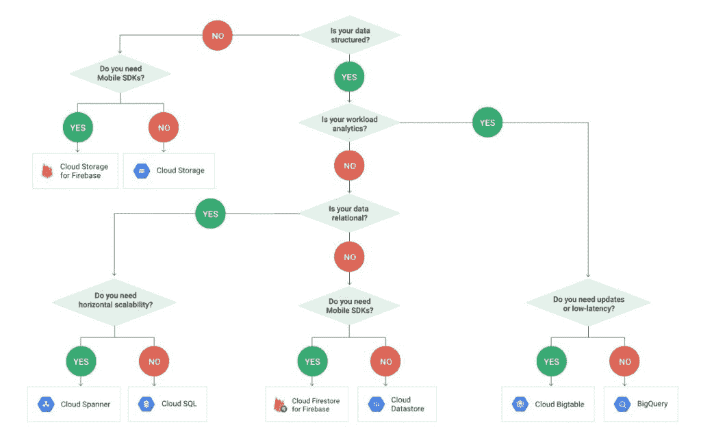

# 成为谷歌云认证专业架构师的 5 个技巧

> 原文：<https://thenewstack.io/5-tips-to-become-a-google-cloud-certified-professional-architect/>

我 2018 年的一个决心是成为[谷歌云认证的专业云架构师](https://cloud.google.com/certification/cloud-architect)。直到年底，我才实现了这个目标。十二月的最后一周，当我的大多数客户都去度假时，我却在埋头准备考试。

我非常熟悉供应商认证流程和格式。通过了微软和亚马逊的多项认证后，我很好奇谷歌是如何组织考试的。Google 的培训和认证团队在考试模式、技术领域和真实企业场景方面做得非常好。我非常喜欢这次测试经历。

如果你渴望成为谷歌云认证架构师，这里有一些建议给你。这些都是基于备考的经验和实际考试的观察。

## 1.了解混合云的概念

非常强调将内部基础设施连接到[谷歌云平台](https://cloud.google.com/)。您需要彻底了解将企业数据中心扩展到 GCP 的选择和权衡。

像其竞争对手一样，谷歌有多种渠道将内部资源连接到云。每个渠道都有针对特定企业场景的独特属性。在实现混合策略时，您需要了解使用一种服务与另一种服务的利弊。关注 Google 提供的混合网络服务。

云 VPN，通过公共互联网将内部资源安全地连接到 GCP VPC。对于客户来说，在数据中心和云之间建立安全隧道是最便宜的选择。

Cloud Interconnect 提供了一个专用的粗 10 Gbps 管道，直接连接到 Google Cloud 的一个存在点。这提供了无与伦比的连接，但价格昂贵。

直接对等是云互连的一种更便宜的选择，比 VPN 提供更好的性能。虽然它没有 SLA，但直接对等让用户通过大幅削减出口费用直接连接到谷歌。

## 2.知道如何将数据转移到谷歌云

将数据移动到云中是迁移过程中的重要一步。谷歌提供多种服务将数据迁移到 GCP。您应该能够根据业务场景选择合适的服务。

熟悉 **gsutil** 命令行工具，在[谷歌云存储](https://cloud.google.com/storage/)上执行基本操作。在许多场景中，这个工具可以方便地将大量文件从本地存储转移到云中。了解如何使用 gsutil 并行上传、配置安全性和自动化数据移动。只有当数据以几 GB 为单位时，使用此 CLI 才有意义。当您必须上传数 TB 或数 Pb 的数据时，请考虑其他选项。

云存储传输服务旨在从亚马逊 S3、Azure Storage 甚至 HTTP 端点等在线来源迁移数据。由于 Google 对 ingress 不收费，这就成为了从其他云平台或存储服务迁移大量数据的理想选择。

当您需要安全地将数 TB 或数 Pb 的数据移动到 GCP 时，传输设备是最便宜、最快的选择。Google 和客户团队都参与了迁移过程。

如果客户需要将大型数据集直接迁移到 BigQuery，可以考虑 [BigQuery 数据传输服务](https://cloud.google.com/bigquery/transfer/)，该服务可以在预定的托管基础上自动将数据从 SaaS 应用程序迁移到 Google BigQuery。

## 3.从里到外学习谷歌云

[Google Cloud Identity and Access Management](https://cloud.google.com/iam/)(IAM)是一项实现粒度或细粒度安全策略的服务。这是一个保护任何谷歌云资源的综合框架。

了解用户帐户和服务帐户之间的主要区别。如果您熟悉 AWS IAM，服务帐户很像 EC2 的 IAM 角色，其中实例承担角色的上下文。在 GCP，任何需要细粒度访问云资源的应用程序都可以使用服务帐户。您甚至需要一个服务帐户来将计算引擎虚拟机连接到云 SQL 实例。

了解权限如何在 IAM 层次结构中传播。在父级定义的权限总是由子资源继承。

探索在定义策略时使用 Google 团体和个人用户帐户的用例。

Google 云存储同时支持 IAM 和 ACL 策略。当您想要保护存储桶时，IAM 是首选，而 ACL 对于保护存储桶中的单个对象非常有用。当两者都处于活动状态时，理解有效的策略非常重要。

## 4.选择正确的存储和数据库产品

GCP 拥有独特的对象存储层，能够以比竞争对手更低的价格为客户提供更多价值。GCP 数据库和大数据产品也是如此。

在对象存储中上传和存储数据时，您应该知道何时使用区域、多区域、近线和冷线存储层。当您不需要跨区域复制时，区域存储桶是正确的选择。[当每月至少访问一次数据时，近线](https://cloud.google.com/storage/archival/)才有意义。 [Coldline](https://cloud.google.com/storage/archival/) 是一年只访问一次数据的理想选择。确保您学习了对象版本控制和对象生命周期管理的概念，这有助于自动化存档和删除过程。

架构师必须根据用例在各种数据库中进行选择。熟悉数据存储、云 SQL、云扳手、云大表和大查询的核心概念。从检查的角度来看，您可以安全地忽略 Firebase 和 Firestore。

[Datastore](https://cloud.google.com/datastore/docs/concepts/overview) 非常适合需要存储无模式文档的 web 和移动后端。但是，如果应用程序需要具有极低延迟和与 HBase 兼容的事务支持，请选择 [Bigtable](https://cloud.google.com/bigtable/) 。[云 SQL](https://cloud.google.com/sql/docs/) 提供与现有 MySQL 和 PostgreSQL 数据库的兼容性。 [Cloud Spanner](https://cloud.google.com/spanner/) 是一项昂贵的服务，仅当您需要一个具有事务支持的全局数据库时才使用。BigQuery 用于存储和检索支持 ANSI SQL 的大型数据集。它不是 NoSQL 和 RDBMS 数据库服务器的替代品。

[Cloud Dataproc](https://cloud.google.com/dataproc/) 可以替代在本地环境中运行的 Apache Hadoop 和 Spark 作业。[云数据流](https://cloud.google.com/dataflow/)在你需要为流和批处理场景建立数据管道时使用。云发布/订阅旨在接收大量数据，这些数据可以连接到数据流管道，最终将最终输出存储在 BigQuery for analytics 中。

## 5.掌握企业案例研究

谷歌在与企业案例研究一致的基于场景的问题方面做得很好。这些案例研究是公开的，这意味着您甚至可以在注册考试之前就可以获得它们。阅读案例研究时，请注意细节。这些需求中使用的词汇传达了许多关于解决方案的设计和架构的复杂细节。

*   [Dress4Win](https://cloud.google.com/certification/guides/cloud-architect/casestudy-dress4win-rev2) 案例研究是一个企业考虑将云用于开发和测试的典型例子。关键是在云中复制现有的环境，并进行最小的更改。
*   [TerramEarth](https://cloud.google.com/certification/guides/cloud-architect/casestudy-terramearth-rev2) 是一个经典的联网车辆/物联网用例，有很多设计数据处理管道的空间。案例研究中使用的微妙暗示和措辞指出了影响在 GCP 选择正确数据平台服务的重要架构选择和设计决策。
*   Mountkirk Games 是一个在云中运行的经典移动游戏后端的例子。它有很大的空间来实现与分析引擎相结合的可扩展后端。

作为准备工作的一部分，请打印这些案例研究，并突出技术和业务需求部分中使用的关键词。将它们与 GCP 的服务和工具对应起来，将为您节省考试期间的宝贵时间。

### 额外提示

确保您了解以下选择的利弊:

*   谷歌计算引擎与谷歌应用引擎
*   标准虚拟机。vs 可抢占的虚拟机
*   本地 SSD 与 SSD 持久磁盘
*   全球与区域和地区资源
*   谷歌应用引擎与谷歌 Kubernetes 引擎
*   HTTP 负载平衡器与网络负载平衡器
*   原始 IAM 角色与预定义 IAM 角色
*   应用引擎标准版与应用引擎灵活版
*   云存储与 BigQuery for Stackdriver Sink

最后，别忘了参加[实践考试](https://cloud.google.com/certification/practice-exam/cloud-architect)。祝你准备顺利！

<svg xmlns:xlink="http://www.w3.org/1999/xlink" viewBox="0 0 68 31" version="1.1"><title>Group</title> <desc>Created with Sketch.</desc></svg>