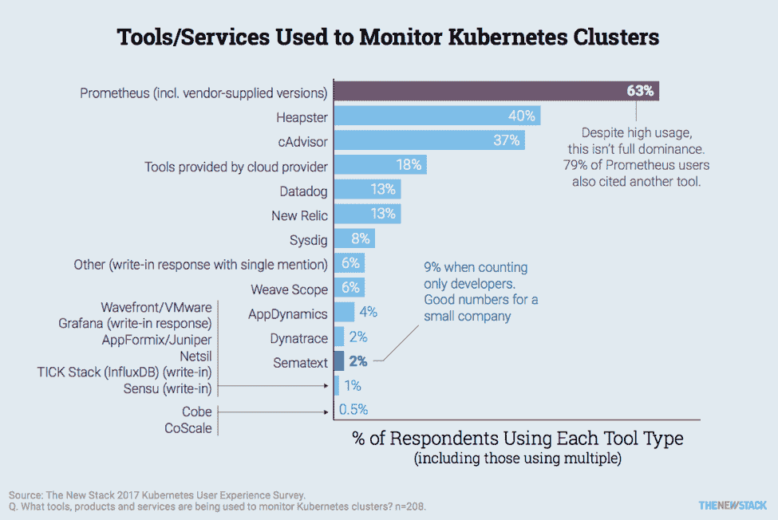
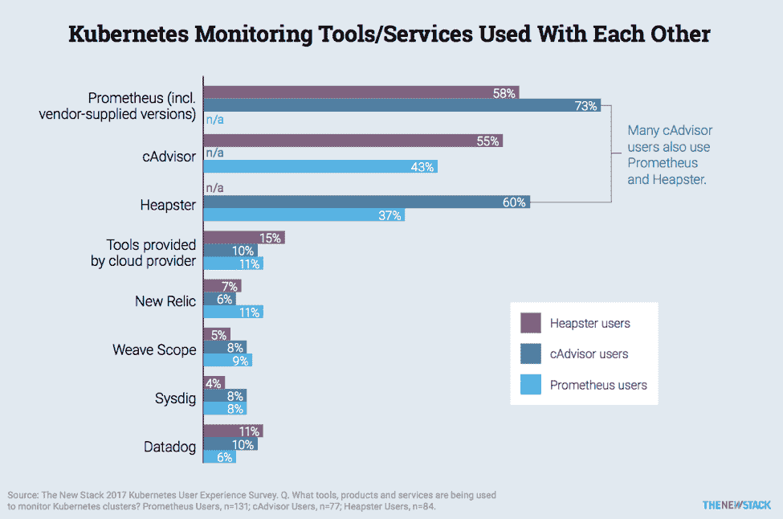

# 在生产中大规模监控 Kubernetes 的 5 种工具

> 原文：<https://thenewstack.io/5-tools-monitoring-kubernetes-scale-production/>

 [克雷格·马丁，肯赞

克雷格·马丁是肯赞的工程界 SVP，他领导工程运营，自称的使命是找到复杂挑战的优雅解决方案。在他的职位上，Craig 帮助领导公司的技术方向，确保探索新的和新兴的技术并将其纳入战略愿景。最近，克雷格一直专注于通过构建大规模微服务应用来帮助公司进行数字化转型。他长期从事专业服务领域的定制软件开发，在加入 Kenzan 之前，Craig 是 Flatiron Solutions 的工程总监。他在乔治梅森大学获得了理学学士学位。](http://kenzan.com/) 

监视分布式系统环境的概念完全不同于监视客户机/服务器网络，原因是一旦发现就变得显而易见了。您正在监控的东西(其性能、弹性和安全性对您的组织非常重要)比运行它的任何一个单独部分的任何一个处理器都要大。因此，与以前相比，监控服务器或查看网络地址传达的分布式系统和微服务的相关信息要少得多。

这就产生了一个挑战:在选择可以帮助您的组织执行这个策略的工具之前，您需要一个监控策略。根据设计，Kubernetes 不是自我监控的，一个裸安装通常会有您需要的监控工具的一个子集。一个高度调整和适当架构的 Kubernetes 环境将会自我修复，并防止任何停机。该系统将使用监控作为在问题出现之前识别问题的关键，并确保自我修复只是最后的手段。

监控 Kubernetes 需要解决许多与任何高度可伸缩的弹性应用程序相同的挑战，尽管工具或方法可能有所不同。所有 Kubernetes 组件——容器、pod、节点和集群——都必须包含在监控操作中。同样重要的是，流程必须到位，以吸收监控结果并采取相应的纠正措施。最后一项经常被开发团队忽略。

## Kubernetes 监控工具

选择一个监控工具集当然很重要，但不是出于您可能会想到的原因。每个监控工具集都有它的优点和缺点，我们可以说，都有独特的品质。您可能会发现自己在选择工具集的组合，就像我们在 [Kenzan](https://kenzan.com/) 的团队在内部所做的那样，尤其是当您需要同时监控几个方面的时候。今年早些时候进行的新堆栈的 Kubernetes 用户体验调查发现，许多 Prometheus 和 Heapster 用户还将它们与其他集群监控工具配对使用(见下图)。

[cyclone slider id = " kubernetes-series-book-1-赞助商"]

事实上，关于工具集最重要的事情是你坚持你所选择的集合，并且在你的 Kubernetes 集群中一致地使用它。

我们必须自己找出事实。虽然有许多可行的选项，您可以在下面的图表中看到，但以下是我们在 Kenzan 的团队经常使用的监控工具集，我们建议您的组织使用这些工具集:

*   [Heapster](https://github.com/kubernetes/heapster) :作为一个 pod 安装在 Kubernetes 内部，它从集群中的容器和 pod 收集数据和事件。
*   [普罗米修斯](https://github.com/prometheus):开源[云本地计算基金会](https://www.cncf.io/) (CNCF)项目，提供强大的查询能力、可视化和警报。
*   [Grafana](https://grafana.com/) :与 Heapster 结合使用，用于可视化 Kubernetes 环境中的数据。
*   [InfluxDB](https://www.influxdata.com/) :一个高度可用的数据库平台，存储所有 Heapster pods 捕获的数据。
*   [CAdvisor:](https://github.com/google/cadvisor) 关注容器级性能和资源使用。这直接嵌入到 kubelet 中，应该会自动发现活动容器。

## 生产监控'过程'

虽然本文主要关注的是 Kubernetes 生产环境中的工具，但是如果不讨论生产环境中的健康监控过程，那将是我的失职。在 Kenzan，我们经常看到组织在开发过程中过晚地推动监控和所有特定于监控的需求。我们提倡“左移”式的监控，作为健康的 DevOps 文化的一部分。在这里，两个主要的经验法则对我们很有用:

*   **监控作为开发的一部分** —非常重要的是，正在开发的功能将包括开发周期中的监控和预期监控。这应该包括在所有的评估中，并且与其他开发活动一样处理。
*   **监控非功能** —如果可能，所有非功能都应受到监控(带警报)。响应时间、每秒请求数等就是很好的例子。我们发现这对于在小问题变成大问题之前抓住它们非常有用。

[cyclone slider id = " kubernetes-series-book-1-赞助商"]

## 最终注释

监控工具需要和整个应用程序一样耐用，如果不是更耐用的话。没有什么比停机更令人沮丧的了，停机会导致您的监控工具停止工作，让您在最需要的时候失去洞察力。虽然在这一级别进行监控的最佳实践往往非常特定于应用程序，但是您应该查看基础架构中的故障点，并确保任何可能发生的停机都不会导致监控盲点。

大多数监控 Kubernetes 的第三方和附加应用程序(例如 cAdvisor、Heapster)都可以在您的环境中部署。不过，请确保这些应用程序的日志记录发生在集群之外，或者它们本身设置了故障转移功能。这一简单而关键的概念如此频繁地被忽视，这一点很值得注意。

正如我前面提到的，您需要监控所有的 Kubernetes 组件，包括容器、pod、节点和集群操作。如果您想最大化它的潜力，您还想确保监控是所有开发周期的一部分。你可以在[Kubernetes 生态系统的状态](https://thenewstack.io/ebooks/kubernetes/state-of-kubernetes-ecosystem/)电子书中找到对这些组件的监测工具和方法的更详细的解释。

<svg xmlns:xlink="http://www.w3.org/1999/xlink" viewBox="0 0 68 31" version="1.1"><title>Group</title> <desc>Created with Sketch.</desc></svg>