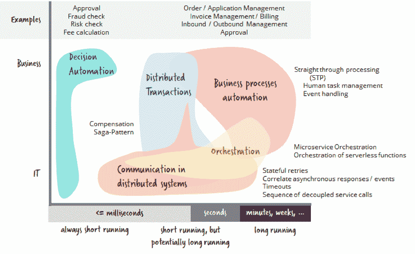

# 您可能没有考虑过的 5 个工作流自动化用例

> 原文：<https://thenewstack.io/5-workflow-automation-use-cases-you-might-not-have-considered/>

工作流自动化？这不是给我们的！我们没有人工任务管理和任务列表。我们完全自动化我们的核心业务。我们有如此巨大的负载，工作流引擎无论如何都无法处理。

我经常听到这样的观点，它们是如此的错误！工作流自动化不仅仅是人工任务管理。这就是为什么我今天想详细阐述我对工作流自动化用例的看法。

**T*L；DR:*** *我看到了工作流自动化技术的五组用例，从非常技术性的用例(比如远程服务不可用时的状态重试)到典型的业务流程(比如订单到现金)。现代工作流引擎是轻量级的，并且还可以以低延迟操作大容量，这使得它们适用于需要状态机的每个问题。*

## 工作流自动化的用例

工作流自动化围绕[长期运行行为](https://blog.bernd-ruecker.com/what-are-long-running-processes-b3ee769f0a27)统一了多个用例。我画了一张图，这是我个人的观点:

 [贝恩德·吕克尔

在吕克尔超过 15 年的软件开发生涯中，他帮助 T-Mobile、Lufthansa 和 Zalando 等全球公司实现了高度可扩展核心工作流的自动化。他为各种开源工作流引擎做出了贡献。他是 Camunda 的联合创始人和开发者倡导者，这是一家重塑工作流自动化的开源软件公司。他与人合著了现实生活中的 BPMN，这是一本关于工作流建模和自动化的畅销书，现在已经是第五版了，有英语、德语和西班牙语版本。](https://bernd-ruecker.com/) 

我将用例分为五类。我将在本文的剩余部分讨论这些集群。我从两个方面对他们进行了评价:

*   **业务**或 **IT** ，意思是手头需求的主要驱动力。这可以是业务部门，因为他们想要实现核心业务能力。但也可能是因为他们想解决技术难题。无论如何，大多数用例都会在中间相遇。
*   工作流实例的持续时间，范围可以从很短的运行时间到很长的运行时间。后者可能意味着工作流实例需要数小时、数天甚至数周才能完成。顺便说一下，长时间*运行*是有误导性的，因为它基本上意味着工作流实例是*而不是*在运行，而是*在等待*。所以这就是为什么你需要处理持久状态，你在天平上移动得越靠右。

一个重要的补充说明:仅仅因为一个用例更技术性并不意味着它与业务无关。决定是否要重试失败的服务呼叫(例如，客户评级)或仅返回默认值(绿色)非常重要。决定哪些矛盾你可以忍受，哪些矛盾你必须解决是相关的。

如果您想知道为什么要使用工作流引擎，有两个主要的价值主张:

*   它是一个**持久状态机**,也解决后续需求，如流程模型的版本化、调度机制、操作控制等等。
*   对于长期运行的工作流来说，**图形可见性**对于[成功的 BizDevOps](https://blog.bernd-ruecker.com/bizdevops-as-avalue-proposition-of-workflow-engines-f342509ba8bb) 至关重要。

因此，让我们开始并逐一查看这五个集群。我还将给出每个用例的源代码示例的链接，以便使它更具体(至少对开发人员来说)。这些例子可以直接在来自 [Camunda](https://camunda.com/) 的[开源工作流引擎](https://thenewstack.io/camunda-offers-a-microservices-workflow-engine-built-on-bpmn/)上运行(提示:由于我是 Camunda 的联合创始人，所以我在工具选择上有偏见，因此手边自然有这个例子)。

## 1.业务流程自动化

业务流程实现了公司的重要核心功能，如交付客户订购的商品或服务(“订单到现金”)。业务流程在本质上通常是长期运行的。它们可能包括:

*   直通式处理/服务编排
*   等待内部或外部消息、计时器(如承诺的交付日期)或其他事件
*   人工任务管理

### 典型例子

*   指令结束
*   应用管理
*   发票管理/计费
*   入站/出站管理(通常称为输入/输出管理)
*   各种事情(订单、采购订单、差旅费、发票等)的审批
*   股票交易
*   内容准备和交付

实现端到端业务流程的工作流模型的真实示例(信用卡申请、双因素身份验证、索赔处理)

代码示例[此处](https://github.com/camunda-consulting/camunda-showcase-insurance-application)。

## 2.分布式系统中的通信

分布式系统成为 IT 领域的新常态。分布式系统之所以复杂，是因为[分布式计算的八大谬误](https://en.wikipedia.org/wiki/Fallacies_of_distributed_computing)。我认识的大多数开发人员还没有意识到即将到来的巨大变化，因为远程通信是不可靠的，错误是必须接受的，并且你用最终的一致性来交换你的事务保证。作为开发人员，我们真的必须调整我们的工具箱，以应对这些新的挑战。我在[微服务集成的三个常见陷阱中写过一些例子，以及如何避免它们](https://blog.bernd-ruecker.com/3-common-pitfalls-in-microservice-integration-and-how-to-avoid-them-3f27a442cd07)。

工作流引擎是解决您将遇到的一些挑战的重要因素。

### 典型例子

*   如果服务不可用或没有响应，则重试服务调用。重试可能需要几个小时甚至几天。我称之为有状态重试。
*   等待消息(例如异步响应或事件)。
*   等待消息时超时。
*   关联几条消息(例如，只有当 3 条消息都到达时才会发生某种情况)。

使用 BPMN 符号的用例可视化

当服务于这个用例时，你可能会得到非常小的工作流模型，这是非常好的。这些模型感觉就像您可能也从类似 ESB 的工具中了解到的集成流程。

这些工作流通常*可能*长期运行——如果一切顺利，您可以在几毫秒内获得同步结果，但您可能需要几秒、几分钟或更长时间来解决故障情况。

## 3.分布式事务

如前所述，您不能在分布式场景中依赖 ACID 事务。ACID 代表原子性、一致性、隔离性和持久性，是您在使用典型的关系数据库(开始事务、做一些事情、提交或回滚)时的体验。像两阶段提交(XA)这样的尝试给分布式场景带来了 ACID，但是在现实生活中并没有真正使用，因为它们没有伸缩性。但是您仍然必须解决为多个活动提供非此即彼的语义的业务需求。

这通常通过记住已经执行了哪些活动，并在业务事务失败时调用所谓的补偿活动来解决。补偿活动在语义上撤销了原始活动(例如，从信用卡中退款)。值得注意的是，该模型接受暂时不一致的状态，但确保最终一切都变得一致。这种放松的一致性观点被称为**最终一致性**，对于大多数现实生活中的用例来说已经足够了。

BPMN 的补偿是实现 Sagas/分布式事务的一种方式

这也被称为传奇模式。我计划很快就此专门写一篇更深入的文章。

### 典型例子

分布式系统中所有关心一致性的活动链。典型的例子是预订旅行，你一个接一个地预订酒店、汽车和航班，如果出了问题，需要取消预订。实际生活中的用例往往更加琐碎。

此处是代码示例。

## 4.管弦乐编曲

现代架构都是关于分解的，例如分解成微服务或无服务器功能。当你有许多小组件做好一件事时，你被迫将这些点连接起来实现真正的用例。这就是编排发挥重要作用的地方(参见[使用 BPMN 和卡蒙达编排 Azure 功能——案例研究](https://blog.bernd-ruecker.com/orchestrating-azure-functions-using-bpmn-and-camunda-a-case-study-ff71264cfad6))。它基本上允许以一定的顺序调用组件(或服务、活动、功能)。

### 典型例子

*   一个微服务依次调用其他三个微服务
*   需要依次执行多个无服务器功能

## 5.决策自动化

对我来说，决策管理是工作流自动化的“僚机”。当然，它是一门独立的学科，应该有自己的文章，但是我今天只从工作流自动化的角度来看它。然后，它是提取业务决策并将其从路由决策中分离出来的一个很好的工具:

### 典型例子

*   资格或审批规则的自动评估
*   数据验证
*   欺诈检测或风险评级
*   衍生价值的计算(如折扣、运输成本)
*   确定受托人，例如，谁最适合从事人工任务

这里的[代码示例](https://github.com/camunda-consulting/camunda-showcase-insurance-application)。

## 用例在现实生活中混杂在一起

在现实生活场景中，用例通常是组合在一起的。例如，您可能想要完全自动化您的应用程序处理(*传统的业务流程自动化*和*直通处理*)。为了做到这一点，你可能需要调用( *orchestrate* )几个 web 服务，这意味着你要在分布式系统中进行*通信。业务规则可以自动决定欺诈的风险(*决策管理*)。如果有涉嫌欺诈的案例，它将被路由到一个职员(*人工任务管理*)。*

## 灵活的架构

在这一点上，我想补充一个非常简短的说明:有许多选项可以设置您的架构来使用工作流引擎。这并不意味着你必须引入一些核心组件，迫使你采用低代码方法。

您可能对运行工作流引擎的[架构选项](https://blog.bernd-ruecker.com/architecture-options-to-run-a-workflow-engine-6c2419902d91)或[感兴趣，在使用有界上下文](https://blog.bernd-ruecker.com/avoiding-the-bpm-monolith-when-using-bounded-contexts-d86be6308d8)时避免“BPM monolith”以获得更多细节。

## 性能和可扩展性

打开工作流自动化的用例通常会提出这样一个问题:如果我们对每个服务调用都使用它，那么相应的工具真的能够处理我们将会得到的负载吗？这也包括被称为“低延迟高吞吐量”的用例因此，即使在非常高的负荷下，发动机也必须非常快。

是的，我们开始看到能够处理这种情况的工具， [Zeebe.io](http://zeebe.io/) 是一个例子， [AWS Step Functions](https://aws.amazon.com/step-functions/) 是另一个例子。

例如，Zeebe 通过完全改变其内部架构达到了这些新的可伸缩性。Zeebe 代理本身就是一个分布式系统，可以有效地处理复制和伸缩。它使用的算法有[事件源](https://martinfowler.com/eaaDev/EventSourcing.html)、[仅附加日志](http://cidrdb.org/cidr2015/Papers/CIDR15_Paper16.pdf)、[单个写入者原则](https://mechanical-sympathy.blogspot.de/2011/09/single-writer-principle.html)和 [Raft 共识](https://raft.github.io/)。如果您没有马上理解这些概念，也不用担心，这就是为什么有中间件或云提供商在处理它。但是它也让你体会到我之前所说的我们开发软件的方式的改变。

所有这些都允许工作流引擎中前所未有的水平可伸缩性。我的[联合创始人将此命名为“**大工作流程**](https://blog.camunda.com/post/2017/12/camunda-year-in-review/) ”

下一个合乎逻辑的、不可避免的阶段是“大工作流问题”:我们如何处理复杂的、分布式的、长时间运行的和关键任务的活动链？我们如何大规模地处理它们呢？这个问题有三个关键方面:软件开发、技术操作和业务可见性。

目前，我正在与客户讨论每秒涉及数十万个实例的用例。我们快到了！

## 摘要

工作流自动化围绕长期运行的行为统一了多个用例。在本文中，我对它们进行了命名和分类。我展示了所有这些都是有效的用例，并且现代技术可以为所有这些问题和相关需求提供很大的帮助。

<svg xmlns:xlink="http://www.w3.org/1999/xlink" viewBox="0 0 68 31" version="1.1"><title>Group</title> <desc>Created with Sketch.</desc></svg>