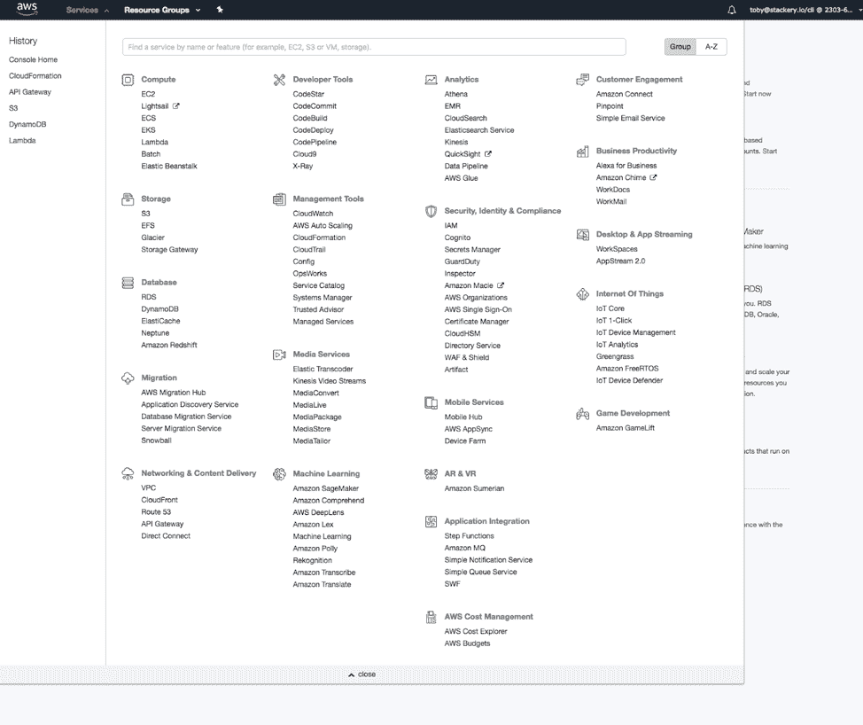

# 高性能无服务器工程的 6 个最佳实践

> 原文：<https://thenewstack.io/6-best-practices-for-high-performance-serverless-engineering/>

Stackery 赞助了这篇文章。

当你写你的第一批 lambdas 的时候，性能是你最不关心的事情。权限、安全性、身份和访问管理(IAM)角色和触发器共同组成了第一对 lambdas，甚至在“hello world”试用之后，只是为了让您的第一个无服务器部署启动并工作。但是一旦你的用户开始依赖你的 lambdas 提供的服务，是时候关注高性能的无服务器服务了。

当您试图开发高性能的无服务器应用程序时，需要记住一些关键的事情。

## 1.可观察性

 [托比·费

Toby 是 Stackery 的社区开发人员。她的角色和经历结合了软件工程师、作家和技术讲师的工作，用新兴工具构建有趣的项目，并与世界分享她的发现。在加入 Stackery 之前，Toby 是 NWEA、瓦卡萨和新遗迹公司的工程师。](https://www.stackery.io/) 

无服务器处理扩展真的很好。但是，随着规模与复杂性的相互作用，速度变慢和出现错误是不可避免的。坦率地说:如果你没有从一开始就计划好可观察性，那么这些可能会很麻烦。

可观察性不仅仅是日志或指标——这两者在 serverless 中都非常丰富。您可以深入查看 cloud watch，以获得每次调用 lambda 时的日志记录信息，AWS 控制台提供了大量方法来查看平均执行时间、内存使用和其他关键指标。

但是可观察性是指我们在不打开系统内部的情况下从外部分析系统的能力。日志记录和度量标准都不能真正做到这一点，因为日志记录提供的信息过于精细，无法告诉您通常是如何处理请求的，而度量标准只能真正指出问题的症状，而不能指出问题的原因。解决方案是真正的工具，它对跟踪信息进行采样，并为您提供一般数据和异常数据。

如果你想编写你的仪器， [Honeycomb.io](https://www.honeycomb.io/) 可以收集你所有的数据，并把它们呈现在一个有用的仪表板上。如果您正在寻找一款专为无服务器构建并能自动检测堆栈的产品。 [Epsagon](https://epsagon.com/) 可以给你一个很好的概述*和*很好的细节。

## 2.想想你在要求什么

我经常看到兰姆达斯，一旦被触发，就开始四处寻找更多的信息。他们发出 web 请求，ping 其他 lambdas 或检查配置文件，以获取关于所请求内容的一些上下文。

这里可以做的最快/最便宜的改进是注销这个 Lambda 是用什么调用的，并检查每个键。由 S3 上传触发的 lambda 应该*不*需要查询相同的 S3 桶。它是用所有需要的对象数据调用的！

## 3.不要重写你的代码

以下是一些常见的谎言:

*   在迭代数组之前，一定要做一个数组的副本，对副本进行变异会更有效
*   不要连接字符串，即使只是两个字符串也要连接成一个数组，这样可以节省内存
*   “全局变量的性能比作用域良好的变量差得多”

所有这些都是好心人提供的，他们想帮助人们编写更具表演性的 JavaScripts。都忽略了一个基本事实: **JavaScript 是一种高阶语言。**

在实践中，这意味着你写的 JavaScript 代码被一个“引擎”解释，它会试图以最可能的方式执行你的代码*。事实上，有多个相互竞争的团队试图开发运行代码更快的引擎。像上面那些建议，声称 JavaScript 的“怪癖”需要特殊的工作才能表现良好，只能适用于单一版本的 *one* JavaScript 引擎。*

 *优化是不可能的吗？一点也不！你总是可以通过减少程序必须做的事情来改进程序:

*   组合对其他服务的多个请求；
*   如果/当你有足够的匹配时停止循环；
*   返回有用的错误信息；
*   优雅地失败。

但是除了这些最基本的最佳实践，*重写代码并不是解决性能问题的方法*

## **4。本地启动**

我认识的每个人在他们的无服务器开发早期都有类似的经历:当你的 lambda 开始做一些有点复杂的事情时，你会发现自己对配置和功能代码做了许多小的调整。对于每个变更，您必须等待代码部署和堆栈的其余部分投入使用。您的开发周期看起来更像是“保存、打开控制台、部署、等待、刷新、等待、刷新、等待、等待、刷新”，而不是“保存、构建、刷新”

至少有了 AWS Lambda，这不再需要减慢您的速度:AWS [无服务器应用程序模型命令行接口(SAM CLI)](https://docs.aws.amazon.com/lambda/latest/dg/sam-cli-requirements.html) 可以复制 Lambda 和 API 端点以及许多其他资源，所有这些都在本地 docker 容器中。

## 5.Local 永远不会复制您的整个堆栈

为了真正模拟您的无服务器流，您需要一个堆栈来部署您的代码。

具体情况可能因团队规模而异，但本质上，您需要某种类型的 staging 或 test 版本的堆栈来测试您的代码。在权限方面，AWS 拥有您需要的所有权限级别，让您的大部分开发人员“建议”对产品进行更改，但在测试中根据需要进行更改。这也是提及 [Stackery](https://www.stackery.io/) 使得在多个环境中从头到尾建立相同的堆栈变得非常容易的一个好地方。

## 6.管理代码，而不是配置

乍一看，AWS 由许多菜单组成:

没有这个菜单的截图，关于 AWS 的讨论就不完整。

它的许多服务可以通过 AWS 控制台中的可视菜单进行配置。这种方法的问题应该是显而易见的:当试图构建[副本环境](http://desktop.arcgis.com/en/arcmap/latest/manage-data/geodatabases/replicas-in-a-disconnected-environment.htm)(参见上面的规则)时，涉及到手工复制，一些更改没有被记录，并且在危机之后，许多更改没有被做出它们的人很好地理解！

怎么收拾这个烂摊子？CloudFront 是 AWS 摆脱“只存储在 UI 中的配置”的途径，他们的[无服务器应用模型](https://github.com/awslabs/serverless-application-model)允许你创建 YAML，在一个文件中定义你的栈，你可以用它来跟踪变化。

不熟悉山姆，甚至只是 YAML 一般？ [Stackery](https://www.stackery.io/) 的另一个卖点是它能够自动创建模板，并随着堆栈的变化进行更新。

## **结论**

高绩效是一种价值观，而不是终点线。当你的项目开始成功时，你的用户可以告诉你什么需要改进。遵循上面的指导，知道在构建可扩展的堆栈时从哪里开始。

通过 Pixabay 的特征图像。

<svg xmlns:xlink="http://www.w3.org/1999/xlink" viewBox="0 0 68 31" version="1.1"><title>Group</title> <desc>Created with Sketch.</desc></svg>*