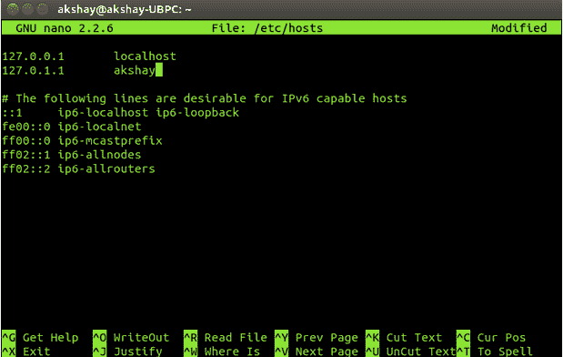
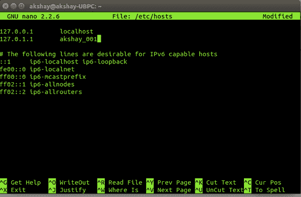

# 构建 Raspberry Pi 集群时的六个常见错误

> 原文：<https://thenewstack.io/6-common-errors-when-building-a-raspberry-pi-cluster/>

尽管互联网是启动和运行 Pi 集群的巨大资源，但是当您遇到困难时，并没有完整的错误集可供参考。很多时候，两个不同集群上的相同错误可能有两种完全不同的含义，这使得解决问题更加困难。随着这些集群在世界各地越来越受欢迎，随之而来的问题也越来越重要。Raspberry Pi 集群经济实惠，可以集群化，做成超级计算机或者云计算集群。例如，Bobo Cloud 是一个基于 Raspberry Pis 的面向学生的开源云服务。

随着这些集群变得越来越普遍，对文档和其他资源的需求也会越来越多。这篇文章旨在成为解决问题的资源。它描述了 Raspberry Pi 领域的初学者可能会遇到的五种常见错误类型及其可能的解决方案。

## 电源问题

### 错误:

*   不允许第一次启动时更改密码，或者每次第一次启动时更改密码都会挂起 Pi。
*   每当 Raspberry Pi 启动时，只有两个端口工作。例如，只有两个 USB 端口可以工作，连接到终端的 HDMI 端口和以太网端口不能工作。或者，HDMI 和一个 USB 工作，禁用设备上的其余端口。
*   在操作的中途，树莓 Pi 重新启动，并以不规则的时间间隔重复重新启动。
*   所有端口都工作正常，但是 Pi 停止响应按键。

### 问题和解决方案:

这些问题是由于 Pi 断电造成的。Raspberry Pi 被设计为在低功率下运行，但是当电源比要求的低很多时，它可以工作，但是不能发挥其最大能力。

树莓派 B 型的理想电源是 5v，2A。虽然大多数移动适配器用于为 Pi 供电，但大多数时候它的额定功率要低得多，这导致了上述问题。

此外，如果适配器被构建为通过微型 USB 线发送电力，则低质量的适配器会在电力传输期间造成损耗，从而无法提供全部 5V。

您也许可以使用一种变通方法来解决上述一些错误，比如通过更改 USB 传输速度的配置来检测键盘的按键，但是这样做只会延迟其他错误的出现。相反，获得一个高质量的适配器来修复这些错误。

## 重叠 MPI 问题

### 错误:

*   mpiexec 崩溃
*   ssh 错误:传递参数时出错

### 问题和解决方案:

这些错误通常是由于多个 MPI 发行版的重叠造成的。最常用和最理想的发行版是 OpenMPI 和 MPICH。Linux 一般使用 MPICH。

当您使用 MPI 发行版之一将软件包直接安装到系统中时，会发生重叠，导致 **mpiexec** 和 **mpicc** 的行为损坏。例如，直接安装 Python 包来运行 MPI 或者多次安装同一个 MPI 发行版(共享和非共享)会导致冲突。发生这种情况是因为直接安装有时不检查完全兼容性。它只是检查依赖关系，如果检查通过，就下载并安装软件包。这些软件包可能会不知不觉地安装 MPI 发行版，即使您已经安装了 MPI 发行版。它也可能改变 MPI 的系统路径。这可能会损坏整个 MPI 安装。

解决方案是手动构建每个包。特定于每个
MPI 发行版的安装指南通常是可用的。如果没有或者手动构建是不可能的，请确保在安装之前创建了一个还原点，以便可以回溯任何损坏

## 主机名问题

### 错误:

*   主机名未解析
*   $pi@(无):

### 问题和解决方案:

这个错误是最令我困惑的错误之一。为什么？因为一个节点不知道它的主机名，它会给出这个错误，但会在 60%的时间里执行交给它的任务。只有当主机名从其缺省值更改为用户想要的值，以便他/她可以区分节点时，才会出现这种情况。

通过在两个地方更改主机名，可以清除“主机名未解析”错误:

运行上面的命令，每个命令打开一个文件。在该文件中，更改默认值

主机名设置为所需的主机名。

最后，当给定的主机名包含**'-'(连字符)**或任何其他符号时，会出现 pi@(none)或(none)主机名错误。解决方法是编辑上面提到的两个文件，并用一个
**'_ '(下划线符号)替换主机名的非法符号。**

下面是将主机名从
**“AK shay”**更改为**“AK shay _ 001”前后的两个文件/etc/hosts 的图像**

对另一个文件也要做同样的事情。保存并重新启动，以便成功应用更改。

## HDMI 端口问题

### 错误:

*   用于连接显示终端的端口不足
*   选择合适的显示器

### 问题和解决方案:

这是许多初学者可能面临的最大困难。当您的终端/显示器上没有 HDMI 端口，或者您想要将不同的显示器连接到 Raspberry Pi 时，就会出现这种情况。

解决办法在于材料的可获得性。连接
显示器的许多选项包括:

*   使用带有 HDMI 端口的显示器。
*   使用 HDMI 到 VGA 转换器，并将其连接到显示器。
*   使用以太网电缆连接到笔记本电脑的显示器(如果您不需要以太网端口进行局域网连接，建议使用以太网电缆)。
*   使用 SSH 以无线方式使用任何电脑或笔记本电脑的显示器。当在笔记本电脑和 Raspberry Pis 上都配置了 SSH 之后，就可以远程连接了，这意味着设备上的任何端口都是不需要的。

## 重复登录问题

### 错误:

*   通过 SSH 连接到另一个节点失败。
*   每次远程登录到其他节点所需的登录凭据。
*   错误:RSA 密钥不安全。
*   警告:未受保护的私钥文件。

### 问题和解决方案:

使用 SSH 的主要目的是许多计算机专家所说的无需登录的**安全网关** **。**"这意味着您只需在首次登录另一个节点时提供登录凭证。如果每次登录节点时都要求您输入凭据，这意味着出现了问题。事实上，如果集群有大约 64 个节点，并且每个节点都需要登录，这将是一场灾难。当包含私钥的文件被复制到其他位置或其访问权限被篡改时，通常会发生此错误。另一个可能的原因是主机名配置不正确，在这种情况下，SSH 不确定该节点是否存在于其网络中。这导致 SSH 认为默认设置不再存在，并得出网络不安全的结论。因此，这些错误。

我通过将访问权限更改为仅由所有者读取和执行，而没有对组或其他人的权限来修复这些错误。如果主机名配置不正确，请使用上面针对**主机名问题**给出的解决方案。

## 共享库问题:

### 错误:

*   生成失败:找不到 mpicc。
*   –无法识别 enable-shared 选项。

### 问题和解决方案:

我们遇到这些错误有两个原因。首先，我们已经构建了没有共享库的 mpich2。然后尝试构建与之并行的共享版本。现在，从理论上讲，这应该不成问题，许多关于这方面的论文表明，有可能构建与没有共享库的版本并行的具有共享库的 mpich2。但结果是，在新版本的 mpich 中，它不起作用。

对于某些用户，只有–enable-shared 选项可能无法识别。这是因为构建脚本无法找到 mpicc 或其他一些依赖项的路径。

解决方案是只构建带有共享库的 mpich。建议将其构建在 Raspbian 操作系统的/usr/local 目录中。因此，这消除了路径信息中的任何歧义，并导致成功的构建。重要的是要知道，只有当需要动态库时，共享库才是重要的。所以)而不是静态库(。a)。因此，如果需要在运行时加载库，mpich 应该配置共享库。

阿克谢·派是一名来自班加罗的工程系学生，现在是他学习的最后一年。

<svg xmlns:xlink="http://www.w3.org/1999/xlink" viewBox="0 0 68 31" version="1.1"><title>Group</title> <desc>Created with Sketch.</desc></svg>