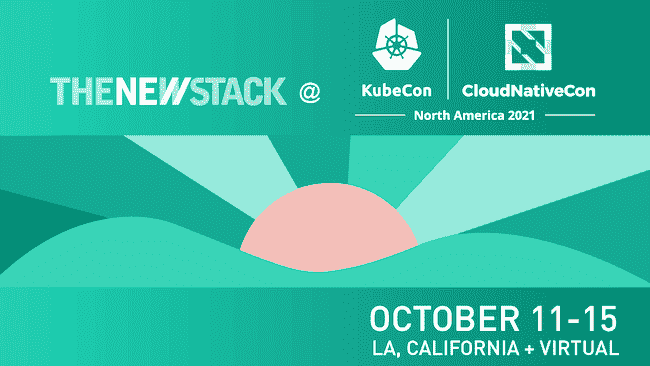

# 6 Kubernetes 帮助开发人员解决问题的最佳实践

> 原文：<https://thenewstack.io/6-kubernetes-best-practices-to-empower-devs-to-troubleshoot/>

 [米卡埃尔·阿利尔

米卡埃尔是一位自学成才的开发者，后来成为 DevOps 的倡导者。他热衷于自动化、创新和创造性解决问题。目前，他正在 Komodor 开发下一代 K8s 故障排除平台，并兼任法国美食鉴赏家。](https://www.linkedin.com/in/mickaelalliel/) 

权力越大，责任越大。虽然 Kubernetes 是一个极其强大的系统，具有几乎无限的规模和分发能力，但从运营管理的角度来看，它也是一把双刃剑。在很大程度上，管理 Kubernetes 的任务落在了平台工程团队(DevOps 和 SRE)身上，但也有相当多的领域可以向左转移，以改善长期的故障排除和维护。

甚至在部署到 Kubernetes 之前，就有一些前瞻性的步骤来实现系统管理和维护的民主化，使运营和开发人员能够更快、更有效地排除故障。

为此，我们总结了来之不易的技巧，在 Kubernetes 系统的设计阶段应用这些技巧，可以省去许多故障排除的麻烦。通过从一开始就将这些融入进来，您将能够分配管理工作，并通过整个工程组织提供更大的所有权感。

## 善良的秘诀:如何在实践中改变你的 Kubernetes 故障诊断

下面，我们将深入了解您可以在工程组织中立即实施的速赢。这些将使您的 Kubernetes 系统更容易为每个人排除故障..与所有代码一样，总会有问题和漏洞，所以您希望尽可能快速、轻松地找到根本原因。

### **1。无状态优先设计**

当最初构思 Kubernetes 时，它是为无状态应用程序构建的，尽管有状态支持已经取得了很大进展..这就是为什么在将无状态应用程序部署到 Kubernetes 时，从一开始就构建无状态应用程序仍然是一个好的实践。这允许您消除应用程序的许多风险，并获得弹性的好处。

需要重启的应用程序不再像重启前那样依赖外部信息或数据来运行，因此管理起来要容易得多。

因此，依赖外部状态进行初始化和启动的应用程序在适应 Kubernetes 操作时会有更多的困难，因为它们需要更多的工程专业知识来实现类似的功能——例如，在崩溃后优雅地重新启动。在许多情况下，这根本做不到。

另一方面，无状态应用程序可以通过代码中的简单定义进行伸缩。它还有助于故障排除。例如，当 K8s 检测到问题时，如果出现问题，它将永远重启您的应用程序和容器，并使您能够无缝地恢复正常操作。对于有状态的应用程序，这种类型的方法更容易出错。

### **2。如何隔离环境**

关于在 Kubernetes 上管理环境已经说了很多；快速搜索会带来大量的资源。对于偏爱 TL 的人；DR 版本，通常推荐的做法是为每个开发阶段创建一个环境:开发、QA、试运行、生产。

使用 Kubernetes，还可以使用 namespaces 资源在逻辑上分离环境，它通过指向隔离的特定对象的“名称”来分离环境，同时仍然共享相同的底层资源和基础设施。

这还会在相同的共享资源(如节点)上维护这些不同的环境，这意味着如果其中一个环境使用了过多的系统资源(如 CPU 或内存),您的生产环境可以使用的资源就会减少。

解决这个问题的一种方法是节点污染和容忍，这使您能够根据您的配置，让 K8s 调度程序决定它应该驻留在哪个节点中。这使得可以根据通常消耗的资源量来选择哪个节点或特定环境驻留在哪个机器上。

对于刚刚开始使用 Kubernetes 的人来说，完全分离集群可能是更好的做法。虽然它更贵，但除了更容易发射和管理之外，它还将提供更大的整体安全性。

### **3。适当的 YAML 管理(也就是您的 K8s 部署清单)**

从长远来看，在处理 YAML 文件时，包含有用的元数据可以大大简化故障排除。

一些好的实践包括设置正确的标签和注释、环境变量、指向正确的对象和卷的秘密和配置映射、配置活性和就绪探测。通过这种方式，K8s 将知道您的应用程序何时健康并准备好接受流量，或者在出现问题时提醒您。

其他重要数据包括特定于云的配置—节点污染、容忍度、就绪门等。—取决于您选择使用的云提供商。

### **4。Kubernetes 感知日志记录**

由于 K8s 固有的复杂性，从大量容器、集群和机器中聚集和收集日志是一项令人望而生畏的工作。

帮“未来的你”一个忙，通过确保正确标记和标注日志，采取一些主动措施来简化故障排除过程。一些良好做法包括:

*   正确的服务名称(不依赖于易变的 pod 名称)
*   版本，以及；
*   集群环境信息

另外，请注意，有许多 K8s 特定的标记定义了应用程序的生产或运行时环境。这有助于故障诊断和了解问题的来源。

因此，例如，如果您有一个有 500 个副本的应用程序，并且其中一个发生了错误，那么如果您没有正确地标记容器和日志，了解错误来自哪个容器几乎是不可能的。

### **5。投资于适当的监控**

由于是开源项目，Prometheus 和 Grafana 已经成为监控 Kubernetes 上的应用程序的非常流行的方法。虽然开源项目提供了很大的灵活性，并且是为可定制性而构建的，但是它们确实有很高的学习曲线。通常很难开始正确配置它们，以接收相关的可操作信息来监控您的集群。这可能会带来在出现问题时无法实时获得准确信息的代价，甚至会导致您错过关键故障。

有一些商业选项提供了大量的文档和开箱即用的特性来帮助快速入门，比如 Datadog 和 New Relic。

例如，借助集群上的 Datadog 代理，您在部署时就可以获得与云提供商的现成集成，以及一个默认控制面板，其中包括关于集群的有用指标以及关于云提供商的相关数据。

让您的开源工具来做这件事是完全可能的，但是需要更多的努力和熟悉配置这个工具。

撇开工具不谈，在 K8s 上开始监控时，您需要做的三件主要事情是:

*   资源:CPU /内存使用率
*   容器状态:启动/关闭/错误/探测数据/重启计数
*   应用程序指标:APMs–每请求或操作指标/延迟/堆栈跟踪/自定义元数据

前两个要点提供了关于您的集群的关键信息，第三点可能是最重要的一点，APMs，提供了关于您的应用程序的关键业务信息。

由于 Kubernetes 与生俱来的可伸缩性，如果你从几个到几十到几百个服务器，运行几百到几千个应用程序，找到一个问题的根本原因将会让你有些毛骨悚然。

在一定规模下，手动方法会停止工作，这时您将需要这些监控工具的帮助，来帮助您检测、提醒和理解应用程序的业务逻辑。

### **6。知识共享和透明度**

当谈到在 K8s 上运行的应用程序时，开发人员当然应该了解一些核心概念，这也是您的 DevOps 团队可以提供帮助的地方。DevOps 团队能够并且应该让开发团队了解他们部署应用程序的平台和环境。了解应用程序所在的平台对于帮助开发人员更快地响应事件至关重要。

了解容器和 pod 配置、运行状况检查、集群编排、负载平衡等的细微差别有助于开发人员快速有效地解决问题，而无需在出现问题时上报给 DevOps 团队。

要点:你对开发人员的授权和信任越多，你的 Kubernetes 系统端到端的运行效率就越高。

## 将这一切结合在一起

Kubernetes 通常被认为是 DevOps 和 SRE 封闭区。然而，事实是，实际上有相当多的实践可以由 DevOps 工程师早在设计阶段就实现，以使开发人员能够更加自主地进行故障排除。

DevOps 可以让开发人员更深入地了解底层基础设施，甚至是从高层次的角度，这样他们就可以更加主动和独立地处理错误，这对于凌晨 2 点的页面和对所有相关人员的提醒来说尤其有价值。

此外，通过元数据、标记、标签和其他良好实践对您的系统进行适当映射，可以提供易于实时理解的正确信息。这种洞察力的价值随着您的运营规模而增长，并成为对大规模部署进行故障排除的必备工具。

我们希望这些技巧能够帮助开发人员和 DevOps 工程师设计他们的应用程序和部署，以针对 Kubernetes 系统进行高度优化。

*要了解更多关于 Kubernetes 和其他云原生技术的信息，请考虑参加 10 月 11 日至 15 日举行的 [KubeCon+CloudNativeCon 北美 2021](https://events.linuxfoundation.org/kubecon-cloudnativecon-north-america/) 。*

<svg xmlns:xlink="http://www.w3.org/1999/xlink" viewBox="0 0 68 31" version="1.1"><title>Group</title> <desc>Created with Sketch.</desc></svg>