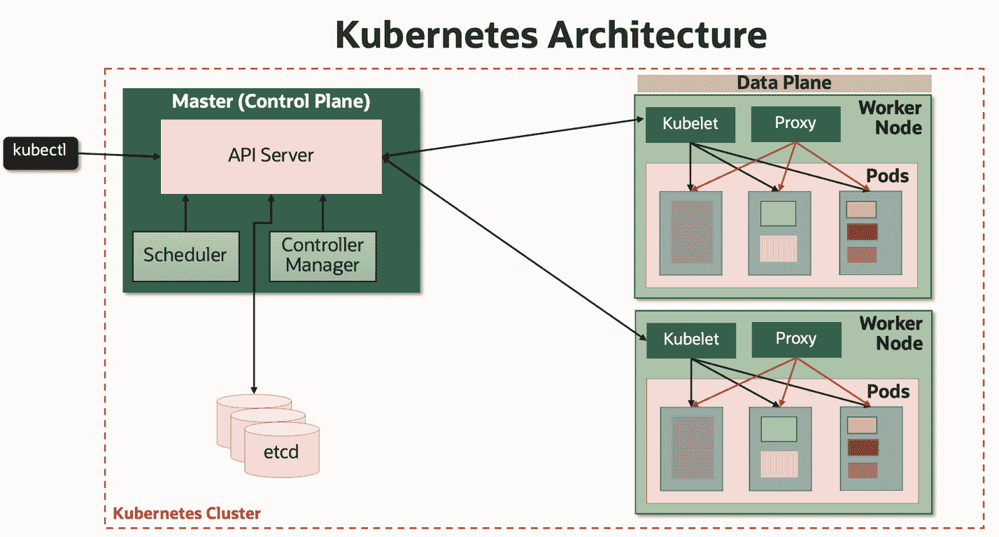
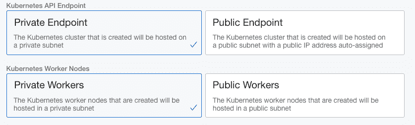
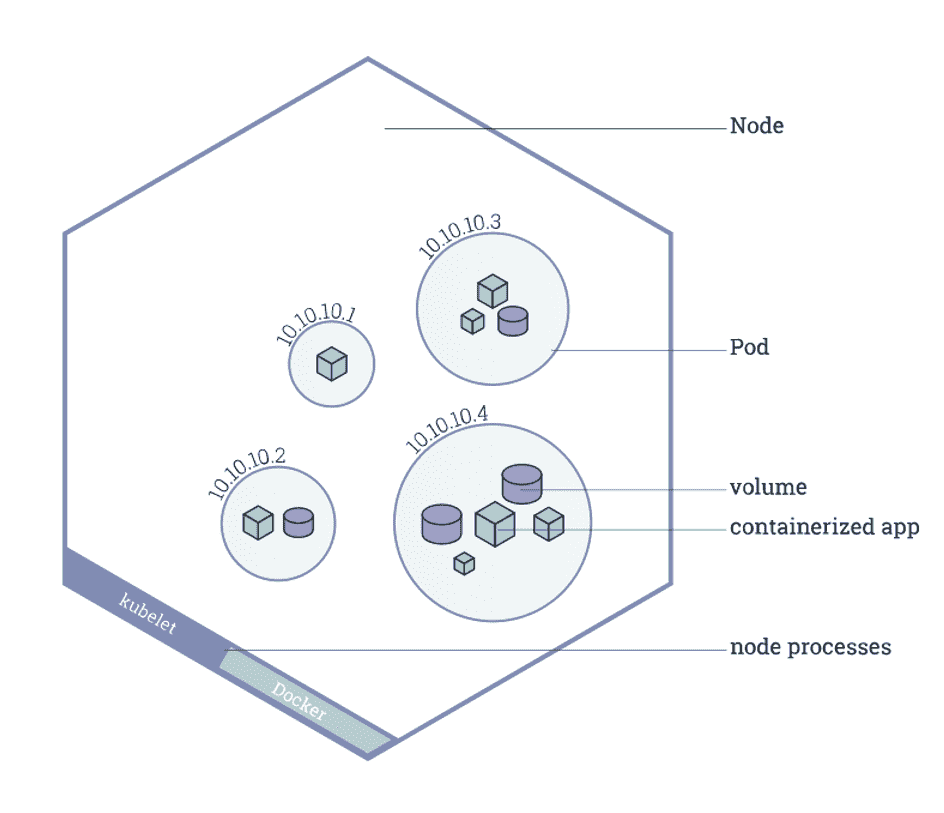

# 6 Kubernetes 安全最佳实践

> 原文：<https://thenewstack.io/6-kubernetes-security-best-practices/>

当然， [Kubernetes](https://www.oracle.com/cloud-native/container-engine-kubernetes/what-is-kubernetes/?source=:ex:pw:::::TNS2&SC=:ex:pw:::::TNS2&pcode=) 给了我们一套很好的核心软件安全原则，但是我们仍然需要理解它们并实现它们。对于像 Kubernetes 集群这样的分布式部署，攻击媒介的数量会增加，因此了解尽可能限制这些攻击面的最佳实践非常重要。

即使使用托管的 Kubernetes 服务，一些安全的所有权仍然落在美国终端用户身上。云供应商通常负责管理和保护 Kubernetes 集群的控制平面(API 服务器、调度程序、etcd、控制器),客户负责保护数据平面(节点池、入口、网络、服务网格等)。)

【T2

大约四年前，我开始在 Kubernetes 上工作，使用了 [minikube local Kubernetes](https://minikube.sigs.k8s.io/docs/start/) 和[Linux vagger project](https://github.com/oracle/vagrant-projects/tree/main/OLCNE)，现在我对更新的云服务更加熟悉了。基于这一经验，这里有六个 Kubernetes 安全最佳实践应该是有帮助的，无论你是使用开源 Kubernetes 还是使用 Oracle、Azure、AWS 或其他云提供商的托管 Kubernetes 服务。

## **1。使用基于角色的访问控制(RBAC)**

 [马尼什·卡普尔

Manish 是甲骨文的产品管理总监，专注于甲骨文的应用开发云平台，包括云原生应用开发(Kubernetes、DevOps 容器注册表、无服务器功能)、低代码开发服务和 Java 服务。](https://www.linkedin.com/in/mkapur/) 

基于角色的访问控制(RBAC)允许客户控制谁可以访问 Kubernetes API 以及他们拥有什么权限。在 Kubernetes 中，RBAC 通常是默认启用的。但是，如果您从非常旧的 Kubernetes 版本升级，并且之前没有启用它，则应该检查 RBAC 设置以确保它们已启用。

另一件要记住的事情是，仅仅支持 RBAC 是不够的。您还应该管理授权策略并正确使用它们。使用 RBAC 将用户和群组限制为仅执行他们可能需要的操作和任务。始终遵循最小特权原则，以确保用户和 Kubernetes 服务帐户拥有所需的最小特权集。确保不要授予集群范围的权限，除非绝对必要，否则不要授予任何人集群管理员权限。更多信息，请参考 RBAC 官方文档。

对于使用云服务创建和管理的 Kubernetes 集群上的操作，供应商可能会提供一个[身份和访问管理](https://docs.cloud.oracle.com/en-us/iaas/Content/Identity/Concepts/overview.htm?source=:ex:pw:::::TNS2&SC=:ex:pw:::::TNS2&pcode=)服务。这里的文档[提供了更多的细节。如果需要多个因素来验证身份，多因素身份验证(MFA)是增强 Kubernetes API 身份验证安全性的另一种选择。](https://docs.cloud.oracle.com/en-us/iaas/Content/ContEng/Concepts/contengaboutaccesscontrol.htm?source=:ex:pw:::::TNS2&SC=:ex:pw:::::TNS2&pcode=)

## **2。秘密应该是秘密**

[机密](https://kubernetes.io/docs/concepts/configuration/secret/)包含敏感数据，如密码、令牌或 SSH 密钥。Kubernetes secrets 有助于安全地初始化带有密钥、密码、令牌等工件的 pod。当一个 pod 启动时，它通常需要访问它的秘密。每当创建一个服务帐户时，就会自动生成一个存储其授权令牌的 Kubernetes secret。Kubernetes 支持静态加密。这将[加密 etcd](https://docs.oracle.com/en-us/iaas/Content/ContEng/Tasks/contengencryptingdata.htm/?source=:ex:pw:::::TNS2&SC=:ex:pw:::::TNS2&pcode=) 中的秘密资源，防止访问您的 etcd 备份和查看这些秘密的内容。

当备份未加密或攻击者获得 etcd 的读取权限时，加密提供了额外的防御级别。确保使用 SSL/TLS 保护用户和 API 服务器之间以及从 API 服务器到 kubelets 的通信，如这里的[所述](https://kubernetes.io/docs/reference/command-line-tools-reference/kubelet-tls-bootstrapping/)。推荐的做法是让机密或凭证具有较短的生命周期，使攻击者更难使用它们。为证书设置较短的生存期并自动轮换是一种好的做法。

另一件要记住的事情是，要注意请求访问 Kubernetes 集群秘密的第三方集成。在这种情况下，请仔细检查请求的 RBAC 权限和访问权限，否则可能会危及群集的安全配置文件。如果您使用的是 [Oracle Kubernetes 引擎](https://www.oracle.com/cloud-native/container-engine-kubernetes/?source=:ex:pw:::::TNS2&SC=:ex:pw:::::TNS2&pcode=)，请参考 Etcd 中的[加密 Kubernetes 静态秘密了解更多信息。](https://docs.cloud.oracle.com/en-us/iaas/Content/ContEng/Tasks/contengencryptingdata.htm?source=:ex:pw:::::TNS2&SC=:ex:pw:::::TNS2&pcode=)

## **3。私有 Kubernetes API 端点**

Kubernetes 集群管理员和操作员可以将集群的 Kubernetes API 端点配置为私有或公共子网的一部分。在私有集群中，控制平面内的 API 服务器(端点)有一个私有 IP 地址，使得无法从公共互联网访问主服务器。除了私有工作节点之外，您应该确保将 Kubernetes API 端点配置为私有端点。如果您需要创建完全私有的集群，不使用或暴露任何公共 IP，并且不允许流量进出公共互联网，这一点非常重要。可以使用安全访问控制列表来控制对集群 API 端点的网络访问，或者使用网络安全设置在粒度级别进行控制。例如，Oracle 的 Kubernetes 引擎为您提供了配置 Kubernetes API 端点和工作节点的选项。

## **4。安全节点和单元**

**节点:**Kubernetes[节点](https://kubernetes.io/docs/concepts/architecture/nodes/)是一个工作节点，它可以是一个虚拟机或物理机，通常在 Linux 操作系统(OS)上运行。运行在节点上的服务包括容器运行时、kubelet 和 kube-proxy。强化和保护节点上运行的操作系统非常重要；这是云提供商和 Kubernetes 管理员的责任。

例如，Oracle Kubernetes 引擎节点带有一个强化的 Linux 映像。Kubernetes 管理员应该定期对运行在这些节点上的 Linux 映像应用安全补丁，或者在客户提供了安全补丁后，使用服务提供商的自动升级功能。对节点使用[互联网安全中心(CIS) Kubernetes 基准](https://www.cisecurity.org/benchmark/kubernetes/)是另一个好的实践。

除了操作系统安全性之外，建议节点位于专用网络上，并且不能从互联网访问。如果需要，可以配置网关来访问集群网络外部的其他服务。节点上的网络端口访问应该通过网络访问列表来控制。还建议限制对节点的安全外壳(SSH)访问。Oracle Kubernetes 引擎节点池安全性[文档](https://docs.cloud.oracle.com/en-us/iaas/Content/Security/Reference/oke_security.htm?source=:ex:pw:::::TNS2&SC=:ex:pw:::::TNS2&pcode=#NodePoolSecurity)提供了更多指导。

**pod:**pod 是一组一个或多个容器，它们在节点上运行，可以使用共享或专用存储。默认情况下，对于哪些节点可以运行 pod 没有限制。使用[网络策略](https://kubernetes.io/docs/concepts/services-networking/network-policies/)定义集群内 pod 的通信规则。网络策略由网络插件实现，使用它们可能需要支持策略的网络驱动程序。例如，Oracle Kubernetes 引擎提供了多种选项来保护集群中工作负载之间的通信。

为了获得最佳的网络安全状态，请结合使用网络策略来保护 pod 级网络通信和安全列表来保护主机级网络通信。Kubernetes [pod 安全上下文](https://kubernetes.io/docs/tasks/configure-pod-container/security-context/)帮助定义 pod 或容器的权限和访问控制设置。检查并利用 pod 和容器清单正在使用的安全上下文设置。 [Pod 安全策略](https://kubernetes.io/docs/concepts/policy/pod-security-policy/)允许客户控制 Pod 的运行时执行属性，例如将容器作为特权容器运行的能力、主机文件系统、网络和端口的使用。默认情况下，可以在集群中的任何节点上安排一个 pod。Kubernetes 提供了多种方法来控制 pod 向节点的分配，例如[策略用于控制 pod 在节点上的放置](https://kubernetes.io/docs/concepts/configuration/assign-pod-node/)和[基于污点的 pod 放置和驱逐](https://kubernetes.io/docs/concepts/configuration/taint-and-toleration/)。如果使用 Oracle Kubernetes 引擎，您可以按照[文档](https://docs.cloud.oracle.com/en-us/iaas/Content/ContEng/Tasks/contengusingpspswithoke.htm?source=:ex:pw:::::TNS2&SC=:ex:pw:::::TNS2&pcode=)中的说明为集群设置 pod 安全策略。

## **5。消除集装箱安全隐患**

应用程序被打包成容器映像，通常是 [Docker](https://www.oracle.com/cloud-native/container-registry/what-is-docker/?source=:ex:pw:::::TNS2&SC=:ex:pw:::::TNS2&pcode=) 映像。容器映像是从容器注册表中存储和提取的，并在 pod 中实例化为运行时容器。在开发过程的一开始，当您在源代码和库上为您的应用程序构建容器映像时，安全性必须是一个设计原则。

在您的 CI/CD 工具链中以及在容器映像的整个构建、存储和部署过程中实施安全实践。这些包括安全地存储容器映像、扫描这些映像的安全漏洞以及管理容器的运行时安全性。作为 DevSecOps 周期的一部分，对您可能用来构建应用程序的第三方库进行自动化漏洞扫描是一个好主意。例如，如果您正在使用 Oracle Kubernetes Engine，您还可以查看 NeuVector、Deepfence、Aqua Security 和 Prisma Cloud Security 等合作伙伴解决方案。作为平台的一部分，您还可以找到本机容器图像扫描、签名和验证功能。

在构建 Docker 映像和容器时，使用强化的瘦操作系统映像，并确保运行应用程序的用户拥有运行容器内进程所需的最低级别的操作系统权限。另一件要记住的重要事情是定期在源映像上应用安全更新，然后将它们作为更新的容器重新部署。同样重要的是，使用私有 Docker 注册中心，如[Oracle Cloud infra structure Registry](https://docs.cloud.oracle.com/en-us/iaas/Content/Registry/Concepts/registryoverview.htm?source=:ex:pw:::::TNS2&SC=:ex:pw:::::TNS2&pcode=)，并配备适当的访问控制和策略，以及用于管理容器映像的治理。建议对容器图像进行签名并维护对容器内容的信任系统。

## **6。审计、记录和监控至关重要**

审计、日志记录和监控是重要的安全方面，可以帮助改善集群的安全状况，不应该被忽视。Kubernetes 审计日志是对 Kubernetes API 服务器的每个调用的详细描述。这些审计日志提供了关于集群中正在发生的事情的有用信息，甚至可以用于审计、合规性和安全性分析。 [Kubernetes audit](https://kubernetes.io/docs/tasks/debug-application-cluster/audit/) 记录包括安全记录，这些记录捕获完整的活动序列，有助于检测异常行为和对敏感资源的访问。

建议启用审核日志记录，并将审核日志保存在安全的存储库中，以便在发生危害时进行分析。Kubernetes 还提供基于集群的[日志记录](https://kubernetes.io/docs/concepts/cluster-administration/logging/)来将容器活动记录到中央日志记录子系统中。Kubernetes 集群中每个容器的标准输出和标准错误输出可以使用在每个节点上运行的代理(如 [Fluentd](https://www.fluentd.org/) )获取到工具(如 [Elasticsearch](https://www.elastic.co/) )中，并使用 Kibana 查看。最后，使用 [Prometheus](https://prometheus.io/) 、 [Grafana](https://grafana.com/) 或 [Jaeger](https://www.jaegertracing.io/) 等工具来监控集群的容器、pod、应用程序、服务和其他组件。

了解这个主题的一个很好的资源是 Liz Rice 和 Michael Hausenblas 的“Kubernetes Security”一书。如果像我一样使用 Oracle Kubernetes 引擎，您可以查看 OCI [安全指南](https://docs.cloud.oracle.com/en-us/iaas/Content/Security/Concepts/security_guide.htm?source=:ex:pw:::::TNS2&SC=:ex:pw:::::TNS2&pcode=)和一些关于[保护 Oracle Kubernetes 引擎](https://docs.cloud.oracle.com/en-us/iaas/Content/Security/Reference/oke_security.htm?source=:ex:pw:::::TNS2&SC=:ex:pw:::::TNS2&pcode=#NetworkSecurity)的附加建议。如上所述，我还利用了 Oracle 云基础架构中的本地身份和认证功能。

不管你部署在哪里，我希望这篇文章能帮助你更清楚地了解你的角色和保护 Kubernetes 的选择。

<svg xmlns:xlink="http://www.w3.org/1999/xlink" viewBox="0 0 68 31" version="1.1"><title>Group</title> <desc>Created with Sketch.</desc></svg>