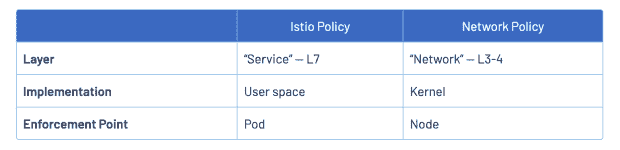

# 6 个被忽视但重要的 Kubernetes 功能需要保护

> 原文：<https://thenewstack.io/6-overlooked-yet-important-kubernetes-features-to-secure/>

如果你曾经和 Kubernetes 一起工作过，你会知道对许多人来说这是一台相当复杂的机器。在所有移动部件、网络以及通常只是启动和正常运行群集之间，这可能需要时间。我所说的“适当”是指安全，包括安全通信、适当的网络隔离、安全机密等。

不幸的是，仅仅启动并运行集群是不够的。Kubernetes 默认是不安全的。它需要进一步的调整，以确保不仅集群安全在一个高水平，而且吊舱和[集装箱](https://thenewstack.io/category/containers/)的安全。

在由 Red Hat 发布的 [2022 年 Kubernetes 安全状况报告](https://www.redhat.com/en/resources/state-kubernetes-security-report)中，300 名[开发人员和安全专家接受了调查，报告称受访者“最担心因其容器和 Kubernetes 环境中的错误配置而导致的暴露(46%)——几乎是对攻击(16%)的担忧水平的三倍，漏洞是第二大担忧原因(28%)获得正确的重要配置，如基于角色的访问控制(RBAC)和安全上下文，对于集群的安全状况至关重要。有许多因素是 DevOps 团队需要整体考虑的，以及在他们自己独特的情况范围内。](https://thenewstack.io/category/devops/)

尽管 DevOps 团队通常会处理集群的设置和维护，但我们也不能忽视应用程序开发人员所扮演的角色，这些开发人员可能不太了解 Kubernetes。一旦集群启动并准备就绪，有时开发人员在容器化和部署应用程序时可能会导致 pod 和容器级别的错误配置。

因此，虽然我们显然无法在这篇文章中涵盖所有配置，但我想介绍一些团队可以从集群部署一开始就制定的初始策略，这些策略将极大地提高他们的安全状况。通过在集群设置后实现这六个解决方案，团队可以显著提高他们的安全性。

## **1。Etcd 安全**

保护 etcd 对于 Kubernetes 的安全至关重要。所有集群数据，包括机密，都保存在这个高度可用的键值存储中。获得 etcd 的读写权限基本上就是获得了通往王国的钥匙。因此，您需要从一开始就为这个重要的后端制定保护计划。应该注意的是，Kubernetes 即服务(EKS、AKS 等)的一个好处是。)就是这个安全措施是为你管理的。

保护您的 etcd 时，需要检查三件事情:

*   **加密静态数据。**默认情况下，etcd 数据不加密。需要为静态加密的 etcd 数据创建 EncryptionConfiguration 对象。还支持这种加密的密钥轮换，并建议与第三方密钥管理服务协作。更多信息可以在[文档](https://kubernetes.io/docs/tasks/administer-cluster/encrypt-data/)中找到。
*   **限制出入。**建议将 etcd 服务器分开并隔离在防火墙后。在那里，应该只允许来自 API 服务器的访问。集群中的其他组件不应该被允许**直接**访问它。
*   **确保 API 服务器正在使用** [**TLS**](https://kubernetes.io/docs/concepts/security/controlling-access/) **。**

## **2。网络策略**

如果集群层在某个点被攻破了呢？我们希望允许尽可能少的横向渗透，对吗？默认情况下，Kubernetes 允许所有点对点通信。允许 pod 之间的所有入站和出站连接。如果攻击者能够访问一个 pod，他们就可以不受阻碍地移动到其他 pod。

为了防止这种情况发生，[网络策略](https://kubernetes.io/docs/concepts/services-networking/network-policies/)应该到位。在网络层和传输层，像 [Weave Net](https://kubernetes.io/docs/tasks/administer-cluster/network-policy-provider/weave-network-policy/) 或 [Kube-router](https://kubernetes.io/docs/tasks/administer-cluster/network-policy-provider/kube-router-network-policy/) 这样的网络插件可以通过名称空间和标签来限制不必要的点对点访问。更好的是，pod 流量可以通过像 [Istio](https://istio.io/latest/about/service-mesh/) 这样的服务网格在应用层进行控制。

图片来自 https://istio.io/latest/blog/2017/0.1-using-network-policy/

举个简单的例子，如果我们有一个有前端、后端和数据库的应用程序，理想情况下，不应该允许前端直接与数据库对话，也不允许数据库与前端对话。相反，应该只允许前端与后端对话，然后后端再与数据库对话。如果攻击者访问前端应用程序，他们将无法不通过后端直接接触数据库，从而使渗透范围变得复杂。

## **3。吊舱对吊舱通信**

除了开放网络，默认情况下，点对点通信是不加密的。这意味着任何能够渗透到集群中的人都可以听到纯文本通信。同样，引入像 Istio 这样的服务网格可以用来在服务之间强制执行[相互 TLS](https://istio.io/latest/docs/tasks/security/authentication/mtls-migration/) ，方法是将其配置设置为严格模式，不允许纯文本。根据您的使用情况，这可以局限于名称空间或整个网格。

## **4。秘密**

应该在最早的阶段制定一个安全的秘密解决方案。然而，事实往往并非如此。事实上，由于建立一个 Kubernetes 集群并让应用程序运行起来的复杂性，秘密管理在许多情况下会被搁置，直到更重要的任务被解决。

问题是，Kubernetes 虽然为我们提供了一个秘密框架，但并不能帮助我们保护它们。默认情况下，它们只是 Base64 编码的，可以很容易地转换为纯文本。当写入 etcd 时，此框架确实支持静态加密机密；当它与适当的 RBAC 限制和严格的 etcd 安全性相结合时，它可以变得更加安全。然而，这对于生产环境来说仍然不理想。

因此，团队越早解决安全秘密管理的“如何”问题，他们的安全性就会变得越好。大多数团队最好使用第三方解决方案，无论是像 AWS Secrets Manager 这样的云解决方案还是像 HashiCorp Vault 这样的开源工具。这些将为重要的 Kubernetes 机密管理提供一个更加健壮和安全的系统。

## **5。吊舱级安全/肮脏的 YAML**

同样的尽职调查也需要在应用程序层面进行。如前所述，有一些有才华的应用程序开发人员在没有很好地掌握 Kubernetes 集群的内部工作原理或理想设置的情况下，将他们的应用程序打包并部署。来自公共回购或公共 Docker 图像的舵图可能包含根级别访问或其他可能削弱安全性的潜在关键配置。

因此，审计进入生态系统的 YAML 配置和容器非常重要。无论是由安全团队手动执行，还是通过漏洞扫描等自动化程度更高的方法来执行，这都有助于在潜在漏洞出现之前将其捕获。

此外，我们应该在 pod 或容器级别使用 Kubernetes 安全上下文来阻止任何以 root 用户身份运行的映像。我们可以用`runAsNonRoot as true`在 YAML 中添加一个安全上下文条目，Kubelet 将拒绝启动任何默认为根用户的映像。当然，退一步说，应该给图像分配一个用户和组 UID，但是如果没有，添加这个安全上下文将会增加另一层防御。还有一些其他的安全内容设置可能对你的情况有用，如这张[备忘单](https://snyk.io/blog/10-kubernetes-security-context-settings-you-should-understand/)所示。

## **6。Kubernetes 访问**

最后，让我们讨论通过 API 服务器的访问本身。任何带着有效证书来到 API 服务器的用户在技术上都被认为是经过身份验证的。鉴于这一事实，这里有一些建议:

*   首先，在大多数情况下，应该通过为 API 服务器设置`--anonymous-auth=false`来禁用匿名认证。应该设置 RBAC 来处理特定的用户。然而，如果必须使用匿名认证，RBAC 应该从整体上大大限制匿名用户的权限。
*   第二，默认情况下，API 服务器监听两个端口:一个是安全的，另一个是不安全的“localhost”端口。您应该通过将 `--insecure-port`标志设置为“0”并确保没有设置`--insecure-bind-address`来禁用不安全端口。这个不安全的端口实际上会绕过身份验证和授权检查，如果有人恶意访问主服务器，您可能不希望出现这种情况。
*   接下来，应建立一个安全且维护良好的 RBAC 系统，并始终处于适当位置。
*   最后，管理员应该考虑使用企业解决方案来管理普通用户帐户，如 Active Directory、Okta 等。，通过 OpenID Connect。

像 [Teleport](https://goteleport.com) 这样的开源应用程序通过单点登录以短期 kubeconfig 文件(和证书)的方式提供对 Kubernetes 集群的安全访问。此外，Teleport 还提供了额外的工具，如内置的 RBAC 系统和 kubectl 事件的审计和会话记录，不仅适用于您的集群，还适用于一个图形用户界面中的数十、数百、数千个集群。可以设置角色和策略，使用户能够轻松、安全地访问集群。事实上，用户永远不会直接访问集群，集群可以孤立地位于私有网络中或防火墙后面。直接交互只与 Teleport 的代理服务。更多信息可在[文档](https://goteleport.com/docs/kubernetes-access/introduction/)中找到。

## **结论**

因此，如果您正在启动一个新的集群或者最近已经这样做了，请记住，默认情况下，它并不是非常安全的。你需要做一些工作来进一步保护它。从一开始就实施上述六个策略来保护 Kubernetes 集群的这些特性，将有助于大大提高集群的安全性和应用程序的整体成功。

<svg xmlns:xlink="http://www.w3.org/1999/xlink" viewBox="0 0 68 31" version="1.1"><title>Group</title> <desc>Created with Sketch.</desc></svg>