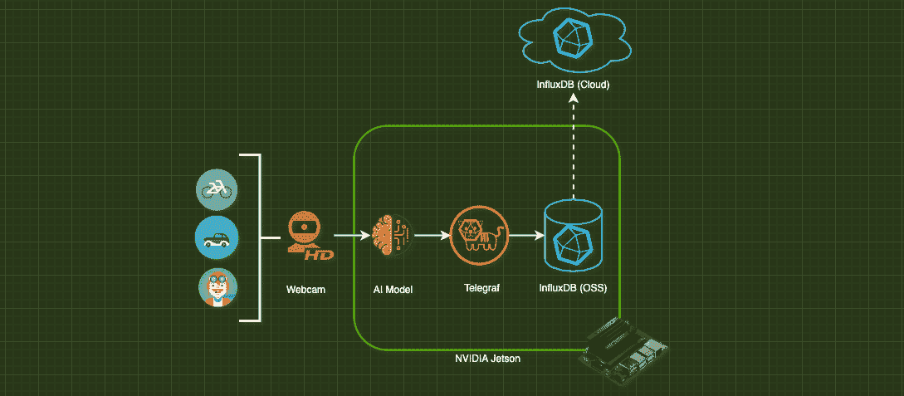
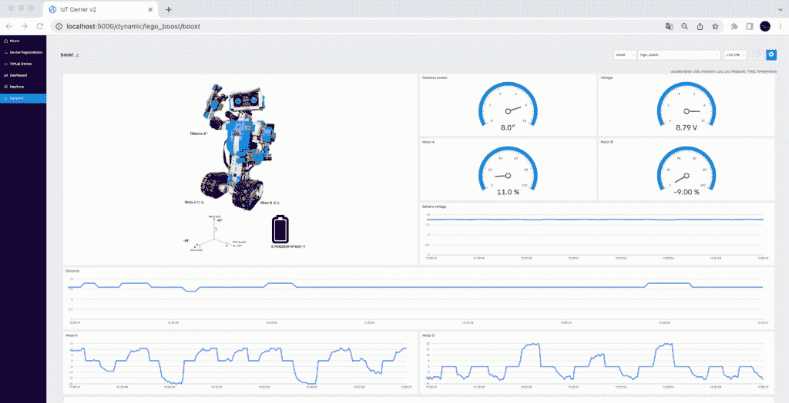

# 物联网入门的 6 个项目创意

> 原文：<https://thenewstack.io/6-project-ideas-to-get-started-with-iot/>

有很多关于物联网概念层面的东西，并没有真正涵盖任何具体的东西。如果你曾经想开始一个真正的物联网项目，但不知道从哪里开始，那么你来对地方了。

本文将介绍规划物联网项目时需要考虑的一些事情，然后展示六个实用的物联网项目，并提供教程和源代码的链接，这样无论您的技术水平如何，都可以轻松开始。

## 物联网项目需要什么？

在开始一个物联网项目之前，你需要确保你已经进行了适当的规划，因为当涉及到硬件时，迭代会变得更加昂贵。让我们看看在规划您的物联网项目时，您需要考虑的主要事项。

### 五金器具

根据项目的范围，硬件可能是最贵的部分，所以如果可以避免的话，你要确保不要花费不必要的费用。有大量的物联网设备可用于爱好项目或原型制作。大体上，它们可以分为微控制器和单板计算机(SBC)两类。

微控制器是在 CPU、RAM 和存储空间方面具有最小资源的小型计算机。它们被编程为执行特定的任务，并且没有完整的操作系统。微控制器的一个常见例子是 [Arduino](https://www.influxdata.com/blog/getting-started-arduino-influxdb/?utm_source=vendor&utm_medium=referral&utm_campaign=2023-03_spnsr-ctn_starting-with-iot_tns) 。

单板计算机是通用计算机，具有足够的资源来运行完整的操作系统，并且可以用于各种各样的用例。SBC 的一个例子是树莓 Pi。

您选择哪种类型的硬件将取决于项目需求。如果你只需要一个低功率的微控制器来执行任务，使用它可能比花钱买一个有你不需要的计算资源的 SBC 更有意义。

### 物联网工具、框架和生态系统

规划物联网项目时要考虑的另一个方面是哪些工具可以节省您的时间并使事情变得更简单。在这一部分，我们将看看你应该研究的几个不同的领域，以决定什么对你的项目有意义。

### **网络协议**

带宽速度和网络可靠性可能是物联网项目面临的主要挑战。如果您知道您的设备将部署在有可靠 WiFi 的地方，这不会是一个重大问题，但对于设备将在现场的项目，您将需要考虑不同的网络协议和互联网连接选项。您选择的通信网络协议会对设备电池寿命、数据可靠性、带宽成本和开发速度等产生重大影响。

以下是一些在不同环境下用于物联网项目的常见网络协议:

*   [MQTT](https://www.influxdata.com/mqtt/?utm_source=vendor&utm_medium=referral&utm_campaign=2023-03_spnsr-ctn_starting-with-iot_tns)
*   洛拉万
*   超文本传送协议
*   物质
*   Zigbee
*   线

### **集成和自动化工具**

物联网最重要的部分之一是“物”的方面，即理论上你可以连接的所有各种设备，并让它们进行通信和协同工作。虽然您可以自己编写所有这些代码，但是有各种各样的框架和活动社区共享代码，因此人们不必重新发明轮子。最流行的两个工具是 Node-RED 和 Home Assistant。

[Node-RED](https://www.influxdata.com/blog/iot-easy-node-red-influxdb/?utm_source=vendor&utm_medium=referral&utm_campaign=2023-03_spnsr-ctn_starting-with-iot_tns) 非常适合任何通用物联网项目。它可以轻松处理几乎任何常见物联网网络协议中的设备发送的消息，然后根据这些消息采取行动。这可以是存储消息、用自定义代码转换消息或将消息发送到另一个设备以执行某项任务。

[家庭助手](https://www.home-assistant.io/)与 Node Red 类似，但具体来说专注于家庭自动化。它有许多特性可以帮助优化这种使用情形。该社区已经完成了超过 1，900 个预构建的集成和自动化。如果你需要更多的权力，你也可以通过家庭助理利用节点红。

### 物联网平台

项目的另一个潜在组件可能是专用的物联网平台或物联网云服务。有许多这样的工具可以使常见的物联网应用功能更容易实施和管理。是否需要使用将取决于项目的规模和您需要的功能。物联网平台提供的一些常见功能包括:

*   设备管理—这允许您轻松地远程更新设备固件和配置设置。
*   分析-物联网平台使您的数据易于流动和分析，通常提供 API 或与其他服务的内置集成。
*   安全性—许多平台都提供认证服务并加密您的数据。
*   网络——物联网平台通常提供某种功能，允许数据从边缘传输到云。

### 数据存储

在许多情况下，您会希望为您的物联网项目生成的数据提供某种持久存储。这些历史数据随后可用于[可视化](https://www.influxdata.com/how-to-visualize-time-series-data/?utm_source=vendor&utm_medium=referral&utm_campaign=2023-03_spnsr-ctn_starting-with-iot_tns)、[分析](https://www.influxdata.com/time-series-analysis-methods/?utm_source=vendor&utm_medium=referral&utm_campaign=2023-03_spnsr-ctn_starting-with-iot_tns)或创建未来趋势的[预测](https://www.influxdata.com/time-series-forecasting-methods/?utm_source=vendor&utm_medium=referral&utm_campaign=2023-03_spnsr-ctn_starting-with-iot_tns)。物联网数据通常是某种形式的[时间序列数据](https://www.influxdata.com/what-is-time-series-data/?utm_source=vendor&utm_medium=referral&utm_campaign=2023-03_spnsr-ctn_starting-with-iot_tns)，在查询这些数据时有一些独特的特征。

虽然根据您将从您的[物联网设备](https://www.influxdata.com/glossary/iot-devices/?utm_source=vendor&utm_medium=referral&utm_campaign=2023-03_spnsr-ctn_starting-with-iot_tns)生成的数据量，[关系数据库](https://www.influxdata.com/blog/relational-databases-vs-time-series-databases/?utm_source=vendor&utm_medium=referral&utm_campaign=2023-03_spnsr-ctn_starting-with-iot_tns)可能是不错的，但它可能值得考虑为存储时间序列数据而优化的替代选项。

存储物联网项目数据的一些常见数据存储选择有:

这是因为它们提供了更好的数据压缩，并且针对通常在时间序列数据上运行的 [OLAP](https://www.influxdata.com/glossary/olap/?utm_source=vendor&utm_medium=referral&utm_campaign=2023-03_spnsr-ctn_starting-with-iot_tns) (在线分析处理)类型的查询进行了优化。结果是更快的查询性能、更少的硬件资源需求和存储数据的成本节约。

## 物联网项目理念和实例

### 家庭自动化

物联网项目的一个常见起点是设置一些基本的家庭自动化。这通常涉及到使用类似树莓派的东西作为连接室内各种智能设备的中枢。一个具体的例子是使用[自动化工具 IFTTT 连接到智能摄像机](https://www.influxdata.com/blog/monitoring-smart-home-influxdb-ifttt/?utm_source=vendor&utm_medium=referral&utm_campaign=2023-03_spnsr-ctn_starting-with-iot_tns)，然后使用 webhook 事件采取自动化操作。

### 人工智能安全摄像机

一个更先进(也更昂贵)的家庭自动化项目将是创造一个[人工智能驱动的安全摄像头](https://www.influxdata.com/blog/nvidia-jetson-series-part-2-vision-ai-pipeline/?utm_source=vendor&utm_medium=referral&utm_campaign=2023-03_spnsr-ctn_starting-with-iot_tns)，它能够在边缘设备本身上进行图像识别。对于这个例子，你需要一个像 Nvidia Jetson 这样的设备，它有一个板载 GPU，可以快速对视频流中的图像进行推理。

一个使用案例是，仅根据安全摄像头上显示的对象类型向您的手机发送警报。其他条件如一天中的时间也可能是一个因素。例如，如果您在商店中安装了摄像头，并且在打烊后检测到有人，则发送警报是有意义的，因为这可能意味着有人闯入。

### 花园监控

监控植物是另一个很好的初学者物联网项目，它将帮助您学习一些基础知识，然后可以扩展到更复杂的项目。[在本例](https://github.com/InfluxCommunity/plant_buddy)中，您可以对微控制器进行编程，从传感器获取数据，以收集关于植物土壤的数据。然后，这个项目可以扩展到使用机械臂或其他设备根据传感器数据自动浇灌植物。

### 空气质量监测器

空气质量会对你的健康和表现产生重大影响，因此一个可以对你的生活产生快速积极影响的简单物联网项目是制造空气质量传感器。[这个例子](https://www.raspberrypi.com/news/monitor-air-quality-with-a-raspberry-pi/)展示了如何使用树莓 Pi 来检测 PM2.5 水平(颗粒物)。你也可以增加额外的传感器来检测二氧化碳。

一旦收集了数据，您就可以定义阈值，并将其与本文中讨论的一些工具集成，以便根据这些级别采取行动。一些潜在的想法:

*   短信
*   根据级别更改智能灯的颜色
*   将警报器直接连接到树莓皮上，以特定的音量发出噪音

### 遥控乐高机器人

[这个项目](https://thenewstack.io/how-to-build-an-interactive-lego-robot-using-python/)使用 Python 通过蓝牙控制一个乐高机器人。代码可以扩展，使机器人做许多不同的事情。在这种情况下，程序根据机器人返回的传感器数据创建实时数据可视化。

### 自动驾驶遥控汽车

通过这个更先进的项目，你可以采用人工智能安全摄像头的一些概念，例如使用 Nvidia Jetson 进行图像识别，并将其与附加硬件相结合，然后可以根据摄像头生成的数据驾驶遥控车。

<svg xmlns:xlink="http://www.w3.org/1999/xlink" viewBox="0 0 68 31" version="1.1"><title>Group</title> <desc>Created with Sketch.</desc></svg>