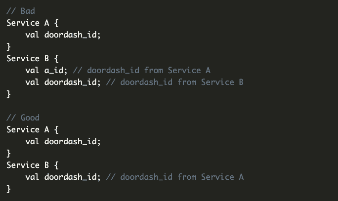

# 你现在应该采用的 6 个拉请求技巧:开门

> 原文：<https://thenewstack.io/6-pull-request-tricks-you-should-adopt-now-doordash/>

编写好的、干净的代码非常重要，但这不是唯一的因素，因为提高拉请求也可以提高团队的产出和效率。在线订餐服务 [DoorDash](https://www.doordash.com/?ignore_splash_experience=true&&utm_source=Google&utm_medium=SEMb&utm_campaign=CX_US_SE_SB_GO_ACQ_17XXXX_11618039194_+BR_ACQ_INMKT_GenDeliveryxx_EVG_CPAx_BMM_Y0425_EN_EN_X_DOOR_GO_SE_TXT_Manhattanx&utm_term=%2Bdoorsash&utm_content=118480942692&kclickid=_k_CjwKCAjwgaeYBhBAEiwAvMgp2mCfqp5NvVhkKQTQ8Ix9mPyiE6j8pMr7H-jDuPmTGBFbOlfDD9TWLxoC9BoQAvD_BwE_k_&utm_adgroup_id=118480942692&utm_creative_id=606766781512&utm_keyword_id=kwd-309133386132&gclid=CjwKCAjwgaeYBhBAEiwAvMgp2mCfqp5NvVhkKQTQ8Ix9mPyiE6j8pMr7H-jDuPmTGBFbOlfDD9TWLxoC9BoQAvD_BwE&gclsrc=aw.ds) 的开发人员遵循六个拉式请求(PR)最佳实践，这有助于改善软件开发生命周期。

[DoorDash 软件工程师 Jenna Kiyasu](https://www.linkedin.com/in/jenna-kiyasu/) 最近在[写了一篇博文](https://doordash.engineering/2022/08/23/6-best-practices-to-manage-pull-request-creation-and-feedback/)，详细介绍了 door dash 的公关最佳实践，以及为什么糟糕的公关会减缓开发周期。

## **拉坏请求滚雪球效应**

总的来说，拉请求是一种提醒开发团队其他成员的方式，让他们知道你已经完成了一个更大项目的一部分代码的工作。“当你派生/克隆一个项目，对代码库进行更改或添加一个功能，或做其他工作，然后准备将你的改进合并回主存储库的主分支时，就会出现拉请求，”Michelle Gienow [在 2019 年的 TNS 中解释道。](https://thenewstack.io/getting-legit-with-git-and-github-your-first-pull-request/)

在最糟糕的情况下，“糟糕的 PRs 会导致‘打勾’式的评审，工程师们甚至懒得看代码就批准了，”Kiyasu 写道。从本质上来说，PR 向代码库添加代码，因此如果 PR 或者包含不遵循最佳实践的代码，或者包含由于大量代码被审查而导致的错误，或者由于 PR 而导致审查过程延迟而导致审查时间过长，这将影响整个代码库。

就对合作的损害而言，不良的 PRs 比良好的 PRs 更有可能导致疏忽的审查。这个巨大的雪球最终减少了团队之间的交流，也减少了没有适当反馈和指导的初级团队成员的技能停滞。

## 如何避免编写错误的拉取请求

从代码开始。确保代码是:

*   很好理解。
*   结构良好，符合风格指南。
*   执行预期的功能。确认测试通过，并且它们通过的原因是正确的。

以下指南有助于 DoorDash 管理自己的 PR 创建和反馈。

### 1.写描述性的和一致的名字

Kiyasu 说“在开始的时候选择好的变量名很重要，这样可以节省时间，防止长期的麻烦。”糟糕的变量和函数命名使得代码更难阅读和理解。如果 PR 被批准，这对 PR 审核者和任何阅读(或添加/修改)代码的人都是正确的。

变量名应该是不言自明的、描述性的和一致的。糟糕的命名虽然看起来无害，但也会导致错误。一旦代码被合并、复制和接受，要更改任何名称都非常困难。

Kiyasu 还强调了关注事物命名的大背景的重要性。

相同的名字，不同的意思。

### 2.创建一个干净的公关标题和描述

公关环境对于理解和回顾公关至关重要。在了解根本问题本身之前，不可能评估问题是否已经解决。最好的方法是在 PR 的顶部提供一个描述性的 PR 标题和高层次的总结。高度概括的一个例子是“特性标志总是关闭的”这为审阅者指明了特征标志的方向。

DoorDash 还建议使用公关模板，例如:

*   问题
*   解决办法
*   影响
*   测试计划

Kiyasu 建议在开始使用 PR 模板时从一个短模板开始，“因为简洁有助于审阅者获得更好的结果。”

### 3.保持 PRs 简短

Kiyasu 说:“长的 PRs 产生长的评审时间，而长的评审时间产生长的 PRs，因为工程师试图让每个 PR 评审更多的代码。”除了更快的审查时间之外，短的 PRs 还导致更少的错误和每行更多的评论，这促进了反馈和协作。

较短的钻杆排放系统的挑战在于规程，因为一旦边缘情况得到解决并且测试通过，较短的钻杆排放系统往往会变得更长。多久算太长也是一个主观问题，取决于公司或项目的最佳实践。一些团队制定了数字指导方针(即少于 400 行代码或少于 10 个文件)，而其他团队将它们分解为逻辑单元，如每个发布者、控制器或数据库层。

### 4.通过直接沟通管理分歧

有些情况下，直接沟通会更好地服务于审核流程。当需要不止一名工程师的批准，而他们又有不同意见时，或者在需要澄清的情况下，直接联系是最好的，这肯定是有帮助的。直接沟通的一些重大积极因素是:

*   反馈可能会更快，并在需要时提供更全面的审查。
*   可能会有更少的误解(尤其是在意见不合的时候)。
*   直接沟通有助于在解决问题的过程中确定优先级和进行单一任务。

### 5.通过尽早获得反馈来避免重写

这是工程师面临的一个常见问题:单干还是寻求帮助。有些问题更值得研究，但有些问题会因为长期走错方向而付出“沉重的代价”。Kiyasu 认为“早期反馈往往更有用。”

DoorDash 提供了一个指南来帮助确定寻求帮助的正确时间:

1.  评估紧急程度——紧急程度越高，越早要求反馈。
2.  确保研究正确的问题——搜索“如何使用复数首字母缩略词”可能会比“PR 的复数形式是什么”产生更好的结果
3.  搜索 Google、代码库和内部资源。
4.  试[调试](https://rubberduckdebugging.com/)橡皮鸭。
5.  求助。

以“草稿模式”创建 PR 是让其他工程师知道你可能需要帮助的另一种方式。一份 PR 草案不会被合并，但是一份关于代码框架或稍微有问题的代码的 PR 可能会征求有用的反馈。

反馈越早，课程修正越早，节省的时间就越多。

### 6.请求其他审核者创建对话

快速合并并不总是等同于更好的代码合并。解决这一问题的一个方法是要求更多的评审员来评审 PR。Kiyasu 说，“如果 PR 中有一个更普遍的编码风格/设计分歧，其他人就有机会参与进来，或者至少意识到这一点。”

让更多的工程师看一份简历可以为合并增加更多的视角，并为初级工程师提供更多的反馈。

## **总之**

除了让代码被评审之外，PRs 将促进反馈，解决分歧，并维护健壮的评审文化。养成写干净的 PRs 的习惯，从长远来看会有回报，即使在经济萧条的时候，也能确保好的实践被遵循。

<svg xmlns:xlink="http://www.w3.org/1999/xlink" viewBox="0 0 68 31" version="1.1"><title>Group</title> <desc>Created with Sketch.</desc></svg>