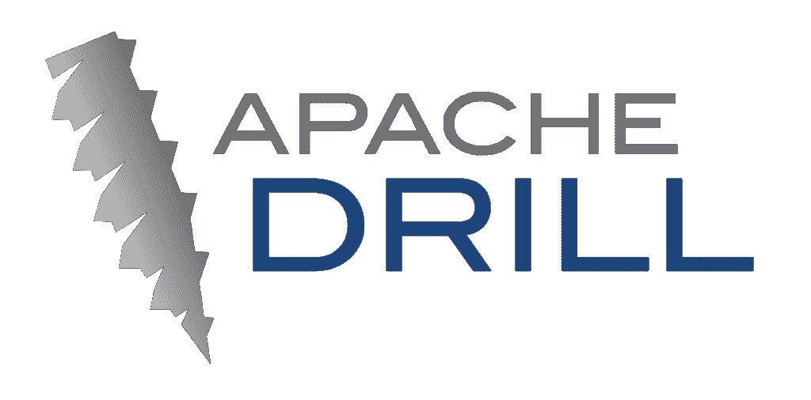
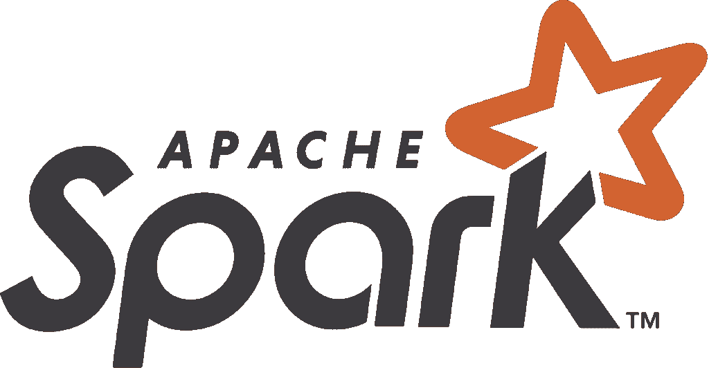

# 选择分析就绪型云数据湖的 6 个问题

> 原文：<https://thenewstack.io/6-questions-for-choosing-an-analytics-ready-cloud-data-lake/>

[Eran vano Nou](https://www.linkedin.com/in/eran-vanounou-983684a)

[Eran vano Nou 是数据湖查询加速领域的创新者 Varada 的 CEO。Eran 在 LivePerson 担任 CTO 后加入 Varada，带来了 20 多年领导大型企业软件组织的经验。](https://www.linkedin.com/in/eran-vanounou-983684a)

根据埃森哲 2021 年关于云趋势的报告，“云不仅仅是一个高效的存储解决方案，它还是一个生成数据和利用这些数据的创新解决方案的独特平台。”数据湖也不例外。鉴于数据湖提供了处理大量复杂数据集的最经济有效的方法，将数据湖迁移到云中是下一个合乎逻辑的步骤。

现代数据湖可以支持高性能查询引擎，允许用户直接访问来自任何来源或格式的原始数据和转换数据。如果您还没有数据湖，那么实现云数据湖应该是您的重点。基于云的解决方案提供弹性可扩展性、敏捷性、高达 40%的总拥有成本降低、运营效率的提高以及快速创新的能力。

然而，为了充分利用您的云数据湖解决方案，您需要确保您的[云数据湖堆栈已做好分析准备](https://varada.io/blog/data-lake/ultimate-data-lake-architecture/)，使您能够将数据转化为战略竞争优势。

以下是为您的企业选择云数据湖堆栈并确保其支持分析时需要考虑的六个关键问题。

## 1.哪个公有云平台？

选择合适的云平台提供商可能是一项艰巨的任务。但是三巨头、AWS、Azure、Google 云平台你都不会错；每个都有自己的大规模可扩展对象存储解决方案、数据湖编排解决方案以及托管 Spark、Presto 和 Hadoop 服务。特别是，AWS Lake Formation 在亚马逊网络服务生态系统的各个部分上提供了一个向导类型的接口，允许组织轻松地构建一个数据湖。Azure Data Lake 是 AWS Lake Formation 的竞争对手，严重依赖 Hadoop 架构。与 AWS 一样，Azure Data Lake 也以其存储容量为中心。同样，Google 云存储是驱动构建在 Google 云平台上的数据湖的后端存储机制。

## 2.哪种云数据湖解决方案具有最佳存储？

就对象存储而言，所有 AWS、Azure 和谷歌都在可用性和价格上竞争，平均而言，Azure 最便宜，谷歌最贵。

AWS S3 存储提供了丰富的功能，是历史最悠久的，许多应用程序都是在其上开发的。它具有高度的可扩展性和可用性，并且可以跨多个可用性区域实现冗余。S3 有三层(标准、IA 和 Glacier)，根据可用性，存储成本较低，读/写成本较高。S3 还有自动对象版本控制，每个版本都是可寻址的，因此可以随时检索。

Azure Blob 存储提供三类存储(热存储、冷存储和归档存储),它们的主要区别在于价格，存储成本较低，但对于不经常或很少访问的数据，会产生额外的读写成本。此外，Azure Blob 存储可以与 Azure Search 集成，允许搜索存储文档的内容，包括 PDF、Word、PowerPoint 和 Excel。虽然 Azure 通过允许用户对 blobs 进行快照来提供某种程度的版本控制，但与 AWS 不同，它不是自动的。

与其他云供应商一样，Google 云存储分为三层(标准、持久、低可用性和近线)。这些层按可用性和访问时间分组(可访问性较低的存储要便宜得多)。和 AWS 一样，Google 支持自动对象版本控制。

## 3.哪种开源查询引擎和数据虚拟化技术？

有许多开源和(商业)工具可供选择。最受欢迎的有:

Presto & Trino (FKA PrestoSQL)最初由脸书创建，是基于 ANSI SQL 构建的分布式查询引擎，可与许多商业智能工具配合使用，能够查询数 Pb 的数据。虽然 Presto 旨在解决大规模数据访问的速度和成本效益，但 Presto 的创始人已经对 [Trino](https://varada.io/blog/presto/trino-presto-data-lake/) 进行了扩展，以适应更广泛的客户和分析用例。为什么 Presto/Trino 是领先的候选人？两者都是用户友好的选项，具有良好的性能、高度的互操作性和强大的社区。它们允许在单个查询中从不同的数据源访问数据，可以组合来自多个源的数据，支持许多数据存储和数据格式，并具有许多连接器，包括 Hive、Phoenix (MR)、Postgres、MySQL、Kafka 等。

Apache Drill 是一个开源的分布式查询引擎，支持数据密集型的分布式应用，用于大规模数据集的交互式分析。Drill 是 Google 的 Dremel 系统的开源版本，它也是一个名为 Google BigQuery 的基础设施服务。Drill 使用 Apache Arrow 进行内存计算，使用方解石进行查询解析和优化——但它从未被广泛采用，主要是因为其固有的性能和并发限制。一些基于 Drill 的产品试图克服这些限制。Drill 与 Presto/Trino 共享许多相同的功能，包括支持许多数据存储、嵌套数据和快速发展的结构。Drill 不需要可能导致数据格式错误的模式定义，而且它的节流功能可能会限制并发查询。

Apache Spark 是一个用于大规模数据处理的开源统一分析引擎。它提供了 Java、Scala、Python 和 R 的高级 API，以及支持通用执行图的优化引擎。使用 Spark SQL 支持 SQL。查询由分布式内存计算引擎在结构化和半结构化数据集上执行。Spark 支持多种数据格式，但其应用更为广泛，支持多种工作负载，如数据转换、ML、批量查询、迭代算法、流等。与 Presto/Trino 或 Drill 相比，Spark 较少采用交互式查询。

## 4.您应该使用云数据湖还是托管解决方案？

借助第三方托管分析服务，企业可以快速开始使用数据分析，并让其提供商处理存储和管理数据的所有麻烦。第三方托管解决方案还允许整个公司的用户快速运行无限制的查询，而不必等待 DevOps 团队分配资源。然而，随着采用和查询量的增长，支出急剧膨胀。

最终，每个托管分析解决方案都变成了管理其数据流的另一个数据孤岛。统一访问控制、审计跟踪、数据沿袭、发现和治理变得复杂，需要定制集成和供应商锁定。这是首席信息官需要了解的“快速启动”托管解决方案的双刃剑，这样他们就可以准备转向更经济的内部托管数据运营计划，以获得长期的成本和控制优势。

## 5.云数据湖分析堆栈:它最适合哪些用例？如何实现结果最大化？

云数据湖分析堆栈显著提高了即席查询、仪表盘和报告的速度。它使您能够操作所有数据，并在低成本数据湖上运行现有 BI 工具，而不会影响性能或数据质量，同时避免添加新数据源和报告时代价高昂的延迟。

请记住，如果您希望服务尽可能多的用例，并将工作负载转移到云数据湖，您将希望避免数据孤岛。相反，请确保您的堆栈具备工作负载可观察性和加速功能，可随时进行分析，以便能够轻松地与特定分析技术集成，例如用于文件夹和日志分析的文本分析。数据团队可以使用集成文本分析的解决方案，直接在数据湖中运行 Pb 级的文本搜索，用于营销、IT 和网络安全用例(以及更多)。

云数据湖分析堆栈可用于广泛的分析用例，但特别是少数几个用例证明可以提供最高水平的 ROI。其中包括:

*   为数据科学家和商业智能数据分析师提供高级分析支持，以调配和试验数据
*   流媒体和物联网数据的近实时分析
*   通过[安全数据湖](https://techcrunch.com/2021/06/04/its-time-for-security-teams-to-embrace-security-data-lakes/)对大量数据进行快速异常和威胁检测，这是传统 SIEM/SOC 平台的一种现代灵活替代方案

## 6.如何实现最佳的查询性能和价格平衡？

根据 [Mordor Intelligence](https://www.mordorintelligence.com/industry-reports/data-lakes-market) 最近的一份报告，数据湖市场在 2020 年的价值为 37.4 亿美元，预计到 2026 年将达到 176.0 亿美元，2021-2026 年预测期的 CAGR 为 29.9%。提高性能和成本效率是这种大规模采用背后的关键驱动力。

随着几乎每个业务部门对分析用例需求的增长，数据团队仍在不断努力平衡性能和成本。不幸的是，手动查询优先级划分和性能优化非常耗时，缺乏可扩展性，并且经常会导致繁重的数据操作。

数据团队和最终用户不再需要为了实现敏捷性、速度和成本效益而牺牲性能。为了有效地做到这一点，数据团队应该利用能够使用大数据索引等高级技术自主加速查询的策略和技术。成功的关键要素是消除数据操作。自主查询加速让用户能够控制云数据湖分析的性能和成本。工作负载级别的可观察性为 DataOps 团队提供了一个开放的视角，让他们可以看到数据在整个组织中的使用情况，并更好地将资源集中在业务优先级上。

在这个方向领导数据团队的首席信息官们可以两全其美。他们会发现，实施这些技术可以在整个组织中广泛扩展数据湖体系结构的同时，带来巨大的变化。

<svg xmlns:xlink="http://www.w3.org/1999/xlink" viewBox="0 0 68 31" version="1.1"><title>Group</title> <desc>Created with Sketch.</desc></svg>