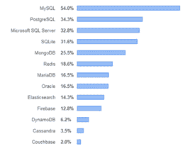
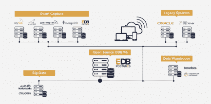

# 关于 Postgres，开发者需要知道的 6 件事

> 原文：<https://thenewstack.io/6-things-for-developers-to-know-about-postgres/>

 [泰勒·格拉汉姆

作为 EnterpriseDB 的现场首席技术官，Taylor 与销售工程师和解决方案架构师合作，帮助客户了解如何使用 EDB Postgres 作为其数字化业务转型的数据库平台。泰勒曾在美国海军陆战队和伊利诺伊州国民警卫队服役。](https://www.enterprisedb.com) 

虽然 PostgreSQL 是部署最频繁的关系数据库管理系统之一，但在过去几年中，它在开发人员中的受欢迎程度急剧上升。

在近 90，000 名开发人员参加的 [Stack Overflow 年度开发人员调查](https://insights.stackoverflow.com/survey/2019/#technology)中，PostgreSQL 是第二大使用最多的数据库技术。

PostgreSQL 的流行有许多因素，首先是其高度活跃的开源社区，与 MongoDB 或 MySQL 等公司主导的开源 DBMS 不同，它不受任何单一赞助商或公司的控制。此外，由于 PostgreSQL 无处不在，如果需要将数据库从内部迁移到云或从云迁移到内部，甚至从一个云平台迁移到另一个云平台，风险就会降低。

PostgreSQL 的特性集在不断扩展，社区在集成之前对每个新特性进行了彻底的测试(为了最高级别的可靠性)。此外，Postgres 是轻量级的(源代码小于 20 MB)，易于安装，并且与庞大的遗留 RDBMs 相比易于移动。它还非常灵活，支持关系和非关系模型，并且可以部署在从裸机到虚拟机、容器和 DBaaS 的各种基础架构上。

现在让我们进入开发者应该知道的关于 Postgres 的六件事。

### 1.无需学习新的 IDE(集成开发环境)

由于支持 80 多种 ide，您现在使用的框架很可能已经与 PostgreSQL 集成在一起了。有 18 个免费软件和 63 个商业 ide 支持 PostgreSQL。这与专有 DBMS 形成了鲜明的对比，在专有 DBMS 中，选项仅限于开发和管理工具。

PostgreSQL GUI 工具的[社区指南](https://wiki.postgresql.org/wiki/Community_Guide_to_PostgreSQL_GUI_Tools)列出了支持 PostgreSQL 的 ide，其中包括 [pgAdmin](https://www.pgadmin.org/) ，一个由 PostgreSQL 社区维护的 GUI，用于在 Linux、Unix、Mac OS X 和 Windows 上开发和管理 PostgreSQL 数据库。另一个是 [DBeaver](https://dbeaver.com/edition/) ，一个多平台数据库工具，支持最流行的 SQL 和 NoSQL 数据库，包括 Postgres。(其社区版免费，企业版有授权费。)

### 2.简单的本地设置和配置

通常，开发人员可以自己处理 Postgres 的设置和配置，DBA 只需要参与大规模的生产使用。

PostgreSQL 最初的设计原则之一是它将与操作系统和存储框架无缝地、可预测地交互。此外，PostgreSQL 可以与标准操作系统备份和监控工具轻松集成。由于这些原因，Postgres 在整个应用程序生命周期——从原型到产品——对开发人员来说是一个很好的使能器。

如果您想完全避免为 PostgreSQL 部署设置和配置本地环境，另一个选择是数据库即服务(DBaaS)模型。所有主要的云提供商都提供 PostgreSQL，例如 Amazon RDS for PostgreSQL、Azure Database for PostgreSQL 和(Google) Cloud SQL for PostgreSQL。也有第三方供应商提供完全托管的 PostgreSQL 云服务，包括我们自己在 AWS 云上的 EDB Postgres 云数据库服务。

### 3.灵活的多模式架构

PostgreSQL 是对象关系 DBMS (ORDBMS)的先驱，支持面向对象的编程。今天，所有领先的 ORM 工具都支持 PostgreSQL。

多模型 ORDBMS 方法对于当今的高级应用程序非常重要，这些应用程序通常必须查询和操作结构化和半结构化数据，这可能需要在单个应用程序中同时实现 SQL 和 NoSQL 数据库。例如，PostgreSQL 内置了对以紧凑的 JSON 二进制格式存储 JSON 对象的支持。

### 4.敏捷和 DevOps 友好

也许 PostgreSQL 对开发人员最大的吸引力之一是它非常适合持续开发、集成和部署过程，并且有助于 DevOps 和敏捷实践。通过使用 Chef、Ansible、Puppet 或任何其他基础设施自动化平台引入基础设施即代码配方，开发人员可以确保在整个应用程序生命周期中基础设施配置的一致性。

此外，PostgreSQL 还完全支持使用容器和微服务，它们是当今使用 Kubernetes 的模块化应用架构的核心。此外，PostgreSQL 作为云服务随时可用的事实与 DevOps 方法的基于云的性质非常吻合。

此外，PostgreSQL 的多模型架构及其对 JSON 和 ORM 的支持意味着系统可以快速原型化，而无需完全设计详细的模式。

最后，PostgreSQL 是高度可移植的，这使得出于开发、测试和登台目的复制实例变得极其容易。例如，开发人员可以在其计算机上的容器中运行 PostgreSQL，并轻松过渡到云中或内部的生产环境。很容易移动 PostgreSQL 数据库，在本地或云中运行它们，或者运行互不干扰的多个版本。

### 5.使用 PostgreSQL 可以做的很酷的事情

在开始真正酷的东西之前，应该注意 PostgreSQL 是高度 ANSI SQL 兼容的，因此已经掌握 SQL 技能的开发人员会感觉在 PostgreSQL 中如鱼得水。

真正酷的东西启动了 PostgreSQL 多模型体系结构(前面讨论过),它为许多非关系 NoSQL 特性提供了内置支持，但没有 NoSQL 的缺点，例如客户端数据分析、缺乏强大的查询语言和优化器，以及数据保留成为管理员的责任。全文搜索功能快速且经过优化，支持模糊匹配、排名、短语搜索和多种语言。

此外，PostgreSQL 具有很强的适应性，有许多插件——其中许多是开源的——扩展了 Postgres 的时间序列数据聚合和图形功能，作为事务图形数据库和空间数据库管理系统。

此外，PostgreSQL 使用外来数据包装器无缝地读写外来数据源，包括 CouchDB、Informix、MongoDB、MySQL、Neo4j、Oracle 和 Redis。使用外来数据包装器，可以使用单个 PostgreSQL 数据库大规模联合各种数据源和格式以及应用程序需求，如下图所示。

### 6-通往生产的平坦道路

PostgreSQL 为在所有流行的部署平台上工作提供了一条顺畅的生产之路，从裸机到虚拟机(内部或 IaaS)、容器和 DBaaS。平台的正确选择将取决于许多因素，包括应用程序的可扩展性和可用性要求、其架构以及组织希望(或需要)直接控制基础设施和流程编排的程度。

根据这次[调查](https://www.datadoghq.com/docker-adoption/)，PostgreSQL 是企业在 Docker 容器上运行的第三受欢迎的技术。容器化的 PostgreSQL 在整个应用生命周期(开发、试运行、生产)中表现一致，非常适合基于微服务的应用架构。它还可以在故障转移情况下提供高可用性，并通过灵活的按需扩展而不是预先过度配置来优化计算存储成本。由于上述原因，以及在内部和云中运行和移动容器的灵活性，我们看到这种与 Kubernetes 结合使用的部署模式越来越受欢迎。

## 摘要

很容易理解为什么 PostgreSQL 仍然越来越受欢迎，为什么开发人员接受 PostgreSQL 在企业数据中心发挥核心作用。PostgreSQL 固有的可靠性、灵活性和可扩展性，以及其活跃的开源社区的支持，确保了它将保持领先地位，随着 DBMS 方法和技术栈的发展而不断更新。

<svg xmlns:xlink="http://www.w3.org/1999/xlink" viewBox="0 0 68 31" version="1.1"><title>Group</title> <desc>Created with Sketch.</desc></svg>