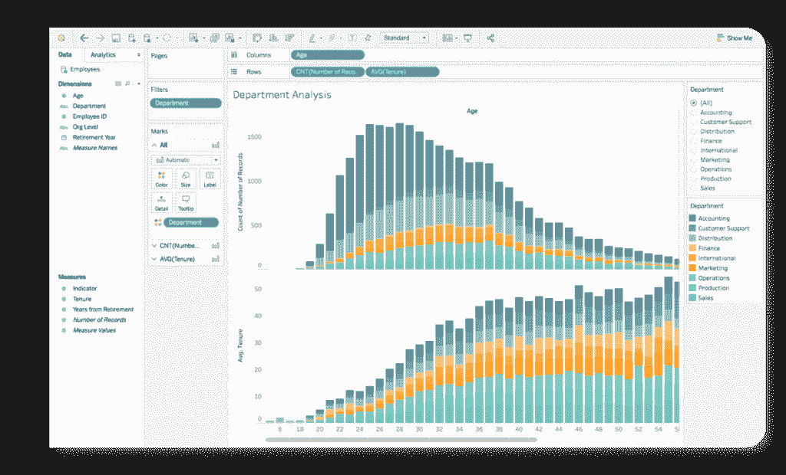
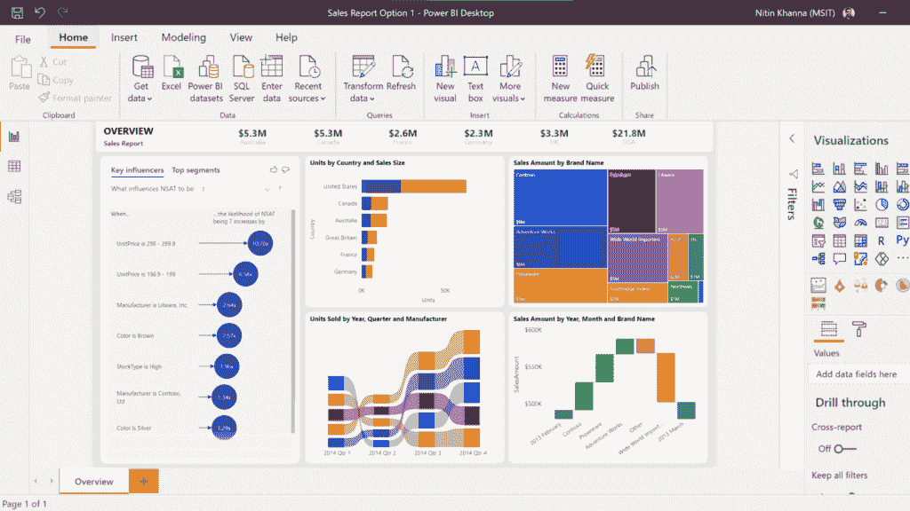
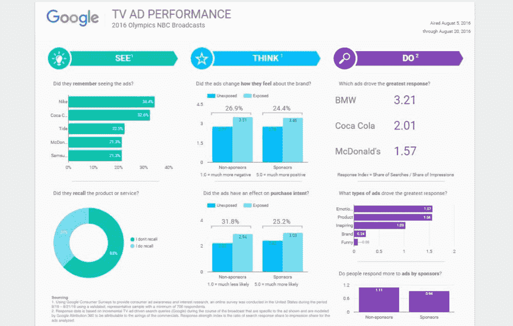
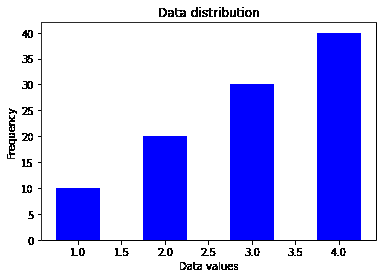
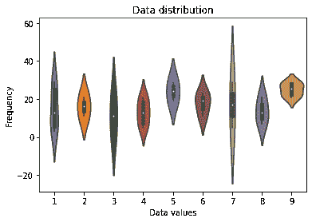
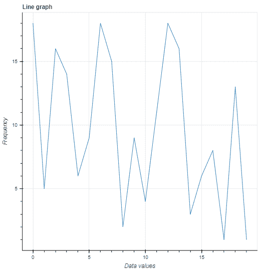
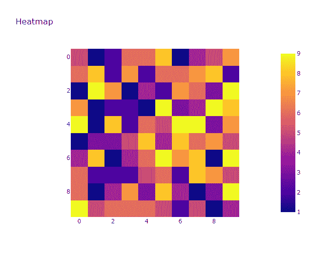

# 数据可视化的 7 个最佳实践

> 原文：<https://thenewstack.io/7-best-practices-for-data-visualization/>

组织定期生成大量对决策至关重要的数据。数据可视化在帮助人们理解复杂数据和观察一段时间内的模式和趋势方面发挥着重要作用。数据可视化是数据专业人员的一项重要技能，通常与讲故事密切相关，旨在有效地交流观察结果并为决策提供信息。

在这篇文章中，我们将讨论什么是数据可视化，可视化的目标，最佳实践，您可以使用的无代码和低代码平台，常见的可视化类型，良好的数据可视化的标准以及如何判断数据可视化。

## 什么是数据可视化？

简而言之，数据可视化是将数据转化为易于理解的视觉效果的过程。这些视觉效果可以是图形、图表、地图、情节、动画等形式。

> 创建数据可视化时，设定目标和目的很重要。

### 数据可视化的主要目标是什么？

创建数据可视化时，设定目标和目的很重要。以下是在构建您自己的数据可视化时需要考虑的一些因素:

*   数据可视化有助于突出数据中的趋势、模式和相关性。
*   数据可视化是一种有效的决策工具，使关键个人能够在数据的支持下做出明智的决策。
*   数据可视化使理解大型数据集和组合来自不同来源的不同数据集变得更加容易。
*   这是一种用讲故事来传达有数据支持的想法的有效方式。
*   数据可视化需要抓住目标受众的注意力，同时易于理解和解释。
*   数据可视化使监控重要指标和关注关键绩效指标(KPI)变得更加容易。

## 数据可视化的最佳实践

这里有一些创建可视化效果时要记住的最佳实践。

### 1.心中有一个目标

在创建数据可视化时，首先要了解你正在处理的数据类型，并对你希望从中获得的洞察力类型有一个概念。记住你想要传达的信息，它的重要性和你要展示给的观众。

### 2.选择正确的可视化工具

设定可视化目标后，考虑合适的工具来帮助您呈现数据。有代码库和无代码/低代码平台，这取决于用例，它们各有所长。

**无代码/低代码平台**

在对如何编码知之甚少甚至一无所知的情况下，您可以创建引人入胜的数据可视化，捕捉您试图传达的信息。这里有几个流行的可视化平台，可以让你创建可视化，仪表板和报告:

*   **Tableau:** Tableau 是一个可视化分析平台，支持用户创建交互式图表、地图和仪表盘。该平台轻松的拖放功能使用户能够快速创建具有各种图表、图形和交互式元素的交互式可视化，同时还使用户能够集成 Python 和 r。



（舞台上由人扮的）静态画面

*   **Power BI:** Power BI 是一个流行的商业智能平台，允许专业人员创建交互式仪表盘、图表和图形，提供广泛的选项和交互式元素，同时对用户友好且直观。



[动力 BI

*   **Looker Studio(原谷歌数据工作室):** Looker Studio 是一个平台，允许用户创建可定制的仪表板和报告。它为用户免费创建专业质量的可视化效果提供了一个有效的选项，并且不需要编写代码。



Looker 工作室

**数据可视化库**

另一方面，根据用例，您可以使用代码来创建数据可视化。对于可视化，你可以构建和使用用 JavaScript、Python 和 r。

**Python**

Python 是一种通用的编程语言，广泛用于数据科学和机器学习。Python 中有几个数据可视化库，您可以根据项目需求选择库。

以下是 Python 中使用最广泛的几个库:

**JavaScript**

JavaScript 是一种流行的编程语言，用于构建 web 应用程序和网站上的交互式元素，并创建数据可视化。下面是一些用于创建可视化效果的流行库:

**R**

r 是一种用于统计计算和可视化的编程语言和软件环境。使用 R，您可以访问几个库和包来创建各种各样的可视化，包括简单的绘图和交互式图形。

以下是一些广泛用于数据可视化的 R 包:

### 3.选择正确的可视化类型

选择正确的可视化类型可以极大地提高清晰度和可读性，并确保您的可视化具有吸引力。使用这些可视化工具时，请确保进行明智的比较，并使用非常适合该数据类型的图表。正确的可视化取决于您的目标、数据类型和受众。

以下是一些图表及其最有用之处:

*   **条形图:**条形图是带有矩形条的图形，用于创建分类数据的视觉效果。它们对于显示分布很有用，并且通常被使用，因为它们是交流信息和比较值的快速方式。
*   **折线图:**折线图用线条连接不同的数据点。当创建一个呈现数据趋势和模式的图表时，它们很有帮助，比如[时间序列数据](https://www.influxdata.com/what-is-time-series-data/?utm_source=vendor&utm_medium=referral&utm_campaign=2023-02_spnsr-ctn_7-best-practice-data-visualization_tns)。一些[的例子](https://www.influxdata.com/how-to-visualize-time-series-data/?utm_source=vendor&utm_medium=referral&utm_campaign=2023-02_spnsr-ctn_7-best-practice-data-visualization_tns)是天气、股票价格、销售等的变化。
*   **散点图:**散点图显示变量之间的关系，在表示变量如何相互影响或识别数据模式时很有帮助。
*   **饼图:**饼图是简单有效的图表，使用圆形图，饼图的每个部分代表数据的相对大小。通过使用多个图表来表示不同的时间段，它们用于显示数量或百分比是如何分布的，或者是如何随时间变化的。
*   **盒图(或盒须图):**盒图是用来表示数据集的最小值、最大值、中值、第一个四分位数和第三个四分位数的图形。它们对于查看数据集的整体形状和指出异常值特别有用。
*   **Violin 图:** Violin 图类似于箱形图，用于可视化数据集的分布。它们可用于显示数据集的最小值、最大值、中值和四分位数，以及使用核密度图的数据分布。您可以使用它们来比较不同组之间的数据分布，或者识别数据中的异常值。
*   **热图:**热图是用来表示数据值的彩色矩阵；较深的颜色用于表示高值，而较冷的颜色表示低值。热图对于识别数据中值得注意的变化以及指出模式和趋势非常有用。

**例题**

让我们使用流行的 Python 库，用代码创建几个数据可视化示例:

*   *   **条形图:**这里，我们将使用*数据值*轴的 **x** 中的值和*频率*轴的 **y** 中的值创建一个条形图。使用 **bar()** 函数用 Matplotlib 创建一个条形图。

```
import matplotlib.pyplot as plt

# Data to plot
x  =  [1,  2,  3,  4]
y  =  [10,  20,  30,  40]

# Create the bar chart
plt.bar(x,  y,  width=0.5,  color='b')

# Add labels and title
plt.xlabel('Data values')
plt.ylabel('Frequency')
plt.title('Data distribution')

# Show the plot
plt.show()

```

您的结果应该是这样的:



*   **violin plots** :让我们使用 Seaborn 来创建一个 Violin plot，其中包含使用 **violinplot()** 函数为 x 和 y 轴生成的值。

    ```
    import seaborn as sns import numpy as np   # Generate data x  =  np.random.randint(1,  10,  size=30) y  =  np.random.randint(1,  30,  size=30)   # Create the violin plot sns.violinplot(x,  y)   # Add labels and title plt.xlabel('Data values') plt.ylabel('Frequency') plt.title('Data distribution')   # Show the plot plt.show() 
    ```

您的结果应该如下所示:



*   **折线图:**让我们使用 **line()** 函数和生成的值创建一个带有散景的折线图。

    ```
    from bokeh.plotting import figure,  show from bokeh.io import output_notebook import numpy as np   # Generate data x  =  np.arange(20) y  =  np.random.randint(1,  20,  size=20)   # Create the line graph p  =  figure(title="Line graph",  x_axis_label="x",  y_axis_label="y") p.line(x,  y)   # Show the plot output_notebook() show(p) 
    ```

您的结果应该如下所示:



*   *   **热图:**使用 Plotly，我们可以使用**热图()**函数和随机值创建一个热图。

```
import plotly.express as px
import numpy as np

# Generate data
data  =  np.random.randint(1,  10,  size=(10,  10))

# Create the heatmap
fig  =  px.imshow(data,  title="Heatmap")
fig.show()

```

你的结果应该是这样的:



你可以在这里了解更多关于数据可视化工具[的信息。](https://www.datacamp.com/blog/12-of-the-best-data-visualizations-tools)

### 4.使用简洁的标签和标题

为你的可视化效果使用标签和标题，并确保它们易于理解，这一点很重要。这些标签应该提供上下文，并告知读者图表试图传达的内容。

对于标题和标签，要记住的其他重要做法是使用易读的字体，确保字体足够大，注意标签的位置，使用易读的颜色。

你还应该避免太多的标签靠在一起，这会造成混乱并影响文本的可读性，并避免不必要的缩写；如果您需要使用缩写，请在报告中注明它们的含义。

### 5.选择正确的颜色

颜色在数据可视化中起着重要的作用，因为它们有助于让您的受众关注仪表板的内容，或者报告并吸引受众对您试图指出的重要信息的注意。

选择配色方案时，你可以选择坚持品牌(例如，使用你公司的品牌颜色)，同时记住你的标题、标签、图表等的可读性。尽量不要使用太多的颜色，确保你的视觉效果吸引人。与此同时，你应该考虑颜色的心理，因为它会影响你的观众的反应。最后，在为你的视觉化选择配色方案时，考虑有视觉障碍的人。

本质上，坚持使用清晰一致的颜色方案。

### 6.避免混乱和不必要的视觉元素

一个好的数据可视化易于理解，引人入胜，整洁有序。在你的视觉化视图中同时进行太多的事情会分散你的观众的注意力，让他们无法从你的作品中获得洞察力。

为了提高可视化的可读性，使用简单的设计，避免不必要的元素。不必要的元素可能是过多的标签、分散注意力的背景图像和图案、不必要的数据点或不相关的网格线。确保你的标题和标签易于阅读和理解，并确保图表和其他部分之间有足够的空间。保持你的设计简单，专注于你想要表达的观点。

> 您需要清理和预处理您的数据，以确保它没有错误和异常。

### 7.使用干净和最新的数据

数据质量对于可视化非常重要。您需要清理和预处理您的数据，以确保它没有错误和异常。这个过程可能包括删除丢失或重复的值、数据标准化等。使用未经清理的数据可能会导致误解或错误的结论——更不用说用它创建有效的可视化是多么困难了。

您不希望使用肮脏或过时的信息来支持组织中的决策。同样重要的是，使用最新的相关数据来确保你的可视化不仅是当前的，而且是准确的。

## 好的数据可视化的标准是什么？

现在我们知道了创建数据可视化的一些最佳实践，下面是创建良好数据可视化的一些标准:

*   一个好的数据可视化以一种容易理解、清晰、简洁和没有混乱的方式显示复杂的数据连接。
*   你的听众可以很快抓住你试图传达的要点。见解应该很容易被你的听众吸收。
*   可视化应该使用正确的视觉元素有效地传达数据中的信息和思想。
*   良好的数据可视化应该考虑各种受众的需求，同时通过使用清晰易读的字体和文本大小来实现可访问性和包容性。使用合适的颜色选择和对比。避免红色和绿色，因为红绿色盲是最常见的。
*   良好的数据可视化简单明了，没有不必要的干扰或元素。
*   良好的数据可视化基于准确、最新和可靠的数据。

## 什么是最好的数据可视化？

最佳的数据可视化能够有效地传达您想要传达的信息。它考虑了所涉及的数据类型，并以一种易于理解和解释的方式呈现数据。它还考虑了设计、可读性和易理解性。

## 如何判断一个好的数据可视化

以下是判断数据可视化是否良好时需要考虑的一些标准:

*   评估可视化的颜色、标签和其他设计元素的使用。
*   文本是否易读易懂，是否提供了足够的信息？
*   它是否有助于你的目标受众理解数据以及如何使用数据？
*   仪表板/可视化的所有内容比例是否准确？
*   视觉化的内容对于有视觉障碍的人来说是否清晰可辨？
*   可视化是否易于理解、整洁和吸引人？
*   可视化中的颜色是否突出了关键图案？

## 结论

数据可视化是观察和跟踪组织中的指标和 KPI 的关键。遵循整合数据可视化的最佳实践将确保您创建的报告易于理解，并在指出模式或异常时有所帮助。你也可以看看这个[关于仪表板设计最佳实践的帖子](https://www.influxdata.com/blog/5-dashboard-design-best-practices/?utm_source=vendor&utm_medium=referral&utm_campaign=2023-02_spnsr-ctn_7-best-practice-data-visualization_tns)。

[InfluxDB](https://www.influxdata.com/products/influxdb/?utm_source=vendor&utm_medium=referral&utm_campaign=2023-02_spnsr-ctn_7-best-practice-data-visualization_tns) 是一个非常棒的平台，可用于可视化您的数据、监控重要指标，并使您能够使用我们直观的仪表盘、查询、任务和其他必要功能来利用您的时间序列数据，从而获得深入的见解和分析。

<svg xmlns:xlink="http://www.w3.org/1999/xlink" viewBox="0 0 68 31" version="1.1"><title>Group</title> <desc>Created with Sketch.</desc></svg>