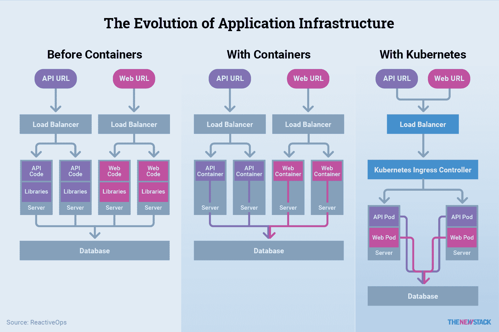

# 使 Kubernetes 成为 CI/CD 理想选择的 7 个特性

> 原文：<https://thenewstack.io/7-features-that-make-kubernetes-ideal-for-ci-cd/>

 [罗布·斯科特

罗布·斯科特在查塔努加的家中工作，是 ReactiveOps 的一名现场可靠性工程师。他帮助为多个客户构建和维护高度可扩展的、基于 Kubernetes 的基础设施。自 2016 年以来，他一直与 Kubernetes 合作，一路为官方文档做出贡献。当他不建设世界一流的基础设施时，Rob 喜欢与家人共度时光，探索户外，并就 Kubernetes 的所有事情发表演讲。](https://www.reactiveops.com/) 

除了改进传统的 DevOps 流程(以及通常被认为是 DevOps 优势的速度、效率和弹性)之外，Kubernetes 还解决了基于容器和微服务的应用程序架构出现的新问题。换句话说，Kubernetes 加强了 DevOps 的目标，同时还支持微服务架构带来的新工作流。

[Kubernetes](https://kubernetes.io/) 是一个强大的下一代开源平台，用于跨主机集群自动部署、扩展和管理应用容器。它可以运行任何工作负载。Kubernetes 提供了卓越的开发者用户体验(UX)，并且创新速度惊人。从一开始，Kubernetes 的基础设施就承诺让组织能够快速大规模部署应用程序，轻松推出新功能，同时只使用所需的资源。借助 Kubernetes，组织可以在自己的 Google Cloud、AWS 或内部环境中运行自己的 Heroku。

在过去的几年中，想想开发团队希望了解运营部署的频率。开发人员和运营团队一直对部署感到紧张，因为维护窗口有扩大的趋势，会导致停机。反过来，运营团队传统上保护他们的领域，因此没有人会干扰他们完成工作的能力。

然后容器化和 Kubernetes 出现了，软件工程师想了解并使用它。这是革命性的。这不是传统的操作模式。它是软件驱动的，非常适合工具化和自动化。Kubernetes 使工程师能够专注于任务驱动的编码，而不是提供桌面支持。同时，它将工程师带入了运营世界，为开发和运营团队提供了一个了解彼此世界的清晰窗口。

以下七个特性使 Kubernetes 成为 DevOps 工程师通过持续集成和持续交付(CI/CD)管道设置和管理其容器化应用程序的理想平台。

[cyclone slider id = " kubernetes-series-book-3-赞助商"]

## 1.强大的构建模块

Kubernetes 使用吊舱作为部署的基本单位。pod 代表一组使用相同存储和网络的一个或多个容器。尽管 pods 通常只用于运行一个容器，但是它们已经以一些创造性的方式被使用，包括作为构建服务网格的一种手段。

单个容器中多个容器的常见使用遵循边车模式。使用这种模式，容器将在核心应用程序旁边运行，以提供一些附加值。这通常用于代理请求，甚至处理身份验证。

有了这些强大的构件，将容器化之前可能在虚拟机中运行的服务映射到在同一个 pod 中运行的多个容器变得非常简单。

有了 Kubernetes，pods 分布在服务器上，内置了负载平衡和路由。以这种方式分配应用程序工作负载可以显著提高资源利用率。

## 2.简化的服务发现

在一个单一的应用程序中，不同的服务都有自己的目的，但是自包含有助于通信。在微服务架构中，微服务需要相互对话——您的用户服务需要与您的发布服务和地址服务等对话。弄清楚这些服务如何简单而一致地进行通信并不容易。

使用 Kubernetes，DevOps 工程师定义一个服务——例如，一个用户服务。在相同的 Kubernetes 命名空间中运行的任何东西都可以向该服务发送请求，Kubernetes 会计算出如何为您路由请求，从而使微服务更容易管理。

## 3.集中、易读的配置

Kubernetes 运行于一个声明性模型:你描述一个期望的状态，Kubernetes 将试图达到那个状态。Kubernetes 有易于阅读的 YAML 文件用来描述你想要达到的状态。使用 Kubernetes YAML 配置，您可以定义从应用程序负载平衡器到一组 pods 的任何东西来运行您的应用程序。一个部署配置可能有一个应用程序 Docker 容器的三个副本和两个不同的环境变量。这种易于阅读的配置可能存储在 Git 存储库中，因此您可以随时看到配置的变化。在 Kubernetes 之前，很难知道跨服务器的互联系统到底发生了什么。

除了配置集群中运行的应用程序容器或可用于访问它们的端点之外，Kubernetes 还可以帮助进行配置管理。Kubernetes 有一个名为 ConfigMap 的概念，您可以在其中为您的应用程序定义环境变量和配置文件。类似地，称为秘密的对象包含敏感信息，并有助于定义应用程序将如何运行。机密的工作方式非常类似于配置图，但是更加模糊，最终用户更难看到。第 2 章详细探讨了所有这些。

## 4.真实的实时来源

手动和脚本发布过去压力非常大。你只有一次机会做对。借助 Kubernetes 的内置部署功能，任何人都可以使用 Kubernetes 的无限部署历史:kubectl 部署历史来部署和检查交付状态。

Kubernetes API 提供了关于部署状态的实时信息来源。任何能够访问集群的开发人员都可以很快发现交付过程中发生了什么，或者看到发出的所有命令。出于安全和历史目的，这个永久的系统审计日志保存在一个地方。您可以轻松了解以前的部署，查看部署之间的差异或回滚到任何列出的版本。

## 5.简单的健康检查功能

这在应用程序的生命周期中是一件大事，尤其是在部署阶段。过去，如果应用程序崩溃了，它们通常不会自动重启；相反，有人在半夜收到传呼，不得不重启它们。另一方面，Kubernetes 具有自动健康检查功能，如果某个应用程序由于任何原因没有响应，包括内存耗尽或锁定，Kubernetes 会自动重新启动它。

为了澄清，Kubernetes 检查您的应用程序是否正在运行，但是它不知道如何检查它是否正确运行。然而，Kubernetes 简化了为应用程序设置健康检查的过程。您可以通过两种方式检查应用程序的健康状况:

1.  **使用活性探测器**检查应用程序是否从健康状态进入不健康状态。如果它完成了转换，它将尝试为您重新启动应用程序。
2.  **使用准备就绪探测器**来检查应用程序是否准备好接受流量，在新的容器健康之前，不会清除先前工作的容器。基本上，准备就绪探测器是防止破损容器暴露的最后一道防线。

这两种探针都是有用的工具，Kubernetes 使它们易于配置。

此外，如果您有一个正确配置的就绪探测器，回滚是很少发生的。如果所有的运行状况检查都失败了，那么一个简单的命令行命令将为您回滚该部署，并使您返回到稳定状态。不常用，但有需要就有。

## 6.滚动更新和本机回滚

为了进一步构建实时的真实数据源和健康检查功能，Kubernetes 的另一个关键特性是使用前面提到的本机回滚来滚动更新。部署可以而且应该是频繁的，而不用担心会走上不归路。在 Kubernetes 之前，如果您想部署某个东西，一个常见的部署模式涉及到服务器获取最新的应用程序代码并重新启动您的应用程序。这个过程是有风险的，因为有些功能不是向后兼容的——如果在部署过程中出现问题，软件将变得不可用。例如，如果服务器发现了新代码，它将获取这些更新，并尝试使用新代码重新启动应用程序。如果管道中出现故障，应用程序很可能会死亡。回滚过程一点也不简单。

在 Kubernetes 之前，这些工作流程都是有问题的。Kubernetes 通过部署回滚功能解决了这一问题，该功能消除了大型维护窗口和对停机时间的担忧。从 Kubernetes 1.2 开始，部署对象是一个声明性的清单，它包含了正在交付的所有内容，包括正在部署的副本的数量和软件映像的版本。这些项目被抽象并包含在部署声明中。这种基于清单的部署激发了新的 CD 工作流，并且是 Kubernetes 的一种不断发展的最佳实践。

在 Kubernetes 关闭现有的应用程序容器之前，它将开始创建新的容器。只有当新版本正常运行时，它才能摆脱旧的稳定版本。假设 Kubernetes 没有捕捉到失败的部署——应用程序正在运行，但它处于某种错误状态，Kubernetes 没有检测到。在这种情况下，DevOps 工程师可以使用一个简单的 Kubernetes 命令来撤销该部署。此外，您可以将其配置为存储两个更改或任意多个修订，并且可以返回到最后一次部署或更早的多次部署，所有这一切都通过一个自动化的、简单的 Kubernetes 命令来完成。这整个概念改变了游戏规则。其他编排框架无法像 Kubernetes 那样无缝、逻辑地处理这个过程。

## 7.简化监控

虽然从表面上看，监控 Kubernetes 似乎很复杂，但这个领域已经有了很大的发展。尽管 Kubernetes 和 containers 增加了基础设施的复杂性，但它们也确保了所有应用程序都在一致的 pods 和部署中运行。这种一致性使得监控工具在许多方面更加简单。

Prometheus 是开源监控工具的一个例子，它在云原生生态系统中非常流行。该工具提供了高级监控和警报功能，并与 Kubernetes 进行了出色的集成。

在监控 Kubernetes 时，有几个关键组件需要注意:Kubernetes 节点(服务器)；Kubernetes 系统部署，如 DNS 或网络；当然，还有您的应用程序本身。有许多监控工具可以简化对这些组件的监控。

*参见:*

[DevOps、微服务、Kubernetes:云原生方法](https://thenewstack.io/devops-microservices-kubernetes-a-cloud-native-approach/)

<svg xmlns:xlink="http://www.w3.org/1999/xlink" viewBox="0 0 68 31" version="1.1"><title>Group</title> <desc>Created with Sketch.</desc></svg>