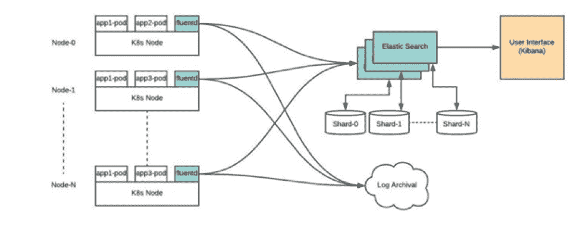

# Kubernetes 在生产中的 7 个关键考虑因素

> 原文：<https://thenewstack.io/7-key-considerations-for-kubernetes-in-production/>

瓦姆西·切米蒂甘蒂

瓦姆西·切米蒂甘蒂是 Platform9 Systems 公司的首席策略师。Vamsi 与 Platform9 的客户 cxo 和架构师合作，帮助他们实施关键的业务转型计划。他拥有马里兰大学帕克分校的计算机科学和工程学士学位以及 MBA 学位。

如今，企业 IT 不再质疑容器化应用程序的价值。考虑到采用 DevOps 和云原生架构的趋势，利用容器功能以实现数字化转型至关重要。Google 的 Kubernetes (K8s)是一个开源容器编排系统，已经成为云原生应用程序以及它们的架构、组合、部署和管理方式的事实上的标准和关键推动者。企业正在使用 Kubernetes 创建由微服务和无缝扩展的无服务器功能组成的现代架构。

然而，两年来与 Kubernetes 在企业应用程序和大规模生产部署方面的合作，让我们学到了宝贵的现实经验，了解了 Kubernetes 在企业中面临的挑战，以及真正需要做些什么才能让 Kubernetes 做好准备，让组织能够安全地依靠 Kubernetes 来支持任务关键型企业应用程序。由于运营或第二天管理方面的挑战，已经投资了基于容器的应用程序的大型复杂企业通常很难实现 Kubernetes 和容器技术的价值。在本帖中，我们分享了大型企业围绕其 Kubernetes 投资所需的七项基本能力，以便能够有效地实施并利用它来推动其业务。

## 介绍

 [彼得·弗雷

彼得·弗雷是 9 号平台的首席技术专家。凭借独特的技术经验组合(来自 IaaS、网络、Kubernetes、数据库等)，他帮助大型企业成功采用云、容器和现代技术来加快应用交付并提高数据中心利用率。](https://platform9.com/) 

通常，当开发人员开始试验 Kubernetes 时，他们最终会在一组服务器上部署 Kubernetes。这只是概念验证(POC)部署，我们看到的是，这种基本部署不能用于长期应用程序的生产，因为它缺少确保基于 Kubernetes 的任务关键型应用程序顺利运行的关键组件。虽然部署本地 Kubernetes 环境可能是一个简单的过程，只需几天就能完成，但企业级部署却是另一个挑战。

一个完整的 Kubernetes 基础设施需要适当的 DNS、负载平衡、入口和 K8 基于角色的访问控制(RBAC)，以及一系列额外的组件，这使得部署过程对 IT 部门来说非常艰巨。一旦部署了 Kubernetes，就会增加监控和所有相关的操作手册，以便在出现问题时进行修复，例如在容量耗尽时，确保高可用性、备份等。最后，每当社区发布了新版本的 Kubernetes，并且您的生产集群需要在没有任何应用程序停机风险的情况下升级时，这个循环就会再次重复。

对于现实世界的生产应用程序来说，基本的 Kubernetes 是远远不够的。以下是围绕基本 Kubernetes 需要的七项关键服务，以支持任务关键型生产应用:

### 排名第一的托管 Kubernetes 服务可确保 SLA 并简化操作

虽然对一些人来说这可能有争议，但我宁愿从最关键的一点开始，直奔主题:对于生产、任务关键型应用程序，不要落入 Kubernetes 的 DIY 陷阱。

是的:Kubernetes 很牛逼。容器是现代软件交付的未来，Kubernetes 是编排容器的最佳——事实上的标准。但是众所周知，企业工作负载的管理非常复杂，其中 SLA 至关重要。

在高层次上，Kubernetes 控制着组成应用程序的容器组(pod)的调度、部署和扩展方式，以及它们如何利用网络和底层存储。一旦您部署了 Kubernetes 集群，IT 运营团队必须弄清楚这些 pod 如何通过请求路由暴露给消费应用程序，它们如何确保这些 pod 的健康、高可用性、零停机环境升级等等。随着集群的增长，IT 需要让开发人员能够在几秒钟内加入，实现监控、故障排除，并确保平稳运行。

我们发现客户面临的最大挑战是 Kubernetes 的第 2 天运营。

一旦您完成了第一次安装，就会出现各种问题:

1.  大规模配置持久存储和网络
2.  及时了解 Kubernetes 社区的最新动态
3.  为应用程序和底层 Kubernetes 版本打补丁，以确保安全性和定期更新
4.  设置和维护监控和日志记录
5.  Kubernetes 主服务器的灾难恢复
6.  还有更多。

管理生产级 Kubernetes 的运营难题因全行业人才匮乏和技能差距而加剧。如今，大多数组织都很难聘请到广受欢迎的 Kubernetes 专家，而且他们自己也缺乏先进的 Kubernetes 经验来确保大规模顺利运营。

托管 Kubernetes 服务本质上提供了企业级 Kubernetes，没有运营负担。这些服务可以是由公共云提供商(如 AWS 或 Google Cloud)独家提供的服务，也可以是使组织能够在自己的数据中心或混合/多云环境中运行 Kubernetes 的解决方案。

即使是托管服务，您也需要注意不同类型的解决方案会使用“托管”或“Kubernetes 即服务”来描述非常不同的管理体验级别。有些只允许您以简单的自助式方式部署 Kubernetes 集群，而有些则接管一些管理该集群的日常操作，而有些则仍然提供完全托管的服务，为您完成所有繁重的工作，[提供服务级别协议保证](https://platform9.com/managed-kubernetes/)，并且不需要客户提供任何管理开销或 Kubernetes 专业知识。

例如，借助[平台 9 托管服务](https://platform9.com/managed-kubernetes/)，您可以在不到一小时的时间内启动并运行适用于任何环境的企业级 Kubernetes。该服务通过将 Kubernetes 作为完全托管的服务来提供，消除了 Kubernetes 的大规模运营复杂性，包括所有现成的企业级功能:零接触升级、多集群操作、高可用性、监控等，所有这些都是自动处理的，并由 24x7x365 SLA 提供支持。

Kubernetes 将是你的软件创新的支柱。不要用 DIY 方法扰乱或危及您的业务，而是从一开始就选择正确的托管服务，为您的成功做好准备。

### #2 集群监控和日志记录

Kubernetes 的生产部署通常会扩展到数百个单元，缺乏有效的监控和记录会导致无法诊断严重故障，从而导致服务中断并影响客户满意度和业务。

监控提供了 Kubernetes 基础设施的可见性和详细指标。这包括所有云提供商或私有数据中心、区域、服务器、网络、存储和单个虚拟机或容器的使用和性能的粒度指标。这些指标的一个关键用途应该是在本地和公共云资源上提高数据中心的效率和利用率(这显然转化为成本)。

日志记录是有效监控的补充和必需功能。日志记录确保了体系结构每一层的日志 Kubernetes 基础设施及其组件以及应用程序都被捕获，以便进行分析、故障排除和诊断。集中式、分布式日志管理和可视化是一项关键功能，可以使用专有工具或开源工具来实现，如 FluentBit、Fluentd、Elasticsearch 和 Kibana(也称为 [EFK 堆栈](https://platform9.com/blog/kubernetes-logging-and-monitoring-the-elasticsearch-fluentd-and-kibana-efk-stack-part-1-fluentd-architecture-and-configuration/))。

监控不仅应该是全天候的，还应该针对生产中可能出现的瓶颈或问题提供主动警报，以及基于角色的仪表板，其中包含有关性能、容量管理等方面的 KPI。

Kubernetes 日志记录和监控堆栈—架构

### #3 注册和软件包管理— Helm/Terraform

私有注册服务器是一个重要的功能，因为它可以安全地存储 Docker 图像。注册表支持图像管理工作流，具有图像签名、安全性、LDAP 集成等功能。包管理器，比如 Helm，提供了一个模板(在 Helm 中称为“图表”)来定义、安装和升级基于 Kubernetes 的应用程序。

一旦开发人员成功地构建了他们的代码，理想情况下，他们会使用注册表重新生成 Docker 映像，最终使用 Helm chart 将其部署到一组目标 pod。

这简化了基于 Kubernetes 的应用程序的 CI/CD 管道和发布过程。开发人员可以更轻松地协作处理他们的应用程序、版本代码更改、确保部署和配置的一致性、确保合规性和安全性，并在需要时回滚到以前的版本。私有注册和包管理确保了正确的映像被部署到正确的容器中，并且安全性也被集成到该过程中。

### 面向开发运维的#4 CI/CD 工具链

启用 CI/CD 管道对于提高基于 Kubernetes 的应用程序的质量、安全性和发布速度至关重要。如今，持续集成管道(如单元测试、集成测试等。)和连续交付管道(例如从开发环境一直到生产环境的部署流程)——都是使用 GitOps 方法和工具配置的。开发人员的工作流程通常从“git 推送”开始——每次代码签入通常都会触发构建、测试和部署流程。这包括使用 Spinnaker 或其他工具进行自动蓝/绿或淡黄色部署。重要的是，您的 Kubernetes 基础设施可以方便地“插入”到这些 CI/CD 工具中，以支持您的开发人员并提高他们的生产力和发布的质量。

### #5 集群配置和负载平衡

生产级 Kubernetes 基础架构通常需要创建高可用性、多主控、多 etcd Kubernetes 集群，这些集群可以跨越您的私有或公共云环境中的可用性区域。这些集群的供应通常涉及 Ansible 或 Terraform 等工具。

一旦设置了集群并为正在运行的应用程序创建了 pod，这些 pod 就由负载平衡器处理，负载平衡器将流量路由到服务。负载平衡器不是开源 Kubernetes 项目中的一项固有功能，因此您需要与 NGINX Ingress controller、HAProxy 或 ELB(在 AWS VPC 上)或其他扩展 Kubernetes 中 Ingress 插件的工具集成，以提供负载平衡。

### #6 安全性

不言而喻，安全性是云原生应用的关键部分，需要从一开始就考虑和设计。安全性贯穿于容器的整个生命周期，它影响着基于容器的应用程序的设计、开发、开发操作和基础设施选择。有一系列技术可供选择，涵盖了应用程序级安全性以及容器和基础设施本身的安全性等各个领域。其中包括使用基于角色的访问控制、多因素身份验证(MFA)、使用 OAuth、OpenID、SSO 等协议的 A&A(身份验证和授权)。；不同的工具为容器本身内部的内容(如图像注册、图像签名、打包)、CVE 扫描等提供认证和安全性。

### #7 治理

围绕治理、审计和合规性的流程是 Kubernetes 日益成熟的标志，也是基于 Kubernetes 的应用在大型企业和受监管行业中日益普及的标志。您的 Kubernetes 基础架构和相关的发布流程需要与工具集成，以便针对 Kubernetes 应用程序或基础架构的任何更新的不同任务和权限级别，实现可见性和自动审计跟踪，从而实现正确的合规性实施。

总之，为企业、关键任务应用启用 Kubernetes 需要的不仅仅是部署一个 Kubernetes 集群。以上关键考虑因素将有助于您确保 Kubernetes 基础设施的设计适合现在和未来的生产工作负载。

<svg xmlns:xlink="http://www.w3.org/1999/xlink" viewBox="0 0 68 31" version="1.1"><title>Group</title> <desc>Created with Sketch.</desc></svg>