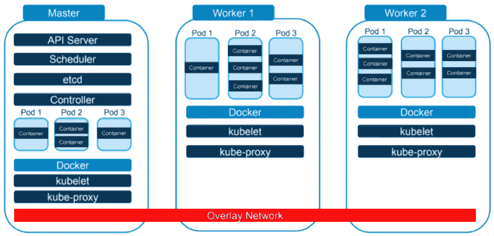
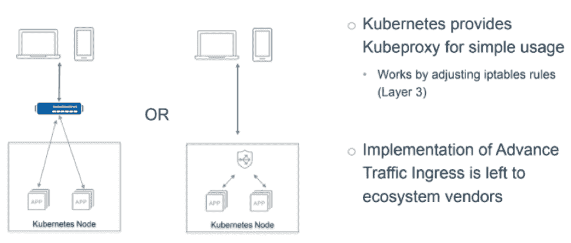
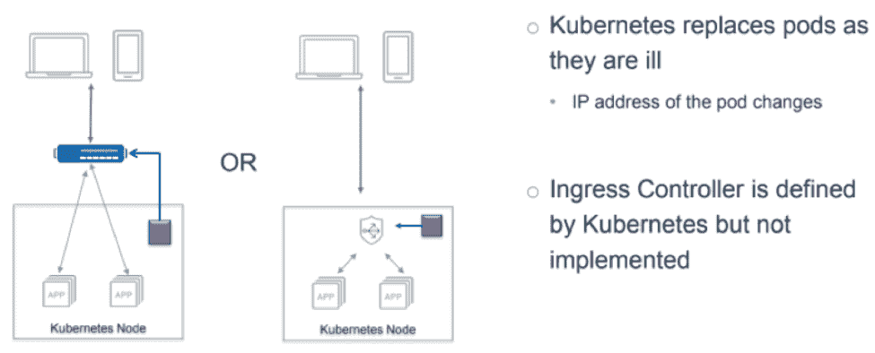
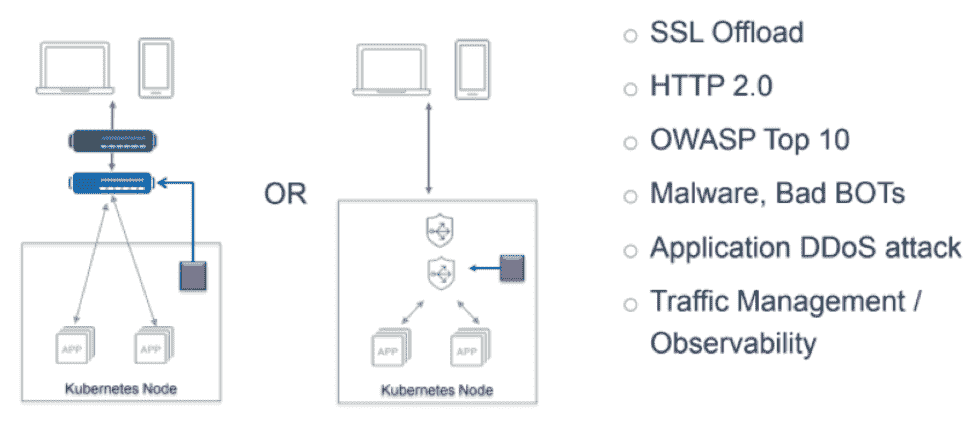
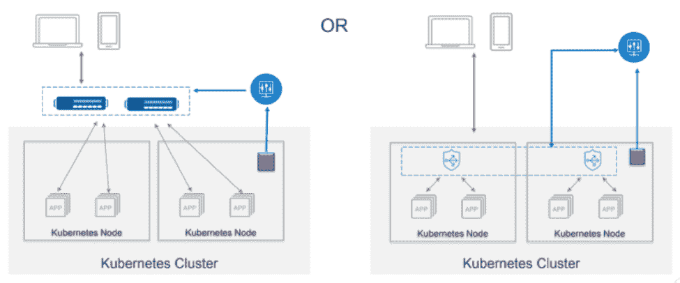
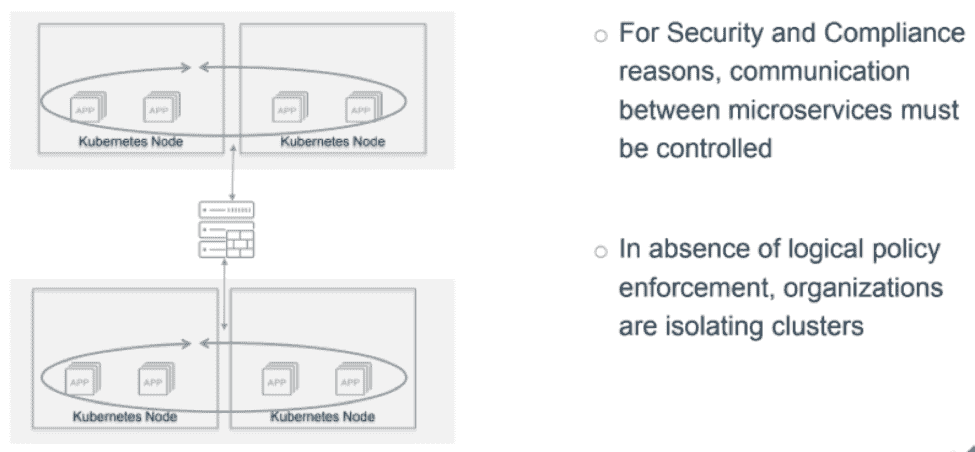
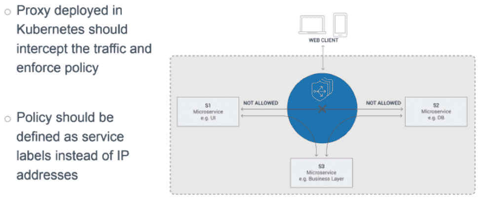
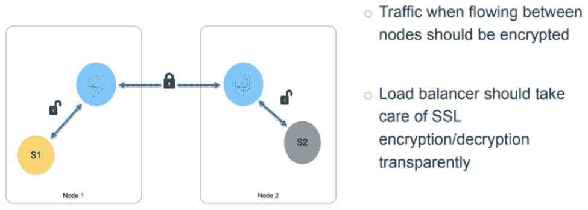
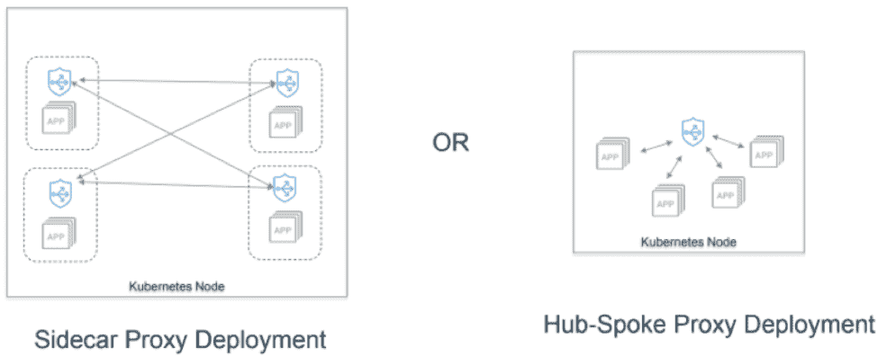
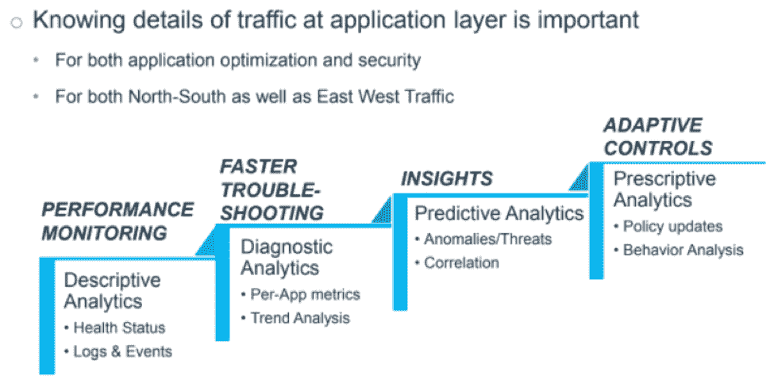

# 7 优化 Kubernetes 交通流量和安全性的要求

> 原文：<https://thenewstack.io/7-requirements-for-optimized-traffic-flow-and-security-in-kubernetes/>

 [阿尔马斯·拉扎

阿尔马斯·拉扎是 A10 网络公司的高级技术营销工程师。在加入 A10 Networks 之前，Raza 曾供职于多家企业安全公司，包括赛门铁克、Bluecoat 和 Juniper 等。她拥有超过 17 年的企业安全和网络经验，专攻企业和云安全。Raza 是一位多种安全技术和产品的成功演讲者、作家和培训师。](https://www.linkedin.com/in/almas-raza-b90141/) 

根据 Portworx 的 [2018 调查，现在五分之四的企业在运行容器，83%的企业在生产中运行容器。鉴于 2017 年只有 67%的人这样做，很明显容器不仅仅是一种时尚。](https://portworx.com/wp-content/uploads/2018/12/Portworx-Container-Adoption-Survey-Report-2018.pdf)

然而，随着容器的重新流行，一些公司正在努力在 Kubernetes(最流行的容器编排平台之一)中建立高效的流量流并有效地实施安全策略。

作为容器编排者和集群管理者，Kubernetes 专注于提供出色的基础设施，并因此被无数公司采用。它刚刚过了五周年，最近的一篇福布斯文章称 Kubernetes 为“我们这个时代最受欢迎的开源项目”，并透露 Kubernetes 被 Capital One、ING 集团、飞利浦、VMware 和华为等公司使用。

使用微服务架构(MSA)开发应用程序的公司往往会发现 Kubernetes 在部署这些应用程序时提供了许多优势。

出于所有这些原因，组织必须了解 Kubernetes 带来的独特流量和安全需求。在这里，我们将解释:

*   库伯内特是什么？
*   Kubernetes 环境中的挑战。
*   Kubernetes 七个最重要的交通流量和安全要求。
*   开发和运营简单性的其他考虑事项。

让我们开始吧。

## 什么是 Kubernetes？

Kubernetes 是一个开源的容器编排系统。根据 Kubernetes 自己的定义，它是一个可移植和可扩展的程序，用于管理容器化的工作负载和服务，并提供一个以容器为中心的管理环境。

让我们看一张图来理解 Kubernetes 的基本工作方式。在这里，您可以看到一个主节点和两个工作节点。主节点的功能是告诉工作节点做什么，而工作节点的功能是执行提供给它们的指令。可以添加额外的 Kubernetes 工作节点来扩展基础设施。

如果你仔细观察，你会注意到单词“Docker”出现在每个部分。Docker 是一个容器平台，非常适合在单个硬件或虚拟机(VM)上运行容器。

但是，如果您在几个不同的应用程序中使用数百个容器，您不会希望将它们都放在一台机器上。这是催生 Kubernetes 的挑战之一。

使用覆盖网络，如上图中的红条所示，主节点中的容器不必知道它需要与之对话的容器在 worker 节点中。相反，它可以简单地与它交谈。

Kubernetes 的另一个主要功能是将信息打包到所谓的“pods”中，多个 pods 可以在同一个节点中运行。这样，如果一个应用程序由几个容器组成，那么这些容器可以被分组到一个 pod 中，作为一个容器开始和停止。

## Kubernetes 环境中的挑战

 [约翰·艾伦

John D. Allen 是 A10 Networks 的高级解决方案工程师，他帮助设计涉及容器和物联网等技术的云和安全解决方案。在加入 A10 Networks 之前，他在美国电话电报公司移动公司担任消息传递的首席实施工程师，推出了第一个用于 iPhones 的图片消息传递解决方案和第一个在线空中激活系统。在其职业生涯中，Allen 曾在 F5、诺基亚和 Openwave Systems 等公司担任系统工程职位。他从十几岁开始就从事计算机方面的工作，为供应商、公司和企业主工作。](https://www.linkedin.com/in/johndallen/) 

像所有其他容器编排系统一样，Kubernetes 也有自己的障碍。

其中包括:

*   内部和外部网络是隔离的。
*   pod 和容器的 IP 地址可以改变。
*   微服务之间没有访问控制。
*   没有应用层可见性。

让我们更深入地探讨一下这些挑战。Kubernetes 的网络是非传统的，尽管使用了覆盖网络，但内部和外部网络彼此不同。

此外，Kubernetes 有意隔离故障或失败的节点或单元，以防止它们导致整个应用程序崩溃。这可能会导致节点之间频繁更改 IP 地址。依赖于知道 pod 或容器的 IP 地址的服务必须找出新的 IP 地址是什么。

当谈到微服务之间的访问控制时，公司必须认识到 Kubernetes 节点之间的流量也能够流向外部物理机器或虚拟机。这既会耗尽资源，又会削弱安全性。

最后，不能在应用程序层检查信息是一个大问题。如果没有这种可见性，企业可能会错过收集详细分析和可行见解的重要机会。

## Kubernetes 和云安全需求

到目前为止，我们已经讨论了 Kubernetes 的基本功能以及它所带来的挑战。现在，我们将根据 [A10 网络](https://www.a10networks.com/)15 年的经验，继续讨论 Kubernetes 和云安全的要求。

我们将讨论七项要求:

1.  高级应用交付控制器(ADC)
2.  保持负载平衡器(LB)配置与基础架构同步
3.  南北交通安全
4.  大型部署的中央控制器
5.  微服务之间的访问控制
6.  东西向流量加密
7.  应用流量分析

让我们更深入地了解每一个问题。

### 1.高级应用交付控制器

虽然公司可能已经在其基础设施的其他领域使用了高级应用交付控制器，但也有必要为 Kubernetes 部署一个。这将允许管理员进行比 Kubernetes 默认情况下更高级的负载平衡。

Kubernetes 已经配备了一个名为 *kube-proxy* 的网络代理。它旨在通过调整第三层中的 *iptables* 规则来提供简单的用法和工作方式。然而，这是非常基本的，与大多数企业所习惯的不同。

许多人会在其云之上放置 ADC 或负载平衡器。这提供了创建每个人都可以使用的静态虚拟 IP 和动态配置一切的能力。

随着 pod 和 containers 的启动，ADC 可以动态配置，以提供对新应用的访问，同时实施网络安全策略，在某些情况下，还可以实施业务数据规则。这通常通过使用“入口控制器”来实现，该“入口控制器”看到新的 pods 和 containers 启动，并配置 ADC 以提供对新应用程序的访问，或者向另一个“Kubernetes 控制器”节点通知该变化。

### 2.保持负载平衡器配置与基础架构同步

由于 Kubernetes 云中的一切都在不断变化，因此没有实用的方法让位于其上的盒子跟踪一切。然而，除非你有类似上图中紫色盒子的东西。

紫色方框通常被称为入口控制器。当一个容器启动或停止时，就会在 Kubernetes 中创建一个事件。然后，入口控制器识别该事件，并相应地对其做出响应。

在上面的例子中，入口控制器识别出一个容器已经启动，因此必须进入负载平衡池。这样，应用程序控制器，无论是在云之上还是在云之内，都是最新的。

这大大减轻了管理员的负担，并且比手动管理效率高得多。

### 3.南北交通安全

南北和东西都是描述交通流向的通用术语。在南北交通的情况下，交通流入和流出 Kubernetes 云。

如前所述，公司需要在 Kubernetes 云上放置一些东西来观察流量。例如，防火墙、DDoS 缓解系统或任何可以捕获恶意流量的系统。

这些东西在交通管理方面也很有用。因此，如果有流量需要去特定的地方，这是一个理想的地方。入口控制器在这方面也很有帮助。

如果企业能够通过统一的解决方案实现此类功能的自动化，他们可以实现:

*   简化操作
*   更好的应用性能
*   控制点，允许后端更改而不中断前端
*   自动化安全策略

### 4.大型部署的中央控制器

横向扩展是企业需要考虑的另一个问题，尤其是在安全性方面。

如上图所示，入口控制器(用紫色方框表示)仍然存在，但这次它处理多个 Kubernetes 节点，并观察整个 Kubernetes 集群。

入口控制器上方是蓝色圆圈，在本例中代表 [A10 网络协调控制器](https://www.a10networks.com/products/harmony-controller/)。这种控制器允许有效的负载分配，并且可以快速地将信息发送到适当的位置。

有了这样的中央控制器，就必须选择一个能够在现有解决方案上进行很少或没有额外配置的情况下进行扩展和缩小的控制器。

### 5.微服务之间的访问控制

与流入和流出 Kubernetes 云的南北交通相反，东西交通在 Kubernetes 节点之间流动。在上图中，您可以看到许多组织的东西向流量是如何运作的。

当流量在 Kubernetes 节点之间流动时，这种流量可以通过物理网络、虚拟网络或覆盖网络或者两者来发送。如果没有某种监控东西向交通流量的方式，保持交通流量从一个舱或集装箱到另一个舱或集装箱会变得非常复杂。

此外，它还会带来严重的安全风险:获得一个容器访问权限的攻击者可以获得整个内部网络的访问权限。

幸运的是，公司可以实现一种叫做“服务网格”的东西，比如 A10 安全服务网格。这可以通过充当容器之间的代理来实现安全规则，从而保护东西向流量，并且还能够帮助扩展、负载平衡、服务监控等。

此外，服务网格可以在 Kubernetes 云中运行，而无需向物理机器或虚拟机发送流量。以下是东西向流量在高效服务网络中的表现:

有了这种类型的解决方案，像金融机构这样的公司可以轻松地将信息保存在应有的位置，而不会影响安全性。

### 6.东西向流量加密

如果没有适当的加密，未加密的信息可能会从一个物理 Kubernetes 节点流向另一个节点。这是一个严重的问题，尤其是对于金融机构和其他处理特别敏感信息的企业。

这就是为什么在评估云安全产品时，企业选择一个在离开节点时加密流量，在进入节点时解密流量的产品非常重要。

供应商提供这种类型的保护有两种方式:

第一种选择，sidecar 代理部署，可以说是最受欢迎的。

有了这样的部署，管理员可以告诉 Kubernetes，每当启动一个特定的 pod 时，也应该在该 pod 中启动一个或多个其他容器。

通常，另一个容器是某种类型的代理，可以管理流出 pod 的流量。

sidecar 代理部署的缺点是，如上图所示，它需要多个实例或 sidecar，因此会占用一定的资源。

另一方面，公司可以选择中心辐射代理部署。在这种类型的部署中，一个代理处理从每个 Kubernetes 节点流出的流量。因此，需要的资源更少。

### 7.应用流量分析

最后但同样重要的是，企业了解应用层流量的细节至关重要。

有了监控南北和东西交通的控制器，就有了两个收集交通信息的理想地点。

这样做有助于应用程序优化和安全性，并支持多种不同的功能。从最简单到最高级，这些功能可以:

*   **通过描述性分析进行绩效监控**。大多数供应商都提供这种功能。
*   **通过诊断分析加快故障排除**。少数供应商提供这种服务。
*   **通过机器学习系统生成的预测分析获得洞察力**。提供这种服务的供应商更少。
*   **自适应控制**通过由真正直观的人工智能生成的指令性分析。只有最好、最先进的供应商才能提供这种服务。

因此，当公司与供应商谈判时，他们必须确定他们的产品能提供哪些好处。

有了 A10 Networks 这样的产品，就有可能看到大图分析以及有问题的单个数据包、日志条目或交易。具有这种粒度的产品是组织应该寻找的。

## 开发和运营简单性的其他考虑事项

最后，让我们看看公司在 Kubernetes 的流量和安全性方面应该寻找的东西。所有这些考虑也有利于大大简化开发和运营团队的工作:

*   具有统一解决方案的简单架构。
*   集中管理和控制，便于分析和故障排除。
*   常见的配置格式，如 YAML 和 JSON，Kubernetes 也使用这些格式。
*   无需更改应用程序代码或配置即可实现安全性和收集分析信息。
*   安全策略的自动应用。

如果公司优先考虑这些项目，企业可以在 Kubernetes 中享受简化、自动化和安全的流量。这是您的硬件、底线和运营团队都会欣赏的。

Portworx 和 VMware 是新堆栈的赞助商。

通过 Pixabay 的特征图像。

<svg xmlns:xlink="http://www.w3.org/1999/xlink" viewBox="0 0 68 31" version="1.1"><title>Group</title> <desc>Created with Sketch.</desc></svg>