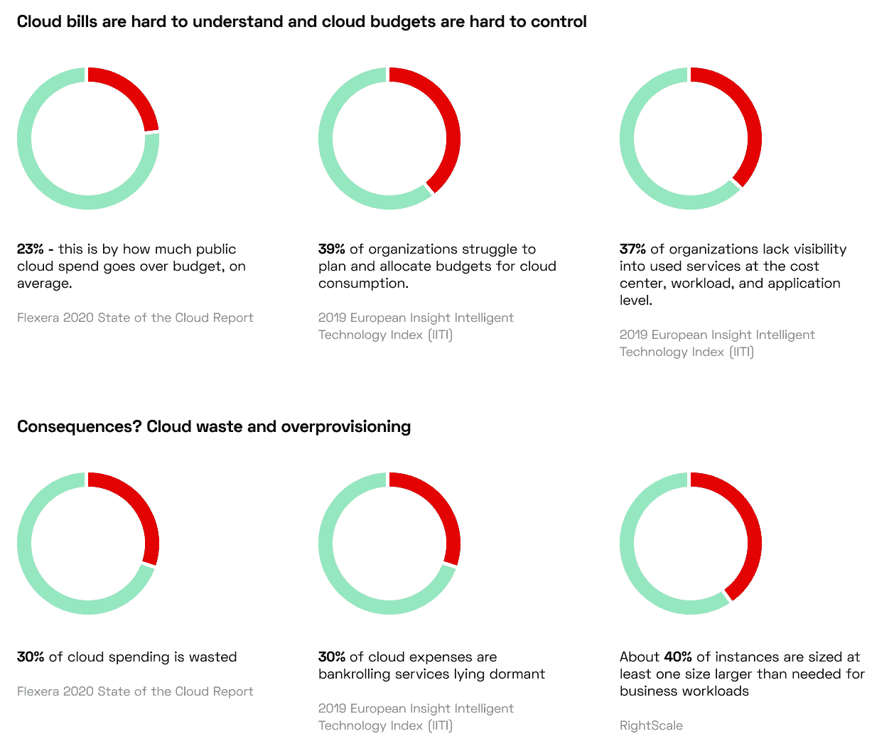
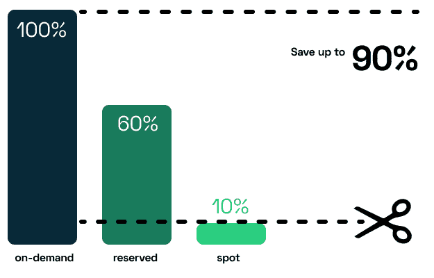
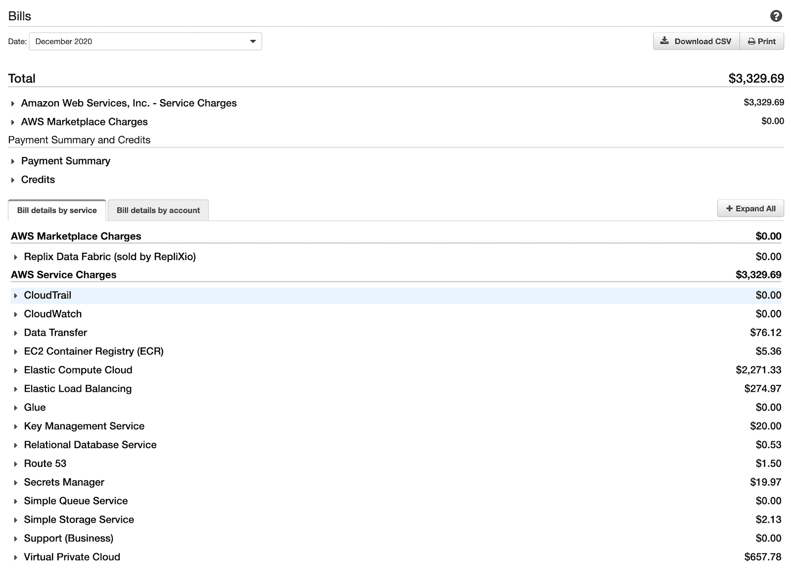
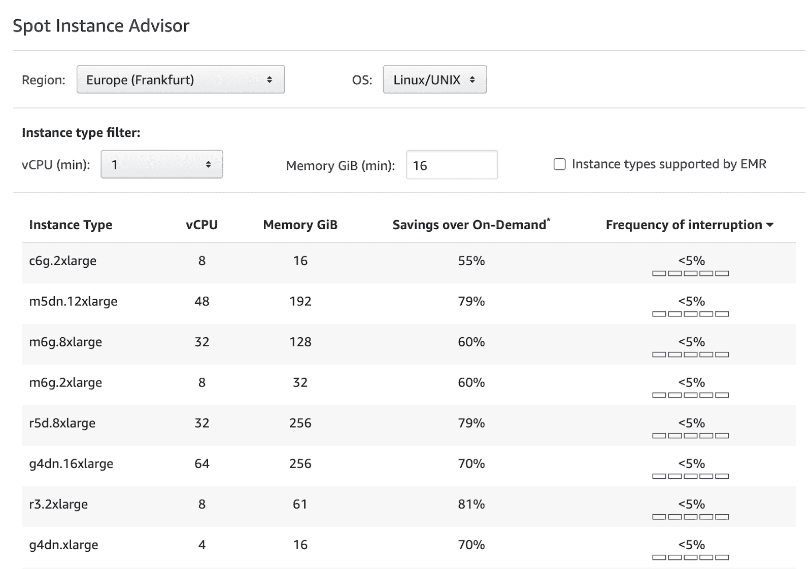

# 削减 AWS Kubernetes 账单的 7 个技巧|新堆栈

> 原文：<https://thenewstack.io/kubernetes/7-tips-for-cutting-down-your-aws-kubernetes-bill/>

 [莱昂·库伯曼

莱昂是 CAST AI 的联合创始人兼首席技术官。Leon 曾担任甲骨文公司 OCI 安全产品副总裁，拥有 20 多年在 IBM、Truition 和 HostedPCI 等公司工作的经验。](https://www.linkedin.com/in/itexecutivecto/) 

在亚马逊网络服务(AWS)中运行你的 Kubernetes 工作负载不是在公园散步，控制成本也不是。您知道 AWS 有超过 150 种 EC2 实例类型和大小吗？

如果每月看着你的账单让你不安，你并不孤单。据 Flexera 称，公司经常报告超过其云服务预算 23%。

为了更好地控制您的预算并降低这些云成本，这里有七个 AWS 提示，无论您是否在 EKS 上运行您的集群，这些提示都是有效的。

## 1.警惕这些定价陷阱

### 按需实例

尽管是现收现付的模式，按需实例是 AWS 提供的最昂贵的选择。它们也使得控制你的预算更加困难。仅将它们用于流量峰值波动的不可预测的工作负载。

### 保留实例

以巨大的折扣提前购买容量听起来很棒——但是你必须对一个给定的实例或系列做出承诺，而没有能力在以后改变。这些资源在一年或三年后对你的公司有意义吗？没办法分辨。您在扩展或处理流量季节性方面没有灵活性。你也冒着被云供应商锁定的风险。

### 储蓄计划

在这种模式下，您承诺在一年或三年内拥有一定数量的计算能力。当您的需求发生变化或以浪费容量告终时，您将被迫承诺更多。

## 2.解读您的云账单

坦率地说，你的[云账单](https://cast.ai/blog/how-to-solve-the-costliest-cloud-bill-issues/)肯定会很长，很难理解。就像这个:

每项服务都使用特定的计费标准。虽然亚马逊 S3 的一些服务是按请求收费的，但其他服务是按 GB 收费的。事实上，该法案没有提供足够的信息来了解您的使用情况和分析您的成本。相反，请查看 AWS 控制台。AWS 计费和成本管理仪表板很有帮助，但要获得更详细的成本视图，请访问成本浏览器，这是您在成本方面最好的 AWS 资源。

提示:要使计费更加透明，请按特定属性(如地区或服务)对成本进行分组和报告。

## 3.云预算

AWS 提供预算工具，帮助控制项目或团队使用的资源。如果你不使用这些控制，你会面临超出预算或者成为另一个在测试云的一天内[几乎破产](https://blog.tomilkieway.com/72k-2/)的创业公司。

**在为云做预算时，请注意这些常见的预算超支原因:**

1.  缺乏关于系统需求的前期知识
2.  关于系统功能如何工作和扩展的错误假设
3.  在正式发现结束后发现昂贵的需求
4.  您的应用程序中缺少 [Kubernetes 自动缩放](https://cast.ai/blog/guide-to-kubernetes-autoscaling-for-cloud-cost-optimization/)设计
5.  IaC 中的配置逻辑不佳，导致其失控
6.  使用无服务器功能，不考虑并行扩展
7.  错误配置的通知和警报。
8.  不关注云预算(也就是没人关注)。

## 4.在一个 AWS 客户中处理多个团队

多个团队或部门参与一个 AWS 账单是很常见的。使用 AWS 提供的按帐户、组织或项目对费用进行分类的机制。这是控制团队开支的最好方法。

*   **组织**:该特性允许您在扩展资源的同时管理和治理您的环境。首先创建一个新的 AWS 帐户，然后通过对帐户进行分组来分配资源和组织工作流。最后，为这些客户群制定预算和政策。
*   **标记资源**:在成本浏览器中使用资源标记。为每个团队、环境、应用程序和服务创建标签，一直到各个功能。为这些标签打开费用分组，并在计费控制台中生成报告。(请记住，有些服务/组件/资源不能在 AWS 中标记。)

## 5.预测云成本

你的 AWS 账单会根据使用情况有所波动，所以预测你的费用是非常痛苦的。但是了解您未来的需求对于控制成本至关重要。

这里有三种有用的预测方法:

1.  **分析使用报告**:你需要有清晰的可见性，所以从定期监控你的资源使用报告开始。设置相关警报以控制局势。
2.  **为您的云成本建模**:使用建模，计算云资源的总拥有成本，分析 AWS 定价模型，并规划未来的容量需求。衡量特定于应用程序和工作负载的成本，以创建此级别的成本计划。确保您有一个位置来聚集所有数据，以便更好地理解它。
3.  **识别峰值资源使用场景**:利用定期分析并生成使用数据报告来检测这些场景。也可以使用其他数据源，比如季节性客户需求模式。如果您发现它们与您的峰值资源使用相关，您将能够提前做好准备。

## 6.选择正确的虚拟机实例类型

计算成本是云账单上最大的一项，所以花些时间选择运行集群的 EC2 实例是明智的。以下是一些指导你选择的建议:

1.  首先定义您的需求，并在这些方面对您的工作负载所需的资源进行排序:
    *   CPU 数量和架构
    *   记忆
    *   储存；储备
    *   网络
2.  看到一个负担得起的实例？三思而行——如果您的工作负载占用大量内存，性能可能会很差，从而影响您的品牌声誉和客户。
3.  考虑 CPU 和 GPU 密集型实例之间的差异。如果你正在寻找一个实例来运行机器学习训练，GPU 会给你更好的结果。
4.  [AWS](https://thenewstack.io/managing-kubernetes-secrets-with-aws-secrets-manager/) 提供 150 多种实例类型，具有各种 CPU、内存、存储和网络容量组合。如果不能比较，就很难理解哪个是正确的。最好的方法是进行基准测试:在不同类型的机器上放置相同的工作负载，并检查其性能— [这里有一个例子](https://cast.ai/blog/how-to-choose-the-best-vm-for-the-job/)。

## 7.利用点实例

Spot 实例有助于在按需定价的基础上节省高达 90%的成本。在开始使用它们之前，您需要知道 spot 实例是否与您的工作负载相匹配。

以下是如何判断您的 [Kubernetes 工作负载](https://thenewstack.io/primer-how-kubernetes-came-to-be-what-it-is-and-why-you-should-care/)是否就绪的方法。问问你自己:

*   完成这项工作需要多少时间？
*   您的工作负载对任务和时间至关重要吗？
*   它能优雅地处理干扰吗？
*   实例节点之间是否紧密耦合？
*   当 AWS 退出时，您准备好快速转移您的工作负载了吗？

考虑应用这些定点实例提示:

1.  当从不同的 spot 实例中选择时，选择稍微不太受欢迎的实例——它们也不太可能被打断。您可以在 AWS Spot Instance Advisor 中检查实例的中断频率。

2.  为您在按需价格级别选择的现货实例设置最高价格。否则，当实例价格高于您设置的价格时，您的工作负载可能会中断。
3.  建立 spot 实例组(AWS Spot 车队)以增加获得 Spot 实例的机会。它们允许您同时请求多个实例类型。

## 总结:降低您的云成本

无论您的设置如何，所有七个技巧都适用——无论您是自己处理 Kubernetes 集群还是使用 AWS EKS。

但是，为了大幅降低云成本，您需要一个智能平台，能够选择正确的实例大小和类型，根据需要自动扩展您的设置，并为您管理基础架构依赖关系。

这就是我们在[剧组 AI](https://cast.ai?utm_content=inline-mention) 所做的工作。我们即将推出我们的 EKS 优化工具，敬请关注。

**本文更新于 2022 年 12 月 14 日。*

<svg xmlns:xlink="http://www.w3.org/1999/xlink" viewBox="0 0 68 31" version="1.1"><title>Group</title> <desc>Created with Sketch.</desc></svg>