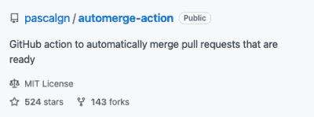
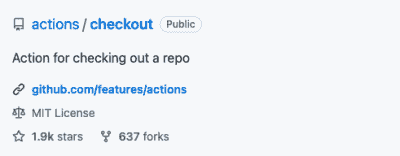
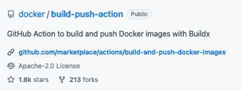

# 设置 CI/CD 管道的 8 个 GitHub 动作

> 原文：<https://thenewstack.io/8-github-actions-for-setting-up-your-ci-cd-pipelines/>

自 2018 年 [GitHub Actions](https://thenewstack.io/github-actions-creates-a-buzz-for-automated-dev-workflows/) 宣布以来，许多个人、组织和开源项目将其 [CI/CD 管道](https://thenewstack.io/three-ways-ci-cd-adoption-can-benefit-your-devops-team/)迁移到 GitHub。它们使用户能够自动化工作流，创建各种自动化，构建开发周期，当然，还可以创建 CI/CD 管道。

GitHub 动作是事件驱动的，这可能是它最好的部分。您可以通过 GitHub 存储库中的事件触发操作来运行按需工作流。

这八个 GitHub 行动可以对开始使用 CI/CD 管道的组织产生影响。

## 1.深谋远虑

您可以通过设置 [Foresight 的](https://www.runforesight.com?utm_content=inline-mention) [GitHub 应用程序来监控您的 GitHub 动作工作流程和测试。](https://github.com/marketplace/thundra-foresight)它让你在一个仪表板上监控你的 GitHub 动作工作流、测试和未测试的代码变更。它通过状态、持续时间和成本可视化您正在运行和已完成的 GitHub Actions 工作流。

### 1.1.Foresight 的工作流工具包活动

它跟踪和监控 GitHub 操作工作流运行的资源指标。如果运行是通过拉式请求触发的，它将在带有结果的已连接 PR 上创建一个注释，并且/或者将结果发布到作业摘要。该操作收集以下指标:

*   CPU 负载(用户和系统)的百分比。
*   内存使用量(已用和可用)，以 MB 为单位。
*   以 MB 为单位的网络 I/O(接收和传输)。
*   以 MB 为单位的磁盘 I/O(读写)。

### 1.2.Foresight 的测试套件动作

### 

Foresight 的测试套件分析测试和/或覆盖结果。它集成了你的 GitHub 动作管道。

它使得查看失败的测试、可视化您的测试的性能以及查看它们的日志变得简单。这是在工作流运行中访问失败测试结果的最快方式。它将代码库的变更与测试覆盖报告相关联，以确定测试覆盖了多少变更。

访问 runforesight.com[了解更多信息。](http://www.runforesight.com)

## 2.设置

## 

您可以下载并安装带有大多数安装操作的运行时的请求版本。根据您选择的编程语言，有许多名为 Setup 的操作可以让您设置 GitHub 工作流。

下面是一些比较受欢迎的:[围棋](https://github.com/actions/setup-go)，[爪哇 JDK](https://github.com/actions/setup-java) ，[。Net Core SDK，](https://github.com/actions/setup-dotnet) [Node.js](https://github.com/actions/setup-node) [，](https://github.com/actions/setup-dotnet) [Python](https://github.com/actions/setup-python) 。

## 3.自动合并

## 

[合并拉取请求](https://github.com/marketplace/actions/merge-pull-requests-automerge-action)在运行任务之前，在拉取请求上添加一个自动合并标签。当 PRs 准备好时，它会自动合并它们。

该操作查看基础分支，并在发生变更时获取变更。然后当 PR 准备就绪时，它会自动合并 PR。

merge pull requests 操作不进行清理，这意味着由该操作创建的分支在成功合并后不会被删除。这就是为什么您需要为此使用另一个删除操作。

## 4.隐藏物

您不必使用[缓存动作](https://github.com/marketplace/actions/cache)来下载常用的依赖项。您可以缓存依赖项，并利用其输出来缩短工作流的执行时间。

如果您在构建 CI/CD 管道时对成本敏感，那么缓存有助于节省资金并释放网络容量。

## 5.创建拉式请求

## 

您可以使用[创建一个 pull 请求](https://github.com/marketplace/actions/create-pull-request)来修改您的存储库。

当与其他操作一起使用时，它可以更容易地添加、删除或修改存储库中的文件。此操作通过自动提交对新分支的更改来创建拉请求。

## 6.检验

## 

您可以使用 [Checkout](https://github.com/marketplace/actions/checkout) 将 Git 存储库下载到您的本地环境中。它允许您的工作流在本地访问您的 Git 存储库，并检查您的目标存储库以在其上运行 GitHub 操作。

结帐有许多可能性。例如，使用内置令牌，您可以推送提交。或者，如果您愿意，您可以获取已定义标签和分支的历史记录。参见 GitHub 市场上的[场景](https://github.com/marketplace/actions/checkout#scenarios)。

## 7.上传工件

## 

[上传工件](https://github.com/marketplace/actions/upload-a-build-artifact)自动化作业之间的数据共享，使您能够从工作流上传工件，允许您在作业之间共享数据，并在工作流完成后存储数据。

但是，如果您的工作流在短时间内上传了大量的工件，您应该小心。您可能会超出使用量，并看到它们被阻止。

您可以通过在上传开始克服这个小障碍之前压缩或归档您的工件的内容，来减少在工件上传期间进行的 HTTP 调用的数量。

## 8.Docker 构建和推送操作

## 

您可以使用 [Docker 构建和推送操作](https://github.com/marketplace/actions/docker-build-push-action)创建 Docker 映像，并将其推送到所需的注册表中，如 GitHub Docker Hub、Docker Registry、[Amazon](https://aws.amazon.com/?utm_content=inline-mention)Elastic Container Registry(ECR)或 Google Container Registry (GCR)。

这个动作主要用于在工作流中的作业之间传递数据，但是你肯定可以用它做很多事情。您可以在注册表之间复制 Docker 映像，而无需更改提交 ID。您可以处理标记和标签。您还可以在多个平台上构建映像。如果你想在 Docker 上看到你的构建结果，你也可以导出图片。

## 总结

与其他一些工具不同，GitHub Actions 是一个非常有价值的自动化工具。GitHub 市场非常丰富。有许多动作可以用来做几乎任何事情。

最后，我想提一下监测竞争情报渠道的必要性。当一个工作流、构建、工作或测试失败时，我们倾向于从头重新运行整个工作流，尝试在本地重现错误，或者深入日志堆。使用 CI 监控工具可以轻松排除故障和延迟，该工具可以根据状态、持续时间和成本可视化 GitHub Actions 工作流，并提供有关性能的见解。

<svg xmlns:xlink="http://www.w3.org/1999/xlink" viewBox="0 0 68 31" version="1.1"><title>Group</title> <desc>Created with Sketch.</desc></svg>