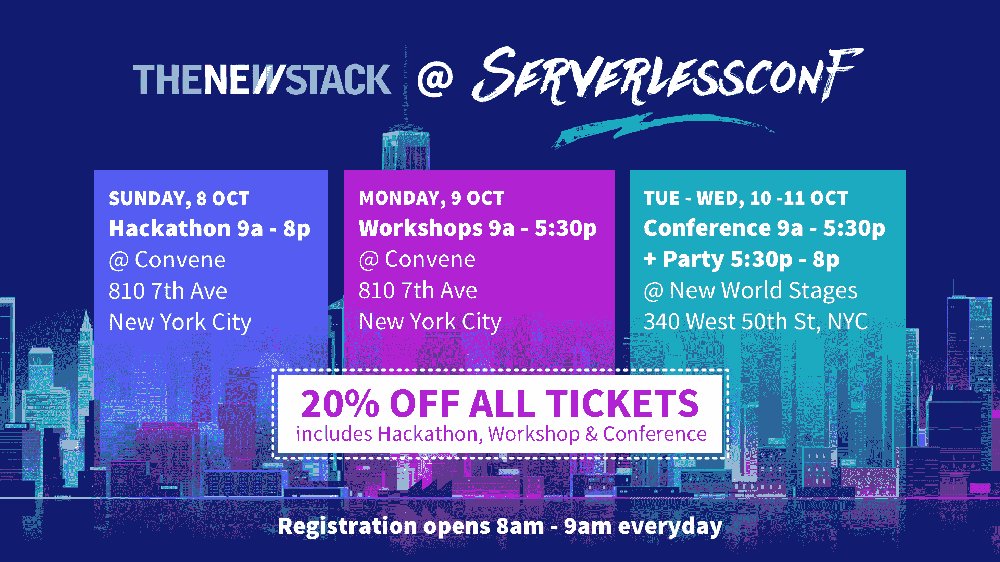

# 80/20 法则指出了容器在生产中的实际好处

> 原文：<https://thenewstack.io/8020-rule-points-real-benefits-containers-production/>

虽然今天我们很多人都在谈论容器、容器编排和围绕容器的生态系统，但相对来说，很少有组织真正以任何真正和持久的方式在生产中部署容器。考虑到使用容器通常带来的好处，尤其是与它们的替代品相比，你不得不怀疑这是为什么。

最常见的情况是，容器是在“绿地”(云原生)应用程序的上下文中谈论的。最近，容器在基于微服务的应用中作为基础元素的角色越来越受到关注。与传统设计相比，微服务方法有明显的优势，因此这种兴趣是有意义的。

问题是，很少有公司能够负担得起将现有应用重新设计为一系列微服务的巨额投资。因此，人们对基于微服务的应用有着极大的热情，但并没有太多的直接机会来很好地利用微服务。

## 你去哪里了，维尔弗雷多·帕累托？

为了便于讨论，让我们对企业中容器的五个机会领域进行分类，每个领域的权重都是 20 %:

### 容器使用的好处:

1.  促进基于微服务的应用的部署
2.  云平台之间和裸机之间的可移植性
3.  快速自动化部署
4.  开发商诉求
5.  与虚拟化和其他托管方法相比，提高了基础架构的效率

 [马克·蒂勒

马克是 Apcera 的首席战略官。他在 IT 领域的成功职业生涯长达 25 年，专注于运营角色和推动各种规模的企业采用云。Mark 拥有丰富的行业经验和对策略驱动的云计算要求的广泛了解，并推动跨职能部门的战略计划。在加入 Apcera 之前，Mark 是 Switch SUPERNAP 的生态系统开发执行副总裁，该公司是世界上最高等级数据中心的构建者。他还是 Data Center Pulse 的总裁和创始人，该组织旨在推广数据中心行业的最佳实践。](https://www.apcera.com/leadership/mark-thiele) 

第一点通常是为什么组织认为容器对他们未来的应用程序和基础结构策略很重要。然而，对于这些组织来说，没有简单的方法可以让他们从闪亮的全新应用程序的角度来考虑他们的部署方案。还记得真正需要一辆车，却一直知道自己太年轻拿不到驾照的感觉吗？

因此，如果容器的重要性可以用“微服务”来概括，这对于大多数组织来说可能是无法实现的，那么我们为什么还在讨论呢？

为了找到答案，我们回顾了过去:也就是 20 世纪初伟大的政治经济学家之一，意大利人维尔弗雷多·帕累托的工作。就像[因特尔的《70 年后的戈登·摩尔》一样，帕累托对适用于大部分经济的工作与收益的比例做了惊人的观察，在许多方面仍然如此。最初，人们认为公司 80%的收入来自 20%的产品线。后来，这个比例出现在这个观察中:一个国家 80%的财富倾向于集中在 20%的公民手中。](http://www.cmswire.com/cms/information-management/where-moores-law-deadends-028867.php)

> 如果您现在可以将现有环境的 30%容器化，那么通过提高员工效率、提高应用程序的弹性和降低基础架构成本，您可能会节省 5%到 15%的 IT 支出。

如果帕累托今天和我们在一起，他无疑会理解 80/20 规则，正如今天所知的，关于集装箱化和效率。你不必等到所有的应用程序都被重新设计后，才能获得*在容器中运行应用程序的大部分好处。如果您可以在几个小时内将最复杂的应用程序打包到一个容器中，并获得为容器化设计的应用程序的 80%的好处，会怎么样？*

## 帕累托的平台

将遗留应用程序打包到容器中是一个开始。但是，加速部署、提供治理、安全、协调、监控、自动化和审计是在生产中运行容器化企业应用程序的真正好处。使用平台方法，您可以将遗留应用程序从特定基础设施和位置的绑定中解放出来。您可以用十分之一的时间部署应用程序，并使用更少的基础架构或云资源。您将获得部署到任何云(公共云、私有云或多云)的能力，以及在其他地方重新部署的能力。通过策略和内置的软件定义网络(SDN ),您将能够简化云之间的可移植性，同时确保始终应用适当的监管。

如果您现在可以将现有环境的 30%容器化，那么通过提高员工效率、提高应用程序的弹性和降低基础架构成本，您可能会节省 5%到 15%的 IT 支出。无论您是在考虑整合数据中心，还是只是想减轻 IT 员工的负担，在容器平台上管理传统应用程序都可以提供虚拟化的优势，这与虚拟化在硬件锁定的操作系统上运行客户端/服务器应用程序的优势不相上下。

## 走向未来

我们都希望为各自的组织提供尽可能最好的 IT 服务。但是，如果您将 80%的时间都花在维持传统应用程序和旧基础架构的正常运行上，就很难做出真正的改变。您真的能够等到每个应用程序都不再受支持或需要重大升级时再进行更改吗？难道您不应该充分利用您现有的应用程序，同时让您的团队能够提供更好的服务和更大的创新吗？

我认为容器与容器管理平台相结合，在管理传统和遗留虚拟环境方面具有显著优势。将容器应用于传统工作负载可以为您提供云原生应用 80%的优势。为什么不现在就获得这一优势，这样您就可以更加专注于让您的企业蓬勃发展的因素？

[Apcera](https://www.ericsson.com/en/digital-services/edge-computing) 是新堆栈的赞助商。

特征图片:世纪之交的印刷品，描绘了[萨尔卡谷、阿科、意大利加尔达湖](https://commons.wikimedia.org/wiki/File:Arco_and_Valley_of_the_Sarca,_Trento,_Italy,_1890-1900.jpg)，来自美国国会图书馆，在公共领域。

<svg xmlns:xlink="http://www.w3.org/1999/xlink" viewBox="0 0 68 31" version="1.1"><title>Group</title> <desc>Created with Sketch.</desc></svg>