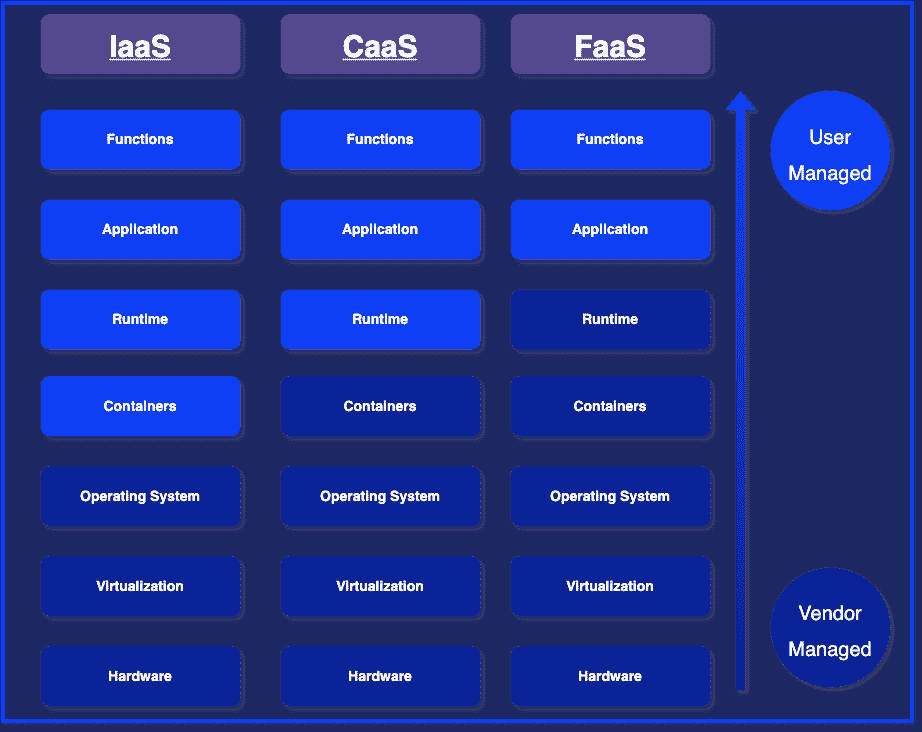

# 2020 年亚马逊网络服务计算指南

> 原文：<https://thenewstack.io/a-2020-guide-to-computing-on-amazon-web-services/>

[桑德拉](https://www.thundra.io/)赞助了这篇文章。

随着云供应商争夺市场份额，[就年收入而言，亚马逊网络服务似乎正在赢得云计算之战。](https://www.parkmycloud.com/blog/aws-vs-azure-vs-google-cloud-market-share/#:~:text=As%20of%20February%202020%2C%20Canalys,and%20other%20clouds%20with%2038.5%25.)

 [萨尔吉尔·优素福

Sarjeel 是 Atlassian 的产品经理，负责引导 Atlassian 工具在其功能集中促进 DevOps 功能。](https://www.linkedin.com/in/syedsarj/) 

然而，选择一个供应商来迁移到云中只是成功的一半。另一半涉及决定哪种服务最适合您的特定应用。您的选择范围从基础设施即服务(IaaS)到功能即服务(FaaS)。最终，这取决于您是想走无服务器应用程序的道路，还是利用容器——甚至是实现混合架构。

在计算服务方面，[亚马逊 EC2](https://aws.amazon.com/ec2/) 、 [AWS Fargate](https://aws.amazon.com/fargate/) 和 [AWS Lambda](https://aws.amazon.com/lambda/) 分别是 IaaS、CaaS 和 FaaS 范例中的热门选择。

如果将这三个服务放在一个光谱上，光谱的一端是容器，另一端是无服务器，AWS Fargate 将位于两者之间。这是因为 AWS Fargate 是一个无服务器容器，也可以定义为一个 CaaS 服务。

因此，让我们深入了解这些服务，了解它们能提供什么。

## 云中的 AWS 容器

2014 年，在 Kubernetes 取得成功之后，AWS 推出了自己的容器管理服务，名为亚马逊弹性容器服务(Amazon **ECS** )，允许您管理亚马逊弹性计算云(Amazon **EC2** )实例的编排。从那以后，我们看到了对 EC2 容器兴趣的增加。那么 ECS 和 EC2 有什么大不了的呢？

首先，ECS 只是一个容器编排服务。它允许您以任务的形式可视化 EC2 容器，其中单个任务是一个或多个已经安装了 Docker 的 EC2 实例。每个带有 Docker 的 EC2 实例然后与 AWS 后端通信。形成集群的几个 EC2 实例将在 ECS 自动扩展组中运行，使用您定义的扩展规则。这意味着 ECS 容器代理不断轮询 ECS API，以根据任务要求检查哪些容器需要停止或运行。所有这些看起来都很诱人，但是问题是您仍然必须管理每个 EC2 实例——这就是困难的开始。

EC2 编排，就像任何其他容器编排一样，是一项艰巨的任务；让 AWS Lambda 在这方面占了上风。即使 ECS 使管理任务变得更加容易，您仍然必须在容器级别上执行管理。您仍然必须管理 EC2 实例的伸缩、监控、安全、联网和其他操作问题。容器级别的管理不仅使容器的使用成为操作负担，而且在安全性和性能方面也很脆弱。

例如，即使您已经为 ECS 自动扩展组指定了合适的规则，根据需要自动增加或减少任务，EC2 实例本身可能没有足够的内存或 CPU 资源调配给它们。此外，当任务分配由于缺乏 EC2 集群资源而失败时，没有明确的度量来扩展 EC2 集群，也没有关于扩展的适当解决方案。另一个问题是[缩小 EC2 集群而不终止任何任务](https://docs.aws.amazon.com/AmazonECS/latest/developerguide/container-instance-draining.html)。

这些操作负担不仅出现在 AWS EC2 上，还出现在所有的容器服务上。他做了这么多工作，你什么时候会有时间专注于你的业务逻辑呢？这就是 AWS 引入 Fargate 的原因，它通过抽象所有这些容器编排责任来拯救你。

与 EC2 的基础设施即服务(IaaS)相比，AWS Fargate 提出了容器即服务(CaaS)。这意味着容器已经设置好了，包括网络、安全性以及最重要的扩展。这些主要的操作负担被抽象掉了，为您提供了直接在云上运行容器的能力。有了这个服务，您只需为每个容器实例指定资源，并让 Fargate 在幕后发挥它的魔力。

最终，每个 Fargate 实例都有其专用的 ENI，以允许任务间集群之间的通信，而同一任务的集群则通过本地主机进行通信。此外，这些任务的管理也是由 ECS 完成的。事实上，Fargate 被定义为 ECS 的计算引擎，提供了一种不同的任务管理方式；这是 Fargate 将其与容器服务联系起来的定义特征。然而，这只是 Fargate 的一面，还有整个无服务器的一面。

## AWS 资源随需应变，无需服务器

因此，AWS Fargate 允许您直接在云端运行容器。但是怎么做呢？这就是服务的无服务器部分发挥作用的地方。AWS Fargate 可以被视为 AWS 无服务器计算服务的子集。这意味着你不用走另一个极端，你现在可以利用无服务器而不必离开容器的灵活性。

将 Fargate 称为无服务器计算服务也打破了这一概念中最大的误解之一。许多人认为无服务器等同于功能即服务(FaaS)。这种被误解的关联是由于 AWS Lambda 的[成功，因此 AWS Lambda 功能成为无服务器概念的同义词。](https://www.contino.io/insights/whos-using-aws-lambda-1)

但是，如果服务具备以下三个特征，则可以将其定义为无服务器服务:

*   服务器管理被抽象为一个供应商；
*   现收现付模式，您只需为您使用的东西付费；和
*   自动扩展和高度可用。

考虑到上述属性，AWS Fargate 是真正的无服务器。这是因为，如前所述，通过 CaaS，直到容器级别的所有底层架构都被抽象给了供应商。此外，与 AWS Lambda 类似，Fargate 也遵循现收现付模式。不同之处在于，Lambda 服务是按每次调用计算账单的，而；使用 Fargate，您将根据每秒消耗的 vCPU 和内存来收费。最后，Fargate 所拥有的独特的也是最重要的特性，证明了它的无服务器标签是正确的，那就是自动伸缩特性。与 AWS Lambda 类似，Fargate 也是可扩展的，高可用的；这是意料之中的，因为两个服务都有 [AWS 鞭炮](https://aws.amazon.com/about-aws/whats-new/2018/11/firecracker-lightweight-virtualization-for-serverless-computing/)在引擎盖下运行。

在 AWS re:Invent 2018 上正式发布，鞭炮是一个非常强大的虚拟化工具，它使用了一个[基于内核的虚拟化机器(KVM)](https://www.redhat.com/en/topics/virtualization/what-is-KVM) 。该技术被设计为安全和极其轻量级的，允许 AWS 增强其 Lambda 和 Fargate 服务的无服务器体验。根据 AWS 首席传道者 Jeff Bar 的说法，鞭炮是“如果它是为今天的容器和功能世界而设计的，那么虚拟机看起来会是什么样子。”

因此，在鞭炮的支持下，AWS 将 CaaS 纳入了无服务器计算服务的范畴。无服务器只意味着 FaaS 的神话现在正受到挑战，迎来了该领域解决方案的新时代。然而，这是早就应该做的，因为 AWS Lambda 的限制已经成为许多人将其架构转向无服务器的阻碍。这就是 Fargate 优于 Lambda 服务的地方。

## 结论

云已经主导了关于如何构建软件系统的讨论。AWS、Azure 和 Google Cloud 等供应商正在开发解决方案来促进云中的这种开发，提供大量服务来满足不同应用程序的需求。仅 AWS 一家就向 FaaS 提供 IaaS 计算领域的三种主要服务。接下来的问题是，哪种服务最适合您的使用案例和业务模型？这需要比较不同的服务，以了解它们在不同用例中作为计算解决方案的可取性。

这就是我们在桑德拉通过分析和比较不同的 AWS 服务所探索的。我们的团队已经写了三种服务之间的各种比较，并将他们的发现记录在[桑德拉关于该主题的白皮书](https://www.thundra.io/whitepaper/the-guide-to-aws-computing-2020?utm_source=newstack&utm_medium=paid&utm_campaign=WP-The%20Guide%20to%20AWS%20Computing%202020&utm_content=lp_theGuidetoAWSComputing20)中，您现在可以下载。

亚马逊网络服务是新堆栈的赞助商。

通过 Pixabay 的特征图像。

<svg xmlns:xlink="http://www.w3.org/1999/xlink" viewBox="0 0 68 31" version="1.1"><title>Group</title> <desc>Created with Sketch.</desc></svg>