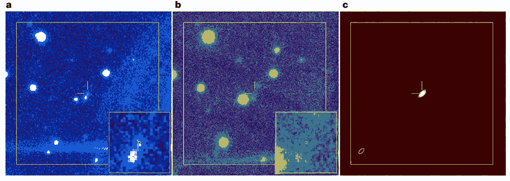

# 30 亿光年外的奇异快速射电爆发

> 原文：<https://thenewstack.io/a-bizarre-fast-radio-burst-from-3-billion-light-years-away/>

从[冰火山到吸星黑洞](https://stacker.com/stories/1610/space-discoveries-will-blow-your-mind)，在神秘浩瀚的宇宙中仍有许多有待发现。现在，一个国际天文学家小组发现了被认为是唯一的一种特殊类型的重复快速射电爆发(简称 FRBs)的第二个例子。

这项新发现引发了一些问题，即除了这些来源在各种天文计算中可能有多大用处之外，哪些种类的天体可能是这些快速重复无线电波的潜在来源。

该团队的[发现](https://www.nature.com/articles/s41586-022-04755-5)发表在期刊*自然*上，详细描述了研究人员如何能够使用两台世界上最强大的射电望远镜来识别新的快速射电爆发，他们将其命名为 FRB 190520。

该团队的论文还指出了令人信服的证据，表明这些神秘排放物背后可能有不止一个来源，他们认为这些排放物位于距离地球约 30 亿光年的矮星系中。

快速射电爆发是长度从几分之一毫秒到几毫秒的无线电脉冲。虽然科学家们还没有完全理解 FRB 背后的天体物理过程，但这些高强度的无线电脉冲平均在一毫秒内释放的能量相当于太阳在三天内释放的能量。但是这些高能爆发的确切来源很难确定，因为 FRB 通常只爆发一次，而且是在遥远的星系中。

## 无线电波的神秘爆发

第一次快速射电爆发是在 2007 年检测到的[，当时科学家们正在梳理](https://www.universetoday.com/tag/lorimer-burst/)[存档的脉冲星调查数据](https://en.wikipedia.org/wiki/Fast_radio_burst)。最近在 2020 年，科学家们在我们的银河系中探测到一个 FRB，它来自一种特殊类型的快速旋转、高度磁化的中子星，称为[磁星](https://earthsky.org/space/what-is-a-magnetar/)。这些密度极高的物体是一颗超新星爆发后的残余物，其特征是强大的磁场，产生的力比地球大几万亿倍。

但更罕见的是重复的 FRB。2016 年，天文学家发现了 FRB 121102，这是一个在大约 30 亿光年外的矮星系中活跃重复的 FRB，从一个局部区域和一个未知的来源发出。当时，天文学家认为 FRB 121102 是一种独特的现象，因为它遵循一种奇怪的模式，即它发出更强大、更快速的无线电波爆发，然后经历了 67 天较弱的放电。

> 高强度快速无线电脉冲在一毫秒内释放的能量相当于太阳三天释放的能量。

但是最近的发现改变了这一切。与 FRB 121102 类似，FRB 190520 表现出相同的强弱发射循环周期的奇怪行为，这是使用中国 500 米口径球面射电望远镜(FAST)确认的。此外，FRB 190520 在一个大约 30 亿光年远的矮星系中的位置后来通过美国国家科学基金会在新墨西哥的 Karl G. Jansky 甚大阵列(VLA)确定。这些最新的观察促使研究小组想知道是否有不同类型的 FRB。

“复读的和不复读的有区别吗？那持续的无线电发射呢——这很常见吗？”该研究的合著者、西弗吉尼亚大学研究生 Kshitij Aggarwal 在一份声明中说。

FRB 190520 区域的光学、红外和无线电图像

现在，天文学家认为可能有不同的机制帮助 FRB 的产生，或者 FRB 的来源在其生命的不同阶段表现不同。例如，在大质量恒星的超新星爆炸后，产生的超密度中子星可能成为 FRB 的来源。或者，极度磁化的中子星或磁星也可能是这些神秘射电爆发的主要来源。

此外，该小组的发现也使人怀疑 FRB 是否可以被可靠地用作进行天文计算的工具。科学家通常通过测量 FRB 的无线电发射根据频率被过滤掉多少来确定物体可能有多远，高频波比低频波传播得快。

这种效应被称为[色散](https://en.wikipedia.org/wiki/Acoustic_dispersion)，取决于无线电波必须穿过哪种气体物质，通常可以帮助专家粗略估计该物体距离地球有多远。

令人惊讶的是，这种方法并不适用于 FRB 190520。通过解释多普勒频移，或者无线电波长如何与宇宙的膨胀相关联，该小组能够确定 FRB 190520 的来源仅位于 30 亿光年之外，而不是表面信号分散最初可能表明的 80 亿或 90 亿光年。

“这意味着 FRB 附近有很多材料，会干扰任何用它来测量星系间气体的尝试，”Aggarwal 解释道。“如果其他公司也是如此，那么我们就不能指望用 FRB 作为宇宙尺度。”

该小组现在认为 FRB 190520 的来源可能是一颗新生成的磁星，FRB 190520 周围惊人密集的电子云就是证据。这些厚云将随着时间的推移而消散，这可能导致 FRB 190520 的活跃爆发减少。无论如何，研究人员计划在未来继续对这个 FRB 和其他 FRB 进行调查，希望找到更多关于这个有趣的天文之谜的线索。

更多阅读团队[论文](https://www.nature.com/articles/s41586-022-04755-5)。

<svg xmlns:xlink="http://www.w3.org/1999/xlink" viewBox="0 0 68 31" version="1.1"><title>Group</title> <desc>Created with Sketch.</desc></svg>