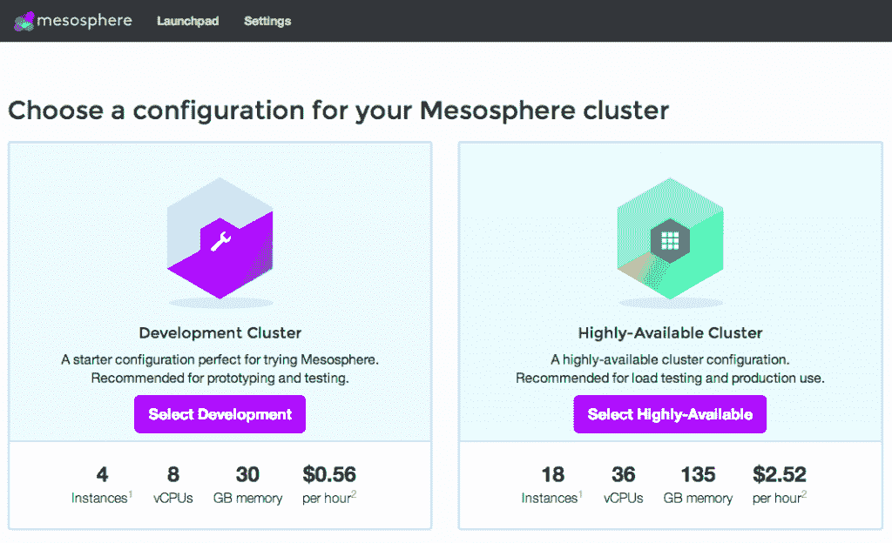

# Mesos 和 Kubernetes 的简要比较

> 原文：<https://thenewstack.io/a-brief-comparison-of-mesos-and-kubernetes/>

编者按:自从这篇文章发表以来，我们已经更新了它，以澄清和纠正一些问题，特别是与调度程序如何在 Mesos 上工作有关的问题。

最近宣布的 Windows 上的 Mesos 意味着在 Linux 和 Windows 平台之间工作的开发人员和组织可以使用他们自己的工具，而不需要大量的资源管理。那些使用谷歌云引擎的人可能更喜欢使用 Kubernetes，而习惯于微软 Azure 的人可能会喜欢 Mesosphere 工作流管道。每一种都有自己的优点和缺点，尽管随着更多的技术被引入其他平台，堆栈管理服务之间的差距会缩小。

随着越来越多的堆栈管理和容器工作流工具需要弥合在 Linux 或 OS X 上开发的工具与在 Windows 上开发的工具之间的差距，对能够满足跨平台工作的工具的需求就变得非常明显。

## Mesos 的情况如何

Mesos 有一些缺陷，首先是它如何与谷歌的 Kubernetes 交互。Kubernetes 也是一个容器管理系统，为开发人员提供了一个轻量级集群管理工具，用于处理类似打包的项目。Mesos 更多地利用那些处理较大数据集群的应用，比如 Spark 数据库。Kubernetes 通过与 Mesosphere 的合作被引入到 Mesos 中，允许开发人员使用它来管理集群，集群可以扩展以满足大大小小团队的需求。

随着开发团队对其服务的要求越来越高，使用 Mesos 和 Kubernetes 构建应用程序可以在不牺牲对资源管理的控制的情况下实现灵活性，允许根据需要扩展、缩减或暂停集群。

Mesos 使用动物园管理员来选择和发现主人。Apache Auroa 是一个运行在 Mesos 上的调度程序。像 Kubernetes 这样的调度器也可以在 Mesos 上运行并共享集群(例如，在同一个 Mesos 集群上运行 Kubernetes、Storm、Spark、Hadoop)。Mesos 本身是用 C++编写的，而相关的框架往往是用 Java 或 Scala 编写的。比如 Chronos 和 Marathon 都用 Scala，而 Storm 用 Java。

Mesos 如何与不同的框架一起工作是一个值得讨论的问题，因为 Java 是主流，但它在不同的时代得到了接受。如今，Go 等编程语言越来越受欢迎，推动了对 Docker 和 Kubernetes 等平台的兴趣，这些平台都是用 Go 构建的。在 Hacker News 的一次对话中，一位用户指出，和其他任何东西一样，Mesos 也有它的问题，但它对微服务很有用。

> 如果您可以将您的服务打包到 Docker 容器中，那么您可以将它启动到集群中，Chronos/Marathon/Mesos 将负责确保它正在运行。

黑客新闻上的同一位用户问道:梅索斯真的执着于什么吗？它的组件是 API 驱动的。

> 我安装它，运行它，向它发送任务，它就能工作，而且表现良好。更好的做法是，我可以查看任何服务的 API，了解正在发生什么。

这是一场关于 Mesos 的资源开销以及它与 Kubernetes 相比如何的辩论。Mesos 使用事件驱动的消息传递，而不是像 Kubernetes 那样通过 etcd 进行协调。正如一位 Mesos 贡献者所解释的那样，由于集群的规模，有些大规模生产用户需要资源效率(当每个集群中运行数万个 Mesos 代理时，效率对于成本非常重要)。:).

随着集成的出现，Zookeeper 将支持使用 etcd、Consul 和其他服务发现机制。还需要完全使用外部发现系统。Mesos 的关键驱动因素是可靠性，因为该系统在 Twitter、Apple 等大型集群上运行。Zookeeper 非常可靠，而且“久经沙场”，而 etcd 是协调和发现领域的新竞争者。

Mesos 上的 Kubernetes pods 现在可以在单个集群上利用数据处理应用程序的能力，如 [Apache Hadoop](https://hadoop.apache.org/) 。但是，在 Mesos 上运行 Kubernetes 时需要注意一些问题。目前无法为 kubernetes-mesos 调度程序指定 [pod 放置约束](https://github.com/mesosphere/kubernetes-mesos/issues/338)。另一个当前的问题是，Mesos 对端口的定义不同于 Kubernetes，当主机端口未声明或被赋予了超出范围的值时，这可能会导致冲突。

孤立的 pod 也是 kubernetes-mesos 的 GitHub 存储库的当前问题列表中列出的一个问题。当 Docker 容器的终止时间比`executor_shutdown_grace_period`长时，就会产生孤立的容器，这会导致一些容器没有被终止并继续无限期运行。那些希望在 Mesos 上与 Kubernetes 一起工作的人应该知道，该项目是在 1.0 版本中，最近刚刚结束测试。因此，可能会出现错误或打嗝。如果您在使用 Kubernetes 开发 Mesos 时遇到了不在上述问题列表中的错误，请按照存储库中提供的说明来报告它。

## Kubernetes 如何比较

Kubernetes 提供的集群管理非常适合在当今的技术堆栈上工作。无论是运行 CoreOS、RedHat 还是众多可用的操作系统，Kubernetes 都可以在几秒钟内启动集群。作为 Google 云平台创建的一个开源项目，Kubernetes 继续由依赖它进行日常工作流管理的社区在基于集群的项目中开发和塑造。Kubernetes 是用 [Go](https://golang.org/) 编写的，这使得它比 Python 之类的语言更快、更轻量级、反应更灵敏。

在 pod、标签和服务之间，Kubernetes 提供了一种与集群交互的可靠方式:

*   **舱**是一小组码头集装箱，可以在 Kubernetes 内维护。Pods 很容易部署，从而减少了测试构建或 QA 调试时的停机时间。
*   **标签**顾名思义，用于组织由它们的键:值对决定的对象组。
*   **服务**用于负载平衡，为一组 pod 提供集中的名称和地址。
*   Kubernetes 上的集群消除了开发人员对物理机器的担忧，它们本身就是轻量级的虚拟机，每个都能够处理需要可伸缩性的任务。

虚拟机可能需要大量资源，尤其是在旧机器上开发时。如果资源分配不正确，或者用户没有指定应该使用一定数量的资源来编译日志或完成相关项目要求的其他任务，运行虚拟机管理程序可能会给系统带来压力。Kubernetes 简化了建立多个虚拟集群的过程，允许堆栈管理去掉不需要的软件层，这些软件层会使系统陷入困境。使用 Kubernetes 进行集群管理可以实现高级任务监控、资源分配和应用程序扩展，同时提供确保应用程序平稳运行所需的控制。

Kubernetes 通常用于应用程序开发，软件开发团队可以将容器放在一起，并一起运行它们。这在调试过程中非常有用，或者在必须测试多个应用程序构建的稳定性时，这将导致生产。Kubernetes 允许 pods 与其他 pods 通信，不管它们是否在同一个主机网络上。这解决了大型团队在大规模启动项目时可能遇到的问题，因为 Docker 只允许位于同一主机上的容器相互交换信息。

Kubernetes 允许快速扩展、轻量级集群管理，而 Mesos 需要更多资源。对于已经在生产中大规模运行的项目要求更高的大型团队来说，Mesos 可能是一个更好的决定。随着 Mesos 和 Kubernetes 在今年早些时候宣布 [Kubernetes 现在可以在 Mesos](https://thenewstack.io/mesosphere-now-includes-kubernetes-for-managing-clustered-containers/) 上使用，开发人员在启动项目或导入现有应用程序时可以选择使用哪种集群管理服务。

总的来说，随着容器成为新的开发主体，集群管理的方法也在不断变化。与 Mesos 和 Kubernetes 一起工作是许多软件开发人员面临的现实，他们的团队能够在他们的开发栈中使用这两种平台。

<svg xmlns:xlink="http://www.w3.org/1999/xlink" viewBox="0 0 68 31" version="1.1"><title>Group</title> <desc>Created with Sketch.</desc></svg>