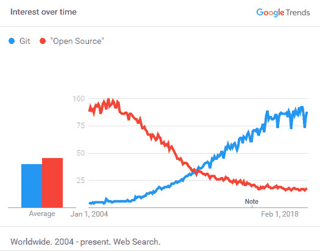

# 数字中的 git 简史

> 原文：<https://thenewstack.io/a-brief-history-of-git-in-numbers/>

随着开源的 git 分布式版本控制系统下周庆祝它的 15 周年纪念日，我们很难记得开发人员曾经依赖其他类型的版本控制系统。让我们简单回顾一下 git 的早期，到它的转折点，再到现在的整合阶段。【T2

根据 2007 年对 git 用户的调查，80%的用户使用过 SVN 的 Subversion，69%的用户使用过 CVS。这些早期的 git 粉丝仍然是开发人员中的少数。在 2009 年，对源自 Java IDE(独立开发环境)的 Eclipse 社区的一项调查中，SVN 是 58%的受访者的主要源代码管理系统，而只有 2%的人使用 Git 或 GitHub。在这一点之后，git 继续获得力量。

2011 年 3 月，Git 超过了“开源”搜索查询。两个月后，GitHub [在上半年提交的数量上超过了 Sourceforge](https://readwrite.com/2011/06/02/github-has-passed-sourceforge/) 。2012 年，安德森·霍洛维茨公司进行了一笔大投资。在接下来的七年里，GitHub 代码库在 Synopsys/Black Duck [开放中心](https://www.openhub.net/repositories/compare)中从 27%增加到 70%。到 2014 年到来的时候，在 Eclipse 的年度调查中，Git 超过 SVN 成为主要的代码管理工具。

Git 在 2018 年或 2019 年的某个时候跃升到另一个统治地位——基本上是在微软收购 GitHub 的时候。例如，StackOverflow 的[调查](https://insights.stackoverflow.com/survey/)显示，git 的使用率从 2015 年的 69%上升到 2018 年的 87%。就开发人员使用的版本控制而言，Subversion 是明显的输家，同期从 37%下降到 16%。 [JetBrains](https://www.jetbrains.com/research/) 和 [SmartBear](https://smartbear.com/resources/ebooks/the-state-of-code-review-2019/) 的调查发现，在 2018 年至 2019 年的时间段内也有类似的变化。

为什么 git 的崛起如此引人注目，它目前的主导地位意味着什么？在与 Jason Warner、GitHub 首席技术官 Jason Warner、Weaveworks 首席技术官 Cornelia Davis 和 GitLab 首席执行官 Sid Sijbrandij 的圆桌讨论中可以找到一些答案。

这篇文章已经更新为 2020 年 4 月 8 日发布的播客的链接。

来自 Pixabay 的 PublicDomainPictures 的特色图片。

<svg xmlns:xlink="http://www.w3.org/1999/xlink" viewBox="0 0 68 31" version="1.1"><title>Group</title> <desc>Created with Sketch.</desc></svg>