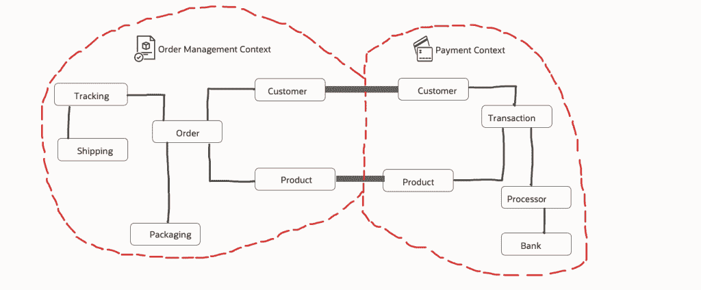
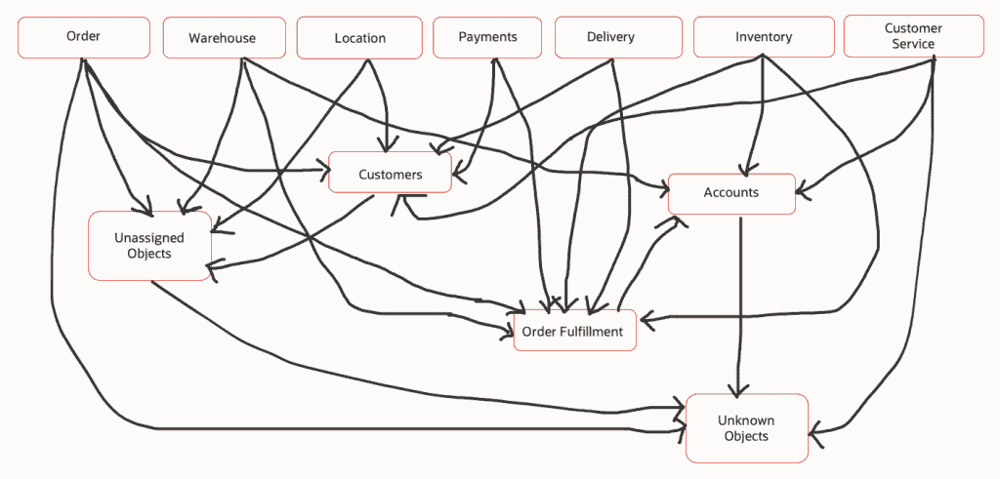
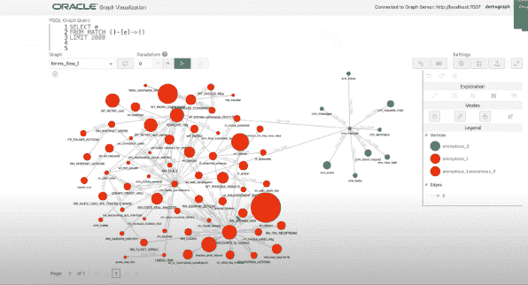

# 图形数据库的出色使用:映射遗留软件

> 原文：<https://thenewstack.io/a-brilliant-use-for-graph-databases-mapping-legacy-software/>

[Neelima Tadikonda](https://www.linkedin.com/in/neelimatadikonda)

[Neelima 是甲骨文公司的首席产品营销总监。她是一名技术发烧友，热衷于简单的设计和自动化。她曾在企业和初创公司工作，建立成功的市场战略和产品发布。](https://www.linkedin.com/in/neelimatadikonda)

您的团队正在对一个历史悠久的遗留环境中的应用程序进行现代化改造。该软件已经存在多年，甚至可能几十年，您的公司依赖它进行日常运营。但随着时间的推移，软件变得如此复杂，以至于添加新的特性、功能和能力太难了——这令人沮丧，因为你知道你可以很容易地将它们添加到你自己用当代资源和方法构建的应用程序中。

你从哪里开始？首先，你需要绘制古老软件的操作图，这样你就能清楚地理解它是如何工作的。但是，当然，这很难做到，因为当时的开发人员通常不区分责任层，如数据管理层、用户界面和业务逻辑层。相反，他们通常会将功能合并到一大堆代码中。(遗憾的是，即使有文档，这种文档也很少是完整的、最新的或准确的。)

你需要分析这个整体软件，这样你就能清楚地理解关系、路径和数据源。然后，您可以重建这些功能，让它们由独立的库和逻辑框架来处理。

[图形](https://www.oracle.com/autonomous-database/what-is-graph-database/?source=:ex:pw:::::TheNewStack_A&SC=:ex:pw:::::TheNewStack_A&pcode=)，也称为图形数据库，可以帮助你的团队更快地完成这个困难的第一步。

我是在甲骨文合作伙伴 PITSS GMBH 的斯蒂芬·拉罗卡展示了他如何使用 Oracle Graph 寻找遗留软件中的链接软件模块、集群模块和数据流模式时产生这个想法的。本文将概述如何以及为什么使用图表来实现这一目的。

## **为什么要用图表？**

图包含节点、边和属性。所有这些都用来以关系数据库所不具备的方式表示和存储数据。图形分析是另一个常用术语，它特指使用数据点作为节点，关系作为边，以图形格式分析数据的过程。图形分析需要支持图形格式的数据库；这可能是一个专用的图形数据库，如 Neo4j 或 Cassandra，或者是一个支持图形和其他多种数据模型的聚合数据库。

## **有界语境**

有界上下文是将整体应用程序分解成有界上下文中的功能和关系集群的过程。这使您能够以只影响少数集群的方式开发和部署应用程序的功能，从而最大限度地减少那些上下文之外的更改。对应用程序的独立于上下文的更改越多，工作就越容易——以后的测试也越容易。

例如，在 Oracle Graph 中，有一些预构建的算法可以根据应用程序的复杂性给出集群建议。这有助于在没有领域知识的情况下定义有界上下文。有了这些信息，您就可以开始理解原因和子域，并在形成集群的有界上下文时创建边界。

图 1:插图显示了如何基于依赖关系识别有界上下文。

下面是不同模块之间的应用程序逻辑的系统流程。这些模块基于有界的上下文进行聚类。每个集群都有自己的管理集群的有界上下文。正如您在这个场景中看到的,‘Customers’集群使用来自许多集群的数据，而它自己的数据只被少数其他集群使用。

## 外键关系

许多遗留应用程序没有定义良好的外键关系，因此有必要创建数据模型分析。例如，为了帮助您做到这一点，Oracle Graph 允许您更改数据模型并在表之间分配外键；帮助识别带有“where”子句的用户界面表，或者连接数据操作语言(DML)语句的表。使用这些信息，您现在可以确定用户界面在两个表之间创建主/从声明的位置。因此，即使您自己不知道外键，您仍然可以理解表之间的关系并识别数据模型中的重要表。

图 3:使用 Oracle Graph 定义的有界上下文和集群。

重要的是，这些信息可以帮助你理解用户行为。Oracle Graph 有助于可视化和分析这些复杂的关系，以确定用户交互和业务流程，以及这些如何在应用程序中运行。

## 结论

我希望这篇文章展示了图形数据库和工具如何通过提供各种上下文的清晰的依赖性分析，以及通过帮助团队识别和可视化业务流程，来帮助您理解遗留的整体应用程序。我将更详细地介绍这一点，并在这里查看另一个有用的用例。

<svg xmlns:xlink="http://www.w3.org/1999/xlink" viewBox="0 0 68 31" version="1.1"><title>Group</title> <desc>Created with Sketch.</desc></svg>