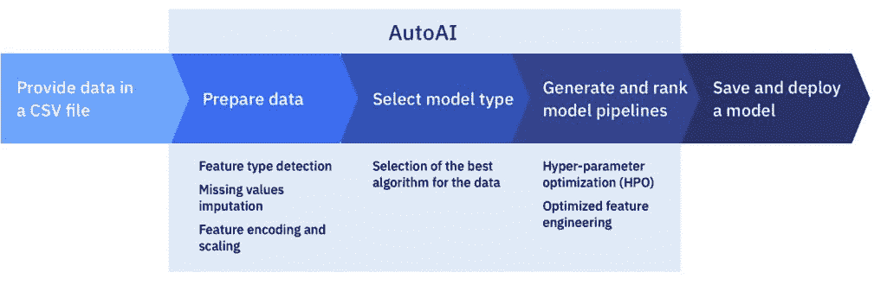
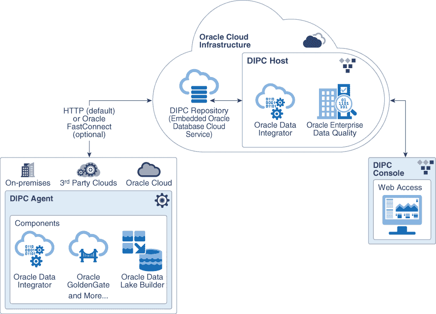
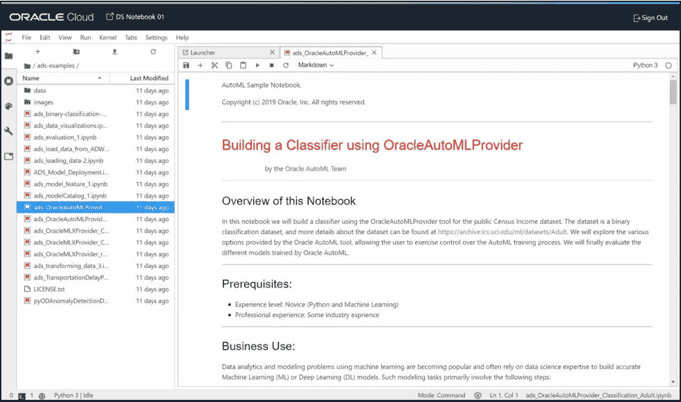
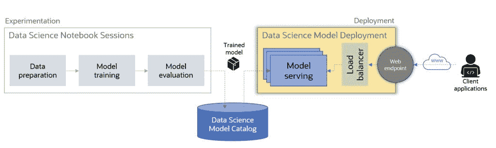

# 近距离观察基于云的机器学习平台:IBM 和 Oracle

> 原文：<https://thenewstack.io/a-close-look-at-cloud-based-machine-learning-platforms-ibm-and-oracle/>

本周，新的堆栈正在运行一个“深度潜水”系列，检查主要云提供商的机器学习即服务产品，作者是分析师贾纳基兰·MSV。阅读我们以前的文章

[here](https://thenewstack.io/series-a-close-look-at-cloud-based-machine-learning-platforms/)

和

[here](https://www.thenewstack.io/a-close-look-at-cloud-based-machine-learning-platforms-microsoft-azure-ml-google-vertex-ai)

.

这是 ML PaaS 系列的第三部分，也是最后一部分，我们将探讨 IBM Cloud Pak for Data 和 Oracle Machine Learning。我们遵循相同的框架，将这些平台的功能和服务分为机器学习的五个阶段。

## IBM 沃森机器学习

[IBM](https://www.ibm.com/cloud?utm_content=inline-mention) 拥有一整套用于构建和部署机器学习模型的工具和服务。IBM 的关键差异化因素是能够在各种环境中运行数据科学和机器学习平台，包括公共云、内部部署和混合云。

### 准备

[IBM Cloud Pak for Data as a Service](https://www.ibm.com/in-en/products/cloud-pak-for-data/as-a-service)是 IBM Cloud 上的一个端到端平台。它作为云原生解决方案运行在 [Red Hat OpenShift](https://www.openshift.com/try?utm_content=inline-mention) 上。

[Watson Studio](https://www.ibm.com/in-en/cloud/watson-studio) 是一个运行在 IBM Cloud Pak for Data 中的集成开发环境。客户使用这个工具来管理机器学习项目的几乎所有阶段。

该平台支持通过可扩展的连接器添加来自不同数据源的数据。来自 IBM 托管服务(如 Cloudant、DB2 和 Informix)或外部服务(如亚马逊 S3、亚马逊 RDS 或微软 Azure SQL 数据库)的数据可以被接收到环境中。客户可以轻松地将存储在对象存储中的非结构化数据或关系数据库中的结构化数据引入 IBM Cloud Pak。

在处理大型数据集时，DataStage 组件是一个 ETL 工具，可用于转换和集成项目中的数据。

摄取的数据通过平台的[数据提炼](https://www.ibm.com/in-en/cloud/data-refinery)组件进行清理和处理。作为训练阶段输入的最终数据集可以以 Avro、CSV、JSON 或 Parquet 格式保存。

### 建设

[Watson Studio](https://www.ibm.com/in-en/cloud/watson-studio) ，它是 IBM Cloud Pak for Data as a Service 不可或缺的一部分，是构建模型的平台。它支持 JupyterLab 和 RStudio 环境作为数据科学家和开发人员的协作开发环境。

Watson Studio 附带了许多预装的 Python 和 R 模块。一旦提供了环境，开发人员就可以使用流行的机器学习和深度学习工具和框架来建立模型。

像其他 MLaaS 产品一样，IBM 为沃森机器学习提供了一个[Python SDK](https://dataplatform.cloud.ibm.com/docs/content/wsj/analyze-data/python-client.html)，它提供了对 IBM 云服务的访问，如对象存储和托管数据库。

### 火车

培训作业可以通过 Watson Studio 以交互方式启动，也可以通过在 YAML 文件中定义规范以声明方式启动。

在 IBM Watson 机器学习中，可以通过一个或多个模型定义的逻辑分组来创建深度学习实验。当实验运行时，它为作为实验一部分的每个模型定义创建训练运行。每个定义都是一个 YAML 文件，带有一个指向模型定义和实验所需的 CPU/GPU 资源的指针。

IBM Watson Machine Learning 提供了自动化的超参数调整和 AutoAI，它们提供了不同级别的 AutoML 功能。

超参数优化是一种机制，用于自动探索潜在超参数的搜索空间，构建一系列模型，并使用感兴趣的度量来比较模型。

IBM Watson 机器学习支持与基于 NVIDIA K80 和 V100 GPUs 的按需 GPU 计算集群并行的训练模型。

Watson Studio 中的 AutoAI 图形工具可自动分析数据集，并生成针对预测建模问题定制的候选模型管道。这些模型管道是在 AutoAI 分析数据集并发现最适合问题集的数据转换、算法和参数设置时迭代创建的。结果显示在排行榜上，显示根据问题优化目标排列的自动生成的模型管线。

### 部署

在 IBM Watson 机器学习中，部署空间充当注册表，管理与模型部署相关的资产。部署资产可以包括序列化模型、评分脚本、推理数据集的模式等等。

从部署空间，可以通过安全的 HTTPS 端点将模型部署和公开为 web 服务。开发人员可以使用 Python SDK 以编程方式部署和配置 REST 端点。

### 经营

IBM Watson 机器学习提供了一个健壮的 ModelOps 框架来管理部署的模型。

当同一个模型的多个版本被训练和部署时，客户需要跟踪模型的不同版本和关键事件。模型沿袭提供了跟踪和管理沃森机器学习模型版本的方法。

通过模型活动组件，可以跟踪模型的生命周期，包括关键阶段，如重新评估、保留和替换活动模型。

## 甲骨文机器学习

Oracle 云基础设施数据科学平台和 Oracle 云基础设施机器学习是提供端到端机器学习功能的 [Oracle 云基础设施](https://developer.oracle.com/?utm_content=inline-mention) (OCI)的两个构建模块。与其竞争对手一样，Oracle 在其核心产品(如 Oracle 自治数据库和 Exadata 云服务)的基础上构建了托管机器学习平台。

### 准备

对于数据准备和预处理，OCI 有多种服务，帮助开发人员从不同的来源摄取和处理。

[Oracle 云基础设施数据集成](https://www.oracle.com/in/integration/oracle-cloud-infrastructure-data-integration/)是一个无服务器平台，可简化提取-转换-加载(ETL)和提取-加载-转换(ELT)作业。它有一个直观的界面，提供了一种无代码的数据流设计方法。在幕后，该服务使用 Apache Spark 来处理大型数据集。

[Oracle 云基础设施数据流](https://www.oracle.com/in/big-data/data-flow/)是基于 Apache Spark 的托管大数据平台。与数据集成服务不同，数据流提供了一种编程方法来创建在 Apache Spark 环境中运行的大数据应用程序。

上述服务的组合可用于接收、处理和准备 Oracle 自治数据库中可用的数据或通过 Oracle 云基础架构流实时传输的数据。

### 建设

为了建立机器学习模型，OCI 拥有 Oracle 云基础设施数据科学平台，该平台带有[加速数据科学(ADS) SDK](https://docs.oracle.com/en-us/iaas/tools/ads-sdk/latest/index.html) ，这是一个 Python 库，提供对相关 OCI 服务的访问。

Oracle Cloud infra structure Data Science 拥有基于 JupyterLab 笔记本电脑的内置云托管 IDE，允许数据科学家团队使用熟悉的用户界面构建和训练模型。该平台支持使用 TensorFlow、PyTorch 或其他框架构建 ML 模型。

### 火车

数据科学家和开发人员可以通过 JupyterLab 笔记本电脑访问 CPU 和 GPU 基础设施。该平台支持英伟达 P100 和 V100 GPUs。

加速数据科学(ADS) SDK 支持甲骨文自己的 AutoML，以及 H2O 3 和 auto-sklearn 等开源工具。Oracle 的 AutoML 提供自动特性选择、自适应采样和自动算法选择。

### 部署

经过训练的模型被打包成一个工件(ZIP 文件),其中包含序列化的模型和推理代码。这些工件被标记并存储在模型目录中以供部署。

部署的模型通过负载平衡机制作为 HTTP 端点公开。

OCI 不支持将模型作为微服务部署到托管的 Kubernetes 集群。

### 经营

部署的模型发出访问日志和预测日志，提供对推理的可见性。

访问日志类别是一个自定义日志，它捕获发送到模型端点的请求的详细信息。预测日志由开发人员定义的推理代码发出。写入 stdout 和 stderr 的日志由预测日志捕获。

从模型部署中发出的访问和预测日志可以使用 [OCI 日志服务](https://docs.oracle.com/en-us/iaas/Content/Logging/Concepts/loggingoverview.htm)来访问，以便进行进一步的分析。

OCI 不支持模型漂移检测，这通常是模型管理的扩展。

<svg xmlns:xlink="http://www.w3.org/1999/xlink" viewBox="0 0 68 31" version="1.1"><title>Group</title> <desc>Created with Sketch.</desc></svg>