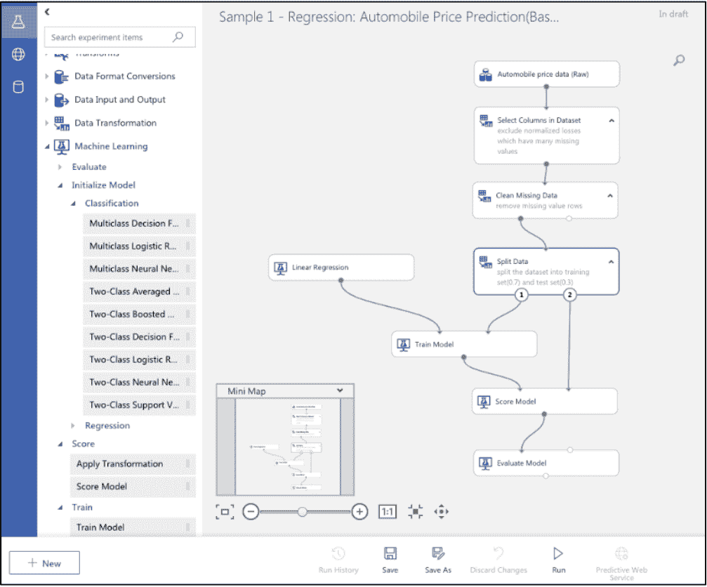
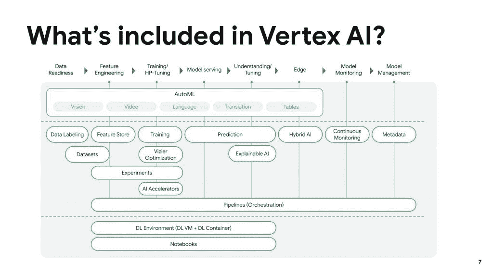

# 近距离观察基于云的机器学习平台:微软 Azure ML、谷歌 Vertex AI

> 原文：<https://thenewstack.io/a-close-look-at-cloud-based-machine-learning-platforms-microsoft-azure-ml-google-vertex-ai/>

本周，新的堆栈启动了一个“深入探讨”系列，研究主要云提供商的机器学习即服务产品，作者是分析师

[Janakiram MSV](https://thenewstack.io/author/janakiram/)

。今天的评论着眼于 Azure 机器学习服务和谷歌顶点人工智能，跟进

[yesterday’s post](https://www.thenewstack.io/series-a-close-look-at-cloud-based-machine-learning-platforms)

其中包括方法论和对 Amazon Sage Maker 的评论。周四回来看看他对 IBM 和 Oracle 的机器学习平台的看法。

这是 ML PaaS 系列的第二部分，在这里我们探索 Azure 机器学习服务和 Google 的 Vertex AI 平台。

我们遵循相同的框架，将这些平台的功能和服务分为机器学习的五个阶段。

## 天蓝色 ML

Azure 机器学习是首批基于云的 ML PaaS 之一。自 2016 年推出以来，微软一直在为 Azure ML 服务添加许多新功能和能力。在目前的形式下，Azure ML 是公共云中最完整、最健壮的 ML 平台之一。

Azure ML Studio 提供了在 Azure 门户内管理端到端机器学习任务的用户体验。

### 准备

Azure ML 中的数据可以通过 [Azure Data Factory](https://azure.microsoft.com/en-in/services/data-factory/) 从各种数据源获取，包括 Azure Blob 容器、Azure 数据湖、Azure SQL 数据库和 Databricks 文件系统。一旦摄入，数据集可以很容易地通过熊猫模块处理。对于需要并行化的大型数据集，可以使用 Apache Spark、Modin 或 Dask 进行预处理。

### 建设

Azure ML 有一个工作空间的概念，它包含机器学习项目的所有资产，包括数据集、笔记本、模型和部署。数据科学家和开发人员可以在工作区内启动 Jupyter 笔记本。Azure ML 的 Python SDK 提供了对存储、计算和其他托管服务的编程访问。

Azure ML Studio 附带了一个基于可视化设计器的低代码/无代码环境，用于构建 ML 管道。通过拖放界面，可视化设计器简化了 ML 模型的构建。

### 火车

Azure ML 将存储和计算资源从培训环境中分离出来。一旦访问并加载了经过处理的数据集，就可以利用预先调配的计算集群来启动培训作业。

Azure ML 还支持使用开发人员工作站或远程数据中心的计算资源进行培训。

每个培训作业都在一个实验的上下文中运行。一个实验包含一个或多个训练作业的运行。每次运行代表训练的一次迭代，这导致一组度量和训练模型。开发人员可以根据准确性和精确度等指标从其中一次运行中选择最佳模型。

Azure ML 可以启动运行高端 CPU 和 GPU 基础设施的 Azure 虚拟机集群。可以从工作区访问该集群来安排培训作业。

Azure ML 的 [AutoML](https://azure.microsoft.com/en-in/services/machine-learning/automatedml/) 功能提供了自动化的特性工程、模型选择和超参数调整。Azure 中的 AutoML 支持分类、回归和预测任务。

### 部署

经过训练的机器学习模型被部署为云中或本地的 web 服务。Azure ML 客户还可以将模型部署到 Azure 物联网边缘设备。部署使用 CPU、GPU 或现场可编程门阵列(FPGA)进行推理。

Azure ML 利用容器和 Kubernetes 来部署模型。模型可以公开为运行在 Azure 容器实例、Azure Kubernetes 服务或本地计算环境中的 web 服务。

可以通过 Python SDK、Azure 门户或 CLI 启动部署。

### 经营

AzureML 支持数据漂移和模型漂移的检测。

[模型监控](https://docs.microsoft.com/en-us/azure/machine-learning/how-to-enable-app-insights)使客户能够了解什么数据被发送到模型，以及它返回的预测。可以从部署在 Azure Kubernetes 服务或 Azure Container 实例中的模型收集数据，这些数据可用于检测模型漂移。

收集的数据和指标也可以发送到 Azure Application Insights 进行实时监控。

## 顶点人工智能

在最近举行的 I/O 2021 大会上，谷歌推出了 Vertex AI，这是运行在谷歌云上的 ML PaaS 的改进版本。Vertex AI 将多个与 AI 相关的托管服务置于一个保护伞之下。谷歌云有两种不同的人工智能服务——AutoML 和定制模型管理，通过云人工智能平台提供。除了这两个服务的统一，Vertex AI 还增加了全新的功能，包括边缘管理器、功能存储、模型监控和 Vizier。这些新功能填补了谷歌人工智能产品组合中存在的关键空白。

让我们进一步了解顶点 AI。

### 准备

Vertex AI 有一个统一的数据准备工具，支持图像、表格、文本和视频内容。上传的数据集存储在 Google 云存储桶中，作为 AutoML 和定制培训作业的输入。

[人工智能平台数据标签服务](https://cloud.google.com/ai-platform/data-labeling/docs)让客户与人类标签员合作，为你可以在机器学习模型中使用的数据集合生成高度准确的标签。标注服务的工作流程包括上传原始数据集、标注集以及标注人员识别标注并将其应用到数据集的说明。

### 建设

Vertex AI 拥有 [Python SDK](https://googleapis.dev/python/aiplatform/latest/index.html) ，可用于从 Jupyter 笔记本、Colab 环境甚至内部环境中访问数据集。

Vertex AI 提供了 Docker 容器图像，开发人员可以将其作为预构建的容器来运行，以进行定制培训。这些容器由机器学习(ML)框架和框架版本组织，包括可以在训练代码中使用的公共依赖项。还可以构建一个自定义容器，并将其上传到 Google 容器注册中心。Vertex AI 中的自定义作业规范包括数据集、预构建或自定义容器、Google 计算引擎机器类型和自定义培训代码的集合。

Vertex AI 附带了一个集成的 Jupyter 笔记本环境，该环境可以基于由 GPU 支持的 GCE 实例。笔记本环境可以基于预先构建的或定制的容器映像来创建。

### 部署

Vertex AI 提供了 Docker 容器图像，开发人员可以将这些图像作为预构建的容器来运行，以提供来自经过训练的模型工件的预测。这些容器由机器学习(ML)框架和框架版本组织，提供 HTTP 预测服务器，可用于以最少的配置提供预测。

Google 供应商为 TensorFlow、XGBoost、Scikit-learn 预测预建了容器。对于其他框架，开发人员可以构建自定义的预测容器映像。在作为端点发布之前，开发人员将把容器图像和推理代码一起上传到平台。推理代码执行发送到模型和从模型接收的数据的预处理和后处理。

容器映像和推理代码在计算引擎 VM 中被调度，用于执行在线或批量预测。

部署可以从谷歌云控制台完成，也可以通过云 AI 平台的 Python SDK 完成。

### 经营

Vertex AI 支持在同一模型的两个不同版本上执行 A/B 测试的流量分割。这有助于在完全从旧模型切换之前评估新模型的准确性。

将模型部署到生产环境中后，提供给模型进行预测的输入数据通常会发生变化。当预测输入数据偏离模型的定型数据时，即使模型本身没有变化，模型的性能也会下降。

顶点人工智能监控支持分类和数字特征的特征倾斜和漂移检测。当生产中的要素数据分布不同于用于训练模型的要素数据分布时，就会出现训练服务偏差。当生产中的要素数据分布随时间发生显著变化时，会发生预测漂移，从而影响整体模型性能。

Vertex AI 将模型预测指标导出到云监控。客户可以使用云监控来创建控制面板或基于指标配置警报。每秒预测数、预测错误百分比、总延迟持续时间是模型监控捕获的一些指标。

在本系列的最后一部分，我们将了解 IBM Cloud Pak for Data 和 Oracle Machine Learning。敬请关注。

<svg xmlns:xlink="http://www.w3.org/1999/xlink" viewBox="0 0 68 31" version="1.1"><title>Group</title> <desc>Created with Sketch.</desc></svg>