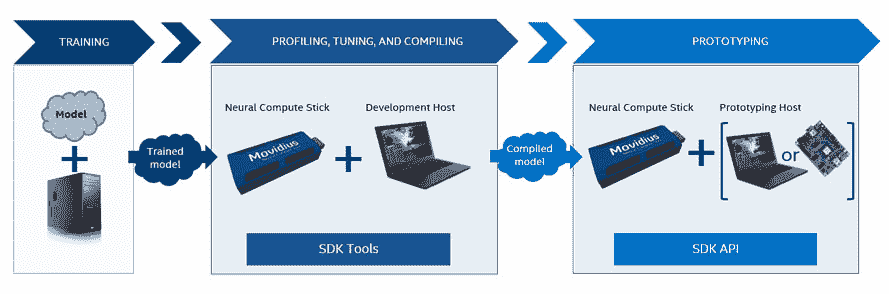

# 深入了解英特尔 Movidius 神经计算棒

> 原文：<https://thenewstack.io/a-closer-look-at-intel-movidius-neural-compute-stick/>

英特尔正专注于优化其处理器，以推理机器学习模型。无论模型在哪里训练，英特尔都希望在它的基础设施上完成推理。

这一战略的核心是 Myriad Vision Processing Unit (VPU)，这是一种基于卷积神经网络(CNN)加速视觉计算的人工智能优化芯片。据英特尔称，Myriad VPUs 拥有用于高质量图像处理、计算机视觉和深度神经网络的专用架构，使其适合在现代智能设备中驱动以视觉为中心的高要求混合任务。

虽然 Myriad 是一种片上系统(SoC)板，但英特尔已经将相同的技术扩展到了 [Movidius 神经计算棒](https://software.intel.com/en-us/neural-compute-stick) (NCS)。这些设备看起来像 USB 棒，可以轻松地连接到英特尔 NUC 或 Raspberry Pi 等边缘设备。

目前，市场上有两种版本的 NCS 设备。NCS 2，最新版本于 2018 年末推出。上一代 NCS 设备仍可在市场上买到，并继续解决其特有的情况。本文详细介绍了英特尔 Movidius NCS 1 的硬件和软件架构。

## 英特尔 NCS 1

第一代神经计算棒在边缘改变了 ML 模型推理的面貌。它基于英特尔 Movidius Myriad 2 VPU，这是一款高性能、始终在线的设备，在数百万台智能安全摄像机、手势控制无人机、工业机器视觉设备和其他产品中均有使用。它配备了 12 个流混合架构矢量引擎(SHAVE)内核，可以并行运行计算。

英特尔 NCS 1 可以连接到 Ubuntu 16.04 PC 或运行 Raspbian Stretch 操作系统的 Raspberry Pi。

在基于英特尔 NCS 1 的边缘设备上运行深度学习模型涉及三个步骤:

1.  使用 TensorFlow 或 Caffe 在基于 GPU 的基础架构上训练模型
2.  将经过训练的模型优化为编译后的图形，以便在英特尔 Movidius 上运行
3.  将图表加载到设备上进行推理

第一步通常通过利用 GPU 支持的深度学习平台在云中执行。

一旦开发人员评估了训练好的模型的性能和准确性，就需要为 Movidius 编译和优化模型。对于第二步，英特尔建议使用连接到 NCS1 的 Ubuntu 16.04 开发机器。GitHub 上的一个开源项目[神经计算 SDK](https://github.com/movidius/ncsdk) (NCSDK)，附带了所有的工具和库，可以从 TensorFlow 和 Caffe 模型生成图形。

一旦生成了优化的模型，它就以编程方式加载到 NCS 中，以加速推理。英特尔 NCSDK 自带 Python 和 C++库来处理这一过程。

NCSDK 有一个名为 API 模式的子集，它排除了优化模型所需的工具。当在边缘设备(如 Raspberry Pi)上使用 NCS 时，我们可以在仅 API 模式下配置 SDK，该模式带有一组最少的库，只够将模型加载到棒上。

NCSDK V2，最新版本包括简化的工具和 SDK。不幸的是，它不能向后兼容以前的版本。但是，V1 的一个垫片使得将现有代码移植到 V2 变得容易。

英特尔在 Moviduis 上做的最好的事情是创建了[模型动物园](https://github.com/movidius/ncappzoo)，一个模型仓库。这些型号针对 Movidius 进行了全面优化，随时可以使用。对于大多数场景，现有模型可以很容易地扩展和定制。

## 英特尔 NCS 2

去年 11 月推出的神经计算棒 2 是该设备的最新化身。它由 Myriad X VPU 提供动力，配有 16 个剃须芯。英特尔声称它比以前的版本至少快 8 倍。

与 NCS 1 不同，这款设备没有一套专属的工具和 SDK。英特尔在 [OpenVINO Toolkit](https://software.intel.com/en-us/openvino-toolkit) 中增加了 NCS 2 支持，这是一个优化 ML 模型的软件平台。新的工具包是为其他硬件平台构建的，包括英特尔 Arria 和 FPGA 运行时环境。

OpenVINO Toolkit 的英特尔发行版支持 Ubuntu、CentOS 和 Yocto Linux 发行版以及 Microsoft Windows 和 Raspbian 32 位操作系统。

英特尔正在逐步将 OpenVINO Toolkit 转变为模型优化和推理的统一平台。

像 NCSDK 一样，OpenVINO Toolkit 包括从 TensorFlow、Caffe 和 Apache MXNet 模型生成中间表示(IR)的工具。它还支持[开放式神经网络交换](https://onnx.ai) (ONNX)，用于跨多个框架导入和导出深度学习模型。

在本文的下一部分，我将向您展示如何将英特尔神经计算棒与 Raspberry Pi 配合使用。我们将把一个 Caffe 模型转换成一个为推理而优化的图。敬请关注。

*贾纳基拉姆·MSV 的网络研讨会系列“[机器智能和现代基础设施(MI2)](https://mi2.janakiram.com) ”提供了涵盖前沿技术的信息丰富、见解深刻的会议。[注册](https://mi2.janakiram.com)参加即将举行的 MI2 网络研讨会，深入了解如何利用英特尔 Movidius 加速机器学习推理。*

<svg xmlns:xlink="http://www.w3.org/1999/xlink" viewBox="0 0 68 31" version="1.1"><title>Group</title> <desc>Created with Sketch.</desc></svg>