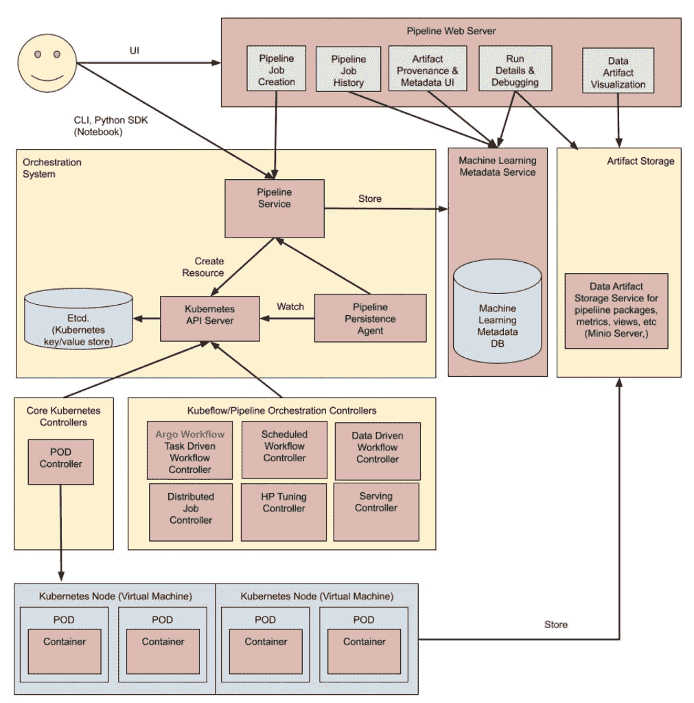
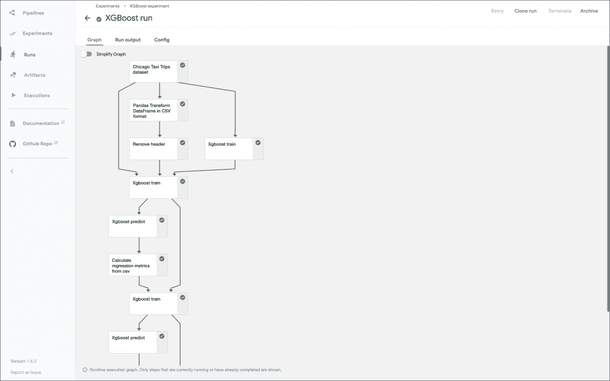
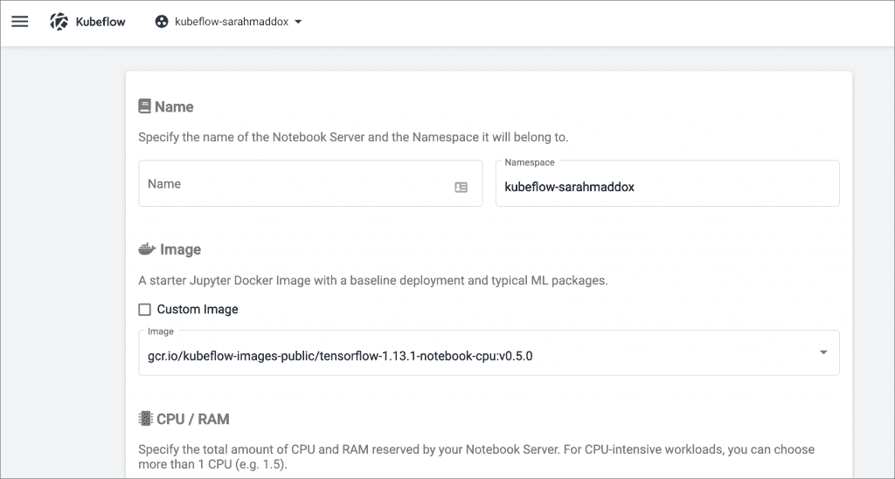
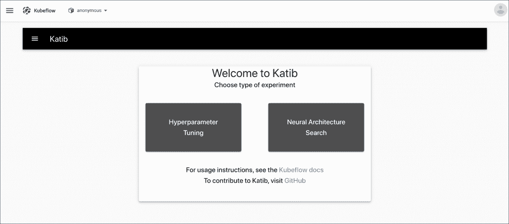

# 进一步了解 Kubeflow 组件

> 原文：<https://thenewstack.io/a-closer-look-at-kubeflow-components/>

本文是探索 Kubeflow 机器学习平台系列文章的第二篇。请每周五回来查看未来的分期付款。（

[Part 1](https://thenewstack.io/kubeflow-where-machine-learning-meets-the-modern-infrastructure/)

和

[Part 2](https://thenewstack.io/tutorial-install-kubernetes-and-kubeflow-on-a-gpu-host-with-nvidia-deepops/)

)

在本系列的[最后一部分](https://thenewstack.io/tutorial-install-kubernetes-and-kubeflow-on-a-gpu-host-with-nvidia-deepops/)中，我带您完成了 [Kubeflow](https://www.kubeflow.org/) 到 [DeepOps](https://github.com/NVIDIA/deepops) 的设置过程，这是在 NVIDIA GPU 主机上部署 Kubernetes 和 Kubeflow 的推荐工具之一。

本文介绍了 Kubeflow 的基本构件及其在 MLOps 中的意义。

Kubeflow 的开箱即用安装带有管道、笔记本服务器、Katib 和 KFServing。让我们来看看这些组件。

## 库伯弗洛管道公司

训练一个[机器学习](https://thenewstack.io/category/machine-learning/)模型的过程是高度迭代的。由于研究人员和工程师采用试错法来获得准确的模型，因此它经常被比作科学实验。

模型训练不仅是重复性的，还需要持之以恒。ML 工程师需要一种机制来调整一些参数，同时保留所有以前的实验值。他们可能还想比较和对比每次迭代的结果，以决定哪个实验产生最好的结果。

训练机器学习模型涉及按顺序运行多个步骤，有时是并行运行。数据采集、数据处理、数据准备、模型训练、模型评估、超参数调整和模型部署是模型生命周期的各个阶段。一个步骤的输出成为另一个步骤的输入。例如，在数据准备阶段，数以万计的图像被调整大小、增强并转换为诸如 TFRecord (TensorFlow)或 Image IO (Apache MXNet)的格式，这些格式在下一步中由模型训练访问。训练步骤可以并行运行，利用可用的 GPU/CPU 基础设施来加速该过程。

基于云的机器学习平台，如 Amazon SageMaker 和 Azure ML，为执行 MLOps 提供了集成的管道功能。他们让工程师独立定义管道的每个步骤，并将它们无缝连接起来，形成一个管道。鉴于容器的模块化和可移植性，这些平台将管道的每一步都映射到容器映像就不足为奇了。对象存储是在管道组件之间共享工件的首选持久层。

开源机器学习平台 Kubeflow 提供了与基于云的企业 ML 平台类似的管道功能。

管道是对 ML 工作流的描述，包括所有工作流组件以及它们如何以图形的形式组合。管道包括运行管道所需的输入(参数)以及每个组件的输入和输出的定义。管道组件是一组自包含的用户代码，打包为容器映像，执行管道中的一个步骤。

Kubeflow 管道可以通过 YAML 规范、Python SDK 或通过注释现有的 Python 代码或 Jupyter 笔记本来定义。YAML 文件是参与管道的容器映像、每个容器的入口点以及保存工件的位置的声明。

Kubeflow 管道有四种接口:

1)库巴流管道 UI
2)库巴流管道 CLI
3)库巴流管道 SDK
4)库巴流管道 API

Kubeflow 管道支持导入和导出管道。例如，在公共云中运行的管道定义可以导入到在本地运行的 Kubeflow 环境中。可以将整个管道导出到一个 tarball 中，并导入到另一个环境中。

Python SDK 和 API 提供了对管道运行时的编程访问。它们使得扩展现有的 Python 应用程序来利用工作流成为可能。

Kubeflow 管道严重依赖于容器映像、 [Argo Workflow](https://github.com/argoproj/argo-workflows) 用于编排、 [MinIO](https://min.io/?utm_content=inline-mention) 用于持久化，以及各种 Kubernetes 资源，如控制器。

在本系列即将发布的教程中，我将带您浏览一个使用 Kubeflow 管道来训练和部署模型的端到端场景。

## 笔记本服务器

Jupyter Notebook 环境已经成为开发数据驱动应用程序的首选开发环境。与传统开发工具不同，Jupyter 笔记本简化了数据科学家和工程师之间的协作。

Kubeflow 以 Kubeflow 笔记本服务器的形式提供了一个集成的 Jupyter 笔记本平台。与 Jupyter 的独立版本不同，Kubeflow 支持基于角色的访问控制(RBAC ),用于对笔记本的细粒度访问。管理员可以为每台笔记本电脑服务器定义具有不同权限的角色。

虽然 Kubernetes 没有严格的多租户，但 Kubeflow Notebook Server 通过名称空间和集成的 RBAC 带来了环境之间的强大隔离。

每台笔记本服务器都基于一个容器映像，该映像带有数据科学家团队所需的库、框架和工具。这种方法使管理员能够基于容器构建多样化的环境，以满足每个团队的需求。比如执行数据准备的团队会推出一个基于 CPU 的笔记本服务器，而模型训练团队会有一个针对 GPU 优化的自定义 TensorFlow 镜像。笔记本服务器可以指向带有映像的私有或公共容器注册表。

在幕后，每台笔记本服务器都转换成一个 Kubernetes StatefulSet。StatefulSet 的每个 Pod 可以附加到专用的持久性卷声明(PVC)和共享 PVC。专用 PVC 充当主目录，存储特定于用户的工件和数据。相比之下，共享 PVC 跨多个 pod 安装，以共享数据集和其他工件。Kubeflow 需要一个容器存储后端，如 NFS，支持多个 pod 的读/写操作(RWX)。

Kubeflow 笔记本服务器是一个面向数据科学家和工程师的强大的协作开发环境。我将有一个专门的教程来演示如何在 Kubeflow 上设置、配置和使用 Jupyter 笔记本。

## 卡蒂卜

如前所述，训练机器学习模型是一个迭代的过程。训练的一个关键方面是超参数调整，它影响模型的准确性和精度。

超参数是控制模型训练过程的变量。当训练基于深度学习的模型时，学习速率参数、神经网络中的层数和每层中的节点数定义准确度。它们可能需要在每次实验中进行调整，以评估和选择最佳组合。

总之，超参数调整优化了超参数值，以最大化模型的预测准确性。

Kubeflow 的组件 Katib 为深度学习模型提供超参数调优。它在每个超参数调优作业(实验)中运行几个训练作业(称为试验)。每次试验测试一组不同的超参数配置。实验结束时，Katib 输出超参数的优化值。

除了超参数调整，Katib 还提供了神经结构搜索(NAS)功能，旨在最大限度地提高模型的预测准确性和性能。超参数调整和 NAS 都是 AutoML 的子集，AutoML 是一种提供低代码/无代码方法来训练复杂机器学习模型的技术。

Katib 使用主流的 ML 框架，包括 TensorFlow、Apache MXNet 和 PyTorch。它有一个 Python SDK，使得将超参数调优与 Kubeflow 管道和笔记本服务器集成成为可能。

Katib 值得进行详细的讨论和演练，我计划在本系列的另一篇文章中对此进行介绍。

## KFServing

模型服务通过标准 API 为应用程序提供一个经过全面训练的模型，以集成机器学习功能。这是 MLOps 管道中的关键阶段之一。

Kubernetes 是大规模部署 API 和 web UI 的成熟平台之一。因为模型服务转化为 API，所以在 Kubernetes 中部署它是有意义的。KFServing 在模型服务组件和 Kubernetes 之间架起了一座桥梁。

Kubeflow 支持两种允许多框架模型服务的模型服务系统:KFServing 和 Seldon Core。或者，我们也可以使用独立的模型服务系统。

KFServing 和 Seldon Core 都是开放源码系统，允许多框架模型服务。

Kubeflow 上的 KFServing 为 Kubernetes 带来了 TensorFlow、PyTorch 和 MXNet 的现有模型服务组件。您可以使用 KFServing 运行支持 TensorFlow、XGBoost、Scikit-learn、NVIDIA Triton 推理服务器、ONNX 和 PyTorch 的多框架模型服务。

KfServing 可以访问存储在持久层中的模型工件，比如对象存储桶或 NFS 共享。它公开了一个定义良好的标准化 API 端点来对模型进行推理。

KFServing 可用于在线预测或批量预测。这是一个可扩展的、云原生的、多框架模型服务引擎，与 Kubeflow 紧密集成。

在本系列的下一部分中，我们将从 Kubeflow 笔记本服务器开始，我将带您创建定制的容器映像，并在 MLOps 的各个阶段使用它们。敬请期待！

<svg xmlns:xlink="http://www.w3.org/1999/xlink" viewBox="0 0 68 31" version="1.1"><title>Group</title> <desc>Created with Sketch.</desc></svg>