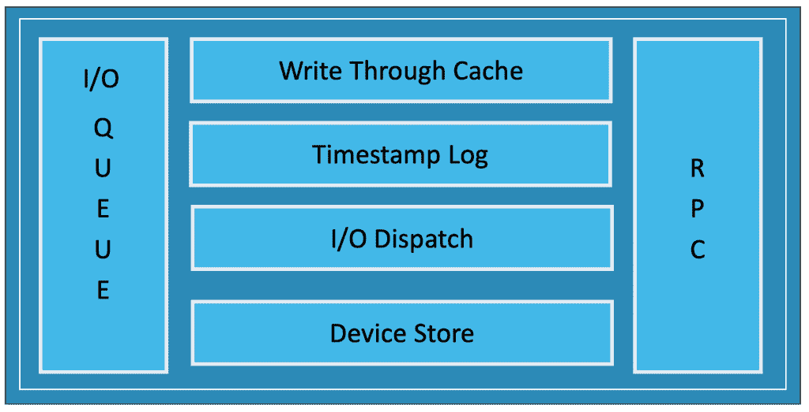

# 详细了解 Portworx 存储集群架构

> 原文：<https://thenewstack.io/a-closer-look-at-the-portworx-storage-cluster-architecture/>

Portworx 是一个现代的分布式云本地存储平台，旨在与 Kubernetes 等 orchestrators 一起工作。来自[同名公司](https://portworx.com/)的平台将一些适用于传统存储架构的成熟技术带到了云原生环境中。

继续关于有状态工作负载和云本地存储产品的系列，我将介绍 Portworx 的架构。

### 什么是波特沃克斯？

Portworx 是为容器和微服务构建的软件定义存储平台。它将多个存储设备抽象化，向云本机应用程序展示一个统一的覆盖存储层。Portworx 用户可以在数据中心的多个物理主机上部署高度可用的有状态应用程序，计算实例在多个区域、地区甚至不同的云提供商上运行。

Portworx 可以很容易地安装在任何运行容器运行时(如 Docker)的主机上。由于该平台依赖于自己的分布式服务，因此无需安装 Kubernetes 就可以配置多节点 Portworx 存储集群。但是通过与 Kubernetes 的紧密集成，Portworx 使得创建超融合或分散部署成为可能。在超融合场景中，计算和存储在同一节点上运行，而在分散场景中，只有指定的节点充当存储节点。

去年，Portworx 已经从一个覆盖存储层发展成为一个企业数据平台。当前的产品包括从集成的安全性到业务连续性，再到存储池的动态扩展。

### 波特沃克斯建筑

像大多数分布式平台一样，Portworx 实现了一个控制平面和一个数据平面。控制面板充当参与群集的所有存储节点的命令和控制中心。每个存储节点运行一个数据平面，负责管理 I/O 和连接的存储设备。

控制平面和数据平面都以分布式模式运行。这确保了存储服务的高可用性。为了实现最佳正常运行时间，Portworx 建议在一个集群中至少运行三个存储节点。根据群集的大小，每个节点可以运行控制平面和数据平面组件。在大型群集中，可能会有不参与数据平面的节点，这意味着它们不是指定的存储节点。

上图描述了一个三节点 Portworx 存储集群。控制平面在三个单独的节点上运行，这些节点共享同一个键/值数据库。该群集由控制平面的所有参与节点使用的唯一 id 来标识。当运行控制平面的新节点加入时，它应该使用相同的群集 id。

数据平面在一个或多个连接了数据块存储设备的存储节点上运行。数据平面负责管理节点级操作和跨存储节点的 I/O 重定向。

控制平面使用 gRPC 与数据平面通信。

让我们仔细看看控制平面和数据平面的组件。

### 波特沃克斯控制平面

控制平面暴露了用于管理集群的外部接口。Portworx 的本机 CLI**pxctl**使用它来执行所有与存储相关的任务，例如创建卷和存储池。像 Kubernetes 这样的编排器使用这个 to API 来协调有状态 pod 的放置和调度。

Portworx 服务 API 可作为 REST 端点、gRPC 服务以及通过容器存储接口(CSI)获得。Portworx 已经开源了 [OpenStorage SDK](https://libopenstorage.github.io/w/index.html) ，它是一个规范和一个库，定义了在云原生环境中执行的常见存储操作。SDK 绑定了 Golang 和 Python，这使得调用 API 变得很容易。Portworx 集群中还有一个 Swagger UI，可以在任何节点的端口 9021 上访问。

控制平面中的节点使用 gossip 协议跨节点发送心跳、I/O 使用情况的实时统计数据以及可用的 CPU 和内存。这种机制确保了控制平面的高可用性。来自控制平面的统计数据也与数据平面共享，这有助于做出调度决策。

集群的元数据存储在 **etcd** 中，这是一个分布式的键/值数据库。KVDB 的根由所有节点共有的集群 id 以及卷配置和节点注册状态等其他信息组成。这作为反映集群当前状态的真实的单一来源。

配置管理组件负责配置存储池、配置卷、向数据层发送安装和卸载卷的指令，甚至跨多个容错域分发存储块的副本。本质上，配置服务处理存储池和卷的生命周期。

最后，后台任务组件执行 RAID 扫描，增加 HA 计数，强制副本重新同步，并根据预定义的计划拍摄卷的快照。

### Portworx 数据平面

控制平面和数据平面通过 gRPC 协议相互对话。控制平面做出的所有决定都作为指令发送到数据平面中的相应节点。

数据平面通过 POSIX 接口对设备执行 I/O 操作。数据平面的每个节点都通过 RPC 与其他节点通信，RPC 用于跨多个节点复制数据。

在 Portworx 集群中，一个磁盘或块存储设备一次只能连接到一个承担数据路径责任的节点。

当数据被写入通过容器/pod 内的绑定挂载暴露的卷时，它通过 I/O 队列进入 Linux 内核。然后，数据进入直写缓存，最终将数据提交到磁盘。如果数据在缓存中可用，它会响应读取操作，而不会进入底层存储。每个写操作还与一个时间戳相关联，这将有助于识别所有节点上的最新数据。如果参与复制的某个节点不可用，时间戳将有助于重新同步该节点上丢失的数据。

I/O 分派组件识别具有目标存储卷的节点，并将操作重定向到该特定节点。如果一个卷有多个副本，I/O 调度程序会确保每个节点都收到一个副本。设备存储充当连接的存储和节点之间的接口。

块存储设备所连接的节点成为事务协调器。以卷为目标的 I/O 总是通过事务协调器。Portworx 还支持对所有节点可见的共享卷。即使在使用共享卷的场景中，事务协调器也负责提交写操作并向上游组件发送确认。

当在仲裁的副本上执行写操作时，Linux 内核会确认该写操作，并将其转发给用户。

Portworx 的数据平面也确保了静态数据的安全性。它是通过 dm-crypt 实现的，dm-crypt 是一个内置于 Linux 内核中的磁盘加密系统，基于加密子系统和设备映射器。在英特尔 CPU 上，Portworx 利用硬件加速将主机负担降至最低。每个写操作在提交到磁盘之前都要经过加密过程。

Portworx 有一个迷人的架构来实现一个现代化的分布式云本地存储平台。在本系列的后续文章中，我将讨论 Portworx 的安全性、定制调度、迁移、灾难恢复和动态卷管理。敬请期待！

贾纳奇拉姆·MSV 的网络研讨会系列“机器智能和现代基础设施(MI2)”提供了涵盖前沿技术的信息丰富、见解深刻的会议。在 [http://mi2.live](http://mi2.live) 注册即将到来的 MI2 网络研讨会。

Portworx 是新堆栈的赞助商。

来自 Pixabay 的 dariasophia 的特写图片。

<svg xmlns:xlink="http://www.w3.org/1999/xlink" viewBox="0 0 68 31" version="1.1"><title>Group</title> <desc>Created with Sketch.</desc></svg>