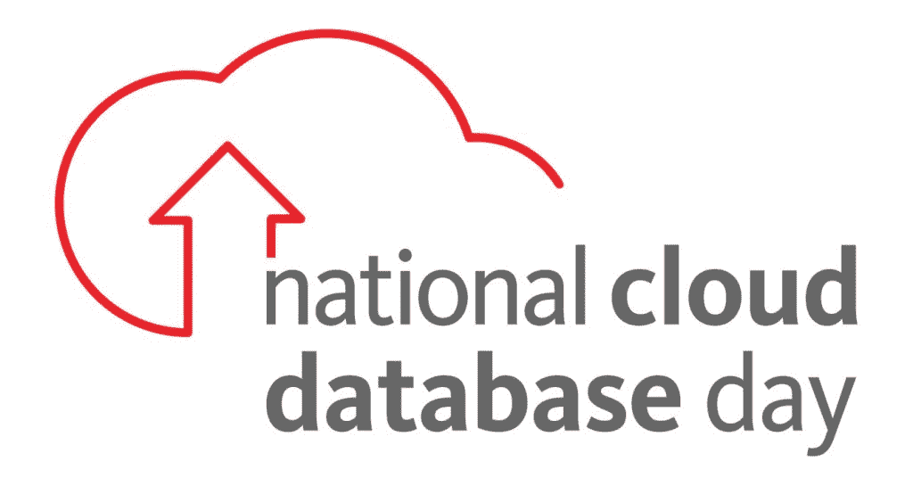

# 庆祝云数据库的一天

> 原文：<https://thenewstack.io/a-day-to-celebrate-cloud-databases/>

今天，6 月 1 日，我们庆祝首届[国家云数据库日](https://info.couchbase.com/Cloud-Database-Day.html)。运行在云中的数据库代表了许多行业和企业的重要组成部分——从运输、包裹递送、零售，一直到银行。

## **什么是云数据库？**

 [马修·格罗夫斯

马修是 Couchbase 的产品营销经理。他是《AOP in》一书的作者。他是一位 Pluralsight 作者，也是微软的 MVP。](https://www.linkedin.com/in/mgroves/) 

云数据库使组织更容易成功满足消费者不断变化的需求。该技术提供了传统数据库和大型机难以提供的可扩展性、性能、灵活性、效率和经济性。完全托管的云数据库:

*   旨在分布式扩展，在一个或多个数据中心内按需增长。
*   具有低延迟输入/输出时间，因此用户可以快速完成工作。
*   足够敏捷以适应各种用例及数据模型。
*   有效利用资源，包括磁盘、内存和网络。
*   是任何规模的团队和组织都可以采用的经济实惠的方法。

## **谁创造了这一天，为什么？**

Couchbase 已经将[国家云数据库日](https://info.couchbase.com/Cloud-Database-Day.html)定为一个注册的[假日](https://www.nationaldayarchives.com/day/national-cloud-database-day/)，在每年的 6 月 1 日庆祝。原因有三。

一个是庆祝和认可工程师、软件团队、管理员、开发人员和任何参与软件交付的人，他们已经采用并依赖云数据库来解决问题。每个参与交付软件的人都值得感谢他们的辛勤工作，尽管云数据库有望减轻他们的负担。

二是提高意识——尤其是那些还没有接受云数据库的人——云数据库对软件构建方式的好处和积极影响。有时我们想当然地认为我们每天都在享受云数据库的好处。无论是在线购物、协调医疗保健、处理财务、在社交媒体上联系、订购食品还是流媒体和视频游戏，每个人都可能受益于云数据库所带来的规模、灵活性和敏捷性。与你的同事和同事讨论你在云数据库的帮助下所做的伟大的事情。也许他们只是等着听你的指挥！

最后，要认可和欣赏那些构建云数据库软件本身的先驱个人和组织的工作。软件站在巨人的肩膀上。庆祝来自供应商、硬件制造商、工程师、早期采用者、测试人员和项目经理的令人难以置信的工作和技术进步，这些都使云数据库成为如此有效的工具。

## 我该如何庆祝？

社交媒体是一种简单的庆祝方式:使用#CloudDBDay 和#NationalCloudDatabaseDay 标签来发布你的项目和你对云数据库的参与。请随意在您的帖子中添加[官方图片](https://info.couchbase.com/rs/302-GJY-034/images/NationalCloudDatabaseDay_logo.jpg)！

写一篇博文或文章，讲述你使用云数据库的经历:优点、缺点和技巧。

向开发人员、架构师、管理员和其他任何参与云数据库软件交付的人表达你的感激之情。它可以是简单的发送一封“谢谢”的电子邮件或短信，或者给他们买一杯他们喜欢的咖啡或饮料。你还可以做得更详细:举办一个庆祝会，给你的组织中云数据库的最佳冠军颁奖或授予荣誉。

## **明年计划**

如果你在今年第一个国家云数据库日的派对上迟到了，那只意味着你已经为明年的庆祝活动开了个头。确保相应地进行规划，以显示您对数据库架构师、开发人员和管理员的欣赏和认可，他们利用云数据库来改善终端用户对始终在线和始终高性能应用程序的体验。

如果您还没有，请开始免费试用五车二，看看只需点击几次[此处](https://www.couchbase.com/products/capella?utm_source=marketo&utm_medium=lp&utm_campaign=national-cloud-db-day)即可轻松启动并运行 Couchbase 即服务。

<svg xmlns:xlink="http://www.w3.org/1999/xlink" viewBox="0 0 68 31" version="1.1"><title>Group</title> <desc>Created with Sketch.</desc></svg>