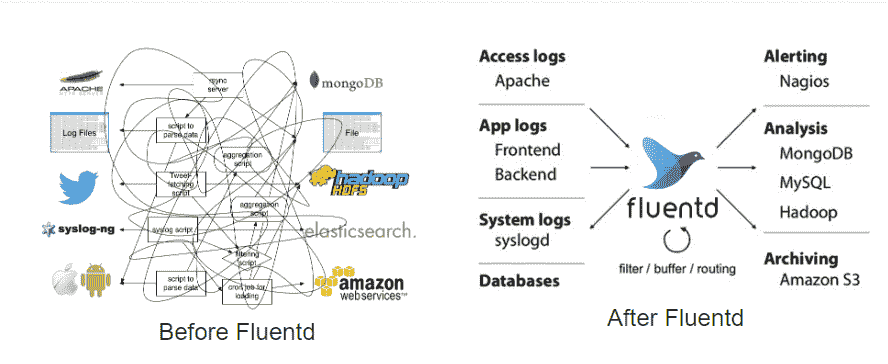

# 深入探讨构建 Kubernetes 基础架构

> 原文：<https://thenewstack.io/a-deep-dive-into-architecting-a-kubernetes-infrastructure/>

这个博客是 Kubernetes 及其生态系统系列的一部分，在这个系列中，我们将一次一个地深入研究基础设施。

到目前为止，在本系列的[中，我们探索了人们在开始使用 Kubernetes 及其生态系统时可能会遇到的各种问题，并尽最大努力回答这些问题。现在正义已经得到伸张，消除了你可能有的疑虑，现在让我们进入 Kubernetes 和整个基础设施之旅的下一个重要步骤。](https://medium.com/timecampus/infrastructure-engineering-the-first-principles-9d7748e3b3fb)

在这篇博客中，我们将着眼于为您的用例设计基础架构的最佳方式，以及您可能希望根据您的约束做出的各种决定。

## **建筑**

你的架构很大程度上围绕着你的用例，你必须非常小心地把它做好，如果需要的话，向专家进行适当的咨询。虽然在开始之前把事情做好是非常重要的，但错误还是会发生，而且随着这些天来大量研究的进行，你经常会发现任何一天都会发生任何变革，让你的旧思维方式变得过时。

这就是为什么我强烈推荐你去 **Architect for Change** 并尽可能使你的架构成为**模块化**，这样你就可以在将来需要的时候灵活地进行增量更改。

让我们看看如何实现我们的目标，即在考虑客户机-服务器模型的情况下构建我们的系统。

## **入口点:DNS**

在任何典型的基础设施中(无论是否是云本地的)，消息请求必须首先由 DNS 服务器解析，以返回服务器的 IP 地址。设置您的 DNS 应该基于您需要的可用性。如果您需要更高的可用性，您可能希望将您的服务器分布在多个地区或云提供商，具体取决于您希望实现的可用性级别。

### 内容交付网络(CDN)

在某些情况下，您可能需要在尽可能短的延迟时间内为用户提供服务，同时降低服务器的负载。这就是内容交付网络(CDN)发挥重要作用的地方。

客户机是否经常向服务器请求一组静态资产？您的目标是提高向用户交付内容的速度，同时降低服务器的负载吗？在这种情况下，服务于一组静态资产的边缘 CDN 实际上可能有助于减少用户的延迟和服务器的负载。

你所有的内容都是动态的吗？为了降低复杂性，您是否愿意在一定程度的延迟下向用户提供内容？还是你的 app 接收流量低？在这种情况下，使用 CDN 可能没有多大意义，您可以将所有流量直接发送到全局负载均衡器。但请注意，拥有 CDN 也有分散流量的优势，这在您的服务器遭受 DDOS 攻击时会有所帮助。

CDN 提供商包括 [Cloudfare CDN](https://www.cloudflare.com/cdn) 、 [Fastly](https://www.fastly.com/) 、Akamai CDN、 [Stackpath](https://www.stackpath.com/maxcdn/) 并且很有可能你的云提供商也提供 CDN 服务，比如来自谷歌云平台的 [Cloud CDN](https://cloud.google.com/cdn) 、来自亚马逊网络服务的[的](https://aws.amazon.com/?utm_content=inline-mention) [CloudFront](https://aws.amazon.com/cloudfront/) 、来自微软 Azure 的 [Azure CDN](https://docs.microsoft.com/en-us/azure/cdn/) 等等。

## **负载平衡器**

如果有一个请求无法由您的 CDN 提供服务，该请求将接着到达您的负载平衡器。这些 IP 可以是区域性的，也可以是全球性的[任播 IP](https://en.wikipedia.org/wiki/Anycast)，在某些情况下，你还可以使用负载平衡器来管理内部流量。

除了将流量路由和代理到适当的后端服务，负载均衡器还可以负责类似 [SSL 终端](https://en.wikipedia.org/wiki/TLS_termination_proxy)的工作，与 CDN 集成，甚至管理网络流量的某些方面。

虽然硬件负载平衡器确实存在，但软件负载平衡器提供了更大的灵活性、成本降低和可伸缩性。

类似于 CDNs，你的云提供商也应该能够为你提供负载均衡器(比如 GCP 的 [GLB](https://cloud.google.com/load-balancing) ，AWS 的 [ELB](https://aws.amazon.com/elasticloadbalancing/) ，Azure 的 [ALB](https://docs.microsoft.com/en-us/azure/load-balancer/) 等)。)但是更有趣的是，您可以直接从 Kubernetes 构造中提供这些负载平衡器。例如，在 GKE 创建一个入口(又名 GKE 入口)也会在幕后为您创建一个 GLB 来接收流量和其他功能，如 CDN、SSL 重定向等。也可以通过配置您的入口来设置，如这里的[所示](https://cloud.google.com/kubernetes-engine/docs/how-to/ingress-features)。

虽然您应该总是从小处着手，但负载平衡器将允许您通过以下架构进行增量扩展:

## **网络与安全架构**

在您的架构中，下一个需要注意的重要事情是网络本身。如果您想提高安全性，您可能需要一个专用集群。在那里，您可以调节入站和出站流量，屏蔽[NAT](https://en.wikipedia.org/wiki/Network_address_translation)后面的 IP 地址，隔离跨多个[VPC](https://en.wikipedia.org/wiki/Virtual_private_cloud)的具有多个[子网](https://en.wikipedia.org/wiki/Subnetwork)的网络，等等。

你如何设置你的网络通常取决于你所寻求的灵活性程度以及你将如何实现它。建立正确的网络是为了尽可能地减少攻击面，同时仍然允许常规操作。

通过设置正确的网络来保护您的基础架构还包括设置具有正确规则和限制的防火墙，以便您只允许允许的流量进出相应的后端服务，包括入站和出站。

在许多情况下，这些私有集群可以通过设置[堡垒主机](https://en.wikipedia.org/wiki/Bastion_host)并通过它们进行集群中的所有操作来进行保护，因为您必须向公共网络公开的只是堡垒(又名跳转主机)——通常设置在与集群相同的网络中。

一些云提供商也在其实现零信任安全的方法中提供定制解决方案。例如，GCP 为其用户提供了[身份感知代理](https://cloud.google.com/iap) (IAP)，可以用来代替典型的 [VPN](https://en.wikipedia.org/wiki/Virtual_private_network) 实现。

一旦解决了所有这些问题，联网的下一步将是根据您的使用情形在集群内部设置联网。

它可能涉及以下任务:

如果您想查看一些示例实现，我建议您查看[这个](https://github.com/terraform-google-modules/cloud-foundation-fabric)存储库，它帮助用户在 GCP 设置所有这些不同的网络模型，包括[通过对等](https://github.com/terraform-google-modules/cloud-foundation-fabric/blob/master/networking/hub-and-spoke-peering)的中心和分支、[通过 VPN](https://github.com/terraform-google-modules/cloud-foundation-fabric/blob/master/networking/hub-and-spoke-vpn) 的中心和分支、 [DNS 和 Google Private Access for on-premises](https://github.com/terraform-google-modules/cloud-foundation-fabric/blob/master/networking/onprem-google-access-dns)、[共享 VPC 并支持 GKE](https://github.com/terraform-google-modules/cloud-foundation-fabric/blob/master/networking/shared-vpc-gke)、 [ILB 作为下一跳](https://github.com/terraform-google-modules/cloud-foundation-fabric/blob/master/networking/ilb-next-hop)等等，所有这些都使用 [Terraform](https://www.terraform.io/)

云中联网的有趣之处在于，它不需要仅限于您所在地区的云提供商，而是可以根据需要跨越多个地区的多个提供商。这就是像 kube fed(T21)或 Crossplane(交叉平面)这样的项目能有所帮助的地方。

如果您想了解更多关于设置 VPC、子网和整体网络的最佳实践，我建议您浏览[本页](https://cloud.google.com/solutions/best-practices-vpc-design)，同样的概念适用于您所在的任何云提供商。

如果你使用的是像 GKE、EKS、AKS 这样的托管集群，那么 Kubernetes 是自动管理的，从而为用户降低了很多复杂性。

如果您自己管理 Kubernetes，您需要处理许多事情，例如备份和加密 etcd 存储，在集群中的各个节点之间建立网络，定期使用最新版本的操作系统修补您的节点，管理集群升级以与上游 Kubernetes 版本保持一致。只有当你有能力让一个专门的团队来做这件事的时候，才推荐这样做。

## **【SRE】**

当您维护一个复杂的基础设施时，拥有正确的可观察性堆栈非常重要，这样您甚至可以在用户注意到错误之前就发现错误，并预测可能的变化，识别异常并能够深入到问题的确切位置。

现在，这需要您有代理来公开特定于工具或应用程序的指标，以进行收集分析(可以遵循推或拉机制)。如果你在 sidecars 中使用服务网格，它们通常会提供度量标准，而你自己不需要做任何定制的测试。

在任何这样的场景中，像 [Prometheus](https://prometheus.io/) 这样的工具可以充当时间序列数据库，为您收集所有指标，还有像 [OpenTelemetry](https://opentelemetry.io/) 这样的工具，使用内置的导出器从应用程序和各种工具中公开指标。像 [Alertmanager](https://github.com/prometheus/alertmanager) 这样的工具可以向多个渠道发送通知和警报，而 [Grafana](https://grafana.com/) 将提供仪表板，以便在一个地方可视化所有内容，使用户能够全面了解整个基础架构。

总之，这就是普罗米修斯的可观测性堆栈的样子:

(来源:https://prometheus.io/docs/introduction/overview/)

拥有这样的复杂系统还需要使用日志聚合系统，这样所有的日志都可以流到一个地方，以便于调试。这就是人们倾向于使用 ELK 或 EFK 堆栈的地方，使用 [Logstash](https://www.elastic.co/logstash) 或 [FluentD](https://www.fluentd.org/) 来根据您的约束为您进行日志聚合和过滤。但是这个领域也有新的玩家，比如洛基和 T21。

像 FluentD 这样的日志聚合系统就是这样简化我们的架构的:

(来源:https://www.fluentd.org/architecture)

但是跨多个微服务和工具跟踪您的请求怎么样呢？这就是分布式跟踪变得非常重要的地方，尤其是考虑到微服务带来的复杂性。像 [Zipkin](https://zipkin.io/) 和 [Jaeger](https://www.jaegertracing.io/) 这样的工具是这个领域的先锋，最近进入这个领域的是 [Tempo](https://grafana.com/oss/tempo/) 。

虽然日志聚合会给出来自各种来源的信息，但它不一定给出请求的上下文，这正是进行跟踪真正有用的地方。但是请记住，将跟踪添加到堆栈中会显著增加请求的开销，因为上下文必须随请求一起在服务之间传播。

典型的分布式跟踪体系结构如下所示:

(来源:https://www.jaegertracing.io/docs/1.21/architecture/)

但是，站点可靠性并不仅限于监控、可视化和警报。您必须做好准备，通过定期备份和故障转移来处理系统中任何部分的任何故障，以便没有数据丢失或最大限度地降低数据丢失的程度。这就是像 [Velero](https://velero.io/) 这样的工具发挥主要作用的地方。

Velero 通过利用您使用的相同 Kubernetes 构造，帮助您维护集群中各种组件的定期备份，包括您的工作负载、存储等。这是 Velero 建筑的样子:

(来源:https://velero.io/docs/v1.5/how-velero-works/)

正如您所注意到的，有一个备份控制器会定期对对象进行备份，并根据您设置的计划以一定的频率将它们推送到特定的目的地。这可用于故障切换和迁移，因为几乎所有对象都已备份。

## **存储**

有许多不同的[存储供应器](https://kubernetes.io/docs/concepts/storage/storage-classes/#provisioner)和文件系统可用，它们在不同的云提供商之间有很大差异。这需要一个像[容器存储接口(CSI)](https://kubernetes-csi.github.io/docs/introduction.html) 这样的标准，它有助于将大多数卷插件从树中推出，从而使其易于维护和发展，而核心不会成为瓶颈。

这是支持各种卷插件的 CSI 架构的典型外观:

(来源:https://kubernetes . io/blog/2018/08/02/dynamic-expand-volume-with-CSI-and-kubernetes/)

分布式存储带来的集群、扩展和其他各种问题怎么办？

这就是像 Ceph 这样的文件系统已经证明了自己的地方，尽管考虑到 Ceph 不是在考虑 Kubernetes 的情况下构建的，并且很难部署和管理，这就是像 [Rook](https://rook.io/) 这样的项目也可以有所帮助的地方。

而 Rook 不耦合到 Ceph，支持其他文件系统，如 EdgeFS、NFS 等。同样，Rook 和 Ceph CSI 就像是天作之合。这是带有 Ceph 的 Rook 的架构的样子:

(来源:https://rook.io/docs/rook/v1.5/ceph-storage.html)

如您所见，Rook 负责在 Kubernetes 集群中安装、配置和管理 Ceph。存储空间会根据用户偏好自动分布在下面。所有这些都发生在应用程序不暴露任何复杂性的情况下。

## **图像注册表**

注册表为您提供了一个用户界面，您可以在其中管理各种用户帐户、推送/拉取映像、管理配额、通过 webhooks 获得事件通知、进行漏洞扫描、对推送的映像进行签名，以及处理镜像或跨多个映像注册表复制映像等操作。

如果您使用云提供商，他们很有可能已经提供了图像注册服务(例如 [GCR](https://cloud.google.com/container-registry) 、 [ECR](https://aws.amazon.com/ecr/) 、 [ACR](https://azure.microsoft.com/en-in/services/container-registry/) 等)。)这消除了许多复杂性。如果你的云提供商没有提供，你也可以使用第三方注册中心，比如 [Docker Hub](https://hub.docker.com/) 、 [Quay](https://quay.io/) 等。

但是，如果您想托管自己的注册表呢？

如果您希望在内部部署注册表，希望对注册表本身有更多的控制，或者希望降低与漏洞扫描等操作相关的成本，这可能是必需的。

如果是这种情况，那么像 [Harbor](https://goharbor.io/) 这样的私有图像注册中心可能会有所帮助。这是海港建筑的样子:

(来源:https://go harbor . io/docs/1.10/install-config/harbor-ha-helm/)

Harbor 是一个 [OCI](https://opencontainers.org/) 兼容的注册中心，由各种开源组件组成，包括 [Docker registry V2](https://docs.docker.com/registry/) ，Harbor UI， [Clair](https://github.com/quay/clair) ，以及[公证人](https://github.com/theupdateframework/notary)。

## CI/CD 架构

Kubernetes 是一个很好的平台，可以托管任何规模的所有工作负载，但这也需要一种标准的方法来部署具有简化的持续集成/持续交付(CI/CD)工作流的应用程序。这就是建立这样的管道真正有用的地方。

一些第三方服务，如 [Travis CI](https://www.travis-ci.com/) 、 [Circle CI](https://circleci.com/) 、 [Gitlab CI](https://docs.gitlab.com/ee/ci/) 或 [Github Actions](https://github.com/features/actions) ，包含自己的 CI 运行器。您只需定义您希望构建的管道中的步骤。这通常包括:构建映像、扫描映像以查找可能的漏洞、运行测试并将其推送到注册表，在某些情况下，还包括提供预览环境以供审批。

现在，如果您正在管理自己的 CI 运行程序，这些步骤通常是相同的，但是您需要配置它们，以便在您的集群内部或外部进行设置，并具有适当的权限[将资产推送到注册中心](https://skaffold.dev/docs/tutorials/ci_cd/)。

## 结论

我们已经讨论了基于 Kubernetes 的云本地基础设施的架构。正如我们在上面看到的，各种工具解决基础设施的不同问题。它们就像乐高积木，每个都专注于手头的一个具体问题，为你抽象出许多复杂性。

这允许用户以一种递增的方式利用 Kubernetes，而不是一次全部使用，根据您的用例从整个堆栈中只使用您需要的工具。

如果您有任何问题或寻求帮助或咨询，请随时联系我 [@techahoy](https://www.twitter.com/techahoy) 或通过 [LinkedIn](https://www.linkedin.com/in/tvvignesh) 。

<svg xmlns:xlink="http://www.w3.org/1999/xlink" viewBox="0 0 68 31" version="1.1"><title>Group</title> <desc>Created with Sketch.</desc></svg>