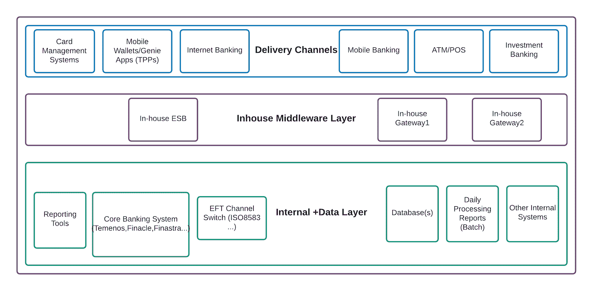
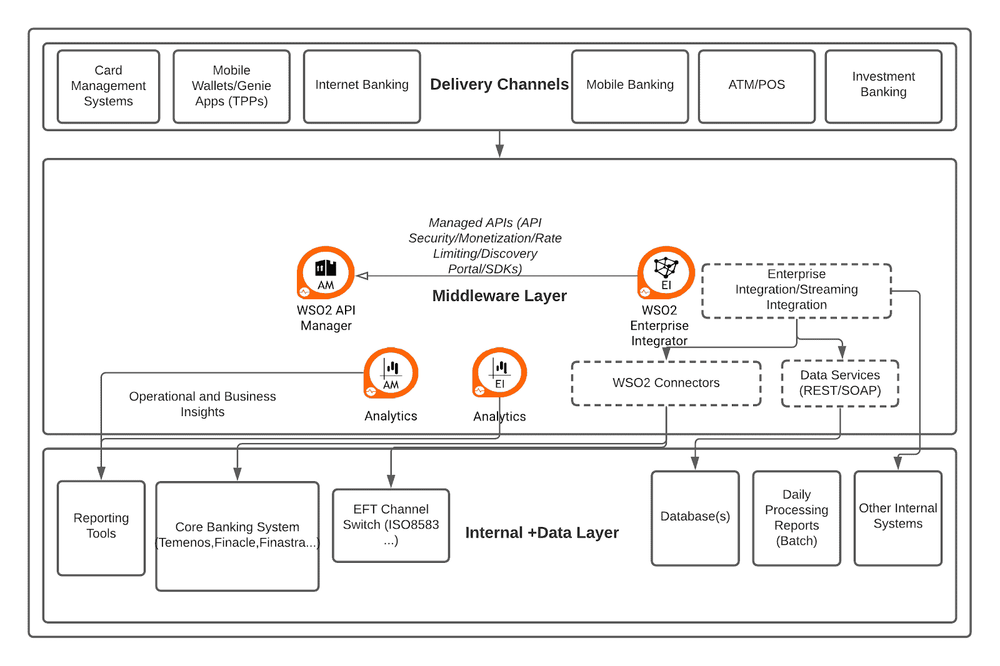

# 银行业的数字化转型之旅

> 原文：<https://thenewstack.io/a-digital-transformation-journey-in-the-banking-sector/>

[Himasha Guruge](https://www.linkedin.com/in/himashag/)

[Himasha 是 WSO2 的一名助理首席解决方案工程师，在集成和消息软件项目上与全球企业密切合作。她参与了不同领域的有趣项目，帮助组织构建 API 主导的集成。她是一名融合福音传道者、演说家和作家。](https://www.linkedin.com/in/himashag/)

银行业不断采用现代方法和 API 主导的集成来优化运营、增加价值和提供增强的客户体验。但是，应该仔细评估这些方法，以避免风险并确保安全性。随着疫情和许多新法规的出台，如[开放银行](https://en.wikipedia.org/wiki/Open_banking)，进一步推动了对在线/数字化服务的需求，数字化转型不是一步到位的方法，而是一个敏捷的迭代过程。

根据我们的经验，将开放银行业务视为颠覆性增长机遇的银行可以超越履行监管要求、进入新市场和创造新业务模式。他们还能够利用这一计划为其组织带来数字化转型。

在银行业内构建数字化转型战略时，需要考虑两个主要重点领域:实际业务需求和满足这些需求的技术方法。

## 合并和渠道整合

将多家银行整合为一家机构有利于降低运营成本、更好地统一标准，并有助于地理位置集中的银行扩大覆盖范围。

从技术上讲，这些计划要求 IT 团队检查现有的基础设施以及合并后银行的基础设施。这是一项单调乏味的任务，因为我们要考虑各种遗留系统、特定于供应商的应用程序和内置流程——不同的协议、消息格式、业务逻辑和技术——它们应该无缝地协同工作。

## 核心金融服务的替代处理

大多数网上银行/手机银行用户都熟悉通知，告知在特定时间后进行的交易将在第二天处理。在考虑网上银行、电子资金转账(EFT)服务(例如 ATM、信用卡和借记卡)和移动银行时，支持关键服务的替代处理(24×7)可让消费者全天使用银行服务。

大多数核心银行系统通常在夜间关闭，以开始一天结束时的批处理。在核心银行系统离线之前，它会复制现有的会员/交易文件，作为临时处理期间的基础。这允许 24×7 服务照常运行。一旦夜间处理完成，在开始常规处理之前，需要将复制文件的更新处理回核心银行系统。

从技术角度来看，为了支持替代处理，需要在能够处理数据并确保没有数据丢失的专用系统中构建缓存层/存储。这需要诸如[消息转换](https://docs.wso2.com/display/IntegrationPatterns/Message+Transformation)、[文件处理](https://ei.docs.wso2.com/en/latest/micro-integrator/use-cases/tutorials/file-processing/)、数据轮询、报告、[数据即服务](https://ei.docs.wso2.com/en/latest/micro-integrator/references/synapse-properties/data-services/elements-of-a-data-service/)以及与消息代理的集成等功能。

## 开放 API 和标准

开放银行业务和额外监管的引入带来了在客户同意的情况下在其他第三方(如金融机构和金融科技)之间共享数据(如账户/支付信息)的需求，这些第三方包括区域和全球范围内的金融机构和金融科技。这种数据交换通过安全的 API 进行，让客户能够控制他们的数据，同时提供更好的服务。尽管法规和合规性在某些地区不是强制性的，但是一旦您需要向各方(尤其是您的客户)公开您的服务，API 就是银行业中的一个重要组成部分。

至少，API 应提供相应的服务质量(例如，使用标准 API 格式，如 Swagger、API 安全、速率限制、API 分析等。)并应具备 API 货币化、API 市场和 API 产品等能力。通过 API 分析获得的业务和运营洞察可以在决定这些扩张中发挥更大的作用。

## 参考银行架构

参考银行架构

银行的典型技术架构包括与上述类似的层。在顶部，这些可以包括移动银行、ATM 和 POS 操作以及网上银行(此列表可能会有所不同)。在底层，可以找到定义各种银行业务流程的所有内部应用程序和系统以及数据层。正在使用的核心银行系统(如 Temenos、Finacle、Finastra、FLEXCUBE 等。)可以连接到各种电子支付渠道，如 EPS，以及其他批处理工具和数据库。内部数据层和交付渠道之间的连接通常由一组使用各种技术/框架构建的内部解决方案来维护，这些解决方案支持点对点集成。

这描绘了一个难以维护和扩展的意大利面条式架构。当应用程序和交付渠道的数量增加时，任务重复等问题会导致效率低下，减少专注于战略增值任务的时间。

## API 主导的参考银行架构

参考架构与 WSO2 的集成平台

上图描述了在典型的银行架构中使用 [WSO2 集成平台](https://wso2.com/integration/)。然而，以下部分讨论了任何集成平台都应该提供的核心功能，以便为业务的各个方面带来动态变化，例如聚合不同的技术、采用敏捷策略以及专注于个性化客户体验。

当考虑通用集成需求时，支持企业集成模式的能力(消息路由、转换、关联、与[消息传递系统](https://docs.wso2.com/display/IntegrationPatterns/Enterprise+Integration+Patterns+with+WSO2+ESB)合并等)。)并支持各种协议和消息格式(HTTP、HTTPS、JMS、REST、SOAP、FIX、ISO8583、FTP、JSON、XML、EDI 等。)有助于银行业众多系统之间的无缝集成。仔细设计数据层并安全地公开它也是至关重要的，因为在典型的银行架构中每天都会生成各种数据库和报告。考虑公开数据层，数据层可以是各种来源/格式(数据库、电子表格、CSV 文件等。)，因为可重用的标准服务如 [REST/SOAP](https://ei.docs.wso2.com/en/latest/micro-integrator/use-cases/integration-use-case/data-integration-overview/#data-integration) 将有利于维护，并有助于无缝的未来创新。

此外，各种流程中可能涉及许多专有(遗留/云)系统，这些系统可能没有标准的服务扩展点，并且可能支持不同的消息传递格式。例如，当考虑核心银行系统时，尽管一些系统可以提供用于集成目的的标准 API(尽管一些系统以更高的订阅或通过不同版本提供 API)，但是许多系统退回到它们自己的本地协议和消息结构、认证机制(例如，在 Temenos 中使用 OFS 查询)。这变得很麻烦，因为可能有许多其他内部应用程序与核心银行解决方案相连接。对于这些应用程序中的每一个来说，维护与核心银行系统的集成流都是不可伸缩的。这突出了集成解决方案中对模板化[连接器](https://store.wso2.com/store/assets/esbconnector/list)的需求，集成解决方案通过包装任何特定于供应商的复杂性来提供服务类型的操作，因此银行只需要担心业务逻辑。

至于替代处理需求，可以使用数据服务和中介构建一个中间缓存层，其中包含开发的任何业务逻辑。首选的消息传递系统(例如 JMS 代理)可以连接到这个内部层，以确保核心银行层和中间件之间的有保证的交付。同样重要的是要注意，一旦核心银行系统恢复在线，就需要进行重新同步过程。在高层次上，一旦上线，核心银行系统需要提取任何与离线交易相关的数据，更新内部系统，并标记要处理的任何此类交易。

大多数银行不具备在其现有基础架构中实施这些必要任务所需的技术。通过提供变更数据捕获([轮询和监听模式](https://ei.docs.wso2.com/en/latest/streaming-integrator/guides/extracting-data-from-static-sources-in-real-time/#change-data-capture))和高级 ETL ( [提取-转换-加载](https://ei.docs.wso2.com/en/latest/streaming-integrator/guides/performing-etl-tasks/))可以在这样的场景中使用流集成功能。此外，当调整各种备份机制和发生的批处理操作时，大文件[处理/传输](https://ei.docs.wso2.com/en/latest/streaming-integrator/guides/extracting-data-from-static-sources-in-real-time/#extracting-data-from-files)是需要考虑的一个重要方面。围绕这些操作(如 ETL/CDC)可视化任何操作洞察/指标的能力，将有助于作为一个反馈循环来改进这些流程和故障排除。

在改进与内部数字创新的集成需求的同时，外部各方将需要访问某些服务，这突出了负责任地公开托管服务(即 API 管理)的需要。对于基于 API 的方法，确保适当的 API 安全性是关键，因为暴露的数据处于高风险中。除非法规中有明确规定，否则大多数银行都遵循基于 OAuth-token 的安全性和 OpenAPI 规范等标准。除了 API 级别的安全性之外，在为公开的[服务实现端到端认证时，应该充分考虑所有方面，例如传输层安全性、基于后端服务的安全性以及各种威胁检测和保护机制。](https://apim.docs.wso2.com/en/latest/learn/api-security/api-authentication/api-authentication-overview/#overview)还应该考虑适当的授权机制，比如 OAuth2 作用域，以确保公开的服务操作只能被预期的消费者访问。

一旦实现了具有必要服务质量的 API，就应该关注在发现、评估和实际使用这些 API 时提供给这些外部涉众的用户体验。因此，当银行希望从他们计划外部化的服务中获得收入时，可以使用以应用开发人员为中心的 [API 商店](https://apim.docs.wso2.com/en/latest/learn/consume-api/discover-apis/search/)、各种现成的 SDK、API 文档、速率限制功能，甚至是[现成的货币化](https://apim.docs.wso2.com/en/latest/learn/api-monetization/monetizing-an-api/)。

很明显，数字化转型是一个持续的过程，需要采用分阶段的方法来解决，从而使组织能够实现数字化发展。尽管上述讨论并未详尽列出银行业中出现的业务和技术需求，但它们在全球范围内非常普遍，是数字化转型之旅的基本起点。

<svg xmlns:xlink="http://www.w3.org/1999/xlink" viewBox="0 0 68 31" version="1.1"><title>Group</title> <desc>Created with Sketch.</desc></svg>