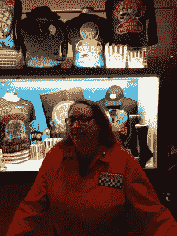
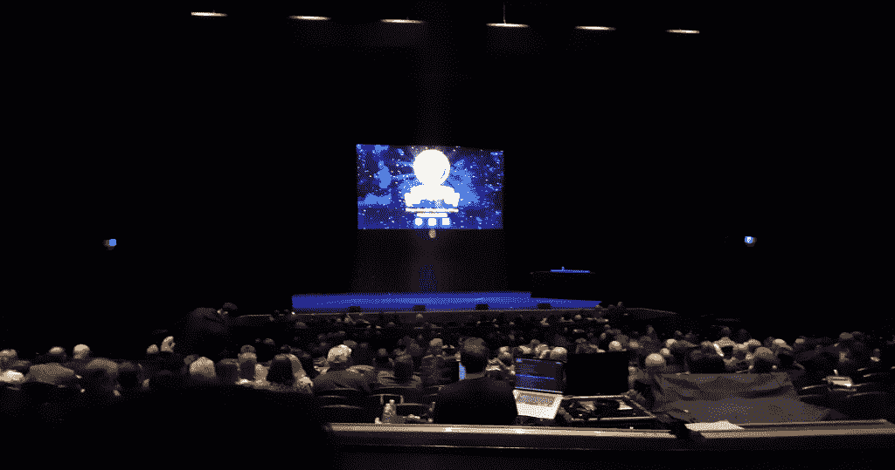

# MST3K 的创造者乔尔·霍奇森和他的傀儡机器人朋友们的告别之旅

> 原文：<https://thenewstack.io/a-farewell-tour-with-his-puppet-robot-pals-for-mst3k-creator-joel-hodgson/>

32 年前，乔尔·霍奇森(Joel Hodgson)是明尼阿波利斯当地电视台的一名 20 多岁的喜剧演员，他用机器人木偶来质问电影。但在 12 个月内，他创作的节目开始在两个不同的有线电视频道(喜剧中心和科幻频道)播放 10 年。

这是大众发现互联网的十年，旧金山的 KQED 现在认为，“神秘科学剧场 3000”节目“[预示了我们今天消费娱乐的方式](https://www.kqed.org/arts/13874130/mystery-science-theaters-joel-hodgson-on-aging-out-of-the-show)，在那个没有时髦的推特和 YouTube 咆哮的遥远时代。霍奇森拒绝被动地消费大众媒体电影，这总是有一些永恒的古怪，在他对 KQED 的采访中，霍奇森引用了围绕这部剧成长起来的“书呆子崇拜”，并描述了现在亲自与这些粉丝见面的情况。“你会遇到一些有点社交障碍的人，但我有我自己的笨拙方式，所以这种情况会有所改善。”

随着我们的媒体生态系统不断变化，经典的“MST3K”剧集现在甚至在 Twitch 上播放[。但是当一个假装的机器人科学家决定退休的时候会发生什么呢？霍奇森即将到来的发射会不会给科技界带来一些奇怪的教训，比如社区建设、遗留系统、追随你的激情以及极客的文化倾向？](https://www.twitch.tv/mst3k)

在他的最后一场现场演出中，被他的忠实粉丝包围是什么感觉？

### **更靠近心脏地带**

在圣何塞和旧金山的演出结束后，演员们来到了加利福尼亚州莫德斯托有 1200 个座位的玛丽·斯图亚特·罗杰斯剧院。

我坐在一个全家人旁边——母亲、父亲和儿子——他们从加利福尼亚的 Valley Springs 驱车 50 英里来看这场演出。(人口:3，553 人)。“我们从一开始就在观察他们，”母亲告诉我。

稍后的停靠站将包括博伊西、夏延、盐湖城和奥马哈。

每个人都被这种精神感染了——甚至连礼品店的摊主都穿着橙色制服，表明她是 Gizmonics Institute 的员工(在长期播出的电视节目中，她是霍奇森命运多舛的原雇主)。我问她，他们让你看恐怖电影吗？

“太多了，”她继续说道，“永远不要让乔尔选择电影。太奇怪了。”

很快在礼堂里，灯光暗了下来…

已经过了很久了。2015 年，该剧的 48270 名在线粉丝在 Kickstarter 上认捐了 5764229 美元，以资助该剧在线的 14 集特别重播。

当时，这是[Kickstarter 上有史以来最高的电影筹款记录](https://www.ign.com/articles/2015/12/12/mst3k-breaks-veronica-mars-record-for-crowdfunding-filmvideo)。网飞最终选择了所有的新剧集，并同意在 2018 年资助[一个额外的六集季](https://news.avclub.com/exclusive-mystery-science-theater-3000-s-new-season-ge-1829297286)。被质疑的电影包括《阿托尔，战斗之鹰》和《时间终结的一天》。

但从很多方面来说，霍奇森只是回归了他的本源。2018 年，霍奇森告诉《休斯顿纪事报》,他十几岁时如何用旧货店的旧货制作木偶机器人——以及他在大学时如何[喜欢他们放映的俗气电影](https://www.houstonchronicle.com/entertainment/tv/article/The-maddening-simplicity-of-MS3TK-comes-to-13349635.php)。“为什么没有人把这些事情搞得更大些？”他想。

"所以我试图设计一个高效的喜剧传送系统."

根据官方 MST3K 粉丝网站[的一次采访，他以明尼阿波利斯 Southdale 购物中心的“Servotron”自动售货机的名字给一个机器人命名为 Tom Servo，以一个大学朋友的朋友的名字给另一个机器人命名为 Crow。在朋友们的帮助下，这一切不知何故都通过了霍奇森大脑的 Cuisinart，到 20 世纪 90 年代中期，该节目的有线电视化身获得了艾美奖最佳编剧提名——连续两年。](http://www.mst3kinfo.com/satnews/brains/20q.html)

“那时有线电视还很新，没有多少人认真对待这个新兴的媒体，”他的一个现场节目解释道…

虽然它一直持续到 1999 年，但霍奇森在 1993 年离开了“神秘科学剧院 3000”，部分原因是他对表演和名气感到不舒服，根据官方 MST3K 常见问题解答。直到极客结束，霍奇森才和他的兄弟一起工作，担任探索频道的“[你需要知道的一切](https://mst3k.fandom.com/wiki/Joel_Hodgson)”的执行制片人，并在电视节目“怪胎和极客”中偶尔出演一个角色——饰演一名迪斯科服装推销员[。](https://www.youtube.com/watch?v=2fSWKfzcXa8)

但是在一个你的粉丝可以在 Kickstarter 上众包大规模回归的世界里，随着 2015 年该节目所有权的吉祥变化，霍奇森最终扫清了道路，开始再次在全国巡回演出质问糟糕的电影——这一次，是用他最初的“神秘科学剧院”机器人木偶。

随着他 60 岁生日的临近，霍奇森现在宣布“伟大的廉价电影马戏团之旅”将是他最后一次现场巡演。

## **继续表演**

当莫德斯托的演出开始时，霍奇森独自站在舞台上，拿着一把红色的电吉他唱着他以前演出的主题曲。他介绍了他熟悉的机器人朋友汤姆·瑟夫和克罗，他们正在弹簧单高跷上跳来跳去。“当克米特在《提线木偶电影》中骑自行车时，每个人都疯了，”克罗热情地说。

霍奇森指出，观众可以在身后昏暗的灯光下看到克劳的黑衣木偶师。机器人有点恼火，向他的木偶师抱怨道，“你只有一份工作”

霍奇森然后向观众介绍了他最新的邪恶科学家折磨者，珀尔·福雷斯特和她的克隆人辛西娅，并很快补充说，“由于预算原因，他们现在是木偶。”但随后演员艾米丽·马什以另一个新的邪恶霸主“Mega Cynthia”的身份出现，直接传送到这个莫德斯托加州舞台，“因为科学。”

霍奇森还建议观众永远不要让机器人做牙科手术…

很快就该看今晚的坎皮电影了——一部 1986 年的电影，《不退缩，不投降》，他们描述为“如果你拍了《洛奇》、《空手道小子》和《局外人》，拿走了所有好的部分，并加入了颜料稀释剂。”它涉及李小龙的鬼魂指导一名少年与一名匪徒自己的俄罗斯武术专家(由年轻的尚格·云顿扮演)进行高潮对决。维基百科告诉我们，这部电影的导演后来执导了《致命武器 4》，即最初的 x 战警电影，以及由李连杰主演的六部电影。但是霍奇森和他的会说话的机器人并不感兴趣。

“如果 ZZ Top 不从车里出来，我会非常失望的…”

在某些情况下，霍奇森和他的机器人似乎敏锐地意识到他们的电影是在另一个时代拍摄的。当电影中的家庭搬到西雅图时，汤姆模仿他们十几岁的儿子说他们的新车库，“地狱耶！我要在这里找到苹果电脑。”后来，当同一个少年沮丧地扔掉一堆杂志时，汤姆喊道:“总有一天他们会发明互联网，我们*不再需要*杂志了。”

当电影暂停播放以马戏为主题的短剧时，观众为克劳骑独轮车鼓掌。他后来开玩笑说，“将来，所有的马戏表演都将由机器人来完成。”

他们在幕间休息前的最后一个短剧融合了大厅里所有待售的 t 恤…

霍奇森面对观众(远离屏幕)诘问了整部 84 分钟的电影——显然是用他腿上的剧本。你可以看到霍奇森用水瓶喝水——有一次，艾米丽·马什甚至取代了他，取代了她在机器人木偶之间的位置。但他们从未停止连珠炮似的讲笑话。机器人一度发出迪吉里杜管的声音。另一次，他们提供了[大力水手主题](https://www.youtube.com/watch?v=2pbcieG3Tec) …

但是当电影结束时，霍奇森走了——只留下一块牌匾让他的木偶朋友们记住他。“致相关人员”，开头是这样的……但接下来是一句熟悉的引言:

*“如果你以正确的方式看待这个世界，它就是一个马戏团……每次你捡起一把灰尘，看到的不是灰尘，而是一个神秘的奇迹，就在你手中……”*

这句话引自 1964 年的电影《老医生的七张脸》，托尼·兰德尔在片中饰演一个神秘的巡回马戏团的神奇领班。但是 MST 的粉丝们也认出这是霍奇森在 1993 年第一次离开这个系列时留下的名言——在一个牌匾上。

“嘿，这是我最喜欢的电影，起诉我吧，”当他的火箭吊舱消失在太空中时，他对他的机器人朋友们说…

“他又对我们这样做了，”莫德斯托舞台上的一个机器人木偶抱怨道。

但由于需要另一个人类宿主，他们求助于马什来管理霍奇森的机器人朋友。

然后霍奇森回到舞台谢幕，亲切地介绍了这部剧所有辛勤工作的演员和木偶师。

“下个月我就 60 岁了，”霍奇森告诉旧金山的 KQED。“我现在的全部工作就是与品牌合作，并为下一个人做好准备。”

<svg xmlns:xlink="http://www.w3.org/1999/xlink" viewBox="0 0 68 31" version="1.1"><title>Group</title> <desc>Created with Sketch.</desc></svg>